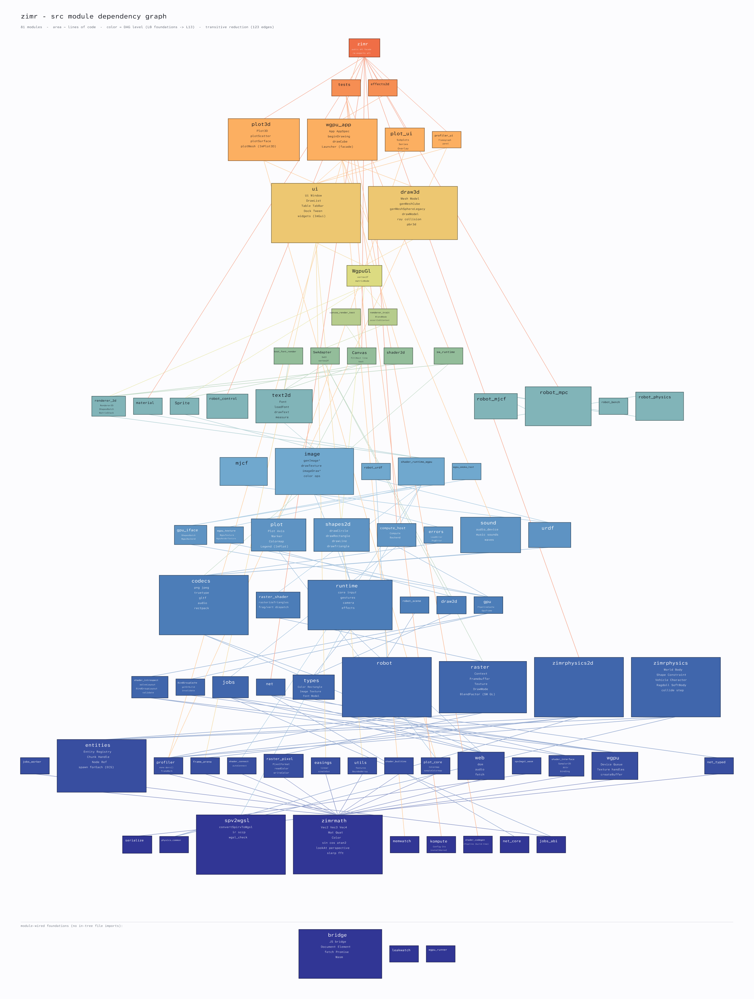

# zimr file atlas

*Generated 2026-09-05 by `zig build files-md` (tools/gen_files_md.zig) — regenerate after structural changes; counts/deps are computed, descriptions come from `//!` headers (preferred) or tools/file_descriptions.zig.*

**775 .zig files, 416,493 lines of Zig.** Module-name dependencies (`zm`, `shader_interface`, `build_options`, `sw_runtime`, …) are build-wired; file dependencies are direct `@import` paths. *Dependents* are in-tree importers (plus `build.zig (wired)` when the build references the path).

## Topography
The `src/*.zig` module import graph: **83 modules, 385 edges, 1 cycles** (127 edges after transitive reduction — see the graph below). The DAG levels below are longest-path layers — bottom-up: `L0` imports no in-tree module, and each level builds only on lower ones. This is the suggested reading order, and the order of the *src (core)* section.
- **L0** (12): `bridge`, `jobs_abi`, `kompute`, `leakwatch`, `memwatch`, `net_core`, `physics_common`, `serialize`, `shader_codegen`, `spv2wgsl`, `wgpu_runner`, `zimrmath`
- **L1** (17): `bvh_synth`, `easings`, `entities`, `frame_arena`, `jobs_worker`, `net_typed`, `plot_core`, `profiler`, `raster_pixel`, `shader_builtins`, `shader_connect`, `shader_interface`, `spv2wgsl_wasm`, `utils`, `web`, `wgpu`, `zimrnum`
- **L2** (9): `BindGroupCache`, `jobs`, `net`, `raster`, `robot`, `shader_introspect`, `types`, `zimrphysics`, `zimrphysics2d`
- **L3** (6): `codecs`, `draw2d`, `gpu`, `raster_shader`, `robot_scene`, `runtime`
- **L4** (8): `compute_host`, `errors`, `gpu_iface`, `plot`, `shapes2d`, `sound`, `urdf`, `wgpu_texture`
- **L5** (5): `image`, `mjcf`, `robot_urdf`, `shader_runtime_wgpu`, `wgpu_smoke_test`
- **L6** (9): `Sprite`, `material`, `renderer_2d`, `robot_bench`, `robot_control`, `robot_mjcf`, `robot_mpc`, `robot_physics`, `text2d`
- **L7** (5): `Canvas`, `SwAdapter`, `shader2d`, `sw_runtime`, `test_font_render`
- **L8** (2): `canvas_render_test`, `renderer_trait`
- **L9** (1): `WgpuGl`
- **L10** (2): `draw3d`, `ui`
- **L11** (4): `plot3d`, `plot_ui`, `profiler_ui`, `wgpu_app`
- **L12** (2): `effects2d`, `tests`
- **L13** (1): `zimr`

**Out-degree hubs:** `zimr` (53), `tests` (51), `wgpu_app` (25), `draw3d` (15), `ui` (14), `WgpuGl` (13), `shader_runtime_wgpu` (11), `Canvas` (8)

## Dependency graph
Transitive reduction of the src import DAG (385 direct `@import` edges reduced to 127 covering edges; an edge already implied by a longer path is dropped). Top-to-bottom: an importer points down to what it directly needs.

```mermaid
graph TD
  BindGroupCache --> wgpu
  Canvas --> Sprite
  Canvas --> plot
  Canvas --> text2d
  Sprite --> image
  SwAdapter --> draw2d
  SwAdapter --> raster
  SwAdapter --> text2d
  WgpuGl --> Sprite
  WgpuGl --> renderer_2d
  WgpuGl --> renderer_trait
  WgpuGl --> shapes2d
  bvh_synth --> zimrmath
  canvas_render_test --> Canvas
  codecs --> bvh_synth
  codecs --> types
  codecs --> web
  compute_host --> gpu
  compute_host --> jobs
  draw2d --> types
  draw3d --> WgpuGl
  easings --> zimrmath
  effects2d --> wgpu_app
  entities --> zimrmath
  errors --> codecs
  frame_arena --> zimrmath
  gpu --> BindGroupCache
  gpu --> shader_introspect
  gpu_iface --> gpu
  image --> errors
  image --> runtime
  jobs --> jobs_abi
  jobs --> web
  jobs --> wgpu
  jobs_worker --> jobs_abi
  material --> shader_runtime_wgpu
  mjcf --> urdf
  net --> net_core
  net --> net_typed
  net --> web
  net_typed --> serialize
  plot --> draw2d
  plot --> plot_core
  plot3d --> plot_core
  plot3d --> ui
  plot_core --> zimrmath
  plot_ui --> plot
  plot_ui --> ui
  profiler --> zimrmath
  profiler_ui --> profiler
  profiler_ui --> ui
  raster --> entities
  raster --> raster_pixel
  raster_pixel --> zimrmath
  raster_shader --> raster
  renderer_2d --> shader_runtime_wgpu
  renderer_trait --> SwAdapter
  robot --> profiler
  robot_bench --> robot_mjcf
  robot_mjcf --> robot_physics
  robot_mpc --> robot_mjcf
  robot_physics --> robot_mjcf
  robot_scene --> robot
  robot_urdf --> robot
  robot_urdf --> urdf
  runtime --> types
  runtime --> web
  shader2d --> renderer_2d
  shader_builtins --> zimrmath
  shader_connect --> zimrmath
  shader_interface --> zimrmath
  shader_introspect --> shader_interface
  shader_introspect --> wgpu
  shader_runtime_wgpu --> gpu_iface
  shader_runtime_wgpu --> raster_shader
  shader_runtime_wgpu --> shader_connect
  shader_runtime_wgpu --> spv2wgsl
  shader_runtime_wgpu --> wgpu_texture
  shapes2d --> runtime
  sound --> codecs
  spv2wgsl_wasm --> spv2wgsl
  sw_runtime --> codecs
  sw_runtime --> renderer_2d
  test_font_render --> text2d
  tests --> kompute
  tests --> leakwatch
  tests --> robot_urdf
  tests --> shader_codegen
  tests --> sw_runtime
  tests --> zimr
  text2d --> image
  types --> shader_interface
  ui --> WgpuGl
  ui --> easings
  ui --> frame_arena
  ui --> utils
  urdf --> codecs
  utils --> zimrmath
  web --> zimrmath
  wgpu --> zimrmath
  wgpu_app --> draw3d
  wgpu_app --> memwatch
  wgpu_app --> profiler
  wgpu_app --> shader2d
  wgpu_app --> sound
  wgpu_app --> ui
  wgpu_smoke_test --> gpu_iface
  wgpu_texture --> gpu
  zimr --> Canvas
  zimr --> compute_host
  zimr --> effects2d
  zimr --> material
  zimr --> net
  zimr --> plot3d
  zimr --> plot_ui
  zimr --> profiler_ui
  zimr --> robot_control
  zimr --> robot_mpc
  zimr --> zimrphysics2d
  zimrnum --> zimrmath
  zimrphysics --> entities
  zimrphysics --> physics_common
  zimrphysics --> profiler
  zimrphysics2d --> entities
  zimrphysics2d --> frame_arena
  zimrphysics2d --> physics_common
  zimrphysics2d --> profiler
  bridge
  wgpu_runner
```

A pixel-rendered version of this same graph — drawn by zimr's own software rasterizer, with each box sized by line count — is regenerated by `zig build dag-png`:

Grouped entries (not per-file): `tests/fixtures/external/tint/` — 363 SPIR-V/WGSL fixtures from Tint's corpus driving the spv2wgsl regression; `tests/fixtures/phi_repro/` — 7 minimized phi-node repros; `tests/snapshots/` — UI snapshot PNG baselines; `assets/` — runtime-fetched images.

## (root)

### `.gitignore`

Ignore rules (caches, zig-out, prebuilt artifacts).

*43 lines*  
**Deps:** —  
**Dependents:** —

### `.zenv.sh`

Sourceable PATH exports for the vendored toolchains.

*6 lines*  
**Deps:** —  
**Dependents:** —

### `LICENSE`

Project license.

*643 lines*  
**Deps:** —  
**Dependents:** —

### `build.zig`

The build graph: discovers shader sources, runs the SPIR-V→WGSL pipeline per engine/example shader, defines every wgpu example's wasm module + page install, the six native host demos, the host test target (with WGSL + externs wiring for the refAllDecls policy), lint (a hard dependency of every compile), smoke harnesses, docs, dist, and the standalone-HTML bakers. The single most load-bearing file in the repo; edit with exact-text anchors and verify with a full gate run.

*5,232 lines · 33 fns*  
**Deps:** `../X.zig`, `../shader_interface.zig`, `../spv2wgsl.zig`, `../x.zig`, `default_shapes_vs.zig`, `math.zig`, `src/shader_codegen.zig`, `ui.zig`, `zimr.zig`, `<name>_externs` (module), `build_options` (module), `io` (module), `kernels` (module), `math` (module), `shader_interface` (module), `zm` (module)  
**Dependents:** —

### `build.zig.zon`

Root package manifest (no external deps by design).

*17 lines*  
**Deps:** —  
**Dependents:** —

### `build_err.txt`

(no description yet — add a //! header or a dict entry)

*20 lines*  
**Deps:** —  
**Dependents:** —

### `cheatsheet.html`

Generated API cheatsheet (from CHEATSHEET.md via scripts/build_cheatsheet.py); carried into dist.

*355 lines*  
**Deps:** —  
**Dependents:** `build.zig (wired)`

### `generate_vscode.bat`

Windows convenience: regenerate launch.json.

*16 lines*  
**Deps:** —  
**Dependents:** —

### `kill-serve.bat`

Stops the dev server (Windows).

*17 lines*  
**Deps:** —  
**Dependents:** —

### `kill-serve.sh`

Stops the dev server (POSIX).

*17 lines*  
**Deps:** —  
**Dependents:** —

### `net_mesh_test.zig`

Headless test of the P2P session layer's mesh brain (src/net_core.zig), with NO browser. We bind net_core's transport-agnostic Session to an in-process fake of the WebSocket signaling + WebRTC data channels, spin up several Sessions, pump their poll() loops, and assert the whole negotiation actually works: peers discover each other, channels open, messages flow both ways across a real mesh, and leaving is noticed.

*712 lines · 28 fns · 9 tests*  
**Deps:** `src/net_core.zig`, `src/net_typed.zig`  
**Dependents:** —

### `readme.md`

Note: A zig port of raylib, imgui, implot, box2d / jolt physics, and MuJoCo-style robot

*132 lines*  
**Deps:** —  
**Dependents:** —

### `release.bat`

Builds + packages the dist bundle (Windows).

*85 lines*  
**Deps:** —  
**Dependents:** `build.zig (wired)`

### `release.sh`

Builds + packages the dist bundle (POSIX).

*35 lines*  
**Deps:** —  
**Dependents:** —

### `serve.bat`

Serves zig-out/web via the bun dev server (Windows).

*56 lines*  
**Deps:** —  
**Dependents:** `build.zig (wired)`

### `serve.sh`

Serves zig-out/web via the bun dev server (POSIX).

*45 lines*  
**Deps:** —  
**Dependents:** —

## src (core)

### `src/bridge.zig`

The browser runtime for the wgpu path: WASI shim, DOM/input glue, the WebGPU bridge (integer-registry handle protocol, encoder ops incl. copyTextureToBuffer), audio, and zimrRun boot. Bundled per-example and inlined by the standalone baker.

*L0 · 6,781 lines · 539 fns*  
**Deps:** `wz` (module)  
**Dependents:** `build.zig (wired)`

### `src/jobs_abi.zig`

lint:alias jobs_abi src/jobs_abi.zig — the names the three sides of the jobs system must agree on.

*L0 · 74 lines · 0 fns*  
**Deps:** —  
**Dependents:** `build.zig (wired)`, `src/jobs.zig`, `src/jobs_worker.zig`

### `src/kompute.zig`

kompute — the compute DSL. A kernel file declares `config` + `Buffers` + `Params` + one or more kernel `fn`s; this module generates the boilerplate so the same source runs as a GPU compute dispatch or a CPU loop (see `src/notes/tutorials/gpu-compute-tutorial.md`).

*L0 · 469 lines · 22 fns*  
**Deps:** `kompute` (module)  
**Dependents:** `build.zig (wired)`, `src/tests.zig`

### `src/leakwatch.zig`

lint:alias leakwatch LeakWatch — an allocator wrapper that says WHERE a leak came from.

*L0 · 335 lines · 13 fns · 2 tests*  
**Deps:** —  
**Dependents:** `src/tests.zig`

### `src/memwatch.zig`

lint:alias memwatch MemWatch — a per-frame wasm-linear-memory growth watchdog.

*L0 · 152 lines · 6 fns*  
**Deps:** `build_options` (module)  
**Dependents:** `src/wgpu_app.zig`

### `src/net_core.zig`

lint:alias net_core src/net.zig — the P2P session layer. This is the friendly front door to the whole multiplayer stack: you call `connect(url, room)`, then each frame you drain `poll()` for events (peers joining/leaving, messages) and use `broadcast()` / `sendTo()` to talk. Everything underneath — the WebSocket signaling handshake and the WebRTC offer/answer/ICE dance — is handled for you, for every peer in the…

*L0 · 708 lines · 28 fns*  
**Deps:** —  
**Dependents:** `net_mesh_test.zig`, `src/net.zig`

### `src/physics_common.zig`

lint:alias physics_common Shared, dimension-independent contract for the two physics engines — `zimrphysics` (3D / Jolt port) and `zimrphysics2d` (2D / Box2D v3 port). Defining the genuinely parallel parts here, and asserting the parallel surface at comptime, is what keeps the two engines feeling like one family rather than re-diverging over time: a developer who learns one can predict the other. See the engine…

*L0 · 58 lines · 1 fns*  
**Deps:** —  
**Dependents:** `src/zimr.zig`, `src/zimrphysics.zig`, `src/zimrphysics2d.zig`

### `src/serialize.zig`

lint:alias serialize serialize.zig — comptime protobuf-style serialization for plain Zig structs.

*L0 · 800 lines · 29 fns · 8 tests*  
**Deps:** —  
**Dependents:** `src/net_typed.zig`, `src/zimr.zig`

### `src/shader_codegen.zig`

lint:alias shader_codegen src/shader_codegen.zig — public build-time API for zimr.

*L0 · 753 lines · 7 fns*  
**Deps:** `src/foo_fs.zig`, `src/src/shader_codegen.zig`, `<basename>_externs` (module), `<externs_module_name>` (module), `cube_split_vs_externs` (module), `gen` (module), `io` (module), `shader_builtins` (module), `shader_interface` (module), `shader_io` (module), `shadermath` (module), `zimr_build` (module), `zm` (module)  
**Dependents:** `build.zig`, `build.zig (wired)`, `src/tests.zig`

### `src/spv2wgsl.zig`

The pure-Zig SPIR-V→WGSL transpiler entry: parses SPIR-V binaries, reconstructs structured control flow via the CFG walkers in src/spv2wgsl/, runs the sample-uniformity pass (Chrome/Tint uniform-control-flow), and emits WGSL. Known item: the recursive emitFunctionBody needs a big stack on one Tint fixture (iterative emitter queued in P6).

*L0 · 11,604 lines · 214 fns · 10 tests*  
**Deps:** —  
**Dependents:** `build.zig (wired)`, `src/shader_runtime_wgpu.zig`, `src/spv2wgsl_wasm.zig`, `src/tests.zig`, `src/zimr.zig`

### `src/wgpu_runner.zig`

wgpu_runner.zig — the generic standalone runner for a DESCRIPTOR-ONLY wgpu example. It is the exe root of an `addWgpuApp` build: it imports the example as the `user_app` module (which exposes `pub const app = z.AppSpec(State){...}` and nothing else — no `main`, no globals), owns the wasm entry and the single beginDrawing/clearBackground/endDrawing, and ticks the app full-screen.

*L0 · 160 lines · 3 fns*  
**Deps:** `user_app` (module), `zimr` (module)  
**Dependents:** `build.zig (wired)`

### `src/zimrmath.zig`

lint:alias zm SHADER-SAFE — this file may be @imported by shader sources (compiled through the SPIR-V pipeline) and by comptime executors. Lint enforces the tier: no allocators, no runtime std, no externs, no bridge imports outside `test` blocks.

*L0 · 9,705 lines · 462 fns · 167 tests*  
**Deps:** `build_options` (module), `zm` (module)  
**Dependents:** `build.zig (wired)`, `src/notes/spikes/spike_sampler_oldpath.zig`, `src/notes/spikes/spike_ssbo_shader.zig`, `src/notes/spikes/spike_texture_shader.zig`

### `src/bvh_synth.zig`

Procedural BVH generation, for tests.

*L1 · 266 lines · 5 fns · 2 tests*  
**Deps:** `zm` (module)  
**Dependents:** `src/codecs.zig`, `src/draw3d.zig`

### `src/easings.zig`

Raylib's easing functions (linear through bounce/elastic, in/out/inout) used by the UI animation layer and the easings examples.

*L1 · 465 lines · 25 fns · 7 tests*  
**Deps:** `zm` (module)  
**Dependents:** `src/tests.zig`, `src/ui.zig`, `src/zimr.zig`

### `src/entities.zig`

The ECS: comptime-dispatched Entities(T) pools with unified spawn, forEach, handles and generation checks (the pool/world_stamp/ecs consolidation).

*L1 · 7,614 lines · 300 fns · 25 tests*  
**Deps:** `zm` (module)  
**Dependents:** `src/raster.zig`, `src/tests.zig`, `src/zimr.zig`, `src/zimrphysics.zig`, `src/zimrphysics2d.zig`

### `src/frame_arena.zig`

FrameArena — an `ArenaAllocator` that enforces its own per-frame reset.

*L1 · 161 lines · 10 fns · 1 tests*  
**Deps:** `zm` (module)  
**Dependents:** `src/ui.zig`, `src/zimrphysics2d.zig`

### `src/jobs_worker.zig`

src/jobs_worker.zig — THE WEB WORKER, WRITTEN IN ZIG.

*L1 · 683 lines · 42 fns*  
**Deps:** `src/jobs_abi.zig`  
**Dependents:** `build.zig (wired)`

### `src/net_typed.zig`

lint:alias net_typed net_typed.zig — a small typed-message layer over a net Session.

*L1 · 96 lines · 6 fns*  
**Deps:** `src/serialize.zig`  
**Dependents:** `net_mesh_test.zig`, `src/net.zig`

### `src/plot_core.zig`

lint:alias plot_core plot_core.zig — machinery shared by implot.zig and implot3d.zig.

*L1 · 297 lines · 15 fns*  
**Deps:** `zm` (module)  
**Dependents:** `src/plot.zig`, `src/plot3d.zig`, `src/zimr.zig`

### `src/profiler.zig`

lint:alias profiler profiler.zig — zimr's integrated, in-process profiler (Tracy-inspired).

*L1 · 726 lines · 41 fns · 3 tests*  
**Deps:** `build_options` (module), `zm` (module)  
**Dependents:** `build.zig (wired)`, `src/profiler_ui.zig`, `src/robot.zig`, `src/robot_bench.zig`, `src/wgpu_app.zig`, `src/zimr.zig`, `src/zimrphysics.zig`, `src/zimrphysics2d.zig`

### `src/raster_pixel.zig`

Pixel-level primitives for the software rasterizer: blending, format packing/unpacking, span fills.

*L1 · 1,464 lines · 22 fns · 34 tests*  
**Deps:** `zm` (module)  
**Dependents:** `src/raster.zig`, `src/raster_shader.zig`, `src/tests.zig`

### `src/shader_builtins.zig`

shader_builtins.zig — the SPIR-V shader DSL: stage-IO decorators, opaque texture / sampler / storage types, and the texture-sampling + storage-buffer intrinsics. These emit SPIR-V inline asm (or `@SpirvType` declarations) that only the SPIR-V backend lowers, so they are SHADER-ONLY.

*L1 · 414 lines · 18 fns*  
**Deps:** `zm` (module)  
**Dependents:** `build.zig (wired)`

### `src/shader_connect.zig`

src/shader_connect.zig — comptime-monomorphized varying connector.

*L1 · 73 lines · 2 fns · 1 tests*  
**Deps:** `zm` (module)  
**Dependents:** `src/shader_runtime_wgpu.zig`, `src/sw_runtime.zig`, `src/tests.zig`, `src/tests/cpu_shadowmap_test.zig`, `src/zimr.zig`

### `src/shader_interface.zig`

SHADER-SAFE — this file may be @imported by shader sources (compiled through the SPIR-V pipeline) and by comptime executors. Lint enforces the tier: no allocators, no runtime std, no externs, no bridge imports outside `test` blocks. `zm` is allowed: it is self-contained (build_options baked in; its host-only std.log branch is comptime-dead on the SPIR-V target) and every consumer already wires it alongside…

*L1 · [shader-safe] · 1,156 lines · 23 fns · 19 tests*  
**Deps:** `common/fog.zig`, `common/lighting.zig`, `zm` (module)  
**Dependents:** `build.zig (wired)`

### `src/spv2wgsl_wasm.zig`

Wasm entry root exposing the transpiler to the browser dev page. Excluded from refAllDecls (wasm root).

*L1 · 96 lines · 1 fns*  
**Deps:** `src/spv2wgsl.zig`  
**Dependents:** `build.zig (wired)`

### `src/utils.zig`

Comptime feature flags (`features`), the todo() marker, allow_assert wiring from build_options, and small shared utilities. zimr re-exports features/todo as the public surface.

*L1 · 621 lines · 33 fns · 4 tests*  
**Deps:** `src/utils.zig`, `zm` (module)  
**Dependents:** `build.zig (wired)`, `src/tests.zig`, `src/ui.zig`, `src/utils.zig`, `src/zimr.zig`

### `src/web.zig`

The dom namespace: log/now_ms/canvas-size externs with host fallbacks, plus fetch/file-loading glue. The function-pointer sinks runtime.effects route through live here.

*L1 · 2,201 lines · 121 fns*  
**Deps:** `src/web.zig`, `zm` (module)  
**Dependents:** `src/codecs.zig`, `src/draw3d.zig`, `src/errors.zig`, `src/jobs.zig`, `src/net.zig`, `src/runtime.zig`, `src/sound.zig`, `src/tests.zig`, `src/ui.zig`, `src/web.zig`, `src/wgpu_app.zig`, `src/zimr.zig`

### `src/wgpu.zig`

The WebGPU handle layer: typed handles (BufferHandle, TextureHandle, BindGroupHandle, PipelineHandle...) over the JS bridge's integer registry, the extern js_* bridge declarations (comptime-gated for wasm), device/queue/encoder operations, buffer mapping, copyTextureToBuffer, and createShaderModuleWgsl. Host builds get inert fallbacks so the same code analyzes everywhere.

*L1 · 2,012 lines · 85 fns · 2 tests*  
**Deps:** `src/wgpu.zig`, `zm` (module)  
**Dependents:** `build.zig (wired)`, `src/BindGroupCache.zig`, `src/WgpuGl.zig`, `src/compute_host.zig`, `src/draw3d.zig`, `src/effects2d.zig`, `src/gpu.zig`, `src/gpu_iface.zig`, `src/jobs.zig`, `src/material.zig`, `src/renderer_2d.zig`, `src/shader2d.zig`, `src/shader_introspect.zig`, `src/shader_runtime_wgpu.zig`, `src/sw_runtime.zig`, `src/tests.zig`, `src/tests/features_test.zig`, `src/wgpu.zig`, `src/wgpu_app.zig`, `src/wgpu_smoke_test.zig`, `src/wgpu_texture.zig`, `src/zimr.zig`

### `src/zimrnum.zig`

lint:alias zn src/zimrnum.zig — **zimrnum**, zimr's numerics / statistics / deep-learning / RL library. Imported as `const zn = @import("zn");`.

*L1 · 2,236 lines · 70 fns · 41 tests*  
**Deps:** `zm` (module), `zn` (module)  
**Dependents:** `build.zig (wired)`

### `src/BindGroupCache.zig`

Cache of bind groups keyed by (layout, resources) so per-frame draws don't re-create identical groups across the bridge.

*L2 · 181 lines · 7 fns · 2 tests*  
**Deps:** `src/BindGroupCache.zig`, `src/wgpu.zig`  
**Dependents:** `src/BindGroupCache.zig`, `src/gpu.zig`, `src/tests.zig`, `src/wgpu_app.zig`, `src/wgpu_smoke_test.zig`, `src/zimr.zig`

### `src/jobs.zig`

lint:alias jobs src/jobs.zig — run a PURE kernel off the main thread, on a Web Worker.

*L2 · 1,209 lines · 35 fns · 17 tests*  
**Deps:** `src/jobs_abi.zig`, `src/web.zig`, `src/wgpu.zig`  
**Dependents:** `src/compute_host.zig`, `src/zimr.zig`

### `src/net.zig`

lint:alias net ============================================================================ zimr networking -- peer-to-peer multiplayer for the browser, all in Zig ============================================================================

*L2 · 274 lines · 0 fns*  
**Deps:** `src/net_core.zig`, `src/net_typed.zig`, `src/web.zig`  
**Dependents:** `src/zimr.zig`

### `src/raster.zig`

lint:alias raster src/raster.zig - software rasterizer.

*L2 · 7,270 lines · 95 fns · 157 tests*  
**Deps:** `src/entities.zig`, `src/raster_pixel.zig`, `zm` (module)  
**Dependents:** `src/SwAdapter.zig`, `src/WgpuGl.zig`, `src/raster_shader.zig`, `src/renderer_trait.zig`, `src/shader_runtime_wgpu.zig`, `src/sw_runtime.zig`, `src/tests.zig`, `src/ui.zig`, `src/wgpu_app.zig`, `src/zimr.zig`

### `src/robot.zig`

robot.zig — reduced-coordinate articulated-body dynamics, in the style of MuJoCo.

*L2 · 16,382 lines · 190 fns · 127 tests*  
**Deps:** `src/profiler.zig`, `src/tests/fixtures/robot/kuka_iiwa.zig`, `src/tests/fixtures/robot/reference.zig`, `zm` (module)  
**Dependents:** `build.zig (wired)`, `src/robot_bench.zig`, `src/robot_control.zig`, `src/robot_mjcf.zig`, `src/robot_mpc.zig`, `src/robot_physics.zig`, `src/robot_scene.zig`, `src/robot_urdf.zig`, `src/tests.zig`, `src/tests/fixtures/robot/kuka_iiwa.zig`, `src/zimr.zig`

### `src/shader_introspect.zig`

Comptime schema introspection: solveLayout (schema → ResolvedLayout of binding fields + groups), autoMaterial bind group layout emission, and assertVaryingsMatch (VS↔FS varying validation with comptime-marked conditions).

*L2 · 1,245 lines · 20 fns · 20 tests*  
**Deps:** `src/wgpu.zig`, `shader_interface` (module), `zm` (module)  
**Dependents:** `src/compute_host.zig`, `src/draw3d.zig`, `src/effects2d.zig`, `src/gpu.zig`, `src/material.zig`, `src/shader2d.zig`, `src/shader_runtime_wgpu.zig`, `src/tests.zig`, `src/wgpu_app.zig`, `src/zimr.zig`

### `src/types.zig`

The shared vocabulary: Color, Rectangle (extern — embedded in extern ABI structs), Image, Texture, Mesh, Model, Material, ModelAnimation, Camera2D/3D, Ray/RayCollision/BoundingBox, PixelFormat, key/mouse/gesture enums. Almost everything imports this; it imports almost nothing.

*L2 · 1,617 lines · 21 fns · 34 tests*  
**Deps:** `src/types.zig`, `shader_interface` (module), `zm` (module)  
**Dependents:** `src/Canvas.zig`, `src/Sprite.zig`, `src/SwAdapter.zig`, `src/WgpuGl.zig`, `src/codecs.zig`, `src/draw2d.zig`, `src/draw3d.zig`, `src/image.zig`, `src/runtime.zig`, `src/shapes2d.zig`, `src/sound.zig`, `src/test_font_render.zig`, `src/tests.zig`, `src/tests/errors_test.zig`, `src/tests/features_test.zig`, `src/tests/leak_test.zig`, `src/tests/shader_enum_test.zig`, `src/text2d.zig`, `src/types.zig`, `src/ui.zig`, `src/wgpu_app.zig`, `src/zimr.zig`

### `src/zimrphysics.zig`

lint:alias zimrphysics physics.zig — a single-file, single-threaded rigid-body engine.

*L2 · 18,584 lines · 450 fns*  
**Deps:** `src/entities.zig`, `src/physics_common.zig`, `src/profiler.zig`, `zm` (module)  
**Dependents:** `src/robot_control.zig`, `src/robot_mjcf.zig`, `src/robot_physics.zig`, `src/tests.zig`, `src/tests/character_walk_test.zig`, `src/tests/zimrphysics_stack_test.zig`, `src/zimr.zig`

### `src/zimrphysics2d.zig`

lint:alias zimrphysics2d zimrphysics2d.zig — a single-file, single-threaded 2D rigid-body engine.

*L2 · 14,500 lines · 425 fns · 10 tests*  
**Deps:** `src/entities.zig`, `src/frame_arena.zig`, `src/physics_common.zig`, `src/profiler.zig`, `zm` (module)  
**Dependents:** `src/zimr.zig`

### `src/codecs.zig`

Asset codecs: PNG encode/decode, JPEG decode, glTF/GLB parse (meshes, skins, animations, JOINTS/WEIGHTS → Mesh bone arrays), OBJ export support, TTF font parsing + atlas baking.

*L3 · 16,290 lines · 353 fns · 56 tests*  
**Deps:** `src/bvh_synth.zig`, `src/codecs.zig`, `src/types.zig`, `src/web.zig`, `zm` (module)  
**Dependents:** `build.zig (wired)`, `src/Canvas.zig`, `src/codecs.zig`, `src/draw3d.zig`, `src/errors.zig`, `src/image.zig`, `src/mjcf.zig`, `src/robot_bench.zig`, `src/robot_control.zig`, `src/robot_mjcf.zig`, `src/robot_mpc.zig`, `src/robot_physics.zig`, `src/sound.zig`, `src/sw_runtime.zig`, `src/test_font_render.zig`, `src/tests.zig`, `src/tests/errors_test.zig`, `src/text2d.zig`, `src/ui.zig`, `src/urdf.zig`, `src/wgpu_app.zig`, `src/zimr.zig`

### `src/draw2d.zig`

lint:alias draw2d Unified 2D primitive surface — the shared Options structs for the `sink.rect` / `image` / `text` / `line` / `circle` primitives. Immediate (WgpuGl / Sw / Gl), retained-GPU (`DrawList`), and retained-CPU (`Canvas`) all take these, so a `fn draw(sink: anytype)` scene runs against any backend. See `notes/drawing_api.md`. All angles are radians; all colors `Color`; all rects `Rectangle`.

*L3 · 810 lines · 30 fns · 5 tests*  
**Deps:** `src/types.zig`, `zm` (module)  
**Dependents:** `src/Canvas.zig`, `src/SwAdapter.zig`, `src/WgpuGl.zig`, `src/plot.zig`, `src/plot_ui.zig`, `src/ui.zig`

### `src/gpu.zig`

zimr's WebGPU resource layer over raw `wgpu` (merge of pipeline_cache + descriptor_encoder + gpu_frame): PipelineCache/StateCombo, the descriptor encoders (RenderPipelineDescriptor/BindGroupEntry/...), and per-frame GpuFrame.

*L3 · 789 lines · 25 fns · 10 tests*  
**Deps:** `src/BindGroupCache.zig`, `src/shader_introspect.zig`, `src/wgpu.zig`  
**Dependents:** `src/compute_host.zig`, `src/draw3d.zig`, `src/effects2d.zig`, `src/gpu_iface.zig`, `src/material.zig`, `src/renderer_2d.zig`, `src/shader2d.zig`, `src/shader_runtime_wgpu.zig`, `src/tests.zig`, `src/wgpu_app.zig`, `src/wgpu_smoke_test.zig`, `src/wgpu_texture.zig`, `src/zimr.zig`

### `src/raster_shader.zig`

lint:alias raster_shader src/raster_shader.zig — run zimr fragment shaders on the CPU.

*L3 · 1,818 lines · 40 fns · 15 tests*  
**Deps:** `src/raster.zig`, `src/raster_pixel.zig`, `zm` (module)  
**Dependents:** `src/shader_runtime_wgpu.zig`, `src/sw_runtime.zig`, `src/tests.zig`, `src/tests/cpu_shadowmap_test.zig`, `src/zimr.zig`

### `src/robot_scene.zig`

robot_scene.zig — a robot and the loose objects it interacts with, in ONE tree.

*L3 · 523 lines · 4 fns · 6 tests*  
**Deps:** `src/robot.zig`, `zm` (module)  
**Dependents:** `build.zig (wired)`, `src/robot_mjcf.zig`, `src/robot_physics.zig`, `src/tests.zig`, `src/zimr.zig`

### `src/runtime.zig`

Engine runtime services, all backend-agnostic since P5: core (WindowState, screen/render dims, traceLog), input (keyboard/mouse/touch state machine + event queue), gestures, camera (updateCamera modes, camera math, screen↔world projection with explicit ClipPlanes), effects (clock, rng, logger with Prefixed/Scoped, loader), allocator helpers (freeMany etc.), and the wasm libc shims.

*L3 · 6,770 lines · 269 fns · 1 tests*  
**Deps:** `src/types.zig`, `src/web.zig`, `zm` (module)  
**Dependents:** `build.zig (wired)`, `src/draw3d.zig`, `src/image.zig`, `src/shapes2d.zig`, `src/tests.zig`, `src/tests/leak_test.zig`, `src/tests/multiapp_test.zig`, `src/text2d.zig`, `src/ui.zig`, `src/wgpu_app.zig`, `src/zimr.zig`

### `src/compute_host.zig`

compute_host.zig — `z.Compute(M)`: run a kompute kernel module `M` on the CPU (a plain `for id` loop calling the kernel) OR the GPU (a WGSL compute dispatch), chosen at runtime via `.backend`. Same kernel source, same results.

*L4 · 1,413 lines · 34 fns · 6 tests*  
**Deps:** `src/add_kernel.zig`, `src/double_it.zig`, `src/gpu.zig`, `src/jobs.zig`, `src/shader_introspect.zig`, `src/wgpu.zig`, `zm` (module)  
**Dependents:** `src/tests.zig`, `src/zimr.zig`

### `src/errors.zig`

The shared error sets: LoadError, ImageGenError, GpuError and friends, plus error-formatting helpers.

*L4 · 77 lines · 0 fns*  
**Deps:** `src/codecs.zig`, `src/web.zig`  
**Dependents:** `src/draw3d.zig`, `src/image.zig`, `src/tests.zig`, `src/tests/errors_test.zig`, `src/text2d.zig`

### `src/gpu_iface.zig`

WgpuBackend — the backend handle the app/frame layer threads through draw3d, renderer_2d and friends; device/queue access plus PassState.

*L4 · 1,005 lines · 29 fns · 4 tests*  
**Deps:** `src/gpu.zig`, `src/wgpu.zig`, `zm` (module)  
**Dependents:** `src/WgpuGl.zig`, `src/draw3d.zig`, `src/effects2d.zig`, `src/material.zig`, `src/renderer_2d.zig`, `src/shader_runtime_wgpu.zig`, `src/sw_runtime.zig`, `src/tests.zig`, `src/wgpu_app.zig`, `src/wgpu_smoke_test.zig`, `src/zimr.zig`

### `src/plot.zig`

lint:alias plot plot.zig — a native-Zig plotting library for zimr, in the spirit of Dear ImGui's ImPlot but redesigned to be idiomatic Zig.

*L4 · 2,831 lines · 93 fns · 17 tests*  
**Deps:** `src/draw2d.zig`, `src/plot_core.zig`, `zm` (module)  
**Dependents:** `src/Canvas.zig`, `src/plot_ui.zig`, `src/tests.zig`, `src/zimr.zig`

### `src/shapes2d.zig`

lint:alias shapes2d src/shapes2d.zig — the backend-generic 2D shape primitives, MOVED VERBATIM out of drawing.zig (GL retirement P1, t1173): rectangles, ellipses, polys, rings, splines, lines — all over `gl: anytype`, drawn by both backends (ui's widget rendering, wgpu_app's ShapesTextureState). GL-free since GL-retirement P5d.

*L4 · 2,930 lines · 97 fns · 41 tests*  
**Deps:** `src/runtime.zig`, `src/types.zig`, `zm` (module)  
**Dependents:** `src/WgpuGl.zig`, `src/tests.zig`, `src/tests/snapshot_regression_test.zig`, `src/tests/ui_dock_screenshot_test.zig`, `src/tests/ui_screenshot_test.zig`, `src/ui.zig`, `src/wgpu_app.zig`, `src/zimr.zig`

### `src/sound.zig`

Audio: sounds (one-shot), streams (ring-buffered PCM with FIFO recycle), and music, over web-audio bridge externs with host no-op fallbacks.

*L4 · 3,427 lines · 93 fns*  
**Deps:** `src/codecs.zig`, `src/types.zig`, `src/web.zig`, `zm` (module)  
**Dependents:** `src/tests.zig`, `src/tests/features_test.zig`, `src/wgpu_app.zig`, `src/zimr.zig`

### `src/urdf.zig`

urdf.zig — read a URDF into a description zimr can build a robot from.

*L4 · 1,687 lines · 31 fns · 10 tests*  
**Deps:** `../../robot.zig`, `src/codecs.zig`, `zimr` (module), `zm` (module)  
**Dependents:** `build.zig (wired)`, `src/mjcf.zig`, `src/robot_urdf.zig`, `src/tests.zig`

### `src/wgpu_texture.zig`

WgpuTexture: creation from Image/raw RGBA8, view + sampler management, the texture registry that backs WgpuGl's id-based setTexture path, and mip/format plumbing.

*L4 · 557 lines · 13 fns · 5 tests*  
**Deps:** `src/gpu.zig`, `src/wgpu.zig`, `zm` (module)  
**Dependents:** `src/WgpuGl.zig`, `src/draw3d.zig`, `src/renderer_2d.zig`, `src/shader_runtime_wgpu.zig`, `src/tests.zig`, `src/tests/features_test.zig`, `src/wgpu_app.zig`, `src/zimr.zig`

### `src/image.zig`

lint:alias image image — Image (CPU pixel buffer) type helpers + the full CPU image-processing library (merged from drawing.textures in GL-retirement P5): generators (color/checked/gradients/noise/ cellular), transforms (crop/resize×3/rotate/flip/blur/dither), draws-into-image (pixels/lines/shapes/text), color ops, format conversion, and PNG export glue.

*L5 · 5,849 lines · 107 fns · 120 tests*  
**Deps:** `src/codecs.zig`, `src/errors.zig`, `src/runtime.zig`, `src/types.zig`, `zm` (module)  
**Dependents:** `src/Canvas.zig`, `src/Sprite.zig`, `src/WgpuGl.zig`, `src/canvas_render_test.zig`, `src/test_font_render.zig`, `src/tests.zig`, `src/tests/leak_test.zig`, `src/text2d.zig`, `src/wgpu_app.zig`, `src/zimr.zig`

### `src/mjcf.zig`

mjcf.zig — reading MuJoCo's own model format.

*L5 · 2,132 lines · 38 fns · 17 tests*  
**Deps:** `src/codecs.zig`, `src/urdf.zig`, `zm` (module)  
**Dependents:** `build.zig (wired)`, `src/robot_bench.zig`, `src/robot_control.zig`, `src/robot_mjcf.zig`, `src/robot_mpc.zig`, `src/robot_physics.zig`, `src/tests.zig`, `src/zimr.zig`

### `src/robot_urdf.zig`

robot_urdf.zig — load a URDF into a live `robot.Model`.

*L5 · 260 lines · 2 fns · 2 tests*  
**Deps:** `src/robot.zig`, `src/tests/fixtures/robot/kuka_iiwa.zig`, `src/urdf.zig`, `zm` (module)  
**Dependents:** `build.zig (wired)`, `src/tests.zig`

### `src/shader_runtime_wgpu.zig`

lint:alias shader_runtime

*L5 · 2,017 lines · 38 fns · 23 tests*  
**Deps:** `src/gpu.zig`, `src/gpu_iface.zig`, `src/raster.zig`, `src/raster_shader.zig`, `src/shader_connect.zig`, `src/shader_introspect.zig`, `src/spv2wgsl.zig`, `src/wave_fs_io.zig`, `src/wave_vs_io.zig`, `src/wgpu.zig`, `src/wgpu_texture.zig`, `shader_interface` (module), `zm` (module)  
**Dependents:** `src/draw3d.zig`, `src/effects2d.zig`, `src/material.zig`, `src/renderer_2d.zig`, `src/sw_runtime.zig`, `src/tests.zig`, `src/wgpu_app.zig`, `src/zimr.zig`

### `src/wgpu_smoke_test.zig`

Wasm-root smoke harness compiled per example by the smoke build: boots the app headlessly under webtests/runner.mjs (driving the dogfooded webtests/wgpu_smoke.zig logic), counts bridge calls per frame, and reports PASS lines the tier-a gate greps. Excluded from refAllDecls (wasm entry root).

*L5 · 210 lines · 4 fns · 2 tests*  
**Deps:** `src/BindGroupCache.zig`, `src/gpu.zig`, `src/gpu_iface.zig`, `src/wgpu.zig`  
**Dependents:** —

### `src/Sprite.zig`

lint:alias Sprite Sprite — a portable, pixel-owning 2D image handle drawable on ANY backend (immediate GPU, retained DrawList, or CPU Canvas). It owns a copy of the CPU pixels; each backend caches its own residency (a GPU bind group, or nothing for Canvas) keyed by the monotonic `.id`. This is the seam that lets one `fn draw(sink: anytype)` scene sample the same texture on every backend. See notes/drawing_api.md.

*L6 · 47 lines · 4 fns*  
**Deps:** `src/image.zig`, `src/types.zig`  
**Dependents:** `src/Canvas.zig`, `src/WgpuGl.zig`, `src/canvas_render_test.zig`, `src/ui.zig`, `src/zimr.zig`

### `src/material.zig`

lint:alias material material.zig — the public custom-pipeline API ("complete WebGPU control").

*L6 · 477 lines · 17 fns*  
**Deps:** `src/gpu.zig`, `src/gpu_iface.zig`, `src/shader_introspect.zig`, `src/shader_runtime_wgpu.zig`, `src/wgpu.zig`  
**Dependents:** `src/zimr.zig`

### `src/renderer_2d.zig`

The 2D batch renderer: shapes batch (vertex staging, per-texture bind groups via the registry — the turn-909 aliasing fix), orthoTopLeft (the GPU-UBO [16]f32 projection), per-frame UBO updates, and pipeline setup. Embeds default_shapes_vs/fs.wgsl.

*L6 · 1,079 lines · 29 fns · 6 tests*  
**Deps:** `src/gpu.zig`, `src/gpu_iface.zig`, `src/shader_runtime_wgpu.zig`, `src/shaders/default_shapes_fs_io.zig`, `src/shaders/default_shapes_vs_io.zig`, `src/wgpu.zig`, `src/wgpu_texture.zig`, `shader_interface` (module), `zm` (module)  
**Dependents:** `src/WgpuGl.zig`, `src/shader2d.zig`, `src/sw_runtime.zig`, `src/tests.zig`, `src/wgpu_app.zig`, `src/zimr.zig`

### `src/robot_bench.zig`

robot_bench — how fast is this, actually?

*L6 · 473 lines · 9 fns*  
**Deps:** `src/codecs.zig`, `src/mjcf.zig`, `src/profiler.zig`, `src/robot.zig`, `src/robot_mjcf.zig`, `src/tests/fixtures/robot/kuka_iiwa.zig`, `zm` (module)  
**Dependents:** `build.zig (wired)`

### `src/robot_control.zig`

robot_control.zig — making a robot go where you want it.

*L6 · 2,091 lines · 33 fns · 14 tests*  
**Deps:** `src/codecs.zig`, `src/mjcf.zig`, `src/robot.zig`, `src/robot_mjcf.zig`, `src/robot_physics.zig`, `src/tests/fixtures/robot/kuka_iiwa.zig`, `src/zimrphysics.zig`, `zm` (module)  
**Dependents:** `build.zig (wired)`, `src/tests.zig`, `src/zimr.zig`

### `src/robot_mjcf.zig`

robot_mjcf.zig — turning a parsed MJCF file into something the engine can simulate.

*L6 · 7,598 lines · 44 fns · 35 tests*  
**Deps:** `src/codecs.zig`, `src/mjcf.zig`, `src/robot.zig`, `src/robot_physics.zig`, `src/robot_scene.zig`, `src/zimrphysics.zig`, `zm` (module)  
**Dependents:** `build.zig (wired)`, `src/robot_bench.zig`, `src/robot_control.zig`, `src/robot_mpc.zig`, `src/robot_physics.zig`, `src/tests.zig`, `src/zimr.zig`

### `src/robot_mpc.zig`

robot_mpc.zig — iterative LQR over a horizon.

*L6 · 6,908 lines · 80 fns · 36 tests*  
**Deps:** `src/codecs.zig`, `src/mjcf.zig`, `src/robot.zig`, `src/robot_mjcf.zig`, `zm` (module)  
**Dependents:** `build.zig (wired)`, `src/tests.zig`, `src/zimr.zig`

### `src/robot_physics.zig`

robot_physics.zig — where `robot.zig` meets `zimrphysics.zig`.

*L6 · 2,171 lines · 18 fns · 15 tests*  
**Deps:** `src/codecs.zig`, `src/mjcf.zig`, `src/robot.zig`, `src/robot_mjcf.zig`, `src/robot_scene.zig`, `src/zimrphysics.zig`, `zm` (module)  
**Dependents:** `build.zig (wired)`, `src/robot_control.zig`, `src/robot_mjcf.zig`, `src/tests.zig`, `src/zimr.zig`

### `src/text2d.zig`

lint:alias text2d src/text2d.zig — the backend-generic 2D text stack, MOVED VERBATIM out of drawing.zig (GL retirement P1, t1173): FontCache, TTF atlas bake (`bakeFontAtlas`), `drawWithFont`/`measureWithFont` over `gl: anytype`. Both backends draw text through this file (wgpu_app builds its Font on `bakeFontAtlas`; ui renders through `drawWithFont`). GL-free since GL-retirement P5d.

*L6 · 3,026 lines · 66 fns · 55 tests*  
**Deps:** `src/codecs.zig`, `src/errors.zig`, `src/image.zig`, `src/runtime.zig`, `src/types.zig`, `zm` (module)  
**Dependents:** `src/Canvas.zig`, `src/SwAdapter.zig`, `src/WgpuGl.zig`, `src/test_font_render.zig`, `src/tests.zig`, `src/tests/snapshot_regression_test.zig`, `src/tests/ui_dock_screenshot_test.zig`, `src/tests/ui_screenshot_test.zig`, `src/ui.zig`, `src/wgpu_app.zig`, `src/zimr.zig`

### `src/Canvas.zig`

lint:alias Canvas `Canvas` — a pure-Zig, native, anti-aliased 2D drawing surface that exports PNG with zero third-party code. It renders into a supersampled RGBA8 buffer using zimr's own `imageDraw*` rasterizers + truetype text, then box-downsamples (premultiplied) for clean anti-aliasing, and encodes via zimr's own PNG codec.

*L7 · 495 lines · 25 fns · 2 tests*  
**Deps:** `src/Canvas.zig`, `src/Sprite.zig`, `src/codecs.zig`, `src/draw2d.zig`, `src/image.zig`, `src/plot.zig`, `src/text2d.zig`, `src/types.zig`, `zm` (module)  
**Dependents:** `src/Canvas.zig`, `src/canvas_render_test.zig`, `src/tests.zig`, `src/zimr.zig`

### `src/SwAdapter.zig`

lint:alias SwAdapter src/SwAdapter.zig — the raster (software rasterizer) renderer-trait adapter.

*L7 · 253 lines · 28 fns*  
**Deps:** `src/SwAdapter.zig`, `src/draw2d.zig`, `src/raster.zig`, `src/text2d.zig`, `src/types.zig`, `zm` (module)  
**Dependents:** `src/SwAdapter.zig`, `src/renderer_trait.zig`, `src/tests.zig`, `src/zimr.zig`

### `src/shader2d.zig`

src/shader2d.zig — a USER fragment shader, run over the ordinary 2D batch.

*L7 · 189 lines · 3 fns*  
**Deps:** `src/gpu.zig`, `src/renderer_2d.zig`, `src/shader_introspect.zig`, `src/wgpu.zig`  
**Dependents:** `src/wgpu_app.zig`, `src/zimr.zig`

### `src/sw_runtime.zig`

src/sw_runtime.zig — single-module entry point for native consumers of the software-renderer + codec pieces.  Bundles `raster`, `raster_shader`, `codecs`, and `shader_connect` so they share one module (avoiding Zig 0.16's one-file-per-module rule — they all transitively import `types.zig`).

*L7 · 32 lines · 0 fns*  
**Deps:** `src/codecs.zig`, `src/gpu_iface.zig`, `src/raster.zig`, `src/raster_shader.zig`, `src/renderer_2d.zig`, `src/shader_connect.zig`, `src/shader_runtime_wgpu.zig`, `src/shaders/default_shapes_fs.zig`, `src/shaders/default_shapes_vs.zig`, `src/wgpu.zig`  
**Dependents:** `build.zig (wired)`, `src/tests.zig`

### `src/test_font_render.zig`

HOST-ONLY debug harness (not shipped): exercises the pure-CPU text-into-image path — bakeFontAtlas → imageDrawTextWithFont → exportImageToMemory(PNG) — so the result can be viewed directly in the sandbox without a device round-trip.

*L7 · 114 lines · 1 fns*  
**Deps:** `src/codecs.zig`, `src/image.zig`, `src/text2d.zig`, `src/types.zig`  
**Dependents:** `build.zig (wired)`

### `src/canvas_render_test.zig`

HOST harness (not shipped): exercises the new Canvas primitive surface → PNG so each slice of the drawing-API migration can be viewed in-sandbox with no device. Excluded from the style gate via build.zig `deletion_skip`.

*L8 · 52 lines · 1 fns*  
**Deps:** `src/Canvas.zig`, `src/Sprite.zig`, `src/image.zig`  
**Dependents:** `build.zig (wired)`

### `src/renderer_trait.zig`

The renderer trait: assertIsGlContext, the comptime contract (begin/end/vertex2f/color4ub/setTexture/...) that WgpuGl, raster adapters and the test stub all satisfy, letting 2D draw code take `gl: anytype`. The GL-era GlAdapter died in P5.

*L8 · 169 lines · 1 fns · 3 tests*  
**Deps:** `src/SwAdapter.zig`, `src/raster.zig`  
**Dependents:** `src/WgpuGl.zig`, `src/tests.zig`

### `src/WgpuGl.zig`

lint:alias WgpuGl src/WgpuGl.zig — the WebGPU `gl: anytype` adapter (the "third renderer").

*L9 · 1,158 lines · 68 fns · 8 tests*  
**Deps:** `src/Sprite.zig`, `src/WgpuGl.zig`, `src/draw2d.zig`, `src/gpu_iface.zig`, `src/image.zig`, `src/raster.zig`, `src/renderer_2d.zig`, `src/renderer_trait.zig`, `src/shapes2d.zig`, `src/text2d.zig`, `src/types.zig`, `src/wgpu.zig`, `src/wgpu_texture.zig`, `zm` (module)  
**Dependents:** `src/WgpuGl.zig`, `src/draw3d.zig`, `src/effects2d.zig`, `src/tests.zig`, `src/ui.zig`, `src/wgpu_app.zig`, `src/zimr.zig`

### `src/draw3d.zig`

lint:alias draw3d draw3d — the 3D library: immediate-mode primitives + the retained-mesh API for the WebGPU backend, AND (since GL-retirement P5) the CPU model/mesh library merged in from drawing.models: mesh generators (plane/cone/cylinder/torus/knot/poly/tangents), collision + bounds + raycast math, glTF model/animation loading, CPU pose evaluation (updateModelAnimation/Blend), and CPU material descriptors.

*L10 · 9,685 lines · 208 fns · 17 tests*  
**Deps:** `src/WgpuGl.zig`, `src/bvh_synth.zig`, `src/codecs.zig`, `src/errors.zig`, `src/gpu.zig`, `src/gpu_iface.zig`, `src/runtime.zig`, `src/shader_introspect.zig`, `src/shader_runtime_wgpu.zig`, `src/shaders/pbr_common_io.zig`, `src/shaders/pbr_fs_io.zig`, `src/types.zig`, `src/web.zig`, `src/wgpu.zig`, `src/wgpu_texture.zig`, `shader_interface` (module), `zm` (module)  
**Dependents:** `src/tests.zig`, `src/tests/leak_test.zig`, `src/wgpu_app.zig`, `src/zimr.zig`

### `src/ui.zig`

The immediate-mode UI — the Dear ImGui port, and the largest file in the tree. UiContext + Ui frame handles, the full widget set (windows, docking, tables, plots, drag-drop, text editing, multiselect, style editor), the DrawList replay over a generic `gl: anytype` renderer trait, layout, persistence (typed state storage + disk), and the raster-based screenshot/snapshot pipeline (renderToBytes/renderToPng/snapshotPng). The Gl selector picks WgpuGl in wasm builds and the inert TestGlStub (alias of shapes2d.TestGl) in host-test builds.

*L10 · 42,975 lines · 678 fns · 664 tests*  
**Deps:** `src/Sprite.zig`, `src/WgpuGl.zig`, `src/codecs.zig`, `src/draw2d.zig`, `src/easings.zig`, `src/frame_arena.zig`, `src/raster.zig`, `src/runtime.zig`, `src/shapes2d.zig`, `src/text2d.zig`, `src/types.zig`, `src/utils.zig`, `src/web.zig`, `build_options` (module), `zimr` (module), `zm` (module)  
**Dependents:** `src/plot3d.zig`, `src/plot_ui.zig`, `src/profiler_ui.zig`, `src/tests.zig`, `src/tests/snapshot_regression_test.zig`, `src/tests/ui_dock_builder_test.zig`, `src/tests/ui_dock_screenshot_test.zig`, `src/tests/ui_screenshot_test.zig`, `src/wgpu_app.zig`, `src/zimr.zig`

### `src/plot3d.zig`

lint:alias plot3d lint:off scope-balance: ImPlot3D provider/wrapper - begin*/end* here are forwarders, not paired usage. implot3d.zig — a single-file, pure-Zig port of ImPlot3D v0.5 WIP (https://github.com/brenocq/implot3d, MIT, (c) 2024-2025 Breno Cunha Queiroz; Zig port 2026).

*L11 · 4,831 lines · 374 fns · 4 tests*  
**Deps:** `src/plot_core.zig`, `src/ui.zig`, `zm` (module)  
**Dependents:** `src/zimr.zig`

### `src/plot_ui.zig`

lint:alias plot_ui plot_ui.zig — the `ui.zig` adapter for `plot.zig`.

*L11 · 1,455 lines · 38 fns*  
**Deps:** `src/draw2d.zig`, `src/plot.zig`, `src/ui.zig`, `zm` (module)  
**Dependents:** `src/zimr.zig`

### `src/profiler_ui.zig`

lint:alias profiler_ui profiler_ui.zig — app-callable views for the integrated profiler.

*L11 · 379 lines · 7 fns*  
**Deps:** `src/profiler.zig`, `src/ui.zig`, `zm` (module)  
**Dependents:** `src/zimr.zig`

### `src/wgpu_app.zig`

lint:alias wgpu_app src/wgpu_app.zig — the WebGPU `App` + `Frame` run-loop.

*L11 · 4,702 lines · 187 fns · 1 tests*  
**Deps:** `src/BindGroupCache.zig`, `src/WgpuGl.zig`, `src/codecs.zig`, `src/draw3d.zig`, `src/gpu.zig`, `src/gpu_iface.zig`, `src/image.zig`, `src/memwatch.zig`, `src/profiler.zig`, `src/raster.zig`, `src/renderer_2d.zig`, `src/runtime.zig`, `src/shader2d.zig`, `src/shader_introspect.zig`, `src/shader_runtime_wgpu.zig`, `src/shapes2d.zig`, `src/sound.zig`, `src/text2d.zig`, `src/types.zig`, `src/ui.zig`, `src/web.zig`, `src/wgpu.zig`, `src/wgpu_texture.zig`, `shader_interface` (module), `zm` (module)  
**Dependents:** `src/effects2d.zig`, `src/tests.zig`, `src/zimr.zig`

### `src/effects2d.zig`

lint:alias effects2d src/effects2d.zig — the 2D fullscreen fragment-effect runner.

*L12 · 379 lines · 10 fns*  
**Deps:** `src/WgpuGl.zig`, `src/gpu.zig`, `src/gpu_iface.zig`, `src/shader_introspect.zig`, `src/shader_runtime_wgpu.zig`, `src/wgpu.zig`, `src/wgpu_app.zig`  
**Dependents:** `src/zimr.zig`

### `src/tests.zig`

Host test aggregator and the refAllDecls policy artifact: every live source file is force-analyzed here so no declaration can rot unanalyzed. Also imports the cross-cutting test suites under src/tests/ and the spv2wgsl internals. zm and shader_interface are referenced as MODULES (file-importing them would double-own their graphs).

*L12 · 140 lines · 0 fns · 1 tests*  
**Deps:** `X.zig`, `src/BindGroupCache.zig`, `src/Canvas.zig`, `src/SwAdapter.zig`, `src/WgpuGl.zig`, `src/codecs.zig`, `src/compute_host.zig`, `src/draw3d.zig`, `src/easings.zig`, `src/entities.zig`, `src/errors.zig`, `src/gpu.zig`, `src/gpu_iface.zig`, `src/image.zig`, `src/kompute.zig`, `src/leakwatch.zig`, `src/mjcf.zig`, `src/plot.zig`, `src/raster.zig`, `src/raster_pixel.zig`, `src/raster_shader.zig`, `src/renderer_2d.zig`, `src/renderer_trait.zig`, `src/robot.zig`, `src/robot_control.zig`, `src/robot_mjcf.zig`, `src/robot_mpc.zig`, `src/robot_physics.zig`, `src/robot_scene.zig`, `src/robot_urdf.zig`, `src/runtime.zig`, `src/shader_codegen.zig`, `src/shader_connect.zig`, `src/shader_introspect.zig`, `src/shader_runtime_wgpu.zig`, `src/shapes2d.zig`, `src/sound.zig`, `src/spv2wgsl.zig`, `src/sw_runtime.zig`, `src/tests/character_walk_test.zig`, `src/tests/cpu_shadowmap_test.zig`, `src/tests/errors_test.zig`, `src/tests/ext_storage_test.zig`, `src/tests/features_test.zig`, `src/tests/leak_test.zig`, `src/tests/multiapp_test.zig`, `src/tests/shader_enum_test.zig`, `src/tests/snapshot_regression_test.zig`, `src/tests/ui_dock_builder_test.zig`, `src/tests/ui_dock_screenshot_test.zig`, `src/tests/ui_screenshot_test.zig`, `src/tests/zimrphysics_stack_test.zig`, `src/text2d.zig`, `src/types.zig`, `src/ui.zig`, `src/urdf.zig`, `src/utils.zig`, `src/web.zig`, `src/wgpu.zig`, `src/wgpu_app.zig`, `src/wgpu_texture.zig`, `src/zimr.zig`, `src/zimrphysics.zig`, `shader_interface` (module), `zm` (module)  
**Dependents:** `build.zig (wired)`

### `src/zimr.zig`

lint:alias z ============================================================================ zimr WebGPU architecture — THE reference doc for the wgpu stack ============================================================================

*L13 · 953 lines · 5 fns · 1 tests*  
**Deps:** `src/BindGroupCache.zig`, `src/Canvas.zig`, `src/Sprite.zig`, `src/SwAdapter.zig`, `src/WgpuGl.zig`, `src/codecs.zig`, `src/compute_host.zig`, `src/draw3d.zig`, `src/easings.zig`, `src/effects2d.zig`, `src/entities.zig`, `src/gpu.zig`, `src/gpu_iface.zig`, `src/image.zig`, `src/jobs.zig`, `src/material.zig`, `src/mjcf.zig`, `src/net.zig`, `src/physics_common.zig`, `src/plot.zig`, `src/plot3d.zig`, `src/plot_core.zig`, `src/plot_ui.zig`, `src/profiler.zig`, `src/profiler_ui.zig`, `src/raster.zig`, `src/raster_shader.zig`, `src/renderer_2d.zig`, `src/robot.zig`, `src/robot_control.zig`, `src/robot_mjcf.zig`, `src/robot_mpc.zig`, `src/robot_physics.zig`, `src/robot_scene.zig`, `src/runtime.zig`, `src/serialize.zig`, `src/shader2d.zig`, `src/shader_connect.zig`, `src/shader_introspect.zig`, `src/shader_runtime_wgpu.zig`, `src/shaders/cel_fs.zig`, `src/shaders/decal_fs.zig`, `src/shaders/decal_vs.zig`, `src/shaders/default_shapes_fs.zig`, `src/shaders/default_shapes_vs.zig`, `src/shaders/deferred_shading_fs.zig`, `src/shaders/deferred_shading_vs.zig`, `src/shaders/depth_fs.zig`, `src/shaders/depth_vs.zig`, `src/shaders/depth_write_fs.zig`, `src/shaders/effect_ascii_fs.zig`, `src/shaders/effect_cubes_fs.zig`, `src/shaders/effect_grade_fs.zig`, `src/shaders/effect_mask_fs.zig`, `src/shaders/effect_outline_fs.zig`, `src/shaders/effect_palette_fs.zig`, `src/shaders/effect_sieve_fs.zig`, `src/shaders/effect_spotlight_fs.zig`, `src/shaders/effect_tiling_fs.zig`, `src/shaders/effect_wave_fs.zig`, `src/shaders/fog_fs.zig`, `src/shaders/gbuffer_fs.zig`, `src/shaders/gbuffer_vs.zig`, `src/shaders/hybrid_raymarch_fs.zig`, `src/shaders/lit_shadow_fs.zig`, `src/shaders/lit_shadow_vs.zig`, `src/shaders/maze_fs.zig`, `src/shaders/outline_hull_vs.zig`, `src/shaders/pbr_fs.zig`, `src/shaders/pbr_vs.zig`, `src/shaders/points3d_vs.zig`, `src/shaders/terrain_fs.zig`, `src/shapes2d.zig`, `src/sound.zig`, `src/spv2wgsl.zig`, `src/text2d.zig`, `src/types.zig`, `src/ui.zig`, `src/utils.zig`, `src/web.zig`, `src/wgpu.zig`, `src/wgpu_app.zig`, `src/wgpu_texture.zig`, `src/zimrphysics.zig`, `src/zimrphysics2d.zig`, `zimr` (module)  
**Dependents:** `build.zig (wired)`, `src/tests.zig`, `src/tests/ext_storage_test.zig`, `src/tests/features_test.zig`

### `src/assets/sample.ogg`

Ogg fixture EMBEDDED BY src/codecs.zig via a relative `@embedFile`. Byte-identical to assets/sample.ogg and NOT redundant: `@embedFile` resolves relative to the importing file, so codecs cannot reach the repo-root copy. Deleting this breaks `zig build test` while `zig build check` stays green.

*19,742 lines*  
**Deps:** —  
**Dependents:** —

### `src/assets/test_sine.wav`

WAV fixture embedded by src/codecs.zig and src/tests/features_test.zig. See src/assets/sample.ogg for why the identical copy elsewhere is not a substitute.

*201 lines*  
**Deps:** —  
**Dependents:** —

### `src/notes/CHEATSHEET.md`

Note: zimr cheatsheet

*18,832 lines*  
**Deps:** —  
**Dependents:** —

### `src/notes/README.md`

Note: zimr

*4 lines*  
**Deps:** —  
**Dependents:** —

### `src/notes/apps_in_ui.md`

Note: App launcher — switching between full examples (reframed)

*256 lines*  
**Deps:** —  
**Dependents:** —

### `src/notes/architecture-imgui-vs-zimr.md`

Note: Architecture deep-dive: imgui vs zimr

*451 lines*  
**Deps:** —  
**Dependents:** —

### `src/notes/architecture.md`

Note: Architecture

*160 lines*  
**Deps:** —  
**Dependents:** —

### `src/notes/arm_authority_probe.zig.txt`

(no description yet — add a //! header or a dict entry)

*135 lines*  
**Deps:** —  
**Dependents:** —

### `src/notes/arm_balance_plan.md`

Note: Using the arm to keep the robot up

*718 lines*  
**Deps:** —  
**Dependents:** —

### `src/notes/arm_balance_probe.zig.txt`

(no description yet — add a //! header or a dict entry)

*424 lines*  
**Deps:** —  
**Dependents:** —

### `src/notes/arm_splice_probe.zig.txt`

(no description yet — add a //! header or a dict entry)

*161 lines*  
**Deps:** —  
**Dependents:** —

### `src/notes/blog_zimr_architecture.md`

Note: zimr: a raylib-shaped graphics library in Zig, compiled to WebAssembly

*291 lines*  
**Deps:** —  
**Dependents:** —

### `src/notes/box2d_samples_plan.md`

Note: Porting the box2d sample corpus → wgpu_zimrphysics2d_demo

*193 lines*  
**Deps:** —  
**Dependents:** —

### `src/notes/build_profile_1282.md`

Note: Cold-cache build profile — launcher standalone, DEBUG, Zig 0.17.0-dev.1282

*328 lines*  
**Deps:** —  
**Dependents:** —

### `src/notes/cadence_probe.zig.txt`

(no description yet — add a //! header or a dict entry)

*150 lines*  
**Deps:** —  
**Dependents:** —

### `src/notes/catch_closing_probe.zig.txt`

(no description yet — add a //! header or a dict entry)

*280 lines*  
**Deps:** —  
**Dependents:** —

### `src/notes/catch_iterations_probe.zig.txt`

(no description yet — add a //! header or a dict entry)

*270 lines*  
**Deps:** —  
**Dependents:** —

### `src/notes/catch_plan.md`

Note: Catching a thrown ball — plan

*656 lines*  
**Deps:** —  
**Dependents:** —

### `src/notes/catch_probe.zig.txt`

(no description yet — add a //! header or a dict entry)

*297 lines*  
**Deps:** —  
**Dependents:** —

### `src/notes/catch_task_probe.zig.txt`

(no description yet — add a //! header or a dict entry)

*200 lines*  
**Deps:** —  
**Dependents:** —

### `src/notes/chain_ik_plan.md`

Note: Redundant chain IK — plan

*90 lines*  
**Deps:** —  
**Dependents:** —

### `src/notes/changelogs/spv2wgsl-rewrite-changelog.md`

Note: spv2wgsl-rewrite-changelog.md

*1,320 lines*  
**Deps:** —  
**Dependents:** —

### `src/notes/claude.md`

Note: ★ NAME THINGS SO THE CODE READS WITHOUT THE COMMENT

*2,800 lines*  
**Deps:** —  
**Dependents:** `build.zig (wired)`

### `src/notes/clobber_design.md`

Note: The queue-timeline UBO clobber — root cause, the whole class, and the fix

*137 lines*  
**Deps:** —  
**Dependents:** —

### `src/notes/contact_persistence_plan.md`

Note: Persistent contacts — feasibility

*116 lines*  
**Deps:** —  
**Dependents:** —

### `src/notes/cop_gate_probe.zig.txt`

(no description yet — add a //! header or a dict entry)

*252 lines*  
**Deps:** —  
**Dependents:** —

### `src/notes/cpu_shadowmap_plan.md`

Note: CPU shadow-map pipeline — mirroring the WebGPU two-pass shadow map in software

*154 lines*  
**Deps:** —  
**Dependents:** —

### `src/notes/crane_plan.md`

Note: Anti-sway crane — plan

*120 lines*  
**Deps:** —  
**Dependents:** —

### `src/notes/creep_knob_probe.zig.txt`

(no description yet — add a //! header or a dict entry)

*179 lines*  
**Deps:** —  
**Dependents:** —

### `src/notes/decal_shader_plan.md`

Note: decal_shader_plan.md — shader-projected decals (real-engine technique)

*141 lines*  
**Deps:** —  
**Dependents:** —

### `src/notes/deferred_render_plan.md`

Note: shaders_deferred_render port — MRT arc plan

*49 lines*  
**Deps:** —  
**Dependents:** —

### `src/notes/deploy-render.md`

Note: zimr P2P — the shared-cursors demo

*82 lines*  
**Deps:** —  
**Dependents:** —

### `src/notes/deprefix_plan.md`

Note: Plan: drop the `wgpu_` prefix from example folders/files/steps

*144 lines*  
**Deps:** —  
**Dependents:** —

### `src/notes/drawing_api.md`

Note: draw2d — THE drawing API (surface · multi-backend · one-API conversion plan)

*890 lines*  
**Deps:** —  
**Dependents:** —

### `src/notes/engine_compatibility_plan.md`

Note: Making `zimrphysics` (3D / Jolt) and `zimrphysics2d` (2D / Box2D) feel like one family

*164 lines*  
**Deps:** —  
**Dependents:** —

### `src/notes/engine_findings.md`

Note: engine_findings.md — the standing register of problems + opportunities

*115 lines*  
**Deps:** —  
**Dependents:** —

### `src/notes/files.md`

Note: zimr file atlas

*8,343 lines*  
**Deps:** —  
**Dependents:** `build.zig (wired)`

### `src/notes/foot_correspondence.md`

Note: ★★★ THE FOOT, DONE PROPERLY — three points, no rules

*296 lines*  
**Deps:** —  
**Dependents:** —

### `src/notes/foot_slip_plan.md`

Note: Why the quadruped's feet slide, and what to do about it

*758 lines*  
**Deps:** —  
**Dependents:** —

### `src/notes/four_ways_plan.md`

Note: four_ways — one Zig function, four machines

*202 lines*  
**Deps:** —  
**Dependents:** —

### `src/notes/four_ways_review.md`

Note: four_ways — adversarial review

*246 lines*  
**Deps:** —  
**Dependents:** —

### `src/notes/gait_probe.zig.txt`

(no description yet — add a //! header or a dict entry)

*210 lines*  
**Deps:** —  
**Dependents:** —

### `src/notes/gallery.md`

Note: Gallery — bring back the streamed-wasm examples site

*86 lines*  
**Deps:** —  
**Dependents:** —

### `src/notes/getting-started.md`

Note: Getting started with zimr

*182 lines*  
**Deps:** —  
**Dependents:** —

### `src/notes/gimbal_mpc_probe.zig.txt`

(no description yet — add a //! header or a dict entry)

*363 lines*  
**Deps:** —  
**Dependents:** —

### `src/notes/gimbal_probe.zig.txt`

(no description yet — add a //! header or a dict entry)

*293 lines*  
**Deps:** —  
**Dependents:** —

### `src/notes/humanoid_balance_plan.md`

Note: Humanoid one-leg balance — where MPC should shine

*831 lines*  
**Deps:** —  
**Dependents:** —

### `src/notes/humanoid_balance_probe.zig.txt`

(no description yet — add a //! header or a dict entry)

*183 lines*  
**Deps:** —  
**Dependents:** —

### `src/notes/implot-port.md`

Note: zimr plotting — `implot.zig`, `implot3d.zig` & friends

*592 lines*  
**Deps:** —  
**Dependents:** —

### `src/notes/jobs_fanout_plan.md`

Note: jobs: fan-out — `Group`, and a progressive tile path tracer

*129 lines*  
**Deps:** —  
**Dependents:** —

### `src/notes/journal.txt`

(no description yet — add a //! header or a dict entry)

*47 lines*  
**Deps:** —  
**Dependents:** —

### `src/notes/keyword_candidates.md`

Note: PROPOSED KEYWORD ADDITIONS — for approval (nothing applied yet)

*26 lines*  
**Deps:** —  
**Dependents:** —

### `src/notes/leak_detection.md`

Note: leak_detection.md — CURRENT PLAN

*541 lines*  
**Deps:** —  
**Dependents:** —

### `src/notes/lint_autofix.md`

Note: zimrlint autofix — design & plan

*250 lines*  
**Deps:** —  
**Dependents:** —

### `src/notes/lint_opinionated_plan.md`

Note: Opinionated linter plan — "an extension of the compiler"

*380 lines*  
**Deps:** —  
**Dependents:** —

### `src/notes/lint_scope_balance.md`

Note: Adding the `scope-balance` lint rule (begin*/end* pairing check)

*97 lines*  
**Deps:** —  
**Dependents:** —

### `src/notes/math.md`

Note: `zm` — zimr's unified math library

*395 lines*  
**Deps:** —  
**Dependents:** —

### `src/notes/mocap_plan.md`

Note: mocap_plan.md — mocap in zimr: BVH, FBX, and a skinned character

*2,058 lines*  
**Deps:** —  
**Dependents:** —

### `src/notes/momentum_mapping_probe.zig.txt`

(no description yet — add a //! header or a dict entry)

*113 lines*  
**Deps:** —  
**Dependents:** —

### `src/notes/mpc_harness_bug.md`

Note: The planner loses everywhere — and it is not the problems

*65 lines*  
**Deps:** —  
**Dependents:** —

### `src/notes/mpc_showcase_plan.md`

Note: Showcase examples for the MPC / IK solvers

*244 lines*  
**Deps:** —  
**Dependents:** —

### `src/notes/one_leg_pose_probe.zig.txt`

(no description yet — add a //! header or a dict entry)

*321 lines*  
**Deps:** —  
**Dependents:** —

### `src/notes/p2p_multiplayer.md`

Note: P2P multiplayer for zimr — PLAN

*98 lines*  
**Deps:** —  
**Dependents:** —

### `src/notes/physics_demo.md`

Note: physics_demo.md — represent every Jolt sample in the zimrphysics demo

*482 lines*  
**Deps:** —  
**Dependents:** —

### `src/notes/plot.md`

Note: zimr plotting — plan & status (`plot.zig` + `plot_ui.zig`)

*355 lines*  
**Deps:** —  
**Dependents:** —

### `src/notes/plot3d.md`

Note: zimr 3D plotting — integration plan (`implot3d`)

*542 lines*  
**Deps:** —  
**Dependents:** —

### `src/notes/profiler.md`

Note: zimr profiler — design & status (ACTIVE PLAN)

*98 lines*  
**Deps:** —  
**Dependents:** —

### `src/notes/quadruped_gait_plan.md`

Note: Quadruped gait — a plan

*803 lines*  
**Deps:** —  
**Dependents:** —

### `src/notes/raylib_port.md`

Note: > **ACTIVE.** Port plan: **182 DONE / 7 TODO / 28 N/A** of 217. Clusters left:

*386 lines*  
**Deps:** —  
**Dependents:** —

### `src/notes/reach_plan.md`

Note: Reaching a target in 0.3 s — the example that fits the architecture

*393 lines*  
**Deps:** —  
**Dependents:** —

### `src/notes/reach_probe.zig.txt`

(no description yet — add a //! header or a dict entry)

*223 lines*  
**Deps:** —  
**Dependents:** —

### `src/notes/retarget_formulation.md`

Note: ★★★ THE RETARGET AS ONE OPTIMISATION — the formulation we should have started from

*1,331 lines*  
**Deps:** —  
**Dependents:** —

### `src/notes/retarget_generalise.md`

Note: ★★★ RETARGETING THE MIXAMO DROP KICK — the plan, and the cleanup it forces

*379 lines*  
**Deps:** —  
**Dependents:** —

### `src/notes/retarget_next.md`

Note: ★★★ WHAT IS NEXT — and the divergence that just re-formed

*1,030 lines*  
**Deps:** —  
**Dependents:** —

### `src/notes/retarget_plan.md`

Note: ★ THE CURRENT PLAN — mocap on any character, any robot

*2,060 lines*  
**Deps:** —  
**Dependents:** —

### `src/notes/retarget_recipe.md`

Note: ★★★ RETARGETING A MOCAP TAKE ONTO A ROBOT — where we are, and where to go

*1,874 lines*  
**Deps:** —  
**Dependents:** —

### `src/notes/retarget_tutorial.html`

(no description yet — add a //! header or a dict entry)

*460 lines*  
**Deps:** —  
**Dependents:** —

### `src/notes/robot_port_plan.md`

Note: robot.zig — port plan

*6,362 lines*  
**Deps:** —  
**Dependents:** —

### `src/notes/robot_review.md`

Note: robot review — findings, evidence, and the fix list

*706 lines*  
**Deps:** —  
**Dependents:** —

### `src/notes/rocket_plan.md`

Note: Rocket landing — plan

*210 lines*  
**Deps:** —  
**Dependents:** —

### `src/notes/rocket_probe.zig.txt`

(no description yet — add a //! header or a dict entry)

*168 lines*  
**Deps:** —  
**Dependents:** —

### `src/notes/routine_probe.zig.txt`

(no description yet — add a //! header or a dict entry)

*202 lines*  
**Deps:** —  
**Dependents:** —

### `src/notes/scripts/jpeg_section.zig`

(no description yet — add a //! header or a dict entry)

*1,131 lines · 15 fns*  
**Deps:** —  
**Dependents:** —

### `src/notes/scripts/timed-build.sh`

(no description yet — add a //! header or a dict entry)

*85 lines*  
**Deps:** —  
**Dependents:** —

### `src/notes/scripts/timing-trend.sh`

(no description yet — add a //! header or a dict entry)

*83 lines*  
**Deps:** —  
**Dependents:** —

### `src/notes/scripts/ui_screenshot_repro.zig`

(no description yet — add a //! header or a dict entry)

*76 lines · 1 fns*  
**Deps:** `zimr` (module)  
**Dependents:** —

### `src/notes/settings.local.json`

Local editor settings snapshot.

*19 lines*  
**Deps:** —  
**Dependents:** —

### `src/notes/setup_ideas.md`

Note: Setup / workflow improvement ideas

*29 lines*  
**Deps:** —  
**Dependents:** —

### `src/notes/shader-style.md`

Note: Shader style guide

*294 lines*  
**Deps:** —  
**Dependents:** —

### `src/notes/shader_gap_experiments.md`

Note: Experiment: closing the IoT shader-interface gaps

*238 lines*  
**Deps:** —  
**Dependents:** —

### `src/notes/shader_unification_eval.md`

Note: shader_unification_eval.md — should we port all shaders to the IoT pattern?

*208 lines*  
**Deps:** —  
**Dependents:** —

### `src/notes/simon_notes.md`

Note: We should always add at top of file const Allocator = std.mem.Allocator and use that instead.

*7 lines*  
**Deps:** —  
**Dependents:** —

### `src/notes/simplification_opportunities.md`

Note: Simplification / de-duplication opportunities

*136 lines*  
**Deps:** —  
**Dependents:** —

### `src/notes/slip_probe.zig.txt`

(no description yet — add a //! header or a dict entry)

*268 lines*  
**Deps:** —  
**Dependents:** —

### `src/notes/software_rasterizer_oracle.md`

Note: A Software Rasterizer as a GPU Oracle — the plan

*974 lines*  
**Deps:** —  
**Dependents:** —

### `src/notes/spikes/README.md`

Note: @SpirvType image-op spikes — P0 SOLVED

*62 lines*  
**Deps:** —  
**Dependents:** —

### `src/notes/spikes/spike_sample.zig`

(no description yet — add a //! header or a dict entry)

*54 lines · 1 fns*  
**Deps:** `zm` (module)  
**Dependents:** —

### `src/notes/spikes/spike_sampler_oldpath.wgsl`

(no description yet — add a //! header or a dict entry)

*32 lines*  
**Deps:** —  
**Dependents:** —

### `src/notes/spikes/spike_sampler_oldpath.zig`

(no description yet — add a //! header or a dict entry)

*9 lines · 0 fns*  
**Deps:** `src/zimrmath.zig`  
**Dependents:** —

### `src/notes/spikes/spike_ssbo_shader.zig`

(no description yet — add a //! header or a dict entry)

*12 lines · 0 fns*  
**Deps:** `src/zimrmath.zig`  
**Dependents:** —

### `src/notes/spikes/spike_store.zig`

(no description yet — add a //! header or a dict entry)

*39 lines · 1 fns*  
**Deps:** `zm` (module)  
**Dependents:** —

### `src/notes/spikes/spike_texture_shader.zig`

(no description yet — add a //! header or a dict entry)

*22 lines · 0 fns*  
**Deps:** `src/zimrmath.zig`  
**Dependents:** —

### `src/notes/spikes/spike_vertex_index.zig`

(no description yet — add a //! header or a dict entry)

*13 lines · 0 fns*  
**Deps:** `zm` (module)  
**Dependents:** —

### `src/notes/spv2wgsl_dropped_block.md`

Note: spv2wgsl silently DROPS a guarded block

*186 lines*  
**Deps:** —  
**Dependents:** —

### `src/notes/spv2wgsl_phi_bug.md`

Note: spv2wgsl drops OpPhi assignments — the root cause of the dead fluids

*98 lines*  
**Deps:** —  
**Dependents:** —

### `src/notes/spv2wgsl_tutorial.md`

Note: How `spv2wgsl` Works — A Tutorial

*603 lines*  
**Deps:** —  
**Dependents:** —

### `src/notes/spv2wgsl_vs_reference.md`

Note: spv2wgsl audit & improvement plan (working doc)

*456 lines*  
**Deps:** —  
**Dependents:** —

### `src/notes/static_creep_probe.zig.txt`

(no description yet — add a //! header or a dict entry)

*154 lines*  
**Deps:** —  
**Dependents:** —

### `src/notes/tangential_anchor_plan.md`

Note: ═══ THE FREE KNOBS ARE EXHAUSTED — AND ONE ROW IS A TRAP ═══

*514 lines*  
**Deps:** —  
**Dependents:** —

### `src/notes/task_cost_probe.zig.txt`

(no description yet — add a //! header or a dict entry)

*141 lines*  
**Deps:** —  
**Dependents:** —

### `src/notes/task_space_cost_plan.md`

Note: A task-space cost for the articulated planner

*186 lines*  
**Deps:** —  
**Dependents:** —

### `src/notes/the-zimr-app-bridge.md`

Note: The zimr_app bridge: why your canvas was black

*464 lines*  
**Deps:** —  
**Dependents:** —

### `src/notes/three_leg_probe.zig.txt`

(no description yet — add a //! header or a dict entry)

*242 lines*  
**Deps:** —  
**Dependents:** —

### `src/notes/tint-vs-spv2wgsl.md`

Note: Tint vs spv2wgsl: architectural comparison

*165 lines*  
**Deps:** —  
**Dependents:** —

### `src/notes/torso_mpc_plan.md`

Note: Making the quadruped's torso orientation precise

*182 lines*  
**Deps:** —  
**Dependents:** —

### `src/notes/torso_probe.zig.txt`

(no description yet — add a //! header or a dict entry)

*219 lines*  
**Deps:** —  
**Dependents:** —

### `src/notes/tracking_probe.zig.txt`

(no description yet — add a //! header or a dict entry)

*191 lines*  
**Deps:** —  
**Dependents:** —

### `src/notes/tutorial_cleanup_plan.md`

Note: Cleaning up `robots.html`

*633 lines*  
**Deps:** —  
**Dependents:** —

### `src/notes/tutorials/app-bridge-tutorial.md`

Note: zimr's AppBridge architecture — and the `pub` bug

*365 lines*  
**Deps:** —  
**Dependents:** —

### `src/notes/tutorials/architecture-tutorial.md`

Note: architecture-tutorial.md — zimr's UI engine, end-to-end

*464 lines*  
**Deps:** —  
**Dependents:** —

### `src/notes/tutorials/debug-reload-tutorial.md`

Note: Debug + reload system

*252 lines*  
**Deps:** —  
**Dependents:** —

### `src/notes/tutorials/gpu-compute-tutorial.html`

(no description yet — add a //! header or a dict entry)

*726 lines*  
**Deps:** —  
**Dependents:** `build.zig (wired)`

### `src/notes/tutorials/gpu-compute-tutorial.md`

Note: gpu-compute-tutorial.md — compute in zimr, CPU and GPU from one source

*502 lines*  
**Deps:** —  
**Dependents:** —

### `src/notes/tutorials/lint-zimr-tutorial.md`

Note: lint-zimr-tutorial.md — how the linter works

*525 lines*  
**Deps:** —  
**Dependents:** —

### `src/notes/tutorials/mandelbrot-tutorial.md`

Note: Tutorial — Mandelbrot, end-to-end

*697 lines*  
**Deps:** —  
**Dependents:** —

### `src/notes/tutorials/mujoco-tutorial.html`

(no description yet — add a //! header or a dict entry)

*451 lines*  
**Deps:** —  
**Dependents:** `build.zig (wired)`

### `src/notes/tutorials/p2p-signaling-tutorial.md`

Note: Building P2P Multiplayer in zimr — Part 1: The Signaling Server

*632 lines*  
**Deps:** —  
**Dependents:** —

### `src/notes/tutorials/raster-tutorial.md`

Note: How the software renderer works — a tour

*596 lines*  
**Deps:** —  
**Dependents:** —

### `src/notes/tutorials/resource-tutorial.md`

Note: zimr resources & game entities — a tutorial

*541 lines*  
**Deps:** —  
**Dependents:** —

### `src/notes/tutorials/robots.html`

(no description yet — add a //! header or a dict entry)

*3,396 lines*  
**Deps:** —  
**Dependents:** `build.zig (wired)`

### `src/notes/tutorials/rtt-tutorial.html`

Render-to-texture tutorial (generated HTML; source via tools/gen_rtt_tut.sh).

*400 lines*  
**Deps:** —  
**Dependents:** `build.zig (wired)`

### `src/notes/tutorials/shader_authoring_tutorial.html`

(no description yet — add a //! header or a dict entry)

*451 lines*  
**Deps:** —  
**Dependents:** `build.zig (wired)`

### `src/notes/tutorials/shapes-tutorial.md`

Note: zimr Shape System — Tutorial

*314 lines*  
**Deps:** —  
**Dependents:** —

### `src/notes/tutorials/wgpu-ports-tutorial.html`

Tutorial on porting GL examples to the wgpu backend (generated HTML).

*1,694 lines*  
**Deps:** —  
**Dependents:** `build.zig (wired)`

### `src/notes/tutorials/zig-shader-tutorial.md`

Note: zig-shader-tutorial.md — writing shaders in Zig, end-to-end

*1,020 lines*  
**Deps:** —  
**Dependents:** —

### `src/notes/tutorials/zimrnum-tutorial.html`

(no description yet — add a //! header or a dict entry)

*712 lines*  
**Deps:** —  
**Dependents:** `build.zig (wired)`

### `src/notes/twist_port_plan.md`

Note: ★★★ THE TWIST-OFFSET RECIPE — worked out, and the plan to port it

*1,241 lines*  
**Deps:** —  
**Dependents:** —

### `src/notes/vscode-debugging.md`

Note: Debugging zimr examples in VS Code

*177 lines*  
**Deps:** —  
**Dependents:** —

### `src/notes/vulkan_backend.md`

Note: vulkan_backend.md — native platforms via a Vulkan backend (plan, not started)

*711 lines*  
**Deps:** —  
**Dependents:** —

### `src/notes/walk_probe.zig.txt`

(no description yet — add a //! header or a dict entry)

*299 lines*  
**Deps:** —  
**Dependents:** —

### `src/notes/webgpu_control.md`

Note: webgpu_control.md — complete WebGPU control + raygpu example parity

*216 lines*  
**Deps:** —  
**Dependents:** —

### `src/notes/wip_vtf/vertex_texture_test.zig.txt`

(no description yet — add a //! header or a dict entry)

*162 lines*  
**Deps:** —  
**Dependents:** —

### `src/notes/zephyr_inspiration.md`

Note: Zephyr inspiration → zimr — BRAINSTORM + PLAN

*132 lines*  
**Deps:** —  
**Dependents:** —

### `src/notes/zig-spirv-compiler-interface.md`

Note: Zig SPIR-V compiler interface — the contract zimr depends on, and how to recover when it changes

*375 lines*  
**Deps:** —  
**Dependents:** —

### `src/notes/zig-spirv-quirks.md`

Note: Zig SPIR-V output quirks — and our spv2wgsl workarounds

*260 lines*  
**Deps:** —  
**Dependents:** —

### `src/notes/zig1245_migration_plan.md`

Note: Zig 0.17.0-dev.1245 migration — working plan

*240 lines*  
**Deps:** —  
**Dependents:** —

### `src/notes/zig17_migration.md`

Note: zig17_migration.md — Zig 0.16 → 0.17 (master) migration

*240 lines*  
**Deps:** —  
**Dependents:** `build.zig (wired)`

### `src/notes/zimrnum_plan.md`

Note: zimrnum — numerics / stats / deep learning / RL for zimr, on CPU **and** GPU

*1,127 lines*  
**Deps:** —  
**Dependents:** `build.zig (wired)`

### `src/notes/zmath-LICENSE.txt`

License of the zmath library zimrmath absorbed.

*23 lines*  
**Deps:** —  
**Dependents:** —

### `src/notes/zmesh_port.md`

Note: zmesh / par_shapes port — CURRENT PLAN

*166 lines*  
**Deps:** —  
**Dependents:** —

## src/shaders

### `src/shaders/_deleted_glsl_placeholder.glsl`

The GLSL gravestone: live shader entries still carry a `<name>.glsl` placeholder name consumer loops wire unconditionally; dies with the P6 wgsl-primary collapse.

*22 lines*  
**Deps:** —  
**Dependents:** `build.zig (wired)`

### `src/shaders/billboard_common_io.zig`

src/shaders/billboard_common_io.zig — the `Interp` varyings shared by `billboard_vs` and `billboard_fs`. The interpolated uv + vertex colour flow from the vertex stage to the fragment stage; aliasing one struct keeps them matched by construction.

*[shader-safe] · 19 lines · 0 fns*  
**Deps:** `zm` (module)  
**Dependents:** `src/shaders/billboard_fs_io.zig`, `src/shaders/billboard_vs_io.zig`

### `src/shaders/billboard_fs.zig`

src/shaders/billboard_fs.zig — textured-3D / billboard FS body (IoT).

*25 lines · 1 fns*  
**Deps:** `billboard_fs_externs` (module), `zm` (module)  
**Dependents:** —

### `src/shaders/billboard_fs_io.zig`

src/shaders/billboard_fs_io.zig — typed interface for the billboard FS. Samples one texture at group 1 and tints by the interpolated vertex colour. Body in `billboard_fs.zig`.

*[shader-safe] · 22 lines · 0 fns*  
**Deps:** `src/shaders/billboard_common_io.zig`, `shader_interface` (module), `zm` (module)  
**Dependents:** —

### `src/shaders/billboard_vs.zig`

src/shaders/billboard_vs.zig — textured-3D / billboard VS body (IoT).

*30 lines · 1 fns*  
**Deps:** `src/shaders/billboard_vs_io.zig`, `billboard_vs_externs` (module), `zm` (module)  
**Dependents:** —

### `src/shaders/billboard_vs_io.zig`

src/shaders/billboard_vs_io.zig — typed interface for the textured-3D / billboard vertex shader. Reads the shared Cube3D camera UBO (only the view-projection), passes the three vertex attributes through to the fragment stage. Body in `billboard_vs.zig`.

*[shader-safe] · 27 lines · 0 fns*  
**Deps:** `src/shaders/billboard_common_io.zig`, `shader_interface` (module), `zm` (module)  
**Dependents:** `src/shaders/billboard_vs.zig`

### `src/shaders/cel_fs.zig`

src/shaders/cel_fs.zig — cel (toon) shading fragment material.

*61 lines · 1 fns*  
**Deps:** `src/shaders/cel_fs_io.zig`, `cel_fs_externs` (module), `zm` (module)  
**Dependents:** `src/zimr.zig`

### `src/shaders/cel_fs_io.zig`

src/shaders/cel_fs_io.zig — typed interface for the cel-shading fragment material.  Companion to `cel_fs.zig`.

*[shader-safe] · 32 lines · 0 fns*  
**Deps:** `src/shaders/gbuffer_common_io.zig`, `zm` (module)  
**Dependents:** `src/shaders/cel_fs.zig`

### `src/shaders/cube3d_common_io.zig`

src/shaders/cube3d_common_io.zig — Interp varyings shared by `cube3d_vs` and `cube3d_fs`.

*[shader-safe] · 20 lines · 0 fns*  
**Deps:** `zm` (module)  
**Dependents:** `src/shaders/cube3d_fs_io.zig`, `src/shaders/cube3d_instanced_vs_io.zig`, `src/shaders/cube3d_vs_io.zig`, `src/shaders/points3d_vs_io.zig`

### `src/shaders/cube3d_fs.zig`

src/shaders/cube3d_fs.zig — cube3d immediate-mode fragment shader body.

*29 lines · 1 fns*  
**Deps:** `src/shaders/cube3d_fs_io.zig`, `cube3d_fs_externs` (module)  
**Dependents:** —

### `src/shaders/cube3d_fs_io.zig`

src/shaders/cube3d_fs_io.zig — typed interface for the cube3d immediate-mode fragment shader. Companion to `cube3d_fs.zig`.

*[shader-safe] · 20 lines · 0 fns*  
**Deps:** `src/shaders/cube3d_common_io.zig`, `zm` (module)  
**Dependents:** `src/shaders/cube3d_fs.zig`

### `src/shaders/cube3d_instanced_vs.zig`

src/shaders/cube3d_instanced_vs.zig — instanced 3D vertex shader body.

*60 lines · 1 fns*  
**Deps:** `src/shaders/cube3d_instanced_vs_io.zig`, `cube3d_instanced_vs_externs` (module), `zm` (module)  
**Dependents:** —

### `src/shaders/cube3d_instanced_vs_io.zig`

src/shaders/cube3d_instanced_vs_io.zig — typed interface for the INSTANCED 3D vertex shader. Companion to `cube3d_instanced_vs.zig`.

*[shader-safe] · 38 lines · 0 fns*  
**Deps:** `src/shaders/cube3d_common_io.zig`, `shader_interface` (module)  
**Dependents:** `src/shaders/cube3d_instanced_vs.zig`

### `src/shaders/cube3d_vs.zig`

src/shaders/cube3d_vs.zig — immediate-mode 3D batch vertex shader body.

*46 lines · 1 fns*  
**Deps:** `src/shaders/cube3d_vs_io.zig`, `cube3d_vs_externs` (module), `zm` (module)  
**Dependents:** —

### `src/shaders/cube3d_vs_io.zig`

src/shaders/cube3d_vs_io.zig — typed interface for the immediate-mode 3D batch vertex shader. Companion to `cube3d_vs.zig`.

*[shader-safe] · 34 lines · 0 fns*  
**Deps:** `src/shaders/cube3d_common_io.zig`, `shader_interface` (module)  
**Dependents:** `src/shaders/cube3d_vs.zig`

### `src/shaders/decal_common_io.zig`

src/shaders/decal_common_io.zig — the varyings shared by `decal_vs` and `decal_fs`. The VS forwards the receiver fragment's WORLD position and WORLD normal; the FS needs the world position to project into decal-box space and the normal for the facing test. Aliasing one struct keeps the two stages matched by construction.

*[shader-safe] · 16 lines · 0 fns*  
**Deps:** `zm` (module)  
**Dependents:** `src/shaders/decal_fs_io.zig`, `src/shaders/decal_vs_io.zig`

### `src/shaders/decal_fs.zig`

src/shaders/decal_fs.zig — shader-projected decal receiver FS body (IoT).

*91 lines · 3 fns*  
**Deps:** `src/shaders/decal_fs_io.zig`, `decal_fs_externs` (module), `zm` (module)  
**Dependents:** `src/zimr.zig`

### `src/shaders/decal_fs_io.zig`

src/shaders/decal_fs_io.zig — typed interface for the shader-projected decal receiver fragment stage. Non-standard bind layout, expressed with two pins: - the projector UBO sits at group 1 (not the default FS group 2), via `pub const ubo_group = 1`; - the decal texture sits at group 2 (not the default sampler group 1), via the `Sampler2D` `.pinned` config. The host serves the group-1 projector UBO from a 64-slot…

*[shader-safe] · 39 lines · 0 fns*  
**Deps:** `src/shaders/decal_common_io.zig`, `shader_interface` (module), `zm` (module)  
**Dependents:** `src/shaders/decal_fs.zig`

### `src/shaders/decal_vs.zig`

src/shaders/decal_vs.zig — shader-projected decal receiver VS body (IoT).

*35 lines · 1 fns*  
**Deps:** `src/shaders/decal_vs_io.zig`, `decal_vs_externs` (module), `zm` (module)  
**Dependents:** `src/zimr.zig`

### `src/shaders/decal_vs_io.zig`

src/shaders/decal_vs_io.zig — typed interface for the shader-projected decal receiver vertex stage. Standard VS: the shared Cube3D camera UBO at group 0 (only the view-projection is read), two world-space attributes, two world varyings. Body in `decal_vs.zig`.

*[shader-safe] · 25 lines · 0 fns*  
**Deps:** `src/shaders/decal_common_io.zig`, `shader_interface` (module)  
**Dependents:** `src/shaders/decal_vs.zig`

### `src/shaders/default_shapes_common_io.zig`

src/shaders/default_shapes_common_io.zig — interpolated

*[shader-safe] · 50 lines · 0 fns*  
**Deps:** `zm` (module)  
**Dependents:** `src/shaders/default_shapes_fs_io.zig`, `src/shaders/default_shapes_vs_io.zig`, `src/shaders/shapes_filter_fs_io.zig`, `src/shaders/text_sdf_fs_io.zig`

### `src/shaders/default_shapes_fs.zig`

src/shaders/default_shapes_fs.zig — Zig source for the wgpu engine's default 2D fragment shader.  Replaces the hand-written the engine-emitted `default_shapes_fs.wgsl` — same effect (sample texture × per-vertex color), now compiled through the typed shader pipeline → SPIR-V → spv2wgsl → embedded `.wgsl`.  See `src/notes/webgpu-migration-plan.md` §3 Phase C for context.

*55 lines · 1 fns*  
**Deps:** `default_shapes_fs_externs` (module), `zm` (module)  
**Dependents:** `src/sw_runtime.zig`, `src/zimr.zig`

### `src/shaders/default_shapes_fs_io.zig`

src/shaders/default_shapes_fs_io.zig — typed interface for the

*[shader-safe] · 47 lines · 0 fns*  
**Deps:** `src/shaders/default_shapes_common_io.zig`, `shader_interface` (module), `zm` (module)  
**Dependents:** `src/renderer_2d.zig`

### `src/shaders/default_shapes_vs.zig`

src/shaders/default_shapes_vs.zig — Zig source for the wgpu engine's default 2D vertex shader.  Replaces the hand-written the engine-emitted `default_shapes_vs.wgsl` — same effect (transform vertex through `view_projection`, pass UV + color through), now compiled through the typed shader pipeline → SPIR-V → spv2wgsl → embedded `.wgsl`.  See `src/notes/webgpu-migration-plan.md` §3 Phase C for context.

*69 lines · 1 fns*  
**Deps:** `src/shaders/default_shapes_vs_io.zig`, `default_shapes_vs_externs` (module), `zm` (module)  
**Dependents:** `src/sw_runtime.zig`, `src/zimr.zig`

### `src/shaders/default_shapes_vs_io.zig`

src/shaders/default_shapes_vs_io.zig — typed interface for the

*[shader-safe] · 57 lines · 0 fns*  
**Deps:** `src/shaders/default_shapes_common_io.zig`, `shader_interface` (module)  
**Dependents:** `src/renderer_2d.zig`, `src/shaders/default_shapes_vs.zig`

### `src/shaders/deferred_shading_common_io.zig`

src/shaders/deferred_shading_common_io.zig — the one varying shared by `deferred_shading_vs` and `deferred_shading_fs`.

*[shader-safe] · 19 lines · 0 fns*  
**Deps:** `zm` (module)  
**Dependents:** `src/shaders/deferred_shading_fs_io.zig`, `src/shaders/deferred_shading_vs_io.zig`, `src/shaders/effect_common_io.zig`, `src/shaders/hybrid_raymarch_fs_io.zig`

### `src/shaders/deferred_shading_fs.zig`

src/shaders/deferred_shading_fs.zig — deferred lighting fragment shader.

*117 lines · 2 fns*  
**Deps:** `src/shaders/deferred_shading_fs_io.zig`, `deferred_shading_fs_externs` (module), `zm` (module)  
**Dependents:** `src/zimr.zig`

### `src/shaders/deferred_shading_fs_io.zig`

src/shaders/deferred_shading_fs_io.zig — typed interface for the deferred lighting fragment shader.  Companion to `deferred_shading_fs.zig`.

*[shader-safe] · 51 lines · 0 fns*  
**Deps:** `src/shaders/deferred_shading_common_io.zig`, `shader_interface` (module), `zm` (module)  
**Dependents:** `src/shaders/deferred_shading_fs.zig`

### `src/shaders/deferred_shading_vs.zig`

src/shaders/deferred_shading_vs.zig — deferred lighting vertex shader.

*39 lines · 1 fns*  
**Deps:** `src/shaders/deferred_shading_vs_io.zig`, `deferred_shading_vs_externs` (module)  
**Dependents:** `src/zimr.zig`

### `src/shaders/deferred_shading_vs_io.zig`

src/shaders/deferred_shading_vs_io.zig — typed interface for the deferred lighting pass's vertex shader.  Companion to `deferred_shading_vs.zig`.

*[shader-safe] · 21 lines · 0 fns*  
**Deps:** `src/shaders/deferred_shading_common_io.zig`, `shader_interface` (module)  
**Dependents:** `src/shaders/deferred_shading_vs.zig`

### `src/shaders/depth_common_io.zig`

src/shaders/depth_common_io.zig — Interp varyings shared by `depth_vs` and `depth_fs`.

*[shader-safe] · 26 lines · 0 fns*  
**Deps:** `zm` (module)  
**Dependents:** `src/shaders/depth_fs_io.zig`, `src/shaders/depth_vs_io.zig`, `src/shaders/outline_hull_vs_io.zig`

### `src/shaders/depth_fs.zig`

src/shaders/depth_fs.zig — depth-in-red fragment shader body.

*29 lines · 1 fns*  
**Deps:** `src/shaders/depth_fs_io.zig`, `depth_fs_externs` (module)  
**Dependents:** `src/zimr.zig`

### `src/shaders/depth_fs_io.zig`

src/shaders/depth_fs_io.zig — typed interface for the depth-in-red fragment shader. Companion to `depth_fs.zig`.

*[shader-safe] · 20 lines · 0 fns*  
**Deps:** `src/shaders/depth_common_io.zig`, `zm` (module)  
**Dependents:** `src/shaders/depth_fs.zig`

### `src/shaders/depth_vs.zig`

src/shaders/depth_vs.zig — depth-in-red vertex shader body.

*55 lines · 1 fns*  
**Deps:** `src/shaders/depth_vs_io.zig`, `depth_vs_externs` (module), `zm` (module)  
**Dependents:** `src/zimr.zig`

### `src/shaders/depth_vs_io.zig`

src/shaders/depth_vs_io.zig — typed interface for the depth-in-red vertex shader. Companion to `depth_vs.zig`.

*[shader-safe] · 42 lines · 0 fns*  
**Deps:** `src/shaders/depth_common_io.zig`, `shader_interface` (module), `zm` (module)  
**Dependents:** `src/shaders/depth_vs.zig`

### `src/shaders/depth_write_fs.zig`

src/shaders/depth_write_fs.zig — fragment-shader depth writing, raylib's `depth_write.fs` ported (their `shaders_depth_writing`).

*65 lines · 1 fns*  
**Deps:** `src/shaders/depth_write_fs_io.zig`, `depth_write_fs_externs` (module), `zm` (module)  
**Dependents:** `src/zimr.zig`

### `src/shaders/depth_write_fs_io.zig`

src/shaders/depth_write_fs_io.zig — manual-depth material schema. Companion to `depth_write_fs.zig`; rides `gbuffer_vs` like every forward material (shared varyings from `gbuffer_common_io.zig`).

*[shader-safe] · 29 lines · 0 fns*  
**Deps:** `src/shaders/gbuffer_common_io.zig`, `zm` (module)  
**Dependents:** `src/shaders/depth_write_fs.zig`

### `src/shaders/effect_ascii_fs.zig`

src/shaders/effect_ascii_fs.zig — ASCII-art post effect (raylib's `shaders_ascii_rendering` ported into the engine's 2D effect family).

*144 lines · 4 fns*  
**Deps:** `src/shaders/effect_ascii_fs_io.zig`, `effect_ascii_fs_externs` (module), `zm` (module)  
**Dependents:** `src/zimr.zig`

### `src/shaders/effect_ascii_fs_io.zig`

src/shaders/effect_ascii_fs_io.zig — ASCII-art effect schema. Companion to `effect_ascii_fs.zig`; shares the effect family's shape (`effect_common_io.zig`) and only adds its own Ubo.

*[shader-safe] · 27 lines · 0 fns*  
**Deps:** `src/shaders/effect_common_io.zig`, `zm` (module)  
**Dependents:** `src/shaders/effect_ascii_fs.zig`

### `src/shaders/effect_common_io.zig`

src/shaders/effect_common_io.zig — the shared shape of every 2D fragment EFFECT in the engine.

*[shader-safe] · 28 lines · 0 fns*  
**Deps:** `src/shaders/deferred_shading_common_io.zig`, `shader_interface` (module), `zm` (module)  
**Dependents:** `src/shaders/effect_ascii_fs_io.zig`, `src/shaders/effect_cubes_fs_io.zig`, `src/shaders/effect_grade_fs_io.zig`, `src/shaders/effect_mask_fs_io.zig`, `src/shaders/effect_outline_fs_io.zig`, `src/shaders/effect_palette_fs_io.zig`, `src/shaders/effect_sieve_fs_io.zig`, `src/shaders/effect_spotlight_fs_io.zig`, `src/shaders/effect_tiling_fs_io.zig`, `src/shaders/effect_wave_fs_io.zig`

### `src/shaders/effect_cubes_fs.zig`

src/shaders/effect_cubes_fs.zig — panning, snap-rotating cubes. Ports raylib's `shaders_texture_rendering` (its `cubes_panning.fs`).

*111 lines · 4 fns*  
**Deps:** `src/shaders/effect_cubes_fs_io.zig`, `effect_cubes_fs_externs` (module), `zm` (module)  
**Dependents:** `src/zimr.zig`

### `src/shaders/effect_cubes_fs_io.zig`

src/shaders/effect_cubes_fs_io.zig — the panning-cubes procedural pattern. Companion to `effect_cubes_fs.zig`; shares the effect family's shape and adds only its own Ubo.

*[shader-safe] · 27 lines · 0 fns*  
**Deps:** `src/shaders/effect_common_io.zig`, `zm` (module)  
**Dependents:** `src/shaders/effect_cubes_fs.zig`

### `src/shaders/effect_grade_fs.zig`

src/shaders/effect_grade_fs.zig — color correction (contrast / brightness / saturation), raylib's `color_correction.fs` ported.

*53 lines · 1 fns*  
**Deps:** `src/shaders/effect_grade_fs_io.zig`, `effect_grade_fs_externs` (module), `zm` (module)  
**Dependents:** `src/zimr.zig`

### `src/shaders/effect_grade_fs_io.zig`

src/shaders/effect_grade_fs_io.zig — color-correction effect schema. Companion to `effect_grade_fs.zig`; shared shape in `effect_common_io.zig` (this file only adds the Ubo).

*[shader-safe] · 20 lines · 0 fns*  
**Deps:** `src/shaders/effect_common_io.zig`, `zm` (module)  
**Dependents:** `src/shaders/effect_grade_fs.zig`

### `src/shaders/effect_mask_fs.zig`

src/shaders/effect_mask_fs.zig — blend two sources, by a mask or by a divider.

*68 lines · 1 fns*  
**Deps:** `src/shaders/effect_mask_fs_io.zig`, `effect_mask_fs_externs` (module), `zm` (module)  
**Dependents:** `src/zimr.zig`

### `src/shaders/effect_mask_fs_io.zig`

src/shaders/effect_mask_fs_io.zig — two-source blend, with a mask.

*[shader-safe] · 43 lines · 0 fns*  
**Deps:** `src/shaders/effect_common_io.zig`, `shader_interface` (module), `zm` (module)  
**Dependents:** `src/shaders/effect_mask_fs.zig`

### `src/shaders/effect_outline_fs.zig`

src/shaders/effect_outline_fs.zig — alpha-silhouette outline, raylib's `outline.fs` ported (their `shaders_texture_outline`).

*60 lines · 1 fns*  
**Deps:** `src/shaders/effect_outline_fs_io.zig`, `effect_outline_fs_externs` (module), `zm` (module)  
**Dependents:** `src/zimr.zig`

### `src/shaders/effect_outline_fs_io.zig`

src/shaders/effect_outline_fs_io.zig — alpha-edge outline effect schema.  Companion to `effect_outline_fs.zig`; shared shape in `effect_common_io.zig` (this file only adds the Ubo).

*[shader-safe] · 20 lines · 0 fns*  
**Deps:** `src/shaders/effect_common_io.zig`, `zm` (module)  
**Dependents:** `src/shaders/effect_outline_fs.zig`

### `src/shaders/effect_palette_fs.zig`

src/shaders/effect_palette_fs.zig — indexed-palette recolor, raylib's `palette_switch.fs` ported (their `shaders_palette_switch`).

*50 lines · 1 fns*  
**Deps:** `src/shaders/effect_palette_fs_io.zig`, `effect_palette_fs_externs` (module), `zm` (module)  
**Dependents:** `src/zimr.zig`

### `src/shaders/effect_palette_fs_io.zig`

src/shaders/effect_palette_fs_io.zig — indexed-palette effect schema. Companion to `effect_palette_fs.zig`; shared shape in `effect_common_io.zig` (this file only adds the Ubo).

*[shader-safe] · 24 lines · 0 fns*  
**Deps:** `src/shaders/effect_common_io.zig`, `zm` (module)  
**Dependents:** `src/shaders/effect_palette_fs.zig`

### `src/shaders/effect_sieve_fs.zig`

src/shaders/effect_sieve_fs.zig — the Sieve of Eratosthenes, raylib's `eratosthenes.fs` ported (their `shaders_eratosthenes_sieve`, by ProfJski).

*56 lines · 2 fns*  
**Deps:** `src/shaders/effect_sieve_fs_io.zig`, `effect_sieve_fs_externs` (module), `zm` (module)  
**Dependents:** `src/zimr.zig`

### `src/shaders/effect_sieve_fs_io.zig`

src/shaders/effect_sieve_fs_io.zig — Sieve of Eratosthenes effect schema. Companion to `effect_sieve_fs.zig`; shared shape in `effect_common_io.zig` (this file only adds the Ubo). Procedural — `texture0` is declared by the shared Samplers but unused by this effect.

*[shader-safe] · 19 lines · 0 fns*  
**Deps:** `src/shaders/effect_common_io.zig`, `zm` (module)  
**Dependents:** `src/shaders/effect_sieve_fs.zig`

### `src/shaders/effect_spotlight_fs.zig`

src/shaders/effect_spotlight_fs.zig — spotlight darkness mask, raylib's `spotlight.fs` ported (their `shaders_spotlight_rendering`).

*79 lines · 1 fns*  
**Deps:** `src/shaders/effect_spotlight_fs_io.zig`, `effect_spotlight_fs_externs` (module), `zm` (module)  
**Dependents:** `src/zimr.zig`

### `src/shaders/effect_spotlight_fs_io.zig`

src/shaders/effect_spotlight_fs_io.zig — spotlight-mask effect schema.  Companion to `effect_spotlight_fs.zig`; shared shape in `effect_common_io.zig` (this file only adds the Ubo).

*[shader-safe] · 25 lines · 0 fns*  
**Deps:** `src/shaders/effect_common_io.zig`, `zm` (module)  
**Dependents:** `src/shaders/effect_spotlight_fs.zig`

### `src/shaders/effect_tiling_fs.zig`

src/shaders/effect_tiling_fs.zig — texture tiling, raylib's `tiling.fs` ported (their `shaders_texture_tiling`).

*35 lines · 1 fns*  
**Deps:** `src/shaders/effect_tiling_fs_io.zig`, `effect_tiling_fs_externs` (module), `zm` (module)  
**Dependents:** `src/zimr.zig`

### `src/shaders/effect_tiling_fs_io.zig`

src/shaders/effect_tiling_fs_io.zig — texture-tiling effect schema. Companion to `effect_tiling_fs.zig`; shared shape in `effect_common_io.zig` (this file only adds the Ubo).

*[shader-safe] · 18 lines · 0 fns*  
**Deps:** `src/shaders/effect_common_io.zig`, `zm` (module)  
**Dependents:** `src/shaders/effect_tiling_fs.zig`

### `src/shaders/effect_wave_fs.zig`

src/shaders/effect_wave_fs.zig — animated sinusoidal UV distortion, raylib's `wave.fs` ported (their `shaders_texture_waves`).

*49 lines · 1 fns*  
**Deps:** `src/shaders/effect_wave_fs_io.zig`, `effect_wave_fs_externs` (module), `zm` (module)  
**Dependents:** `src/zimr.zig`

### `src/shaders/effect_wave_fs_io.zig`

src/shaders/effect_wave_fs_io.zig — sinusoidal UV-warp effect schema. Companion to `effect_wave_fs.zig`; shared shape in `effect_common_io.zig` (this file only adds the Ubo).

*[shader-safe] · 22 lines · 0 fns*  
**Deps:** `src/shaders/effect_common_io.zig`, `zm` (module)  
**Dependents:** `src/shaders/effect_wave_fs.zig`

### `src/shaders/fluid_discs_common_io.zig`

src/shaders/fluid_discs_common_io.zig — the `Interp` varyings shared by `fluid_discs_vs` and `fluid_discs_fs`. Single source of truth: the VS Outputs and FS Inputs both alias this, so the per-instance colour and the quad-corner offset can never drift between the two stages.

*[shader-safe] · 16 lines · 0 fns*  
**Deps:** `zm` (module)  
**Dependents:** `src/shaders/fluid_discs_fs_io.zig`, `src/shaders/fluid_discs_vs_io.zig`

### `src/shaders/fluid_discs_fs.zig`

src/shaders/fluid_discs_fs.zig — instanced SDF-disc FS body (IoT).

*37 lines · 1 fns*  
**Deps:** `fluid_discs_fs_externs` (module), `zm` (module)  
**Dependents:** —

### `src/shaders/fluid_discs_fs_io.zig`

src/shaders/fluid_discs_fs_io.zig — typed interface for the SDF-disc FS. Reads the interpolated colour + corner, draws a soft-edged disc. Body in `fluid_discs_fs.zig`.

*[shader-safe] · 16 lines · 0 fns*  
**Deps:** `src/shaders/fluid_discs_common_io.zig`, `zm` (module)  
**Dependents:** —

### `src/shaders/fluid_discs_vs.zig`

src/shaders/fluid_discs_vs.zig — instanced SDF-disc VS body (IoT).

*56 lines · 1 fns*  
**Deps:** `src/shaders/fluid_discs_vs_io.zig`, `fluid_discs_vs_externs` (module), `zm` (module)  
**Dependents:** —

### `src/shaders/fluid_discs_vs_io.zig`

src/shaders/fluid_discs_vs_io.zig — typed interface for the instanced SDF-disc vertex shader. The HARDEST shader in the engine: two read-only storage buffers (`positions`, `density`) indexed by `instance_index`, plus `vertex_index` for the 6-vertex quad expansion. Body in `fluid_discs_vs.zig`.

*[shader-safe] · 46 lines · 0 fns*  
**Deps:** `src/shaders/fluid_discs_common_io.zig`, `shader_interface` (module), `zm` (module)  
**Dependents:** `src/shaders/fluid_discs_vs.zig`

### `src/shaders/fog_fs.zig`

src/shaders/fog_fs.zig — distance-fog fragment shader.

*83 lines · 2 fns*  
**Deps:** `src/shaders/fog_fs_io.zig`, `fog_fs_externs` (module), `zm` (module)  
**Dependents:** `src/zimr.zig`

### `src/shaders/fog_fs_io.zig`

src/shaders/fog_fs_io.zig — typed interface for the fog fragment shader.  Companion to `fog_fs.zig`.

*[shader-safe] · 40 lines · 0 fns*  
**Deps:** `src/shaders/gbuffer_common_io.zig`, `zm` (module)  
**Dependents:** `src/shaders/fog_fs.zig`

### `src/shaders/gbuffer_common_io.zig`

src/shaders/gbuffer_common_io.zig — varyings shared by `gbuffer_vs` and `gbuffer_fs`.

*[shader-safe] · 27 lines · 0 fns*  
**Deps:** `zm` (module)  
**Dependents:** `src/shaders/cel_fs_io.zig`, `src/shaders/depth_write_fs_io.zig`, `src/shaders/fog_fs_io.zig`, `src/shaders/gbuffer_fs_io.zig`, `src/shaders/gbuffer_vs_io.zig`, `src/shaders/maze_fs_io.zig`, `src/shaders/terrain_fs_io.zig`

### `src/shaders/gbuffer_fs.zig`

src/shaders/gbuffer_fs.zig — G-buffer fragment shader body.

*52 lines · 1 fns*  
**Deps:** `src/shaders/gbuffer_fs_io.zig`, `gbuffer_fs_externs` (module), `zm` (module)  
**Dependents:** `src/zimr.zig`

### `src/shaders/gbuffer_fs_io.zig`

src/shaders/gbuffer_fs_io.zig — typed interface for the G-buffer fragment shader.  Companion to `gbuffer_fs.zig`.

*[shader-safe] · 39 lines · 0 fns*  
**Deps:** `src/shaders/gbuffer_common_io.zig`, `zm` (module)  
**Dependents:** `src/shaders/gbuffer_fs.zig`

### `src/shaders/gbuffer_vs.zig`

src/shaders/gbuffer_vs.zig — G-buffer vertex shader body.

*48 lines · 1 fns*  
**Deps:** `src/shaders/gbuffer_vs_io.zig`, `gbuffer_vs_externs` (module), `zm` (module)  
**Dependents:** `src/zimr.zig`

### `src/shaders/gbuffer_vs_io.zig`

src/shaders/gbuffer_vs_io.zig — typed interface for the G-buffer vertex shader.  Companion to `gbuffer_vs.zig`.

*[shader-safe] · 35 lines · 0 fns*  
**Deps:** `src/shaders/gbuffer_common_io.zig`, `shader_interface` (module)  
**Dependents:** `src/shaders/gbuffer_vs.zig`

### `src/shaders/hybrid_raymarch_fs.zig`

src/shaders/hybrid_raymarch_fs.zig — sphere-traced SDF scene with true depth output, the marcher behind `shaders_hybrid_rendering` (and, alone on screen, `shaders_raymarching_rendering`).

*187 lines · 7 fns*  
**Deps:** `src/shaders/hybrid_raymarch_fs_io.zig`, `hybrid_raymarch_fs_externs` (module), `zm` (module)  
**Dependents:** `src/zimr.zig`

### `src/shaders/hybrid_raymarch_fs_io.zig`

src/shaders/hybrid_raymarch_fs_io.zig — raymarched-scene fragment shader schema.  Companion to `hybrid_raymarch_fs.zig`.

*[shader-safe] · 43 lines · 0 fns*  
**Deps:** `src/shaders/deferred_shading_common_io.zig`, `zm` (module)  
**Dependents:** `src/shaders/hybrid_raymarch_fs.zig`

### `src/shaders/lambert_common_io.zig`

src/shaders/lambert_common_io.zig — Interp varyings shared by

*[shader-safe] · 23 lines · 0 fns*  
**Deps:** `zm` (module)  
**Dependents:** `src/shaders/lambert_fs_io.zig`, `src/shaders/lambert_vs_io.zig`

### `src/shaders/lambert_fs.zig`

src/shaders/lambert_fs.zig — Lambert fragment shader body.

*50 lines · 1 fns*  
**Deps:** `src/shaders/lambert_fs_io.zig`, `lambert_fs_externs` (module), `zm` (module)  
**Dependents:** —

### `src/shaders/lambert_fs_io.zig`

src/shaders/lambert_fs_io.zig — typed interface for the Lambert

*[shader-safe] · 43 lines · 0 fns*  
**Deps:** `src/shaders/lambert_common_io.zig`, `shader_interface` (module), `zm` (module)  
**Dependents:** `src/shaders/lambert_fs.zig`

### `src/shaders/lambert_vs.zig`

src/shaders/lambert_vs.zig — Lambert vertex shader body.

*50 lines · 1 fns*  
**Deps:** `src/shaders/lambert_vs_io.zig`, `lambert_vs_externs` (module), `zm` (module)  
**Dependents:** —

### `src/shaders/lambert_vs_io.zig`

src/shaders/lambert_vs_io.zig — typed interface for the Lambert

*[shader-safe] · 42 lines · 0 fns*  
**Deps:** `src/shaders/lambert_common_io.zig`, `shader_interface` (module)  
**Dependents:** `src/shaders/lambert_vs.zig`

### `src/shaders/lit_shadow_common_io.zig`

src/shaders/lit_shadow_common_io.zig — Interp varyings shared by `lit_shadow_vs` and `lit_shadow_fs`.

*[shader-safe] · 24 lines · 0 fns*  
**Deps:** `zm` (module)  
**Dependents:** `src/shaders/lit_shadow_fs_io.zig`, `src/shaders/lit_shadow_vs_io.zig`

### `src/shaders/lit_shadow_fs.zig`

src/shaders/lit_shadow_fs.zig — shadow-mapped Lambert fragment shader.

*94 lines · 2 fns*  
**Deps:** `src/shaders/lit_shadow_fs_io.zig`, `lit_shadow_fs_externs` (module), `zm` (module)  
**Dependents:** `src/zimr.zig`

### `src/shaders/lit_shadow_fs_io.zig`

src/shaders/lit_shadow_fs_io.zig — typed interface for the shadow-mapped Lambert fragment shader. Companion to `lit_shadow_fs.zig`.

*[shader-safe] · 40 lines · 0 fns*  
**Deps:** `src/shaders/lit_shadow_common_io.zig`, `shader_interface` (module), `zm` (module)  
**Dependents:** `src/shaders/lit_shadow_fs.zig`

### `src/shaders/lit_shadow_vs.zig`

src/shaders/lit_shadow_vs.zig — shadow-mapped Lambert vertex shader.

*42 lines · 1 fns*  
**Deps:** `src/shaders/lit_shadow_vs_io.zig`, `lit_shadow_vs_externs` (module), `zm` (module)  
**Dependents:** `src/zimr.zig`

### `src/shaders/lit_shadow_vs_io.zig`

src/shaders/lit_shadow_vs_io.zig — typed interface for the shadow-mapped Lambert vertex shader. Companion to `lit_shadow_vs.zig`.

*[shader-safe] · 37 lines · 0 fns*  
**Deps:** `src/shaders/lit_shadow_common_io.zig`, `shader_interface` (module)  
**Dependents:** `src/shaders/lit_shadow_vs.zig`

### `src/shaders/maze_fs.zig`

src/shaders/maze_fs.zig — face-shaded maze material.

*62 lines · 2 fns*  
**Deps:** `src/shaders/maze_fs_io.zig`, `maze_fs_externs` (module), `zm` (module)  
**Dependents:** `src/zimr.zig`

### `src/shaders/maze_fs_io.zig`

src/shaders/maze_fs_io.zig — face-shaded maze material schema. Companion to `maze_fs.zig`.

*[shader-safe] · 32 lines · 0 fns*  
**Deps:** `src/shaders/gbuffer_common_io.zig`, `zm` (module)  
**Dependents:** `src/shaders/maze_fs.zig`

### `src/shaders/normalmap_fs.zig`

src/shaders/normalmap_fs.zig — the "what is a normal map" fragment shader.

*100 lines · 2 fns*  
**Deps:** `src/shaders/normalmap_fs_io.zig`, `normalmap_fs_externs` (module), `zm` (module)  
**Dependents:** —

### `src/shaders/normalmap_fs_io.zig`

src/shaders/normalmap_fs_io.zig — IO schema for the simple normal-map shader (`shaders_normalmap_rendering`). It deliberately REUSES the PBR fragment IO — the same samplers (base color + normal + ...), the same UBO (view_pos, ambient, directional lights, col_diffuse), and the same interpolated varyings (world pos / normal / tangent / uv). Sharing the layout means this shader drops straight into the `pbr3d`…

*[shader-safe] · 17 lines · 0 fns*  
**Deps:** `src/shaders/pbr_fs_io.zig`  
**Dependents:** `src/shaders/normalmap_fs.zig`

### `src/shaders/outline_hull_vs.zig`

src/shaders/outline_hull_vs.zig — inverted-hull outline vertex shader.

*43 lines · 1 fns*  
**Deps:** `src/shaders/outline_hull_vs_io.zig`, `outline_hull_vs_externs` (module), `zm` (module)  
**Dependents:** `src/zimr.zig`

### `src/shaders/outline_hull_vs_io.zig`

src/shaders/outline_hull_vs_io.zig — typed interface for the inverted-hull outline vertex shader.  Companion to `outline_hull_vs.zig`.

*[shader-safe] · 39 lines · 0 fns*  
**Deps:** `src/shaders/depth_common_io.zig`, `shader_interface` (module), `zm` (module)  
**Dependents:** `src/shaders/outline_hull_vs.zig`

### `src/shaders/pbr_common_io.zig`

src/shaders/pbr_common_io.zig — constants + Interp varyings

*[shader-safe] · 55 lines · 0 fns*  
**Deps:** `zm` (module)  
**Dependents:** `src/draw3d.zig`, `src/shaders/pbr_fs_io.zig`, `src/shaders/pbr_vs_io.zig`

### `src/shaders/pbr_fs.zig`

src/shaders/pbr_fs.zig — PBR fragment shader body.

*313 lines · 9 fns*  
**Deps:** `src/shaders/pbr_fs_io.zig`, `pbr_fs_externs` (module), `zm` (module)  
**Dependents:** `src/zimr.zig`

### `src/shaders/pbr_fs_io.zig`

src/shaders/pbr_fs_io.zig — typed interface for the PBR

*[shader-safe] · 126 lines · 0 fns*  
**Deps:** `src/shaders/pbr_common_io.zig`, `shader_interface` (module), `zm` (module)  
**Dependents:** `src/draw3d.zig`, `src/shaders/normalmap_fs_io.zig`, `src/shaders/pbr_fs.zig`

### `src/shaders/pbr_vs.zig`

src/shaders/pbr_vs.zig — PBR vertex shader body.

*70 lines · 1 fns*  
**Deps:** `src/shaders/pbr_vs_io.zig`, `pbr_vs_externs` (module), `zm` (module)  
**Dependents:** `src/zimr.zig`

### `src/shaders/pbr_vs_io.zig`

src/shaders/pbr_vs_io.zig — typed interface for the PBR vertex

*[shader-safe] · 54 lines · 0 fns*  
**Deps:** `src/shaders/pbr_common_io.zig`, `shader_interface` (module)  
**Dependents:** `src/shaders/pbr_vs.zig`

### `src/shaders/points3d_vs.zig`

src/shaders/points3d_vs.zig — unlit 3D point-cloud vertex shader.

*31 lines · 1 fns*  
**Deps:** `src/shaders/points3d_vs_io.zig`, `points3d_vs_externs` (module), `zm` (module)  
**Dependents:** `src/zimr.zig`

### `src/shaders/points3d_vs_io.zig`

src/shaders/points3d_vs_io.zig — typed interface for the unlit 3D point-cloud vertex shader.  Companion to `points3d_vs.zig`.

*[shader-safe] · 33 lines · 0 fns*  
**Deps:** `src/shaders/cube3d_common_io.zig`, `shader_interface` (module)  
**Dependents:** `src/shaders/points3d_vs.zig`

### `src/shaders/points_common_io.zig`

src/shaders/points_common_io.zig — the `Interp` varyings shared by `points_vs` and `points_fs`. Single source of truth: VS Outputs and FS Inputs both alias this, so they can't drift.

*[shader-safe] · 12 lines · 0 fns*  
**Deps:** `zm` (module)  
**Dependents:** `src/shaders/points_fs_io.zig`, `src/shaders/points_vs_io.zig`

### `src/shaders/points_fs.zig`

src/shaders/points_fs.zig — instanced points FS body (IoT). Pass-through: emits the interpolated colour. Schema in `points_fs_io.zig`.

*18 lines · 1 fns*  
**Deps:** `points_fs_externs` (module)  
**Dependents:** —

### `src/shaders/points_fs_io.zig`

src/shaders/points_fs_io.zig — typed interface for the points FS. Pass-through: emits the interpolated colour. Body in `points_fs.zig`.

*[shader-safe] · 15 lines · 0 fns*  
**Deps:** `src/shaders/points_common_io.zig`, `zm` (module)  
**Dependents:** —

### `src/shaders/points_vs.zig`

src/shaders/points_vs.zig — instanced gradient points VS body (IoT).

*55 lines · 1 fns*  
**Deps:** `src/shaders/points_vs_io.zig`, `points_vs_externs` (module), `zm` (module)  
**Dependents:** —

### `src/shaders/points_vs_io.zig`

src/shaders/points_vs_io.zig — typed interface for the instanced points VS.

*[shader-safe] · 41 lines · 0 fns*  
**Deps:** `src/shaders/points_common_io.zig`, `shader_interface` (module), `zm` (module)  
**Dependents:** `src/shaders/points_vs.zig`

### `src/shaders/probes/sampler_test_fs.zig`

src/shaders/probes/sampler_test_fs.zig — S1.4.5b end-to-end probe.

*63 lines · 0 fns*  
**Deps:** `shader_builtins` (module), `zm` (module)  
**Dependents:** `build.zig (wired)`

### `src/shaders/shapes_filter_fs.zig`

src/shaders/shapes_filter_fs.zig — a user 2D shader, run over the ordinary 2D batch.

*55 lines · 1 fns*  
**Deps:** `src/shaders/shapes_filter_fs_io.zig`, `shapes_filter_fs_externs` (module), `zm` (module)  
**Dependents:** —

### `src/shaders/shapes_filter_fs_io.zig`

src/shaders/shapes_filter_fs_io.zig — the schema for a USER 2D shader.

*[shader-safe] · 47 lines · 0 fns*  
**Deps:** `src/shaders/default_shapes_common_io.zig`, `shader_interface` (module), `zm` (module)  
**Dependents:** `src/shaders/shapes_filter_fs.zig`

### `src/shaders/skybox_common_io.zig`

src/shaders/skybox_common_io.zig — the varyings shared by `skybox_vs` and `skybox_fs`. The VS forwards the world-space view ray plus the two sky gradient colours; the FS reads only these varyings, so it needs no UBO of its own. That keeps the whole skybox pipeline on a single group-0 uniform (read by the VS), matching the host's one-bind-group layout.

*[shader-safe] · 18 lines · 0 fns*  
**Deps:** `zm` (module)  
**Dependents:** `src/shaders/skybox_fs_io.zig`, `src/shaders/skybox_vs_io.zig`

### `src/shaders/skybox_fs.zig`

src/shaders/skybox_fs.zig — gradient-skybox FS body (IoT).

*35 lines · 1 fns*  
**Deps:** `skybox_fs_externs` (module), `zm` (module)  
**Dependents:** —

### `src/shaders/skybox_fs_io.zig`

src/shaders/skybox_fs_io.zig — typed interface for the gradient-skybox FS. Reads only the interpolated varyings (view ray + sky colours forwarded by the VS), so it needs no UBO — the whole pipeline stays on one group-0 uniform. Mixes the two sky colours by the ray's vertical component. Body in `skybox_fs.zig`.

*[shader-safe] · 18 lines · 0 fns*  
**Deps:** `src/shaders/skybox_common_io.zig`, `zm` (module)  
**Dependents:** —

### `src/shaders/skybox_vs.zig`

src/shaders/skybox_vs.zig — gradient-skybox VS body (IoT).

*45 lines · 1 fns*  
**Deps:** `src/shaders/skybox_vs_io.zig`, `skybox_vs_externs` (module), `zm` (module)  
**Dependents:** —

### `src/shaders/skybox_vs_io.zig`

src/shaders/skybox_vs_io.zig — typed interface for the gradient-skybox VS. Emits a fullscreen triangle from `vertex_index`, unprojects each corner to a world-space view ray, and forwards the ray + sky colours to the FS. Body in `skybox_vs.zig`. UBO layout mirrors `draw3d.SkyboxSchema.Ubo`.

*[shader-safe] · 30 lines · 0 fns*  
**Deps:** `src/shaders/skybox_common_io.zig`, `shader_interface` (module), `zm` (module)  
**Dependents:** `src/shaders/skybox_vs.zig`

### `src/shaders/ssao_blur_common_io.zig`

src/shaders/ssao_blur_common_io.zig — the varying shared by the SSAO blur's stages.

*[shader-safe] · 14 lines · 0 fns*  
**Deps:** `zm` (module)  
**Dependents:** `src/shaders/ssao_blur_fs_io.zig`

### `src/shaders/ssao_blur_fs.zig`

ssao_blur_fs — separable BILATERAL blur for the SSAO buffer.

*108 lines · 1 fns*  
**Deps:** `src/shaders/ssao_blur_fs_io.zig`, `ssao_blur_fs_externs` (module), `zm` (module)  
**Dependents:** —

### `src/shaders/ssao_blur_fs_io.zig`

ssao_blur_fs_io — typed schema for the SSAO bilateral blur.

*[shader-safe] · 47 lines · 0 fns*  
**Deps:** `src/shaders/ssao_blur_common_io.zig`, `shader_interface` (module), `zm` (module)  
**Dependents:** `src/shaders/ssao_blur_fs.zig`

### `src/shaders/ssao_common_io.zig`

src/shaders/ssao_common_io.zig — the one varying shared by the SSAO pass's stages.

*[shader-safe] · 18 lines · 0 fns*  
**Deps:** `zm` (module)  
**Dependents:** `src/shaders/ssao_fs_io.zig`

### `src/shaders/ssao_fs.zig`

ssao_fs — screen-space ambient occlusion from the G-buffer's world position and normal.

*165 lines · 4 fns*  
**Deps:** `src/shaders/ssao_fs_io.zig`, `ssao_fs_externs` (module), `zm` (module)  
**Dependents:** —

### `src/shaders/ssao_fs_io.zig`

ssao_fs_io — typed schema for the screen-space ambient occlusion pass.

*[shader-safe] · 54 lines · 0 fns*  
**Deps:** `src/shaders/ssao_common_io.zig`, `shader_interface` (module), `zm` (module)  
**Dependents:** `src/shaders/ssao_fs.zig`

### `src/shaders/terrain_fs.zig`

src/shaders/terrain_fs.zig — height-banded terrain material.

*71 lines · 3 fns*  
**Deps:** `src/shaders/terrain_fs_io.zig`, `terrain_fs_externs` (module), `zm` (module)  
**Dependents:** `src/zimr.zig`

### `src/shaders/terrain_fs_io.zig`

src/shaders/terrain_fs_io.zig — height-banded terrain material schema.  Companion to `terrain_fs.zig`.

*[shader-safe] · 30 lines · 0 fns*  
**Deps:** `src/shaders/gbuffer_common_io.zig`, `zm` (module)  
**Dependents:** `src/shaders/terrain_fs.zig`

### `src/shaders/text_sdf_fs.zig`

src/shaders/text_sdf_fs.zig — the SDF text fragment shader (raylib's sdf.fs).

*42 lines · 1 fns*  
**Deps:** `src/shaders/text_sdf_fs_io.zig`, `text_sdf_fs_externs` (module), `zm` (module)  
**Dependents:** —

### `src/shaders/text_sdf_fs_io.zig`

src/shaders/text_sdf_fs_io.zig — schema for the SDF text fragment shader.

*[shader-safe] · 30 lines · 0 fns*  
**Deps:** `src/shaders/default_shapes_common_io.zig`, `shader_interface` (module), `zm` (module)  
**Dependents:** `src/shaders/text_sdf_fs.zig`

## src/tests

### `src/tests/character_walk_test.zig`

Cross-cutting host test suite (see file for scope).

*149 lines · 2 fns · 3 tests*  
**Deps:** `src/zimrphysics.zig`, `zm` (module)  
**Dependents:** `src/tests.zig`

### `src/tests/cpu_shadowmap_test.zig`

src/tests/cpu_shadowmap_test.zig — proves the software rasteriser can run a real TWO-PASS shadow-map pipeline end to end, entirely on the CPU:

*325 lines · 9 fns · 1 tests*  
**Deps:** `src/raster_shader.zig`, `src/shader_connect.zig`, `zm` (module)  
**Dependents:** `src/tests.zig`

### `src/tests/errors_test.zig`

Cross-cutting host test suite (see file for scope).

*115 lines · 2 fns · 7 tests*  
**Deps:** `src/codecs.zig`, `src/errors.zig`, `src/types.zig`  
**Dependents:** `src/tests.zig`

### `src/tests/ext_storage_test.zig`

Cross-cutting host test suite (see file for scope).

*60 lines · 0 fns · 2 tests*  
**Deps:** `src/zimr.zig`  
**Dependents:** `src/tests.zig`

### `src/tests/features_test.zig`

Cross-cutting host test suite (see file for scope).

*282 lines · 2 fns · 7 tests*  
**Deps:** `src/sound.zig`, `src/types.zig`, `src/wgpu.zig`, `src/wgpu_texture.zig`, `src/zimr.zig`, `zm` (module)  
**Dependents:** `src/tests.zig`

### `src/tests/fixtures/robot/arm_gripper.xml`

(no description yet — add a //! header or a dict entry)

*59 lines*  
**Deps:** —  
**Dependents:** —

### `src/tests/fixtures/robot/chain.xml`

(no description yet — add a //! header or a dict entry)

*44 lines*  
**Deps:** —  
**Dependents:** —

### `src/tests/fixtures/robot/fourbar.xml`

(no description yet — add a //! header or a dict entry)

*19 lines*  
**Deps:** —  
**Dependents:** —

### `src/tests/fixtures/robot/go1/go1.xml`

(no description yet — add a //! header or a dict entry)

*229 lines*  
**Deps:** —  
**Dependents:** —

### `src/tests/fixtures/robot/gripper.xml`

(no description yet — add a //! header or a dict entry)

*23 lines*  
**Deps:** —  
**Dependents:** —

### `src/tests/fixtures/robot/humanoid.xml`

(no description yet — add a //! header or a dict entry)

*268 lines*  
**Deps:** —  
**Dependents:** —

### `src/tests/fixtures/robot/humanoid_flex.xml`

(no description yet — add a //! header or a dict entry)

*386 lines*  
**Deps:** —  
**Dependents:** —

### `src/tests/fixtures/robot/humanoid_flex2.xml`

(no description yet — add a //! header or a dict entry)

*420 lines*  
**Deps:** —  
**Dependents:** —

### `src/tests/fixtures/robot/keeper.xml`

(no description yet — add a //! header or a dict entry)

*55 lines*  
**Deps:** —  
**Dependents:** —

### `src/tests/fixtures/robot/kuka_iiwa.urdf`

(no description yet — add a //! header or a dict entry)

*290 lines*  
**Deps:** —  
**Dependents:** `build.zig (wired)`

### `src/tests/fixtures/robot/kuka_iiwa.zig`

GENERATED from kuka_iiwa.urdf by tools/urdf_import.zig. Do not edit by hand.

*1,005 lines · 0 fns*  
**Deps:** `src/robot.zig`, `zm` (module)  
**Dependents:** `build.zig (wired)`, `src/robot.zig`, `src/robot_bench.zig`, `src/robot_control.zig`, `src/robot_urdf.zig`

### `src/tests/fixtures/robot/meshes/link_0.stl`

(no description yet — add a //! header or a dict entry)

*766 lines*  
**Deps:** —  
**Dependents:** —

### `src/tests/fixtures/robot/meshes/link_1.stl`

(no description yet — add a //! header or a dict entry)

*618 lines*  
**Deps:** —  
**Dependents:** —

### `src/tests/fixtures/robot/meshes/link_2.stl`

(no description yet — add a //! header or a dict entry)

*331 lines*  
**Deps:** —  
**Dependents:** —

### `src/tests/fixtures/robot/meshes/link_3.stl`

(no description yet — add a //! header or a dict entry)

*500 lines*  
**Deps:** —  
**Dependents:** —

### `src/tests/fixtures/robot/meshes/link_4.stl`

(no description yet — add a //! header or a dict entry)

*316 lines*  
**Deps:** —  
**Dependents:** —

### `src/tests/fixtures/robot/meshes/link_5.stl`

(no description yet — add a //! header or a dict entry)

*288 lines*  
**Deps:** —  
**Dependents:** —

### `src/tests/fixtures/robot/meshes/link_6.stl`

(no description yet — add a //! header or a dict entry)

*190 lines*  
**Deps:** —  
**Dependents:** —

### `src/tests/fixtures/robot/meshes/link_7.stl`

(no description yet — add a //! header or a dict entry)

*391 lines*  
**Deps:** —  
**Dependents:** —

### `src/tests/fixtures/robot/reference.zig`

(no description yet — add a //! header or a dict entry)

*995 lines · 0 fns*  
**Deps:** —  
**Dependents:** `src/robot.zig`

### `src/tests/fixtures/robot/sensors.xml`

(no description yet — add a //! header or a dict entry)

*30 lines*  
**Deps:** —  
**Dependents:** —

### `src/tests/fixtures/robot/tracker.xml`

(no description yet — add a //! header or a dict entry)

*59 lines*  
**Deps:** —  
**Dependents:** —

### `src/tests/fixtures/robot/weld.xml`

(no description yet — add a //! header or a dict entry)

*17 lines*  
**Deps:** —  
**Dependents:** —

### `src/tests/leak_test.zig`

Cross-cutting host test suite (see file for scope).

*221 lines · 0 fns · 10 tests*  
**Deps:** `src/draw3d.zig`, `src/image.zig`, `src/runtime.zig`, `src/types.zig`, `zm` (module)  
**Dependents:** `src/tests.zig`

### `src/tests/multiapp_test.zig`

Cross-cutting host test suite (see file for scope).

*356 lines · 13 fns · 9 tests*  
**Deps:** `src/runtime.zig`  
**Dependents:** `src/tests.zig`

### `src/tests/ragdoll_bvh_test.zig`

src/tests/ragdoll_bvh_test.zig — the real-data half of retarget_plan.md §13x.

*665 lines · 3 fns · 6 tests*  
**Deps:** `codecs` (module), `robot` (module), `zm` (module)  
**Dependents:** `build.zig (wired)`

### `src/tests/shader_enum_test.zig`

Cross-cutting host test suite (see file for scope).

*98 lines · 1 fns · 3 tests*  
**Deps:** `src/types.zig`  
**Dependents:** `src/tests.zig`

### `src/tests/snapshot_regression_test.zig`

Cross-cutting host test suite (see file for scope).

*215 lines · 4 fns · 6 tests*  
**Deps:** `src/shapes2d.zig`, `src/text2d.zig`, `src/ui.zig`  
**Dependents:** `src/tests.zig`

### `src/tests/ui_dock_builder_test.zig`

Cross-cutting host test suite (see file for scope).

*265 lines · 3 fns · 10 tests*  
**Deps:** `src/ui.zig`  
**Dependents:** `src/tests.zig`

### `src/tests/ui_dock_screenshot_test.zig`

Cross-cutting host test suite (see file for scope).

*162 lines · 0 fns · 2 tests*  
**Deps:** `src/shapes2d.zig`, `src/text2d.zig`, `src/ui.zig`  
**Dependents:** `src/tests.zig`

### `src/tests/ui_screenshot_test.zig`

Cross-cutting host test suite (see file for scope).

*86 lines · 0 fns · 1 tests*  
**Deps:** `src/shapes2d.zig`, `src/text2d.zig`, `src/ui.zig`  
**Dependents:** `src/tests.zig`

### `src/tests/zimrphysics_stack_test.zig`

Cross-cutting host test suite (see file for scope).

*197 lines · 0 fns · 2 tests*  
**Deps:** `src/zimrphysics.zig`, `zm` (module)  
**Dependents:** `src/tests.zig`

## src/web

### `src/web/index.html`

(no description yet — add a //! header or a dict entry)

*454 lines*  
**Deps:** —  
**Dependents:** `build.zig (wired)`

### `src/web/manifest.json`

Gallery metadata (names, descriptions, stars, filters) consumed by the wgpu gallery example's picker UI.

*3,093 lines*  
**Deps:** —  
**Dependents:** `build.zig (wired)`

### `src/web/readme.html`

The dark-brutalist project landing page; README.md links here. Installed into zig-out/web and carried by dist.

*2,441 lines*  
**Deps:** —  
**Dependents:** `build.zig (wired)`

### `src/web/tutorial.html`

(no description yet — add a //! header or a dict entry)

*1,362 lines*  
**Deps:** —  
**Dependents:** `build.zig (wired)`

## examples (top-level)

### `examples/3d_probe/3d_probe.zig`

3d_probe — the immediate-mode 3D pipeline, end to end. A drag-orbit camera (z.updateCamera, .orbital) around a lit scene: a ground plane + grid, two cubes tumbling via drawCubeEx / drawCubeWiresEx, a smooth sphere, and a capped cylinder — all depth-tested in the dedicated 3D pass, batched into one draw per topology. The caption is drawn in 2D before entering 3D so it stays screen-anchored. Drag to orbit; wheel to…

*98 lines · 3 fns*  
**Deps:** `example_common` (module), `zimr` (module), `zm` (module)  
**Dependents:** —

### `examples/assets/fonts/atkinson_mono_LICENSE.txt`

License for the bundled Atkinson Hyperlegible Mono font.

*94 lines*  
**Deps:** —  
**Dependents:** —

### `examples/assets/test_sine.wav`

(no description yet — add a //! header or a dict entry)

*201 lines*  
**Deps:** —  
**Dependents:** `build.zig (wired)`

### `examples/audio_amp_envelope/audio_amp_envelope.zig`

(no description yet — add a //! header or a dict entry)

*242 lines · 4 fns*  
**Deps:** `zimr` (module), `zm` (module)  
**Dependents:** —

### `examples/audio_basic/audio_basic.zig`

audio_basic — port of the GL `audio_basic`: the first sound on the wgpu backend. Synthesizes three short tones on the CPU with `composer.tone` (square/sine/triangle, with an attack/release envelope), uploads each to a GPU-side... no — to a Web Audio buffer via `sounds.loadFromWave`, and plays them when you tap a pad or press 1/2/3. The audio path is backend-agnostic (Web Audio); the wgpu runner now hands the app…

*160 lines · 4 fns*  
**Deps:** `example_common` (module), `zimr` (module), `zm` (module)  
**Dependents:** —

### `examples/audio_sound_lab/audio_sound_lab.zig`

(no description yet — add a //! header or a dict entry)

*344 lines · 5 fns*  
**Deps:** `zimr` (module), `zm` (module)  
**Dependents:** —

### `examples/audio_spectrum_visualizer/audio_spectrum_visualizer.zig`

(no description yet — add a //! header or a dict entry)

*222 lines · 3 fns*  
**Deps:** `zimr` (module), `zm` (module)  
**Dependents:** —

### `examples/audio_stream_synth/audio_stream_synth.zig`

audio_stream_synth — port of the GL `audio_stream_synth`: a theremin on the wgpu audio bridge. Mouse Y maps (logarithmically) to a pitch in 110–1760 Hz; each frame it synthesizes sine samples and feeds them to an `AudioStream` — a 3-buffer rotation scheduled gaplessly via the bridge's `play_buffer_at` (implemented this turn). Click toggles the sound. The synth phase persists across chunks so the wave doesn't…

*144 lines · 4 fns*  
**Deps:** `example_common` (module), `zimr` (module), `zm` (module)  
**Dependents:** —

### `examples/balance_flywheel/balance_flywheel.zig`

balance_flywheel — why a balancing robot windmills its arms.

*352 lines · 11 fns*  
**Deps:** `zimr` (module), `zm` (module)  
**Dependents:** —

### `examples/ball_physics/ball_physics.zig`

(no description yet — add a //! header or a dict entry)

*313 lines · 8 fns*  
**Deps:** `zimr` (module), `zm` (module)  
**Dependents:** —

### `examples/basic/basic.zig`

basic — the smallest end-to-end zimr WebGPU demo, the flagship the GL `basic` is for the GL backend. On init it builds a 16×16 checker with `genImageChecked` and uploads it (`loadTextureFromImage`). Each frame it clears to a slowly-pulsing slate and pushes ONE textured triangle through the rl-immediate path (`rlSetTexture` + `rlBegin(.triangles)` + `rlColor4ub`/`rlTexCoord2f`/`rlVertex2f`): the default fragment…

*102 lines · 4 fns*  
**Deps:** `example_common` (module), `zimr` (module), `zm` (module)  
**Dependents:** —

### `examples/billboards/billboards.zig`

billboards — port of the GL `billboards`, on the new textured-3D path. A ring of soft glowing sprites (a procedurally-generated radial-alpha texture) drawn as camera-facing billboards via `drawBillboard`, plus a few solid cubes and a grid. As the camera orbits, the billboards always face it (flat to the view) while the cubes show their 3D faces — the billboard effect. The sprite has an alpha falloff, so this also…

*166 lines · 6 fns*  
**Deps:** `example_common` (module), `zimr` (module), `zm` (module)  
**Dependents:** —

### `examples/bloom_blur_fs.zig`

examples/bloom_blur_fs.zig — bloom separable-Gaussian blur FS body.

*58 lines · 1 fns*  
**Deps:** `bloom_blur_fs_externs` (module), `zm` (module)  
**Dependents:** —

### `examples/bloom_blur_fs_io.zig`

examples/bloom_blur_fs_io.zig — typed interface for the bloom separable- Gaussian blur pass. ONE shader serves both the horizontal and vertical passes: the blur direction (and texel size) is a per-pass UBO value rather than an override constant, so the same compiled shader is reused for both directions by writing a different `dir` — no spec-constant authoring needed. Body in `bloom_blur_fs.zig`.

*[shader-safe] · 44 lines · 0 fns*  
**Deps:** `shader_interface` (module), `zm` (module)  
**Dependents:** —

### `examples/bloom_bright_fs.zig`

examples/bloom_bright_fs.zig — bloom bright-pass FS body.

*31 lines · 1 fns*  
**Deps:** `bloom_bright_fs_externs` (module), `zm` (module)  
**Dependents:** —

### `examples/bloom_bright_fs_io.zig`

examples/bloom_bright_fs_io.zig — typed interface for the bloom bright-pass fragment shader. Reads the scene render texture and keeps only the luminance above `thresh`, remapped so the threshold maps to black. Body in `bloom_bright_fs.zig`.

*[shader-safe] · 42 lines · 0 fns*  
**Deps:** `shader_interface` (module), `zm` (module)  
**Dependents:** —

### `examples/bloom_composite_fs.zig`

examples/bloom_composite_fs.zig — bloom composite FS body.

*34 lines · 1 fns*  
**Deps:** `bloom_composite_fs_externs` (module), `zm` (module)  
**Dependents:** —

### `examples/bloom_composite_fs_io.zig`

examples/bloom_composite_fs_io.zig — typed interface for the bloom composite pass: adds the blurred highlights back onto the original scene, scaled by `intensity`. Body in `bloom_composite_fs.zig`.

*[shader-safe] · 48 lines · 0 fns*  
**Deps:** `shader_interface` (module), `zm` (module)  
**Dependents:** —

### `examples/bloom_fullscreen_vs.zig`

examples/bloom_fullscreen_vs.zig — shared fullscreen-triangle VS body.

*30 lines · 1 fns*  
**Deps:** `bloom_fullscreen_vs_externs` (module)  
**Dependents:** —

### `examples/bloom_fullscreen_vs_io.zig`

examples/bloom_fullscreen_vs_io.zig — typed interface for the shared fullscreen-triangle vertex shader used by every bloom effect pass. Emits a single oversized triangle covering the viewport from `vertex_index`, with no vertex buffer and no uniforms. Body in `bloom_fullscreen_vs.zig`.

*[shader-safe] · 24 lines · 0 fns*  
**Deps:** `shader_interface` (module), `zm` (module)  
**Dependents:** —

### `examples/bone_socket/bone_socket.zig`

bone_socket — port of raylib's `models_bone_socket` with the real rigged character. Loads the CC0 `greenman.glb` (a 12-joint HIERARCHICAL skeleton with 4 animations) and `greenman_sword.glb`, plays an animation, and rigidly sockets the sword to the `socket_hand_R` bone so it swings with the hand.

*430 lines · 6 fns*  
**Deps:** `example_common` (module), `zimr` (module), `zm` (module)  
**Dependents:** —

### `examples/bouncing_ball/bouncing_ball.zig`

(no description yet — add a //! header or a dict entry)

*168 lines · 3 fns*  
**Deps:** `zimr` (module), `zm` (module)  
**Dependents:** —

### `examples/box_collisions/box_collisions.zig`

box_collisions — raylib's `models_box_collisions`, the zimr way.

*603 lines · 9 fns*  
**Deps:** `zimr` (module), `zm` (module)  
**Dependents:** —

### `examples/bridge_classic_probe/bridge_classic_probe.zig`

bridge_classic_probe — ZIG_BRIDGE Phase 3a validator. A wasm32-wasi REACTOR speaking the CLASSIC zimr contract (`_initialize` + `update(dt)`) against the new Zig bridge: device/queue/surface singletons, buffer create + queue write, WGSL shader module, sampler, and a per-frame encoder/finish/submit round. The jsdom gate asserts each verb landed by counting mock-device calls.

*275 lines · 3 fns*  
**Deps:** —  
**Dependents:** `build.zig (wired)`

### `examples/bridge_slice/bridge_slice.zig`

bridge_slice — ZIG_BRIDGE_PLAN Phase-2 slice (doctrine D9–D11). THE APP OWNS THE PAGE: this wasm module builds the entire document — css, heading, prose, a link, an embedded YouTube iframe, and TWO dynamically created WebGPU canvases on the shared device — through the bridge's generic "dom" verbs, then animates per-canvas clears and reacts to clicks on canvas 1. No HTML or JS was written for this page.

*133 lines · 5 fns*  
**Deps:** —  
**Dependents:** `build.zig (wired)`

### `examples/bullet_hell/bullet_hell.zig`

bullet_hell — a radial bullet spawner. Every few frames a ring of bullets fires outward from the centre; the spawn angle creeps each volley so the rings braid into a spiral. A rotating "magic circle" (two spinning squares + three rings) anchors the middle. Self-running; tap to cycle the spiral pattern (row count / creep / speed). From raylib shapes_bullet_hell.

*186 lines · 5 fns*  
**Deps:** `example_common` (module), `zimr` (module), `zm` (module)  
**Dependents:** —

### `examples/camera2d/camera2d.zig`

camera2d — the Camera2D pan / zoom / rotate transform, ported to WebGPU. A world scene (grid + landmark shapes + origin marker) is viewed through a Camera2D whose target pans on a Lissajous path, zoom breathes, and rotation slowly turns — exercising the full 2D camera (offset / target / zoom / rotation) via `beginMode2D`. The GL original was mouse-driven; this animates itself. Viewport-relative under `.responsive`.

*94 lines · 4 fns*  
**Deps:** `zimr` (module), `zm` (module)  
**Dependents:** —

### `examples/camera_controls/camera_controls.zig`

camera_controls — a demo of the shared `z.OrbitCamera` controller.

*112 lines · 3 fns*  
**Deps:** `example_common` (module), `zimr` (module), `zm` (module)  
**Dependents:** —

### `examples/cartpole/cartpole.zig`

cartpole — a policy learning to balance, live, in a browser tab.

*517 lines · 14 fns*  
**Deps:** `zimr` (module), `zm` (module)  
**Dependents:** —

### `examples/catch/catch.zig`

catch — an arm that reaches ahead into empty space, and one that chases.

*691 lines · 16 fns*  
**Deps:** `zimr` (module), `zm` (module)  
**Dependents:** —

### `examples/catch/keeper.xml`

(no description yet — add a //! header or a dict entry)

*55 lines*  
**Deps:** —  
**Dependents:** —

### `examples/cel_shading/cel_shading.zig`

cel_shading — raylib's `shaders_cel_shading`, the zimr way.

*520 lines · 7 fns*  
**Deps:** `zimr` (module), `zm` (module)  
**Dependents:** —

### `examples/cel_shading/native_verify.zig`

native_verify — render the cel_shading example's ACTUAL look on the CPU, no GPU required.

*165 lines · 1 fns*  
**Deps:** `bunny_proxy` (module), `zimr` (module), `zm` (module)  
**Dependents:** `build.zig (wired)`

### `examples/cellular_automata/cellular_automata.zig`

cellular_automata — Wolfram's 1-D elementary cellular automata (Rule 30, 90, 110, …). Each row is computed from the three cells above it: the 3-bit neighbourhood (0..7) indexes the 8-bit rule to decide the new cell. The grid is a CPU pixel buffer streamed to the GPU every frame via a CpuFramebuffer (update -> present), so it exercises the dynamic-texture-upload path. Tap a preset chip to pick a rule, or tap the…

*219 lines · 11 fns*  
**Deps:** `example_common` (module), `zimr` (module), `zm` (module)  
**Dependents:** —

### `examples/chain_ik/chain.xml`

(no description yet — add a //! header or a dict entry)

*44 lines*  
**Deps:** —  
**Dependents:** —

### `examples/chain_ik/chain_ik.zig`

chain_ik — ten joints for a two-joint job.

*300 lines · 7 fns*  
**Deps:** `zimr` (module), `zm` (module)  
**Dependents:** —

### `examples/circle_sector_drawing/circle_sector_drawing.zig`

circle_sector_drawing — a filled circular sector (pie slice) with its outline. The swept angle rotates and breathes, the radius pulses, and — the point of the sample — the segment count oscillates from chunky (you can see the polygonal facets) to smooth. Tap to reveal the segment vertices as dots so the tessellation is literal. A panel echoes the live parameters and the MANUAL/AUTO segment mode. Ported from…

*134 lines · 3 fns*  
**Deps:** `example_common` (module), `zimr` (module), `zm` (module)  
**Dependents:** —

### `examples/clock_of_clocks/clock_of_clocks.zig`

clock_of_clocks — the time as HHMMSS, where every digit is a 4x6 grid of 24 tiny analog clocks. Each little clock has two hands; neighbouring hands line up to trace the strokes of the digit. When a digit changes the hands sweep to their new pose with a smoothstep. Driven by the real wall clock via z.localTime(). Tap to toggle 12/24-hour mode (raylib uses SPACE). From raylib shapes_clock_of_clocks.

*200 lines · 6 fns*  
**Deps:** `example_common` (module), `zimr` (module), `zm` (module)  
**Dependents:** —

### `examples/collision_area/collision_area.zig`

(no description yet — add a //! header or a dict entry)

*191 lines · 5 fns*  
**Deps:** `zimr` (module), `zm` (module)  
**Dependents:** —

### `examples/color_wheel/color_wheel.zig`

color_wheel — an HSV colour wheel drawn as a fan of triangles (rim = full-saturation hue, hub = the value/grey), with a draggable picker and a value slider. Drag inside the wheel to pick a hue+saturation; drag the bar to set value. The selected colour shows as a swatch with its hex. A port of raylib's rlgl colour wheel (its rlBegin/rlColor/rlVertex fan -> drawTriangleGradient). From raylib shapes_rlgl_color_wheel.

*177 lines · 8 fns*  
**Deps:** `example_common` (module), `zimr` (module), `zm` (module)  
**Dependents:** —

### `examples/colors_palette/colors_palette.zig`

(no description yet — add a //! header or a dict entry)

*168 lines · 5 fns*  
**Deps:** `zimr` (module), `zm` (module)  
**Dependents:** —

### `examples/composer_drum/composer_drum.zig`

composer_drum — port of the GL `composer_drum`: a tiny drum machine on the wgpu audio bridge. Synthesizes a kick (60Hz sine), snare (250Hz saw), and hat (4kHz triangle) with `composer.tone`, then bakes an 8-step pattern into ONE looping Wave via `composer.Sequence` (each drum added at its step's frame offset). Tap PLAY (or press SPACE) to play the loop; a step grid shows the pattern and a playhead sweeps it. All…

*213 lines · 3 fns*  
**Deps:** `example_common` (module), `zimr` (module), `zm` (module)  
**Dependents:** —

### `examples/comptime_julia.zig`

examples/comptime_julia.zig — the Julia set, computed at COMPILE TIME and baked into the binary as a const.  Companion to examples/comptime_mandelbrot.zig.

*157 lines · 4 fns*  
**Deps:** `zm` (module)  
**Dependents:** `build.zig (wired)`

### `examples/comptime_julia/comptime_julia.zig`

comptime_julia — the Julia set computed ENTIRELY at COMPILE TIME and baked into the binary as a `const` escape-value grid, then drawn on the GPU. The graphical sibling of the CLI `comptime_julia` (which printed ASCII): same comptime kernel, but the image is painted as colored cells.

*147 lines · 5 fns*  
**Deps:** `zimr` (module), `zm` (module)  
**Dependents:** —

### `examples/comptime_mandelbrot.zig`

examples/comptime_mandelbrot.zig — the Mandelbrot set, computed at COMPILE TIME, baked into the binary as a const, printed at runtime.

*193 lines · 4 fns*  
**Deps:** `zm` (module)  
**Dependents:** `build.zig (wired)`

### `examples/comptime_mandelbrot/comptime_mandelbrot.zig`

comptime_mandelbrot — the Mandelbrot set computed ENTIRELY at COMPILE TIME and baked into the binary as a `const` escape-value grid, then drawn on the GPU. The graphical sibling of the CLI `comptime_mandelbrot` (which printed ASCII): same comptime kernel, but the image is painted as colored cells.

*136 lines · 5 fns*  
**Deps:** `zimr` (module), `zm` (module)  
**Dependents:** —

### `examples/compute_particles/compute_particles.zig`

compute_particles — 65536 particles driven by `z.Compute`, demonstrating the CPU/GPU compute toggle on the zero-copy render path. The SAME kernel auto-flips between a GPU dispatch and a CPU loop every few seconds, with the live state carried across the flip so the sim never resets. Both backends render through `z.DrawPoints`: the GPU path is zero-copy (the kernel writes the very buffer the vertex shader reads)…

*175 lines · 4 fns*  
**Deps:** `examples/compute_particles/particle_step.zig`, `zimr` (module), `zm` (module)  
**Dependents:** —

### `examples/compute_particles/particle_step.zig`

particle_step.zig — one compute kernel: advance a particle under gravity and bounce it off the unit-box walls. Pure GATHER (each id writes only its own pos/vel), so it's identical on CPU and GPU and trivially parallel. Positions live in [0,1]^2; the host maps them to the screen. Written once in the kompute DSL; `z.Compute(@This())` runs it on either backend.

*69 lines · 1 fns*  
**Deps:** `kompute` (module), `zm` (module)  
**Dependents:** `examples/compute_particles/compute_particles.zig`

### `examples/compute_smoke/compute_smoke.zig`

compute_smoke — the GPU compute round-trip, now driven by `z.Compute(M)` instead of hand-wired wgpu calls. Uploads [0,1,2,...,particle_count-1], runs the `double_it` kernel (out[i] = in[i]*2) on the GPU, reads it back, draws it as bars (a correct run = a doubled ascending staircase). Also runs a CPU-backend self-check at startup over the SAME kernel, demonstrating the runtime CPU/GPU toggle.

*128 lines · 3 fns*  
**Deps:** `examples/compute_smoke/double_it.zig`, `zimr` (module), `zm` (module)  
**Dependents:** —

### `examples/compute_smoke/double_it.zig`

double_it.zig — the simplest compute kernel: out[i] = in[i] * 2, written in the kompute DSL form. The author writes only config + Buffers + Params + the kernel fn; `kompute` generates the g-namespace (extern storage/uniform on GPU, plain var on CPU), the Ctx type, and the spirv_kernel entry.

*35 lines · 1 fns*  
**Deps:** `kompute` (module)  
**Dependents:** `examples/compute_smoke/compute_smoke.zig`

### `examples/crane/crane.zig`

crane — moving a swinging load and arriving with it still.

*335 lines · 11 fns*  
**Deps:** `zimr` (module), `zm` (module)  
**Dependents:** —

### `examples/cube3d/cube3d.zig`

cube3d — port of the GL `cube3d`: a fixed-camera 3D scene with a spinning green cube (solid + wireframe) above a ground grid, plus a static reference sphere. The GL version spun the cube through the rlgl matrix stack (rlPushMatrix / rlRotatef); the wgpu immediate API expresses the same thing as a `.rotation` matrix on the cube descriptor — no matrix stack. The HUD is drawn in 2D after endMode3D so it stays…

*79 lines · 3 fns*  
**Deps:** `example_common` (module), `zimr` (module), `zm` (module)  
**Dependents:** —

### `examples/cube_demo/cube_demo.zig`

(no description yet — add a //! header or a dict entry)

*346 lines · 3 fns*  
**Deps:** `shader_interface` (module), `zimr` (module), `zm` (module)  
**Dependents:** —

### `examples/cube_sidebyside/cube_sidebyside.zig`

cube_sidebyside — the raycube_fs ray-traced cube on THREE execution targets, side by side from ONE Zig shader: - LEFT  : `raycube_fs.shaderMain` dispatched per pixel on the CPU (raster). - RIGHT : the EXACT SAME shaderMain compiled to WGSL, run as a fullscreen GPU pass. - CORNER: the SAME shaderMain evaluated by the Zig COMPILER (comptime) and baked into the binary as a const image — read-only, can't move. A…

*346 lines · 7 fns*  
**Deps:** `examples/cube_sidebyside/raycube_fs.zig`, `examples/cube_sidebyside/raycube_fs_io.zig`, `examples/cube_sidebyside/trivial_vs_io.zig`, `zimr` (module), `zm` (module)  
**Dependents:** —

### `examples/cube_split_fs.zig`

examples/cube_split_fs.zig — fragment shader for the cube_split demo.

*34 lines · 1 fns*  
**Deps:** `examples/cube_split_fs_io.zig`, `cube_split_fs_externs` (module)  
**Dependents:** —

### `examples/cube_split_fs_io.zig`

examples/cube_split_fs_io.zig — schema for the cube_split demo's fragment shader.  Declares Inputs / Samplers / Outputs.

*[shader-safe] · 33 lines · 0 fns*  
**Deps:** `shader_interface` (module), `zm` (module)  
**Dependents:** `examples/cube_split_fs.zig`

### `examples/cube_split_vs.zig`

examples/cube_split_vs.zig — vertex shader for the cube_split demo.

*34 lines · 1 fns*  
**Deps:** `examples/cube_split_vs_io.zig`, `cube_split_vs_externs` (module), `zm` (module)  
**Dependents:** —

### `examples/cube_split_vs_io.zig`

examples/cube_split_vs_io.zig — schema for the cube_split demo's vertex shader.  Declares Attributes / Ubo / Outputs consumed by `cube_split_vs.zig` (shader body) and shared with the CPU host `cube_split.zig`.

*[shader-safe] · 39 lines · 0 fns*  
**Deps:** `shader_interface` (module), `zm` (module)  
**Dependents:** `examples/cube_split_vs.zig`

### `examples/cubicmap/cubicmap.zig`

cubicmap — raylib's `models_cubicmap_rendering`, the zimr way.

*505 lines · 10 fns*  
**Deps:** `zimr` (module), `zm` (module)  
**Dependents:** —

### `examples/damaged_helmet/damaged_helmet.zig`

(no description yet — add a //! header or a dict entry)

*129 lines · 3 fns*  
**Deps:** `zimr` (module), `zm` (module)  
**Dependents:** —

### `examples/dashed_line/dashed_line.zig`

dashed_line — a dashed line whose endpoint follows the pointer (drag to aim; when idle the endpoint orbits so the demo stays alive). The dash and gap lengths breathe on sines so the dashing is visibly parametric, and a tap cycles the line colour (it also auto-advances). A translucent panel reads back the live dash/space values. Ported from raylib examples/shapes/shapes_dashed_line.c (the desktop original aimed at…

*151 lines · 4 fns*  
**Deps:** `example_common` (module), `zimr` (module), `zm` (module)  
**Dependents:** —

### `examples/decal_sw/decal_sw.zig`

decal_sw — ONE Zig decal shader, TWO renderers, side by side.

*587 lines · 18 fns*  
**Deps:** `zimr` (module), `zm` (module)  
**Dependents:** —

### `examples/decals/bunny.obj`

(no description yet — add a //! header or a dict entry)

*105,415 lines*  
**Deps:** —  
**Dependents:** —

### `examples/decals/decals.zig`

decals — raylib's `models_decals`, done the real-engine way.

*415 lines · 9 fns*  
**Deps:** `example_common` (module), `zimr` (module), `zm` (module)  
**Dependents:** —

### `examples/deferred_render/deferred_render.zig`

deferred_render — raylib's `shaders_deferred_rendering`, the zimr way.

*897 lines · 15 fns*  
**Deps:** `zimr` (module), `zm` (module)  
**Dependents:** —

### `examples/delta_time/delta_time.zig`

(no description yet — add a //! header or a dict entry)

*111 lines · 3 fns*  
**Deps:** `zimr` (module), `zm` (module)  
**Dependents:** —

### `examples/depth_cue/depth_cue.zig`

depth_cue — a quick depth-visualisation preview on the way to `shaders_depth_rendering`. A field of cubes over a ground grid, each shaded grayscale by its distance from the camera (near = bright, far = dark), with a slowly orbiting camera so the gradient sweeps across the field.

*121 lines · 4 fns*  
**Deps:** `example_common` (module), `zimr` (module), `zm` (module)  
**Dependents:** —

### `examples/depth_rendering/depth_rendering.zig`

(no description yet — add a //! header or a dict entry)

*315 lines · 3 fns*  
**Deps:** `zimr` (module), `zm` (module)  
**Dependents:** —

### `examples/depth_writing/depth_writing.zig`

depth_writing — raylib's `shaders_depth_writing`, the zimr way.

*496 lines · 8 fns*  
**Deps:** `zimr` (module), `zm` (module)  
**Dependents:** —

### `examples/digital_clock/digital_clock.zig`

digital_clock — a clock with two faces: a custom seven-segment digital readout and an analog dial with sweeping hands. Both are ported faithfully from the raylib original (the seven-segment glyphs are hand-built from hexagonal bar segments; the hands are rotated bars). There is no wall-clock-of-day in the raylib original's sense, but zimr exposes z.localTime() (real local time, DST-correct), so this shows the…

*220 lines · 8 fns*  
**Deps:** `example_common` (module), `zimr` (module), `zm` (module)  
**Dependents:** —

### `examples/directional_billboard/directional_billboard.zig`

directional_billboard — raylib's `models_directional_billboard`.

*251 lines · 8 fns*  
**Deps:** `example_common` (module), `zimr` (module), `zm` (module)  
**Dependents:** —

### `examples/double_pendulum/double_pendulum.zig`

double_pendulum — the classic chaotic double pendulum, ported to WebGPU. Two pendulums start 1e-3 rad apart in θ₂; identical at first, they diverge into completely different trajectories — the canonical demo of sensitive dependence on initial conditions. Each leaves a fading trail: a CPU ring buffer of recent rod-2 tip positions drawn as alpha-graded segments. (The GL original used a render texture; the wgpu…

*221 lines · 8 fns*  
**Deps:** `zimr` (module), `zm` (module)  
**Dependents:** —

### `examples/draw2d_demo/draw2d_demo.zig`

draw2d_demo — exercises the unified draw2d IMMEDIATE surface on the GPU backend: `sink.rect` (fill + outline), `sink.circle`, and `sink.image` with a Sprite (which uploads + caches its GPU residency on first draw). See notes/drawing_api.md.

*93 lines · 3 fns*  
**Deps:** `zimr` (module), `zm` (module)  
**Dependents:** —

### `examples/dynamic_mesh/dynamic_mesh.zig`

dynamic_mesh — port of the GL `dynamic_mesh`: a quad whose four corners breathe in and out radially each frame via `updateMeshBuffer`, proving the dynamic-vertex path. Built as a 4-vertex indexed mesh; the per-frame corner positions are written into the mesh's position array, which the retained draw path re-reads each frame (Step 3a). Drawn as a Model in a fixed camera.

*120 lines · 3 fns*  
**Deps:** `example_common` (module), `zimr` (module), `zm` (module)  
**Dependents:** —

### `examples/easings_ball/easings_ball.zig`

(no description yet — add a //! header or a dict entry)

*208 lines · 3 fns*  
**Deps:** `zimr` (module), `zm` (module)  
**Dependents:** —

### `examples/easings_box/easings_box.zig`

(no description yet — add a //! header or a dict entry)

*193 lines · 3 fns*  
**Deps:** `zimr` (module), `zm` (module)  
**Dependents:** —

### `examples/easings_rectangles/easings_rectangles.zig`

(no description yet — add a //! header or a dict entry)

*158 lines · 3 fns*  
**Deps:** `zimr` (module), `zm` (module)  
**Dependents:** —

### `examples/easings_testbed/easings_testbed.zig`

(no description yet — add a //! header or a dict entry)

*333 lines · 5 fns*  
**Deps:** `zimr` (module), `zm` (module)  
**Dependents:** —

### `examples/ecs_boids/ecs_boids.zig`

ecs_boids — Reynolds flocking on the zimr ECS, ported to WebGPU. ~160 boids live in an archetype of Pos + Vel components. Each frame: a snapshot via `iterator` feeds a steering `forEach` (separation/alignment/cohesion), then integrate-and-wrap, then a render `iterator`. Proves the ECS subsystem (Registry, archetypes, iterator, forEach) on the wgpu backend. Self-running, viewport-relative under `.responsive`.

*244 lines · 6 fns*  
**Deps:** `zimr` (module), `zm` (module)  
**Dependents:** —

### `examples/ecs_solar_system/ecs_solar_system.zig`

ecs_solar_system — port of the GL `ecs_solar_system` onto WebGPU. Same ECS exercise, drawn with the wgpu draw API (drawCircle).

*446 lines · 9 fns*  
**Deps:** `zimr` (module), `zm` (module)  
**Dependents:** —

### `examples/ellipse_collision/ellipse_collision.zig`

(no description yet — add a //! header or a dict entry)

*244 lines · 6 fns*  
**Deps:** `zimr` (module), `zm` (module)  
**Dependents:** —

### `examples/example_common/example_common.zig`

lint:alias common example_common — shared scaffold for the wgpu example set. A cohesive palette, one caption style, a subtle backdrop, and viewport-relative layout helpers, so every example reads as part of the same family instead of ad-hoc per file. Import as `@import("example_common")`.

*72 lines · 4 fns*  
**Deps:** `example_common` (module), `zimr` (module), `zm` (module)  
**Dependents:** `build.zig (wired)`

### `examples/first_person_camera/first_person_camera.zig`

first_person_camera — port of the GL `first_person_camera`: WASD + drag-look across procedurally generated terrain.

*121 lines · 3 fns*  
**Deps:** `example_common` (module), `zimr` (module), `zm` (module)  
**Dependents:** —

### `examples/first_person_maze/first_person_maze.zig`

first_person_maze — raylib's `models_first_person_maze`, the zimr way.

*604 lines · 19 fns*  
**Deps:** `zimr` (module), `zm` (module)  
**Dependents:** —

### `examples/fluid_gpu/fluid_gpu.zig`

fluid_gpu — 20,000-particle Clavet fluid, ENTIRELY on the GPU.

*884 lines · 7 fns*  
**Deps:** `examples/fluid_gpu/fluid_kernels.zig`, `zimr` (module), `zm` (module)  
**Dependents:** —

### `examples/fluid_gpu/fluid_kernels.zig`

fluid_kernels.zig — the GPU fluid: Clavet/Beaudoin/Poulin (2005) double-density relaxation as a SEVEN-kernel kompute module. The same algorithm as examples/sph_fluid_2d (the CPU port), now running where it was born: 20k particles in compute shaders. Every kernel is the pure kompute DSL — the SAME Zig compiles to a CPU loop and to SPIR-V→WGSL.

*825 lines · 14 fns · 3 tests*  
**Deps:** `kompute` (module), `zm` (module)  
**Dependents:** `examples/fluid_gpu/fluid_gpu.zig`

### `examples/fluid_sort/fluid_sort.zig`

fluid_sort — 20,000-particle Clavet fluid on the GPU, neighbour grid

*946 lines · 4 fns*  
**Deps:** `examples/fluid_sort/sort_kernels.zig`, `zimr` (module), `zm` (module)  
**Dependents:** —

### `examples/fluid_sort/sort_kernels.zig`

sort_kernels.zig — the GPU fluid with a SPATIAL COUNTING SORT (t1178). Same Clavet double-density-relaxation SPH as fluid_gpu, but the neighbour grid is a counting sort instead of per-cell slot arrays: clearGrid → countGrid → prefixSum → scatter → copyback reorders pos/vel/prev into CELL ORDER each frame, so the density / force / viscosity neighbour loops read CONTIGUOUS memory (b_pos[cell_start[c]..[c+1]]) and…

*721 lines · 13 fns · 1 tests*  
**Deps:** `kompute` (module), `zm` (module)  
**Dependents:** `examples/fluid_sort/fluid_sort.zig`

### `examples/fog_rendering/fog_rendering.zig`

fog_rendering — raylib's `shaders_fog_rendering`, the zimr way.

*531 lines · 10 fns*  
**Deps:** `zimr` (module), `zm` (module)  
**Dependents:** —

### `examples/following_eyes/following_eyes.zig`

following_eyes — two googly eyes whose irises track the pointer, each clamped to stay inside its sclera (atan2 + a radius clamp, straight from the raylib original). On a phone there is no hover, so when nothing is touching the screen the eyes wander on their own along a slow Lissajous path; touch and they snap to your finger. From raylib shapes_following_eyes.

*108 lines · 5 fns*  
**Deps:** `example_common` (module), `zimr` (module), `zm` (module)  
**Dependents:** —

### `examples/forward_kinematics/forward_kinematics.zig`

(no description yet — add a //! header or a dict entry)

*308 lines · 6 fns*  
**Deps:** `example_common` (module), `zimr` (module), `zm` (module)  
**Dependents:** —

### `examples/four_ways/escape.zig`

examples/four_ways/escape.zig — THE function.

*42 lines · 1 fns · 1 tests*  
**Deps:** —  
**Dependents:** `examples/four_ways/escape_kernel.zig`, `examples/four_ways/four_ways.zig`

### `examples/four_ways/escape_kernel.zig`

examples/four_ways/escape_kernel.zig — the kernel.

*93 lines · 1 fns*  
**Deps:** `examples/four_ways/escape.zig`, `kompute` (module)  
**Dependents:** `examples/four_ways/four_ways.zig`, `examples/four_ways/kernels.zig`

### `examples/four_ways/four_ways.zig`

examples/four_ways/four_ways.zig — ONE Zig function, FOUR machines.

*511 lines · 8 fns*  
**Deps:** `examples/four_ways/escape.zig`, `examples/four_ways/escape_kernel.zig`, `zimr` (module), `zm` (module)  
**Dependents:** —

### `examples/four_ways/kernels.zig`

examples/four_ways/kernels.zig — the worker's half, and it is FOUR LINES of substance.

*41 lines · 0 fns*  
**Deps:** `examples/four_ways/escape_kernel.zig`, `zimr` (module)  
**Dependents:** —

### `examples/fps_playground/fps_playground.zig`

fps_playground — a first-person character walking a world of physics cubes. The player is a `CharacterVirtual` (the engine's ported Jolt capsule character controller): a capsule that sweeps through the world, slides along walls, walks up small steps, sticks to the floor on slopes, and reports whether it is on the ground. Scattered around are random-sized dynamic cubes that fall into a pile you can walk into,…

*541 lines · 12 fns*  
**Deps:** `examples/fps_playground/render.zig`, `example_common` (module), `zimr` (module), `zm` (module)  
**Dependents:** —

### `examples/fps_playground/render.zig`

render.zig — draw a `zimrphysics` World with zimr's 3D immediate-mode API.

*230 lines · 6 fns*  
**Deps:** `zimr` (module), `zm` (module)  
**Dependents:** `examples/fps_playground/fps_playground.zig`

### `examples/fractal_tree/fractal_tree.zig`

fractal_tree — a recursive L-system tree swaying in the wind. Each branch splits into two thinner, shorter children; recursion to a fixed depth grows the canopy, with blossoms at the tips. A per-depth, per-position sinusoidal sway makes a ripple travel up the tree so the whole thing bends and shimmers. Pure recursion + drawLine.

*92 lines · 4 fns*  
**Deps:** `zimr` (module), `zm` (module)  
**Dependents:** —

### `examples/friction_slope/friction_slope.zig`

friction_slope — does the engine's friction match Coulomb's law?

*393 lines · 6 fns*  
**Deps:** `zimr` (module), `zm` (module)  
**Dependents:** —

### `examples/friction_slope/go1.xml`

(no description yet — add a //! header or a dict entry)

*229 lines*  
**Deps:** —  
**Dependents:** —

### `examples/gallery/gallery.zig`

gallery — multi-app demo on WebGPU, now via the pushViewport primitive (P1 of the multi-app refactor). One App hosts four independent sub-apps in a 2x2 grid: pulse (gradient), spinner (rotating triangle), sparkles (per-app-RNG particles), counter (big frame count). The host opens ONE draw frame, then for each cell calls z.pushViewport(f, cell) -> sub-app -> z.popViewport(f). Inside a viewport the sub-app draws in…

*263 lines · 9 fns*  
**Deps:** `zimr` (module), `zm` (module)  
**Dependents:** —

### `examples/gallery_all/gallery_all.zig`

gallery_all — the multi-app LAUNCHER (P3). A descriptor-only app whose State holds a z.Launcher hosting four independent child apps in a 2x2 grid, each with its OWN leak-checking allocator. Tap a cell to reset that child (deinit -> leak-check -> re-init). Three cells use reflow placement (the child sees the cell size); the fourth (orbit) uses scale_to_fit (a 300x300 design letterboxed into its cell) to exercise…

*256 lines · 16 fns*  
**Deps:** `zimr` (module), `zm` (module)  
**Dependents:** —

### `examples/geno_dance/Drop_Kick.fbx`

(no description yet — add a //! header or a dict entry)

*13,628 lines*  
**Deps:** —  
**Dependents:** —

### `examples/geno_dance/Geno.fbx`

(no description yet — add a //! header or a dict entry)

*5,816 lines*  
**Deps:** —  
**Dependents:** —

### `examples/geno_dance/Geno_stance.bvh`

(no description yet — add a //! header or a dict entry)

*466 lines*  
**Deps:** —  
**Dependents:** —

### `examples/geno_dance/dance1_20s.bvh`

(no description yet — add a //! header or a dict entry)

*1,064 lines*  
**Deps:** —  
**Dependents:** —

### `examples/geno_dance/geno_dance.zig`

examples/geno_dance — two skinned characters from FBX, side by side.

*4,269 lines · 60 fns*  
**Deps:** `zimr` (module), `zm` (module)  
**Dependents:** —

### `examples/geno_dance/humanoid.xml`

(no description yet — add a //! header or a dict entry)

*268 lines*  
**Deps:** —  
**Dependents:** —

### `examples/geno_dance/humanoid_flex.xml`

(no description yet — add a //! header or a dict entry)

*386 lines*  
**Deps:** —  
**Dependents:** —

### `examples/geno_dance/humanoid_flex2.xml`

(no description yet — add a //! header or a dict entry)

*420 lines*  
**Deps:** —  
**Dependents:** —

### `examples/gestures_demo/gestures_demo.zig`

gestures_demo — port of the GL `gestures_demo`: shows the most recent gesture name + its data (drag vector, pinch vector/angle, hold duration), a scrolling history, and a touch-point debug strip. Touch-driven — a graceful no-op on desktop. The recognizers are backend-agnostic input math (`updateGestures` ticks them on the wgpu input snapshot each frame); no GL. Mirrors raylib's core_input_gestures.

*161 lines · 5 fns*  
**Deps:** `example_common` (module), `zimr` (module), `zm` (module)  
**Dependents:** —

### `examples/gestures_testbed/gestures_testbed.zig`

gestures_testbed — port of the GL `gestures_testbed`: a comprehensive gesture-state visualizer. Three columns — per-finger touch state, gesture- detector state, and a state-transition log — plus numbered touch circles tracking each finger. Touch-driven (no-op on desktop). Same backend-agnostic recognizers as gestures_demo, ticked on the wgpu input snapshot.

*199 lines · 5 fns*  
**Deps:** `example_common` (module), `zimr` (module), `zm` (module)  
**Dependents:** —

### `examples/gltf_simple/cube_glb.zig`

Embedded-GLB byte array for the simple glTF cube demo.

*85 lines · 0 fns*  
**Deps:** —  
**Dependents:** `examples/gltf_simple/gltf_simple.zig`

### `examples/gltf_simple/gltf_simple.zig`

(no description yet — add a //! header or a dict entry)

*81 lines · 3 fns*  
**Deps:** `examples/gltf_simple/cube_glb.zig`, `zimr` (module), `zm` (module)  
**Dependents:** —

### `examples/gltf_textured/gltf_textured.zig`

(no description yet — add a //! header or a dict entry)

*88 lines · 3 fns*  
**Deps:** `examples/gltf_textured/quad_glb_data.zig`, `zimr` (module), `zm` (module)  
**Dependents:** —

### `examples/gripper/arm.xml`

(no description yet — add a //! header or a dict entry)

*59 lines*  
**Deps:** —  
**Dependents:** —

### `examples/gripper/gripper.zig`

gripper — a 4-DOF arm with a geared two-finger gripper, driven by inverse kinematics.

*468 lines · 7 fns*  
**Deps:** `zimr` (module), `zm` (module)  
**Dependents:** —

### `examples/heightmap/heightmap.zig`

heightmap — raylib's `models_heightmap`, the zimr way.

*436 lines · 7 fns*  
**Deps:** `zimr` (module), `zm` (module)  
**Dependents:** —

### `examples/hello_world/hello_world.zig`

(no description yet — add a //! header or a dict entry)

*103 lines · 3 fns*  
**Deps:** `zimr` (module), `zm` (module)  
**Dependents:** —

### `examples/hello_world/main.zig`

(no description yet — add a //! header or a dict entry)

*1 lines · 0 fns*  
**Deps:** —  
**Dependents:** —

### `examples/helmet_sw/helmet_sw.zig`

helmet_sw — ONE Zig PBR shader, THREE targets, side by side.

*703 lines · 12 fns*  
**Deps:** `helmet_proxy` (module), `zimr` (module), `zm` (module)  
**Dependents:** —

### `examples/hilbert_curve/hilbert_curve.zig`

(no description yet — add a //! header or a dict entry)

*233 lines · 6 fns*  
**Deps:** `zimr` (module), `zm` (module)  
**Dependents:** —

### `examples/humanoid/humanoid.xml`

(no description yet — add a //! header or a dict entry)

*268 lines*  
**Deps:** —  
**Dependents:** —

### `examples/humanoid/humanoid.zig`

humanoid — MuJoCo's own humanoid, standing on its own two feet.

*1,697 lines · 20 fns*  
**Deps:** `zimr` (module), `zm` (module)  
**Dependents:** —

### `examples/hybrid_render/hybrid_render.zig`

hybrid_render — raylib's `shaders_hybrid_rendering`, the zimr way (and, with the cubes toggled off, `shaders_raymarching_rendering`).

*584 lines · 8 fns*  
**Deps:** `zimr` (module), `zm` (module)  
**Dependents:** —

### `examples/hybrid_render/native_verify.zig`

native_verify — render the hybrid example's raymarched scene on the CPU through the same `shaderMain` the wasm compiles to WGSL, dump `hybrid_verify.png`, and assert the three visual populations exist: sky, checkerboard floor (two distinct grays), and hot metaball pixels.  `zig build hybrid-render-verify`.

*122 lines · 1 fns*  
**Deps:** `zimr` (module), `zm` (module)  
**Dependents:** `build.zig (wired)`

### `examples/icosphere_demo/icosphere_demo.zig`

icosphere_demo — shows the icosphere refining from its icosahedron seed into a smooth ball. Four copies sit in a row at subdivision levels 0, 1, 2, 3: the leftmost is just the 20-face icosahedron; each step to the right splits every triangle into four and pushes the new points onto the sphere, so the silhouette rounds out and the surface smooths. This is the geodesic sphere — uniform triangles, no pinched poles —…

*89 lines · 3 fns*  
**Deps:** `zimr` (module), `zm` (module)  
**Dependents:** —

### `examples/image_editor/image_editor.zig`

image_editor — port of the GL `image_editor`: a tour of the CPU image API now living in src/image.zig. A 32×32 PNG is decoded once (`loadImageFromMemory`), then `imageCopy`'d four ways and edited — `imageBlurGaussian`, `imageColorInvert`, `imageRotateCW` — each uploaded to its own GPU texture (`loadTextureFromImage`). A fifth "live" panel keeps a CPU buffer around, rewrites its pixels every frame (a brightness…

*184 lines · 9 fns*  
**Deps:** `example_common` (module), `zimr` (module), `zm` (module)  
**Dependents:** —

### `examples/imgui_phone_demo/imgui_phone_demo.zig`

(no description yet — add a //! header or a dict entry)

*304 lines · 8 fns*  
**Deps:** `zimr` (module), `zm` (module)  
**Dependents:** —

### `examples/input_actions/input_actions.zig`

input_actions — port of raylib [core] example - input actions. raylib source: examples/core/core_input_actions.c.

*469 lines · 16 fns*  
**Deps:** `example_common` (module), `zimr` (module), `zm` (module)  
**Dependents:** —

### `examples/input_keys/input_keys.zig`

(no description yet — add a //! header or a dict entry)

*108 lines · 3 fns*  
**Deps:** `zimr` (module), `zm` (module)  
**Dependents:** —

### `examples/input_mouse/input_mouse.zig`

(no description yet — add a //! header or a dict entry)

*148 lines · 3 fns*  
**Deps:** `zimr` (module), `zm` (module)  
**Dependents:** —

### `examples/input_mouse_wheel/input_mouse_wheel.zig`

(no description yet — add a //! header or a dict entry)

*106 lines · 3 fns*  
**Deps:** `zimr` (module), `zm` (module)  
**Dependents:** —

### `examples/input_multitouch/input_multitouch.zig`

(no description yet — add a //! header or a dict entry)

*116 lines · 3 fns*  
**Deps:** `zimr` (module), `zm` (module)  
**Dependents:** —

### `examples/input_virtual_controls/input_virtual_controls.zig`

(no description yet — add a //! header or a dict entry)

*213 lines · 6 fns*  
**Deps:** `zimr` (module), `zm` (module)  
**Dependents:** —

### `examples/instancing/instancing.zig`

instancing — port of the GL `instancing`: 1000 cubes (a 10×10×10 grid) drawn in ONE instanced GPU draw. The GL version split a per-instance mat4 into four vec4 vertex attributes through a custom GLSL shader; on wgpu the engine owns that — `drawMeshInstanced` keeps the cube mesh GPU-resident and streams a per-instance buffer (model matrix + colour, instance step-mode), and the instanced cube3d shader reconstructs…

*139 lines · 3 fns*  
**Deps:** `example_common` (module), `zimr` (module), `zm` (module)  
**Dependents:** —

### `examples/instancing_vs.zig`

examples/instancing_vs.zig — instancing vertex shader body.

*37 lines · 1 fns*  
**Deps:** `examples/instancing_vs_io.zig`, `instancing_vs_externs` (module), `zm` (module)  
**Dependents:** —

### `examples/instancing_vs_io.zig`

examples/instancing_vs_io.zig — typed interface for the instancing vertex shader. Companion to `instancing_vs.zig`.

*[shader-safe] · 41 lines · 0 fns*  
**Deps:** `shader_interface` (module), `zm` (module)  
**Dependents:** `examples/instancing_vs.zig`

### `examples/julia/julia.zig`

(no description yet — add a //! header or a dict entry)

*95 lines · 3 fns*  
**Deps:** `examples/julia/julia_fs_io.zig`, `examples/julia/trivial_vs_io.zig`, `zimr` (module), `zm` (module)  
**Dependents:** —

### `examples/julia_fs.zig`

examples/julia_inline_fs.zig — Julia-set fragment shader with iface co-located in the same file (Inputs / Outputs / Ubo at the top, body below).  See `mandel_inline_fs.zig` for the mechanism; this is its companion.

*105 lines · 2 fns*  
**Deps:** `examples/julia_fs_io.zig`, `julia_fs_externs` (module), `zm` (module)  
**Dependents:** `examples/julia_fs_bundle.zig`

### `examples/julia_fs_bundle.zig`

examples/julia_fs_bundle.zig — single-module entry point for native consumers of `julia_fs.zig`.  Bundles the shader source and its io schema so they share one module (one-file-per-module rule).  Same pattern as `mandelbrot_fs_bundle`.

*8 lines · 0 fns*  
**Deps:** `examples/julia_fs.zig`, `examples/julia_fs_io.zig`  
**Dependents:** —

### `examples/julia_fs_io.zig`

examples/julia_fs_io.zig — schema for the julia_fs shader. Declares Inputs / Outputs / Ubo consumed by `julia_fs.zig` (shader body) and shared with the CPU host.

*[shader-safe] · 36 lines · 0 fns*  
**Deps:** `zm` (module)  
**Dependents:** `examples/julia_fs.zig`, `examples/julia_fs_bundle.zig`

### `examples/julia_gallery.zig`

examples/julia_gallery.zig — four Julia sets in a 2×2 grid, each with a different `c` constant, composited into a single 1280×720 PNG.

*216 lines · 4 fns*  
**Deps:** `sw_runtime` (module), `zm` (module)  
**Dependents:** `build.zig (wired)`

### `examples/julia_gallery/julia_gallery.zig`

julia_gallery — four classic Julia sets in a 2×2 grid, each computed ENTIRELY at COMPILE TIME and baked into the binary, then drawn on the GPU. The graphical sibling of the CLI `julia_gallery` (which wrote a PNG).

*158 lines · 6 fns*  
**Deps:** `zimr` (module), `zm` (module)  
**Dependents:** —

### `examples/kaleidoscope/kaleidoscope.zig`

kaleidoscope — symmetric trail art ported to WebGPU. A brush follows an auto-driven Lissajous path; every frame the new segment is mirrored across N rotational axes (plus an X-axis reflection) about the screen centre, so the stroke wraps a full 360° into a kaleidoscope. A short ring buffer of recent brush points gives a flowing, fading rainbow trail. The GL original was mouse-painted; this runs itself so it's…

*117 lines · 3 fns*  
**Deps:** `zimr` (module), `zm` (module)  
**Dependents:** —

### `examples/keys/keys.zig`

keys - input demo (ported). WASD/arrows move a square, shift = faster, space toggles bg, mouse crosshair + click splats. Exercises the input state machine + core 2D draws on the wgpu backend.

*193 lines · 3 fns*  
**Deps:** `zimr` (module), `zm` (module)  
**Dependents:** —

### `examples/lambert_demo/lambert_demo.zig`

(no description yet — add a //! header or a dict entry)

*430 lines · 3 fns*  
**Deps:** `zimr` (module), `zm` (module)  
**Dependents:** —

### `examples/langton_ant/langton_ant.zig`

langton_ant — Langton's Ant, the two-rule cellular automaton whose ant paints chaos for ~10,000 steps and then, astonishingly, builds a repeating diagonal "highway" forever. The whole rule is four lines: on a white cell turn right, on a black cell turn left; flip the cell you leave; step forward one square.

*603 lines · 22 fns*  
**Deps:** `example_common` (module), `zimr` (module), `zm` (module)  
**Dependents:** —

### `examples/launcher/kernels.zig`

examples/launcher/kernels.zig — ONE kernel wasm for a page that bundles many examples.

*55 lines · 0 fns*  
**Deps:** `k_four_ways` (module), `k_worker_png` (module), `zimr` (module)  
**Dependents:** `build.zig (wired)`

### `examples/launcher/launcher.zig`

launcher — the flagship multi-app switcher. Hosts many full example apps (each self-contained: its own shaders/fonts/State, isolated leak-checking allocator) and shows ONE at a time full-screen via z.Launcher. A switch pill (◂ prev, a dot per app, ▸ next) cycles between apps on tap.

*182 lines · 4 fns*  
**Deps:** `ex_bone_socket` (module), `ex_cel_shading` (module), `ex_decals` (module), `ex_deferred_render` (module), `ex_fluid_sort` (module), `ex_fog_rendering` (module), `ex_four_ways` (module), `ex_fps_playground` (module), `ex_gallery_all` (module), `ex_helmet_sw` (module), `ex_hybrid_render` (module), `ex_langton_ant` (module), `ex_mandel_julia` (module), `ex_mandel_sidebyside` (module), `ex_mpc_cartpole` (module), `ex_plot3d_demo` (module), `ex_plot_demo` (module), `ex_quadruped` (module), `ex_rt_sidebyside` (module), `ex_shader_effects` (module), `ex_shadowmap_sw` (module), `ex_snake` (module), `ex_sph_fluid_2d` (module), `ex_starfield` (module), `ex_textures_background_scrolling` (module), `ex_tic_tac_toe` (module), `ex_ui_full_showcase` (module), `ex_waving_cubes` (module), `ex_worker_png` (module), `ex_zimrphysics2d_demo` (module), `ex_zimrphysics_demo` (module), `zimr` (module), `zm` (module)  
**Dependents:** —

### `examples/life/life.zig`

(no description yet — add a //! header or a dict entry)

*240 lines · 6 fns*  
**Deps:** `zimr` (module), `zm` (module)  
**Dependents:** —

### `examples/lightmap_fs.zig`

lightmap_fs.zig — the whole point: base(uv) × lightmap(uv2). The base is sampled with the (possibly tiled) primary uv; the lightmap with the second uv set, so precomputed lighting modulates the surface independently of how the base texture repeats.

*32 lines · 1 fns*  
**Deps:** `lightmap_fs_externs` (module), `zm` (module)  
**Dependents:** —

### `examples/lightmap_fs_io.zig`

lightmap_fs_io.zig — IO schema for the lightmap fragment shader: two samplers (the base texture, sampled with uv, and the baked lightmap, sampled with uv2) whose product is the lit surface colour.

*[shader-safe] · 21 lines · 0 fns*  
**Deps:** `shader_interface` (module), `zm` (module)  
**Dependents:** —

### `examples/lightmap_vs.zig`

lightmap_vs.zig — transform the plane by MVP and pass BOTH uv sets through to the fragment stage (base uv + lightmap uv2).

*25 lines · 1 fns*  
**Deps:** `examples/lightmap_vs_io.zig`, `lightmap_vs_externs` (module), `zm` (module)  
**Dependents:** —

### `examples/lightmap_vs_io.zig`

lightmap_vs_io.zig — IO schema for the lightmap vertex shader. Two UV sets: `vertex_uv` (base texture, may tile) and `vertex_uv2` at the reserved texcoord2 location 5 (the lightmap, one 0..1 span over the whole surface).

*[shader-safe] · 22 lines · 0 fns*  
**Deps:** `shader_interface` (module), `zm` (module)  
**Dependents:** `examples/lightmap_vs.zig`

### `examples/lines_bezier/lines_bezier.zig`

lines_bezier — a cubic Bézier curve ported to WebGPU. Four control points drift along slow Lissajous paths; each frame the cubic is sampled into a polyline and drawn via `drawSplineLinear`, with the control polygon as a dashed line and the control points as dots. The GL original let you drag the endpoints; this animates itself. Viewport-relative under `.responsive`.

*118 lines · 5 fns*  
**Deps:** `zimr` (module), `zm` (module)  
**Dependents:** —

### `examples/lines_drawing/lines_drawing.zig`

lines_drawing — a persistent paint canvas. Drag to paint with a hue that cycles by stroke speed; strokes accumulate into an offscreen render texture that is composited to the screen each frame. Exercises the RTT accumulate path (beginTextureMode with no clear = load) and pointer input. Desktop extras: right-drag erases, middle-click clears, wheel sets thickness. From raylib shapes_lines_drawing; touch-paints on…

*106 lines · 3 fns*  
**Deps:** `example_common` (module), `zimr` (module), `zm` (module)  
**Dependents:** —

### `examples/logo_raylib/logo_raylib.zig`

logo_raylib — the classic "framed square" logo, drawn entirely from primitives: a filled square, a smaller filled square punched out of its middle to leave a thick border, and a word centred inside. Rebadged for this engine ("zimr"), and on the dark theme it's a light frame on the page colour. A gentle breathe keeps it alive. The point of the original survives: it is NOT a texture, every pixel is a shape. From…

*82 lines · 3 fns*  
**Deps:** `example_common` (module), `zimr` (module), `zm` (module)  
**Dependents:** —

### `examples/logo_raylib_anim/logo_raylib_anim.zig`

logo_raylib_anim — the framed-square logo, assembled live by a little state machine: a box blinks, the top+left bars grow, then the bottom+right bars close the frame, the letters type in one by one, and the whole thing fades out before looping. Rebadged "zimr" and inverted for the dark theme. Auto-loops; tap to replay immediately (raylib uses the R key). From raylib shapes_logo_raylib_anim.

*192 lines · 7 fns*  
**Deps:** `example_common` (module), `zimr` (module), `zm` (module)  
**Dependents:** —

### `examples/mandel_julia/mandel_julia.zig`

(no description yet — add a //! header or a dict entry)

*90 lines · 3 fns*  
**Deps:** `examples/mandel_julia/mandel_julia_fs_io.zig`, `examples/mandel_julia/trivial_vs_io.zig`, `zimr` (module), `zm` (module)  
**Dependents:** —

### `examples/mandel_julia_fs.zig`

examples/mandel_julia_inline_fs.zig — mandelbrot ↔ julia morph shader with iface co-located at the top of this file. See `mandel_inline_fs.zig` for the inline-iface mechanism.

*107 lines · 2 fns*  
**Deps:** `examples/mandel_julia_fs_io.zig`, `mandel_julia_fs_externs` (module), `zm` (module)  
**Dependents:** `examples/mandel_julia_fs_bundle.zig`

### `examples/mandel_julia_fs_bundle.zig`

examples/mandel_julia_fs_bundle.zig — single-module entry point for native consumers of `mandel_julia_fs.zig`.  Bundles the shader source and its io schema so they share one module.

*7 lines · 0 fns*  
**Deps:** `examples/mandel_julia_fs.zig`, `examples/mandel_julia_fs_io.zig`  
**Dependents:** —

### `examples/mandel_julia_fs_io.zig`

examples/mandel_julia_fs_io.zig — schema for the mandel_julia_fs shader. Declares Inputs / Outputs / Ubo consumed by `mandel_julia_fs.zig` (shader body) and shared with the CPU host.

*[shader-safe] · 31 lines · 0 fns*  
**Deps:** `zm` (module)  
**Dependents:** `examples/mandel_julia_fs.zig`, `examples/mandel_julia_fs_bundle.zig`

### `examples/mandel_sidebyside/mandel_sidebyside.zig`

(no description yet — add a //! header or a dict entry)

*430 lines · 6 fns*  
**Deps:** `examples/mandel_sidebyside/mandelbrot_fs.zig`, `examples/mandel_sidebyside/mandelbrot_fs_io.zig`, `examples/mandel_sidebyside/trivial_vs_io.zig`, `zimr` (module), `zm` (module)  
**Dependents:** —

### `examples/mandelbrot_fs.zig`

examples/mandelbrot_fs.zig — Mandelbrot fragment shader in Zig.

*163 lines · 2 fns*  
**Deps:** `examples/mandelbrot_fs_io.zig`, `mandelbrot_fs_externs` (module), `zm` (module)  
**Dependents:** `build.zig (wired)`, `examples/mandelbrot_fs_bundle.zig`

### `examples/mandelbrot_fs_bundle.zig`

examples/mandelbrot_fs_bundle.zig — single-module entry point for native consumers of `mandelbrot_fs.zig`.  Bundles the shader source and its io schema together so they share one module (avoiding Zig 0.16's one-file-per-module rule when both are reached by an example).

*12 lines · 0 fns*  
**Deps:** `examples/mandelbrot_fs.zig`, `examples/mandelbrot_fs_io.zig`  
**Dependents:** —

### `examples/mandelbrot_fs_io.zig`

examples/mandelbrot_fs_io.zig — schema for the Mandelbrot fragment shader.  Declares the data interface (Inputs, Outputs, Ubo) consumed by `mandelbrot_fs.zig` and shared with the CPU host `mandelbrot.zig` / `mandelbrot_split.zig`.

*[shader-safe] · 52 lines · 0 fns*  
**Deps:** `zm` (module)  
**Dependents:** `build.zig (wired)`, `examples/mandelbrot_fs.zig`, `examples/mandelbrot_fs_bundle.zig`

### `examples/math_angle_rotation/math_angle_rotation.zig`

math_angle_rotation — four fixed reference lines (0/30/60/90 degrees) from the centre with radial labels, plus one line that sweeps a full turn every six seconds with its colour cycling by angle. Demonstrates the parametric (cos, sin) circle-point pattern. Ported from raylib shapes_math_angle_rotation, themed with the shared scaffold.

*83 lines · 3 fns*  
**Deps:** `example_common` (module), `zimr` (module), `zm` (module)  
**Dependents:** —

### `examples/math_sine_cosine/math_sine_cosine.zig`

math_sine_cosine — unit-circle visualisation of sine & cosine, ported to WebGPU. A point sweeps the unit circle (auto-advancing angle); the right triangle's legs ARE cos (horizontal, blue) and sin (vertical, red). A sector arc marks the swept angle, dashed lines mark the axes, and two wave traces below plot sin/cos over 0–360° with a moving marker. Exercises the new drawSplineLinear / drawLineDashed /…

*122 lines · 3 fns*  
**Deps:** `zimr` (module), `zm` (module)  
**Dependents:** —

### `examples/mesh_builder/mesh_builder.zig`

mesh_builder — a little workshop for the mesh-ops toolkit. It doesn't draw any bare primitive; instead it BUILDS things out of them, the way you're meant to: generate parts, orient/place them with meshTranslate/meshRotate, flip caps with meshInvert, and weld everything into one mesh with meshMerge.

*146 lines · 6 fns*  
**Deps:** `zimr` (module), `zm` (module)  
**Dependents:** —

### `examples/mesh_picking/mesh_picking.zig`

mesh_picking — raylib's `models_mesh_picking`, the zimr way.

*691 lines · 11 fns*  
**Deps:** `zimr` (module), `zm` (module)  
**Dependents:** —

### `examples/mocap_viewer/dance1_20s.bvh`

(no description yet — add a //! header or a dict entry)

*1,064 lines*  
**Deps:** —  
**Dependents:** —

### `examples/mocap_viewer/mocap_viewer.zig`

examples/mocap_viewer — a BVH scrubber you can drop files onto.

*503 lines · 11 fns*  
**Deps:** `zimr` (module), `zm` (module)  
**Dependents:** —

### `examples/models3d/models3d.zig`

models3d — port of the GL `models3d`: every immediate-3D primitive in one slowly-orbiting scene — sphere, cube, tapered cylinder, capsule, cone — above a ground grid, each wrapped in its wireframe AABB so the `getXxxBoundingBox` helpers are visually verified. The GL version drew these through the rlgl matrix stack; the wgpu immediate API batches them (one draw per topology) and the camera orbits via a hand-set…

*98 lines · 3 fns*  
**Deps:** `example_common` (module), `zimr` (module), `zm` (module)  
**Dependents:** —

### `examples/models_animation_blend_custom/models_animation_blend_custom.zig`

models_animation_blend_custom — port of raylib's per-bone animation blending. The CC0 `greenman.glb` plays TWO clips at once — `2_move` (walk) and `3_attack` — and blends them PER BONE: the upper body (torso, arms, hands) follows the attack while the lower body (hips, legs) keeps walking, so the character strides forward mid-swing. A checkbox flips to a uniform 50/50 blend of the whole skeleton for comparison.

*451 lines · 11 fns*  
**Deps:** `example_common` (module), `zimr` (module), `zm` (module)  
**Dependents:** —

### `examples/models_geometric_shapes/models_geometric_shapes.zig`

models_geometric_shapes — raylib's [models] geometric-shapes sample, as a 3D gallery you spin with your finger.

*183 lines · 6 fns*  
**Deps:** `example_common` (module), `zimr` (module), `zm` (module)  
**Dependents:** —

### `examples/mpc_cartpole/mpc_cartpole.zig`

mpc_cartpole — model predictive control, planning in front of you, at 60 fps.

*530 lines · 9 fns*  
**Deps:** `zimr` (module), `zm` (module)  
**Dependents:** —

### `examples/mpc_quadruped/mpc_quadruped.zig`

mpc_quadruped — watching a quadruped's trunk planner think.

*480 lines · 11 fns*  
**Deps:** `zimr` (module), `zm` (module)  
**Dependents:** —

### `examples/music_streaming/music_streaming.zig`

music_streaming — port of the GL `music_streaming`: stream an embedded OGG (~2.3 MB, 96 s stereo Vorbis) on the wgpu audio bridge. `music.loadFromMemory` kicks off the browser's async `decodeAudioData` (the `js_audio_decode_ogg_bytes` path implemented this turn); `isReady` flips true a few frames later. Tap PLAY to play/stop the looping track; tap the bar to seek. A progress bar tracks the playhead. No per-frame…

*156 lines · 3 fns*  
**Deps:** `example_common` (module), `zimr` (module), `zm` (module)  
**Dependents:** —

### `examples/native_plot_png/font_LICENSE.txt`

(no description yet — add a //! header or a dict entry)

*94 lines*  
**Deps:** —  
**Dependents:** —

### `examples/native_plot_png/main.zig`

native_plot_png — a small, native, pure-Zig program that renders a publication-quality plot straight to a PNG file. No GPU, no browser, no third-party code: zimr rasterizes into a supersampled buffer (4x AA) with its own `imageDraw*` + truetype text, then encodes with its own PNG codec.

*83 lines · 1 fns*  
**Deps:** `zimr` (module), `zm` (module)  
**Dependents:** `build.zig (wired)`

### `examples/net_cursors/net_cursors.zig`

net_cursors — the payoff demo: a shared 2D canvas where everyone in the room sees everyone else's mouse cursor moving in real time, and clicks send a ripple that all peers see. This is the "invite friends to a local game" goal in its simplest form.

*383 lines · 16 fns*  
**Deps:** `zimr` (module), `zm` (module)  
**Dependents:** —

### `examples/net_rtc_smoke/net_rtc_smoke.zig`

net_rtc_smoke — the WebRTC half of zimr P2P: two browser tabs open a DIRECT peer-to-peer data-channel connection, using the signaling server only for discovery and the SDP/ICE handshake. Once connected, the game data would flow browser-to-browser with no server in the middle.

*357 lines · 13 fns*  
**Deps:** `zimr` (module)  
**Dependents:** —

### `examples/net_ws_smoke/net_ws_smoke.zig`

net_ws_smoke — the WebSocket half of zimr's P2P signaling, running in a browser. It connects to the L0 signaling server (tools/signal_server.zig or its Render-deployable twin tools/render_server.zig), joins a room, and shows the live protocol: WELCOME / JOINED / LEFT / FROM messages as they arrive.

*194 lines · 4 fns*  
**Deps:** `zimr` (module)  
**Dependents:** —

### `examples/obj_bunny/bunny.obj`

(no description yet — add a //! header or a dict entry)

*105,415 lines*  
**Deps:** —  
**Dependents:** —

### `examples/obj_bunny/obj_bunny.zig`

(no description yet — add a //! header or a dict entry)

*91 lines · 3 fns*  
**Deps:** `zimr` (module), `zm` (module)  
**Dependents:** —

### `examples/obj_simple/obj_simple.zig`

(no description yet — add a //! header or a dict entry)

*111 lines · 3 fns*  
**Deps:** `zimr` (module), `zm` (module)  
**Dependents:** —

### `examples/orthographic_projection/orthographic_projection.zig`

orthographic_projection — raylib's `models_orthographic_projection`.

*150 lines · 3 fns*  
**Deps:** `example_common` (module), `zimr` (module), `zm` (module)  
**Dependents:** —

### `examples/particles/particles.zig`

(no description yet — add a //! header or a dict entry)

*172 lines · 4 fns*  
**Deps:** `zimr` (module), `zm` (module)  
**Dependents:** —

### `examples/pbr_demo/pbr_demo.zig`

(no description yet — add a //! header or a dict entry)

*88 lines · 3 fns*  
**Deps:** `zimr` (module), `zm` (module)  
**Dependents:** —

### `examples/penrose_tile/penrose_tile.zig`

penrose_tile — a Penrose tiling grown from an L-system (Lindenmayer system) and drawn with a turtle: the production string is expanded generation by generation from W/X/Y/Z rules, then interpreted as turtle commands (F draws, +/- turn by 36 degrees, [ ] push/pop state). The tiling reveals itself progressively, then tap to step to the next generation (raylib uses UP/DOWN). From raylib shapes_penrose_tile.

*202 lines · 7 fns*  
**Deps:** `example_common` (module), `zimr` (module), `zm` (module)  
**Dependents:** —

### `examples/physics_sidebyside/physics_sidebyside.zig`

physics_sidebyside — two physics worlds, side by side, drawn the way each kind of game would actually draw it.

*294 lines · 8 fns*  
**Deps:** `zimr` (module), `zm` (module)  
**Dependents:** —

### `examples/pie_chart/pie_chart.zig`

pie_chart — a live pie chart of N slices whose values breathe, so the wedges continuously re-proportion. Each slice is an HSV-spread colour; the slice under the pointer pops outward and is read out by name; a percentage label rides each wedge at its mid-angle. Tap toggles a donut hole. Ported from raylib examples/shapes/shapes_pie_chart.c (raygui spinner/checkboxes/ value editors, here animated and pointer-driven…

*163 lines · 3 fns*  
**Deps:** `example_common` (module), `zimr` (module), `zm` (module)  
**Dependents:** —

### `examples/pipeline_array/pipeline_array.zig`

pipeline_array — Phase 3 (`src/notes/webgpu_control.md`): 2D texture arrays. One texture holds four layers, each painted a distinct pattern by a COMPUTE shader (a `texture_storage_2d_array`, one dispatch with z = layers). A single render pipeline then samples a `texture_2d_array`: the layer index is a per-vertex attribute, so ONE draw renders a 2x2 grid where each quad reads a different layer.

*273 lines · 5 fns*  
**Deps:** `example_common` (module), `zimr` (module)  
**Dependents:** —

### `examples/pipeline_basic/pipeline_basic.zig`

pipeline_basic — the first example on zimr's public custom-pipeline API. Ported from raygpu's `pipeline_basic.c`: a custom render pipeline + a vertex buffer + a single draw, drawing one gradient triangle.

*123 lines · 3 fns*  
**Deps:** `examples/pipeline_basic/pipeline_basic_fs_io.zig`, `examples/pipeline_basic/pipeline_basic_vs_io.zig`, `example_common` (module), `zimr` (module)  
**Dependents:** —

### `examples/pipeline_basic_fs.zig`

examples/pipeline_basic_fs.zig — pipeline_basic fragment shader body, in Zig.

*24 lines · 1 fns*  
**Deps:** `examples/pipeline_basic_fs_io.zig`, `pipeline_basic_fs_externs` (module)  
**Dependents:** —

### `examples/pipeline_basic_fs_io.zig`

examples/pipeline_basic_fs_io.zig — typed interface for the pipeline_basic fragment shader. Companion to `pipeline_basic_fs.zig`. No Ubo, no Samplers. `Inputs` must match `pipeline_basic_vs_io.Outputs` field-for-field.

*[shader-safe] · 17 lines · 0 fns*  
**Deps:** `zm` (module)  
**Dependents:** `examples/pipeline_basic_fs.zig`

### `examples/pipeline_basic_vs.zig`

examples/pipeline_basic_vs.zig — pipeline_basic vertex shader body, in Zig.

*31 lines · 1 fns*  
**Deps:** `examples/pipeline_basic_vs_io.zig`, `pipeline_basic_vs_externs` (module), `zm` (module)  
**Dependents:** —

### `examples/pipeline_basic_vs_io.zig`

examples/pipeline_basic_vs_io.zig — typed interface for the pipeline_basic vertex shader. Companion to `pipeline_basic_vs.zig`.

*[shader-safe] · 22 lines · 0 fns*  
**Deps:** `shader_interface` (module), `zm` (module)  
**Dependents:** `examples/pipeline_basic_vs.zig`

### `examples/pipeline_bloom/pipeline_bloom.zig`

pipeline_bloom — a full multi-pass BLOOM effect, now entirely on the typed shader interface (no inline WGSL, no override constants). Five effect passes across three render textures:

*319 lines · 9 fns*  
**Deps:** `examples/pipeline_bloom/bloom_blur_fs_io.zig`, `examples/pipeline_bloom/bloom_bright_fs_io.zig`, `examples/pipeline_bloom/bloom_composite_fs_io.zig`, `examples/pipeline_bloom/bloom_fullscreen_vs_io.zig`, `example_common` (module), `zimr` (module), `zm` (module)  
**Dependents:** —

### `examples/pipeline_constants/pipeline_constants.zig`

pipeline_constants — increment 5 of the custom-pipeline API (`src/notes/webgpu_control.md`). Ported from raygpu's `pipeline_constants.cpp`: WGSL pipeline-overridable constants (`override`). ONE shader source becomes THREE specialised pipelines, each baked with different constant values at creation — different tint, position and scale — with no separate shaders and no per-draw uniforms.

*174 lines · 4 fns*  
**Deps:** `example_common` (module), `zimr` (module)  
**Dependents:** —

### `examples/pipeline_instancing/pipeline_instancing.zig`

pipeline_instancing — increment 4 of the custom-pipeline API (`src/notes/webgpu_control.md`). Ported from raygpu's `pipeline_instancing.cpp`: ONE draw call paints a whole grid of triangles, each fed its own offset and colour from INSTANCE-rate vertex buffers.

*205 lines · 6 fns*  
**Deps:** `examples/pipeline_instancing/instancing_vs_io.zig`, `examples/pipeline_instancing/pipeline_uniforms_fs_io.zig`, `example_common` (module), `zimr` (module), `zm` (module)  
**Dependents:** —

### `examples/pipeline_mipmap/pipeline_mipmap.zig`

pipeline_mipmap — Phase 3 (`src/notes/webgpu_control.md`): mipmaps and LOD selection. A texture is built with a full mip chain, and a COMPUTE shader paints each level a DISTINCT hue (level 0 red, climbing the spectrum to the 1x1 top). The texture is then drawn on a perspective ground plane: the GPU picks a mip level per pixel from the UV derivatives, so distance selects the level and the road shows the chain as…

*313 lines · 10 fns*  
**Deps:** `example_common` (module), `zimr` (module)  
**Dependents:** —

### `examples/pipeline_msaa/pipeline_msaa.zig`

pipeline_msaa — MSAA (multisample anti-aliasing). The same rotating high-contrast triangle is rendered twice into small targets, magnified side by side so the edge quality is obvious: - LEFT  : 1 sample  -> jagged, stair-stepped diagonal edges - RIGHT : 4 samples -> resolved to a 1-sample texture -> smooth edges

*204 lines · 4 fns*  
**Deps:** `examples/pipeline_msaa/pipeline_msaa_fs_io.zig`, `examples/pipeline_msaa/pipeline_msaa_vs_io.zig`, `example_common` (module), `zimr` (module), `zm` (module)  
**Dependents:** —

### `examples/pipeline_msaa_fs.zig`

examples/pipeline_msaa_fs.zig — pipeline_msaa fragment shader body. Emits one flat high-contrast colour so the MSAA edge quality is obvious.

*21 lines · 1 fns*  
**Deps:** `examples/pipeline_msaa_fs_io.zig`, `pipeline_msaa_fs_externs` (module)  
**Dependents:** —

### `examples/pipeline_msaa_fs_io.zig`

examples/pipeline_msaa_fs_io.zig — typed interface for the pipeline_msaa fragment shader. No inputs (constant colour); the empty `Inputs` matches the empty VS `Outputs`.

*[shader-safe] · 13 lines · 0 fns*  
**Deps:** `zm` (module)  
**Dependents:** `examples/pipeline_msaa_fs.zig`

### `examples/pipeline_msaa_vs.zig`

examples/pipeline_msaa_vs.zig — pipeline_msaa vertex shader body. Transforms the 2D triangle by the UBO matrix; no varyings out.

*24 lines · 1 fns*  
**Deps:** `examples/pipeline_msaa_vs_io.zig`, `pipeline_msaa_vs_externs` (module), `zm` (module)  
**Dependents:** —

### `examples/pipeline_msaa_vs_io.zig`

examples/pipeline_msaa_vs_io.zig — typed interface for the pipeline_msaa vertex shader. A position-only triangle transformed by a vertex-stage UBO; there are NO varyings (the fragment stage emits a constant colour), so `Outputs` is empty and matches the empty FS `Inputs`.

*[shader-safe] · 19 lines · 0 fns*  
**Deps:** `shader_interface` (module)  
**Dependents:** `examples/pipeline_msaa_vs.zig`

### `examples/pipeline_postprocess/pipeline_postprocess.zig`

pipeline_postprocess — a pass whose INPUT is a previous pass's output. Render a spinning gradient triangle into a RenderTexture, then a FULLSCREEN shader SAMPLES that texture and applies a screen-space effect (chromatic aberration + vignette). The post-processing / bloom foundation.

*184 lines · 4 fns*  
**Deps:** `examples/pipeline_postprocess/pipeline_uniforms_fs_io.zig`, `examples/pipeline_postprocess/pipeline_uniforms_vs_io.zig`, `examples/pipeline_postprocess/postprocess_post_fs_io.zig`, `examples/pipeline_postprocess/trivial_vs_io.zig`, `example_common` (module), `zimr` (module), `zm` (module)  
**Dependents:** —

### `examples/pipeline_rendertarget/pipeline_rendertarget.zig`

pipeline_rendertarget — render a CUSTOM PIPELINE into an offscreen RenderTexture, then composite that texture to the screen many times — "render once, reuse many". The foundation for post-processing and MSAA.

*159 lines · 3 fns*  
**Deps:** `examples/pipeline_rendertarget/pipeline_uniforms_fs_io.zig`, `examples/pipeline_rendertarget/pipeline_uniforms_vs_io.zig`, `example_common` (module), `zimr` (module), `zm` (module)  
**Dependents:** —

### `examples/pipeline_sampler/pipeline_sampler.zig`

pipeline_sampler — Phase 3 opener (`src/notes/webgpu_control.md`): texture sampling control. One pattern (a checker tinted by a gradient, painted by a COMPUTE shader into a storage texture) is drawn four ways with UVs running 0..2.5 so both the filter and the address mode are obvious:

*260 lines · 4 fns*  
**Deps:** `example_common` (module), `zimr` (module)  
**Dependents:** —

### `examples/pipeline_settings/pipeline_settings.zig`

pipeline_settings — pipeline STATE: the same translucent geometry drawn twice, left with `.blend = .alpha`, right with `.blend = .additive`, so the difference is unmistakable (alpha occludes back-to-front; additive sums to white where the three triangles overlap).

*152 lines · 6 fns*  
**Deps:** `examples/pipeline_settings/pipeline_settings_vs_io.zig`, `examples/pipeline_settings/pipeline_uniforms_fs_io.zig`, `example_common` (module), `zimr` (module), `zm` (module)  
**Dependents:** —

### `examples/pipeline_settings_vs.zig`

examples/pipeline_settings_vs.zig — pipeline_settings vertex shader body.

*31 lines · 1 fns*  
**Deps:** `examples/pipeline_settings_vs_io.zig`, `pipeline_settings_vs_externs` (module), `zm` (module)  
**Dependents:** —

### `examples/pipeline_settings_vs_io.zig`

examples/pipeline_settings_vs_io.zig — typed interface for the pipeline_settings vertex shader. Companion to `pipeline_settings_vs.zig`.

*[shader-safe] · 30 lines · 0 fns*  
**Deps:** `shader_interface` (module), `zm` (module)  
**Dependents:** `examples/pipeline_settings_vs.zig`

### `examples/pipeline_storage/pipeline_storage.zig`

pipeline_storage — Phase 2 (`src/notes/webgpu_control.md`): a COMPUTE shader writes an image into a STORAGE TEXTURE, which a render pass then samples. This is the compute<->render bridge: GPU-generated texture content, no CPU upload.

*176 lines · 3 fns*  
**Deps:** `example_common` (module), `zimr` (module)  
**Dependents:** —

### `examples/pipeline_uniforms/pipeline_uniforms.zig`

pipeline_uniforms — a custom render pipeline driven by a VERTEX-STAGE uniform buffer. The UBO holds a 4x4 transform the app rewrites every frame, so the triangle spins and stays aspect-correct (the matrix replaces the hand vertex-rewrite the basic example used).

*131 lines · 4 fns*  
**Deps:** `examples/pipeline_uniforms/pipeline_uniforms_fs_io.zig`, `examples/pipeline_uniforms/pipeline_uniforms_vs_io.zig`, `example_common` (module), `zimr` (module), `zm` (module)  
**Dependents:** —

### `examples/pipeline_uniforms_fs.zig`

examples/pipeline_uniforms_fs.zig — pipeline_uniforms fragment shader body. Emits the interpolated colour straight through.

*20 lines · 1 fns*  
**Deps:** `examples/pipeline_uniforms_fs_io.zig`, `pipeline_uniforms_fs_externs` (module)  
**Dependents:** —

### `examples/pipeline_uniforms_fs_io.zig`

examples/pipeline_uniforms_fs_io.zig — typed interface for the pipeline_uniforms fragment shader. Companion to `pipeline_uniforms_fs.zig`.

*[shader-safe] · 20 lines · 0 fns*  
**Deps:** `zm` (module)  
**Dependents:** `examples/pipeline_uniforms_fs.zig`

### `examples/pipeline_uniforms_vs.zig`

examples/pipeline_uniforms_vs.zig — pipeline_uniforms vertex shader body.

*33 lines · 1 fns*  
**Deps:** `examples/pipeline_uniforms_vs_io.zig`, `pipeline_uniforms_vs_externs` (module), `zm` (module)  
**Dependents:** —

### `examples/pipeline_uniforms_vs_io.zig`

examples/pipeline_uniforms_vs_io.zig — typed interface for the pipeline_uniforms vertex shader. Companion to `pipeline_uniforms_vs.zig`.

*[shader-safe] · 34 lines · 0 fns*  
**Deps:** `shader_interface` (module), `zm` (module)  
**Dependents:** `examples/pipeline_uniforms_vs.zig`

### `examples/platonic_solids/platonic_solids.zig`

platonic_solids — the four platonic solids the shape library gained, shown in a row: tetrahedron, octahedron, dodecahedron, icosahedron. They're built FLAT-shaded (each face carries its own normal), so you should see crisp, faceted faces with sharp edges — not the rounded look you'd get from smooth normals. They slowly spin so you can appreciate the geometry.

*93 lines · 3 fns*  
**Deps:** `zimr` (module), `zm` (module)  
**Dependents:** —

### `examples/plot3d_demo/plot3d_demo.zig`

(no description yet — add a //! header or a dict entry)

*235 lines · 4 fns*  
**Deps:** `zimr` (module), `zm` (module)  
**Dependents:** —

### `examples/plot3d_gallery/plot3d_gallery.zig`

(no description yet — add a //! header or a dict entry)

*416 lines · 10 fns*  
**Deps:** `zimr` (module), `zm` (module)  
**Dependents:** —

### `examples/plot_demo/plot_demo.zig`

(no description yet — add a //! header or a dict entry)

*1,419 lines · 40 fns*  
**Deps:** `zimr` (module), `zm` (module)  
**Dependents:** —

### `examples/png_demo/png_demo.zig`

png_demo — port of the GL `png_demo`: decode an embedded PNG at runtime, upload it to a GPU texture, and draw it four times (2×2 grid, 4× zoom) with different tints. The GL version routed through the retained `gpu.GpuTexture` system; on wgpu the path is the engine's `loadImageFromMemory` → `loadTextureFromImage` → `drawTexture` (tinted quad). The decoded CPU pixels are freed right after upload (the texture lives…

*93 lines · 3 fns*  
**Deps:** `example_common` (module), `zimr` (module), `zm` (module)  
**Dependents:** —

### `examples/point_rendering/point_rendering.zig`

point_rendering — raylib's `models_point_rendering`, the zimr way.

*380 lines · 6 fns*  
**Deps:** `zimr` (module), `zm` (module)  
**Dependents:** —

### `examples/postprocess_post_fs.zig`

examples/postprocess_post_fs.zig — fullscreen post-processing fragment shader for the postprocess demo. Samples the `scene` texture three times at UV offsets along the radial direction (a chromatic-aberration RGB split), then darkens toward the edges (vignette).

*53 lines · 1 fns*  
**Deps:** `examples/postprocess_post_fs_io.zig`, `postprocess_post_fs_externs` (module), `zm` (module)  
**Dependents:** —

### `examples/postprocess_post_fs_io.zig`

examples/postprocess_post_fs_io.zig — schema for the postprocess demo's FULLSCREEN post-processing fragment shader. Declares Inputs / Samplers / Outputs; no Ubo (the effect is parameter-free).

*[shader-safe] · 30 lines · 0 fns*  
**Deps:** `shader_interface` (module), `zm` (module)  
**Dependents:** `examples/postprocess_post_fs.zig`

### `examples/procgen_noise/procgen_noise.zig`

procgen_noise — port of the GL `procgen_noise`: three procedurally- generated noise textures (white / Perlin / cellular), each made on the CPU with the engine's `genImage*` (now in src/image.zig, GL-free), uploaded to GPU textures, and drawn as panels via the rl-immediate textured-quad path (`rlSetTexture` + `rlBegin(.triangles)` + `rlVertex2f`/`rlTexCoord2f`). A fourth panel scrolls an animated Perlin field:…

*158 lines · 6 fns*  
**Deps:** `example_common` (module), `zimr` (module), `zm` (module)  
**Dependents:** —

### `examples/quad_glb_data.zig`

Embedded-GLB byte array (a textured quad asset) imported by gltf_textured as anonymous module data. Data file — the lint skip list's single exception.

*97 lines · 0 fns*  
**Deps:** —  
**Dependents:** `build.zig (wired)`

### `examples/quadruped/go1.xml`

(no description yet — add a //! header or a dict entry)

*229 lines*  
**Deps:** —  
**Dependents:** —

### `examples/quadruped/quadruped.zig`

quadruped — a real Unitree Go1, imported from MuJoCo Menagerie, standing on its own legs.

*1,946 lines · 22 fns*  
**Deps:** `zimr` (module), `zm` (module)  
**Dependents:** —

### `examples/random_sequence/random_sequence.zig`

(no description yet — add a //! header or a dict entry)

*115 lines · 4 fns*  
**Deps:** `zimr` (module), `zm` (module)  
**Dependents:** —

### `examples/random_values/random_values.zig`

(no description yet — add a //! header or a dict entry)

*88 lines · 3 fns*  
**Deps:** `zimr` (module), `zm` (module)  
**Dependents:** —

### `examples/raycube_fs.zig`

examples/raycube_fs.zig — a ray-traced-cube FRAGMENT SHADER.

*137 lines · 1 fns*  
**Deps:** `examples/raycube_fs_io.zig`, `raycube_fs_externs` (module), `zm` (module)  
**Dependents:** —

### `examples/raycube_fs_io.zig`

examples/raycube_fs_io.zig — schema for the ray-traced-cube fragment shader.

*[shader-safe] · 31 lines · 0 fns*  
**Deps:** `zm` (module)  
**Dependents:** `examples/raycube_fs.zig`

### `examples/rayshadow_fs.zig`

examples/rayshadow_fs.zig — a ray-traced HARD-SHADOW fragment shader.

*170 lines · 4 fns*  
**Deps:** `examples/rayshadow_fs_io.zig`, `rayshadow_fs_externs` (module), `zm` (module)  
**Dependents:** —

### `examples/rayshadow_fs_io.zig`

examples/rayshadow_fs_io.zig — schema for the ray-traced hard-shadow shader.

*[shader-safe] · 33 lines · 0 fns*  
**Deps:** `zm` (module)  
**Dependents:** `examples/rayshadow_fs.zig`

### `examples/raytracer/raytracer.zig`

(no description yet — add a //! header or a dict entry)

*841 lines · 24 fns*  
**Deps:** `zimr` (module), `zm` (module)  
**Dependents:** —

### `examples/rectangle_advanced/rectangle_advanced.zig`

rectangle_advanced — rounded rectangles with independent left/right corner roundness and a horizontal colour gradient (solid corners, body interpolated). A faithful port of the raylib DrawRectangleRoundedGradientH helper. A stack of bars breathes: each bar oscillates its two corner radii on offset sine waves while the gradient hues drift around the wheel. Phone-first: drag left/right scales the overall roundness…

*195 lines · 6 fns*  
**Deps:** `example_common` (module), `zimr` (module), `zm` (module)  
**Dependents:** —

### `examples/rectangle_scaling/rectangle_scaling.zig`

rectangle_scaling — drag the bottom-right handle to live-resize a rectangle. Three states: idle, ready (pointer over the handle → outline + corner marker appear), and dragging (the corner tracks the pointer until release). Ported from raylib shapes_rectangle_scaling; touch-draggable on mobile. Themed with the shared scaffold.

*97 lines · 3 fns*  
**Deps:** `example_common` (module), `zimr` (module), `zm` (module)  
**Dependents:** —

### `examples/recursive_hud/recursive_hud.zig`

recursive_hud — render once, composite as a nested tunnel. An animated scene (a framed HUD: border, rotating sweep, orbiting dots) is rendered ONCE into a render texture, then that single texture is drawn back to the screen as a stack of concentric, progressively smaller + dimmer copies — a screen-inside-screen recursion. Pure render-once-reuse: the scene is rasterized one time and composited N times.

*133 lines · 4 fns*  
**Deps:** `zimr` (module), `zm` (module)  
**Dependents:** —

### `examples/render_texture/render_texture.zig`

render_texture — render-to-texture demo for the new offscreen API. An animated scene (spinning rectangles + a pulsing circle) is drawn INTO an offscreen render texture via `beginTextureMode`/`endTextureMode`, then that ONE texture is composited to the screen as a tinted grid with `drawTextureRec` — "render once, reuse many." Exercises loadRenderTexture / texture-mode / asTexture. Viewport-relative.

*122 lines · 4 fns*  
**Deps:** `zimr` (module), `zm` (module)  
**Dependents:** —

### `examples/ring_drawing/ring_drawing.zig`

ring_drawing — a parametric ring (annulus). The swept angle sweeps open and closed like a loading dial, the inner/outer radii breathe, and the demo cycles three render modes: filled ring, ring outline, and circle-sector outline. Tap to advance the mode (it also auto-advances). A panel reads back the live angle span and radii. Ported from raylib examples/shapes/shapes_ring_drawing.c, whose raygui sliders drove the…

*124 lines · 3 fns*  
**Deps:** `example_common` (module), `zimr` (module), `zm` (module)  
**Dependents:** —

### `examples/robot_3d/kuka_iiwa.zig`

GENERATED from kuka_iiwa.urdf by tools/urdf_import.zig. Do not edit by hand.

*1,005 lines · 0 fns*  
**Deps:** `zimr` (module), `zm` (module)  
**Dependents:** `build.zig (wired)`, `examples/robot_3d/robot_3d.zig`

### `examples/robot_3d/meshes/link_0.obj`

(no description yet — add a //! header or a dict entry)

*6,056 lines*  
**Deps:** —  
**Dependents:** —

### `examples/robot_3d/meshes/link_1.obj`

(no description yet — add a //! header or a dict entry)

*5,577 lines*  
**Deps:** —  
**Dependents:** —

### `examples/robot_3d/meshes/link_2.obj`

(no description yet — add a //! header or a dict entry)

*2,949 lines*  
**Deps:** —  
**Dependents:** —

### `examples/robot_3d/meshes/link_3.obj`

(no description yet — add a //! header or a dict entry)

*3,925 lines*  
**Deps:** —  
**Dependents:** —

### `examples/robot_3d/meshes/link_4.obj`

(no description yet — add a //! header or a dict entry)

*3,169 lines*  
**Deps:** —  
**Dependents:** —

### `examples/robot_3d/meshes/link_5.obj`

(no description yet — add a //! header or a dict entry)

*2,733 lines*  
**Deps:** —  
**Dependents:** —

### `examples/robot_3d/meshes/link_6.obj`

(no description yet — add a //! header or a dict entry)

*2,329 lines*  
**Deps:** —  
**Dependents:** —

### `examples/robot_3d/meshes/link_7.obj`

(no description yet — add a //! header or a dict entry)

*3,156 lines*  
**Deps:** —  
**Dependents:** —

### `examples/robot_3d/robot_3d.zig`

robot_3d — a real robot, from a real URDF, moving in three dimensions.

*1,092 lines · 13 fns*  
**Deps:** `examples/robot_3d/kuka_iiwa.zig`, `zimr` (module), `zm` (module)  
**Dependents:** —

### `examples/robot_contact/robot_contact.zig`

robot_contact — a robot arm that touches the world.

*469 lines · 8 fns*  
**Deps:** `zimr` (module), `zm` (module)  
**Dependents:** —

### `examples/robot_demo/robot_demo.zig`

robot_demo — a scene table for `src/robot.zig`, in the shape of the 2D physics demo.

*283 lines · 8 fns*  
**Deps:** `examples/robot_demo/scenes.zig`, `zimr` (module), `zm` (module)  
**Dependents:** —

### `examples/robot_demo/scenes.zig`

scenes.zig — the robot demo's scene table.

*560 lines · 17 fns*  
**Deps:** `zimr` (module), `zm` (module)  
**Dependents:** `examples/robot_demo/robot_demo.zig`

### `examples/robot_pendulum/robot_pendulum.zig`

robot_pendulum — the first thing `src/robot.zig` can draw.

*282 lines · 5 fns*  
**Deps:** `zimr` (module), `zm` (module)  
**Dependents:** —

### `examples/robot_sidebyside/robot_sidebyside.zig`

robot_sidebyside — the same double pendulum, simulated two ways.

*478 lines · 10 fns*  
**Deps:** `zimr` (module), `zm` (module)  
**Dependents:** —

### `examples/rock_demo/rock_demo.zig`

rock_demo — a little scatter of procedural rocks, each a noise-displaced icosphere. They all share the same generator; only the seed (and size) differ, so every rock is unique but they're all made the same way. This is the payoff for the icosphere's even triangles — displacing a UV sphere here would tear at the poles. Rocks are recomputed-smooth, so they read as rounded boulders rather than faceted crystals.

*93 lines · 3 fns*  
**Deps:** `zimr` (module), `zm` (module)  
**Dependents:** —

### `examples/rocket/rocket.zig`

rocket — landing on an engine you are not allowed to switch off.

*420 lines · 10 fns*  
**Deps:** `zimr` (module), `zm` (module)  
**Dependents:** —

### `examples/rounded_rectangle/rounded_rectangle.zig`

rounded_rectangle — a rounded rectangle whose roundness, size, outline thickness and corner-segment count all animate, cycling three render modes: filled rounded rect, rounded outline, and a plain rectangle for contrast. Tap advances the mode (auto-advances too); a panel reads back roundness / segments / MANUAL-AUTO. Ported from raylib examples/shapes/shapes_rounded_rectangle_drawing.c, whose raygui sliders drove…

*118 lines · 3 fns*  
**Deps:** `example_common` (module), `zimr` (module), `zm` (module)  
**Dependents:** —

### `examples/rt_fs.zig`

examples/rt_fs.zig — a ray-tracing FRAGMENT SHADER.

*250 lines · 7 fns*  
**Deps:** `examples/rt_fs_io.zig`, `rt_fs_externs` (module), `zm` (module)  
**Dependents:** —

### `examples/rt_fs_io.zig`

examples/rt_fs_io.zig — schema for the ray-tracing fragment shader.

*[shader-safe] · 49 lines · 0 fns*  
**Deps:** `zm` (module)  
**Dependents:** `examples/rt_fs.zig`

### `examples/rt_shader/rt_shader.zig`

(no description yet — add a //! header or a dict entry)

*143 lines · 4 fns*  
**Deps:** `examples/rt_shader/rt_fs_io.zig`, `examples/rt_shader/trivial_vs_io.zig`, `zimr` (module), `zm` (module)  
**Dependents:** —

### `examples/rt_sidebyside/rt_sidebyside.zig`

rt_sidebyside — the rt_fs path tracer on THREE execution targets, side by side from ONE Zig shader: - LEFT  : `rt_fs.shaderMain` dispatched per pixel on the CPU (raster), 1/5 res. - RIGHT : the EXACT SAME shaderMain compiled to WGSL, run as a fullscreen GPU pass. - CORNER: the SAME shaderMain evaluated by the Zig COMPILER (comptime), accumulated over a few samples and baked into the binary as a const. It cannot…

*400 lines · 5 fns*  
**Deps:** `examples/rt_sidebyside/rt_fs.zig`, `examples/rt_sidebyside/rt_fs_io.zig`, `examples/rt_sidebyside/trivial_vs_io.zig`, `zimr` (module), `zm` (module)  
**Dependents:** —

### `examples/rt_workers/kernels.zig`

examples/rt_workers/kernels.zig — the registry.

*33 lines · 0 fns*  
**Deps:** `examples/rt_workers/tracer.zig`, `zimr` (module)  
**Dependents:** `examples/rt_workers/rt_workers.zig`

### `examples/rt_workers/rt_workers.zig`

examples/rt_workers/rt_workers.zig — a path tracer, rendered across the worker pool.

*519 lines · 8 fns*  
**Deps:** `examples/rt_workers/kernels.zig`, `examples/rt_workers/tracer.zig`, `zimr` (module), `zm` (module)  
**Dependents:** —

### `examples/rt_workers/tracer.zig`

examples/rt_workers/tracer.zig — the PURE half. A path tracer that is a job kernel.

*379 lines · 9 fns · 3 tests*  
**Deps:** `zm` (module)  
**Dependents:** `examples/rt_workers/kernels.zig`, `examples/rt_workers/rt_workers.zig`

### `examples/scissor_test/scissor_test.zig`

(no description yet — add a //! header or a dict entry)

*162 lines · 4 fns*  
**Deps:** `zimr` (module), `zm` (module)  
**Dependents:** —

### `examples/shader_chroma_fs.zig`

examples/shader_chroma_fs.zig — chroma-shift fragment shader.

*59 lines · 1 fns*  
**Deps:** `examples/shader_chroma_fs_io.zig`, `shader_chroma_fs_externs` (module), `zm` (module)  
**Dependents:** —

### `examples/shader_chroma_fs_io.zig`

examples/shader_chroma_fs_io.zig — schema for the chroma-shift fragment shader.  Declares Inputs / Samplers / Uniforms / Outputs.

*[shader-safe] · 47 lines · 0 fns*  
**Deps:** `shader_interface` (module), `zm` (module)  
**Dependents:** `examples/shader_chroma_fs.zig`

### `examples/shader_effects/native_verify.zig`

native_verify — render every 2D effect NATIVELY through the same `shaderMain`s the gallery compiles to WGSL, over a synthetic test pattern, into one contact sheet (`effects_verify.png`): source, grade, waves, outline, palette, left to right.

*232 lines · 4 fns*  
**Deps:** `zimr` (module), `zm` (module)  
**Dependents:** `build.zig (wired)`

### `examples/shader_effects/shader_effects.zig`

shader_effects — raylib's 2D texture-shader examples, gathered into one live gallery.

*497 lines · 7 fns*  
**Deps:** `zimr` (module), `zm` (module)  
**Dependents:** —

### `examples/shader_inspection/shader_inspection.zig`

(no description yet — add a //! header or a dict entry)

*115 lines · 4 fns*  
**Deps:** `example_common` (module), `zimr` (module), `zm` (module)  
**Dependents:** —

### `examples/shader_uniforms_fs.zig`

examples/shader_uniforms_fs.zig — mouse-driven spiral fragment shader with iface co-located in this file (Inputs / Outputs / Ubo at the top, body below).

*89 lines · 2 fns*  
**Deps:** `examples/shader_uniforms_fs_io.zig`, `shader_uniforms_fs_externs` (module), `zm` (module)  
**Dependents:** —

### `examples/shader_uniforms_fs_io.zig`

examples/shader_uniforms_fs_io.zig — schema for the shader_uniforms_fs shader. Declares Inputs / Outputs / Ubo consumed by `shader_uniforms_fs.zig` (shader body) and shared with the CPU host.

*[shader-safe] · 33 lines · 0 fns*  
**Deps:** `zm` (module)  
**Dependents:** `examples/shader_uniforms_fs.zig`

### `examples/shaders_lightmap_rendering/shaders_lightmap_rendering.zig`

shaders_lightmap_rendering — port of raylib's lightmap demo, expanded into a proper "why lightmaps exist" showcase: a STATIC scene lit by ~30 coloured point lights whose lighting — including the SHADOWS the static cubes cast on the floor — is BAKED into a texture once at load, then sampled for free at runtime. Runtime lighting cost: one texture fetch. Zero lights are evaluated per frame.

*530 lines · 14 fns*  
**Deps:** `examples/shaders_lightmap_rendering/lightmap_vs_io.zig`, `example_common` (module), `shader_interface` (module), `zimr` (module), `zm` (module)  
**Dependents:** —

### `examples/shaders_multi_texture/shaders_multi_texture.zig`

(no description yet — add a //! header or a dict entry)

*359 lines · 7 fns*  
**Deps:** `zimr` (module), `zm` (module)  
**Dependents:** —

### `examples/shaders_normalmap_rendering/shaders_normalmap_rendering.zig`

shaders_normalmap_rendering — port of raylib [shaders] example - normalmap. raylib source: examples/shaders/shaders_normalmap_rendering.c (assets: tiles_diffuse.png, tiles_normal.png — copied under examples/assets/normalmap, zlib-licensed, porting encouraged).

*199 lines · 4 fns*  
**Deps:** `example_common` (module), `zimr` (module), `zm` (module)  
**Dependents:** —

### `examples/shaders_shapes_textures/shaders_shapes_textures.zig`

examples/shaders_shapes_textures — a port of raylib's `shaders_shapes_textures`.

*237 lines · 8 fns*  
**Deps:** `zimr` (module), `zm` (module)  
**Dependents:** —

### `examples/shaders_vertex_displacement/shaders_vertex_displacement.zig`

shaders_vertex_displacement — the GPU displacement-mapping showcase for vertex texture fetch. A flat grid is pushed into a living, lit 3D surface by sampling a Perlin heightfield IN THE VERTEX SHADER: three samples per vertex (the height plus two neighbours), from which the surface normal is computed in the vertex stage too. The heightfield is one static texture; scrolling the vertex-stage lookup by time animates…

*209 lines · 4 fns*  
**Deps:** `examples/shaders_vertex_displacement/shaders_vertex_displacement_fs_io.zig`, `examples/shaders_vertex_displacement/shaders_vertex_displacement_vs_io.zig`, `example_common` (module), `zimr` (module), `zm` (module)  
**Dependents:** —

### `examples/shaders_vertex_displacement_fs.zig`

examples/shaders_vertex_displacement_fs.zig — lights the displaced surface: Lambert diffuse over a height-graded colour (deep trough -> mid water -> bright crest), plus a Blinn specular glint. The normal it shades with was computed in the vertex shader from the heightfield samples.

*61 lines · 2 fns*  
**Deps:** `examples/shaders_vertex_displacement_fs_io.zig`, `shaders_vertex_displacement_fs_externs` (module), `zm` (module)  
**Dependents:** —

### `examples/shaders_vertex_displacement_fs_io.zig`

examples/shaders_vertex_displacement_fs_io.zig — fragment schema: consume the VS varyings (surface normal, world position + height, view direction) and light the surface.

*[shader-safe] · 16 lines · 0 fns*  
**Deps:** `zm` (module)  
**Dependents:** `examples/shaders_vertex_displacement_fs.zig`

### `examples/shaders_vertex_displacement_vs.zig`

examples/shaders_vertex_displacement_vs.zig — the vertex shader that turns a flat grid into a living surface by sampling a Perlin heightfield IN THE VERTEX STAGE. `heightLevel` is the explicit-LOD accessor (→ textureSampleLevel), which needs no derivatives and is legal in the vertex stage. Three heights per vertex (the vertex plus two neighbours) give the world-space surface normal, so the surface is lit, not…

*76 lines · 2 fns*  
**Deps:** `examples/shaders_vertex_displacement_vs_io.zig`, `shaders_vertex_displacement_vs_externs` (module), `zm` (module)  
**Dependents:** —

### `examples/shaders_vertex_displacement_vs_io.zig`

examples/shaders_vertex_displacement_vs_io.zig — schema for the GPU vertex- displacement showcase. A Perlin heightfield is sampled IN THE VERTEX STAGE (a vertex-visible sampler) to push a flat grid into a lit, animated 3D surface; the surface normal is computed from three vertex-stage samples per vertex. This is what vertex texture fetch is FOR.

*[shader-safe] · 33 lines · 0 fns*  
**Deps:** `shader_interface` (module), `zm` (module)  
**Dependents:** `examples/shaders_vertex_displacement_vs.zig`

### `examples/shadow_sidebyside/shadow_sidebyside.zig`

shadow_sidebyside — the rayshadow_fs hard-shadow scene on THREE execution targets, side by side from ONE Zig shader: - LEFT  : `rayshadow_fs.shaderMain` dispatched per pixel on the CPU (raster). - RIGHT : the EXACT SAME shaderMain compiled to WGSL, run as a fullscreen GPU pass. - CORNER: the SAME shaderMain evaluated by the Zig COMPILER (comptime) and baked into the binary as a const image — read-only, can't…

*339 lines · 7 fns*  
**Deps:** `examples/shadow_sidebyside/rayshadow_fs.zig`, `examples/shadow_sidebyside/rayshadow_fs_io.zig`, `examples/shadow_sidebyside/trivial_vs_io.zig`, `zimr` (module), `zm` (module)  
**Dependents:** —

### `examples/shadowmap/bunny.obj`

(no description yet — add a //! header or a dict entry)

*105,415 lines*  
**Deps:** —  
**Dependents:** `build.zig (wired)`

### `examples/shadowmap/shadowmap.zig`

(no description yet — add a //! header or a dict entry)

*775 lines · 8 fns*  
**Deps:** `zimr` (module), `zm` (module)  
**Dependents:** —

### `examples/shadowmap_sw/native_verify.zig`

native_verify — the shadow-map side-by-side's NATIVE gate.

*115 lines · 2 fns*  
**Deps:** `examples/shadowmap_sw/scene.zig`, `bunny_proxy` (module), `zimr` (module), `zm` (module)  
**Dependents:** `build.zig (wired)`

### `examples/shadowmap_sw/scene.zig`

scene.zig — THE shared scene of the shadow-map side-by-side.

*482 lines · 16 fns*  
**Deps:** `bunny_proxy` (module), `zimr` (module), `zm` (module)  
**Dependents:** `examples/shadowmap_sw/native_verify.zig`, `examples/shadowmap_sw/shadowmap_sw.zig`

### `examples/shadowmap_sw/shadowmap_sw.zig`

shadowmap_sw — ONE shadow-map shader source, THREE renderers, live.

*801 lines · 12 fns*  
**Deps:** `examples/shadowmap_sw/scene.zig`, `zimr` (module), `zm` (module)  
**Dependents:** —

### `examples/shapes_demo/shapes_demo.zig`

(no description yet — add a //! header or a dict entry)

*148 lines · 4 fns*  
**Deps:** `zimr` (module), `zm` (module)  
**Dependents:** —

### `examples/shapes_gallery/shapes_gallery.zig`

shapes_gallery — visual check + showcase for the new parametric shape spine and the mesh-ops toolkit. Renders the eight parametric primitives (sphere, hemisphere, cylinder, cone, torus, trefoil knot, plane, klein bottle) plus a COMPOSED shape — a dumbbell built from a cylinder + two spheres with `meshMerge` and `meshTranslate` — in a grid under an orbit camera. Lit by the immediate renderer's directional shade,…

*121 lines · 4 fns*  
**Deps:** `zimr` (module), `zm` (module)  
**Dependents:** —

### `examples/shapes_procedural/shapes_procedural.zig`

(no description yet — add a //! header or a dict entry)

*223 lines · 6 fns*  
**Deps:** `zimr` (module), `zm` (module)  
**Dependents:** —

### `examples/shapes_showcase/shapes_showcase.zig`

shapes_showcase — a grid of animated 2D shape primitives. Exercises the new gradient / polygon / fan / outline primitives (drawCircleGradient, drawCircleLines, drawPoly, drawPolyLines, drawRectangleGradientVertical/Ex, drawTriangleFan, drawTriangleLines) alongside existing ones (sectors, ellipses, splines, dashed lines), on the shared scaffold. Adapted from raylib's shapes showcase; self-running.

*173 lines · 5 fns*  
**Deps:** `example_common` (module), `zimr` (module), `zm` (module)  
**Dependents:** —

### `examples/shapes_top_down_lights/shapes_top_down_lights.zig`

(no description yet — add a //! header or a dict entry)

*289 lines · 5 fns*  
**Deps:** `zimr` (module), `zm` (module)  
**Dependents:** —

### `examples/sidebyside/sidebyside.zig`

(no description yet — add a //! header or a dict entry)

*295 lines · 7 fns*  
**Deps:** `zimr` (module), `zm` (module)  
**Dependents:** —

### `examples/simple_particles/simple_particles.zig`

simple_particles — a three-type particle emitter ported to WebGPU. A ring buffer of particles is emitted from a centre emitter; the active type cycles every few seconds: water (blue, falls under gravity), smoke (grey, rises, grows, fades), and fire (yellow→red, rises with a flicker wobble, shrinks). The GL original let you drag the emitter with the mouse; this runs itself. Viewport-relative under `.responsive`.

*187 lines · 5 fns*  
**Deps:** `zimr` (module), `zm` (module)  
**Dependents:** —

### `examples/skinned_mesh/skinned_mesh.zig`

skinned_mesh — port of the GL `skinned_mesh`: a skinned glTF rig, animated and deformed every frame. (The bone-socket technique — parenting an object to a bone — now lives in its own `bone_socket` example on a real rigged character, so this stays a focused pure-skinning demo.)

*336 lines · 5 fns*  
**Deps:** `examples/skinned_mesh/skinned_mesh_data.zig`, `example_common` (module), `zimr` (module), `zm` (module)  
**Dependents:** —

### `examples/skinned_mesh/skinned_mesh_data.zig`

Embedded 2KB rigged GLB (two-bone strip) the CPU-skinning demo animates.

*180 lines · 0 fns*  
**Deps:** —  
**Dependents:** `examples/skinned_mesh/skinned_mesh.zig`

### `examples/skybox/skybox.zig`

skybox — a gradient skybox via the new `drawSkybox`, with a few solid 3D objects in front. The skybox is a fullscreen far-plane pass: it unprojects each pixel to a world ray and lerps a vertical gradient (warm horizon → deep blue zenith), parked just inside the far plane so the 3D objects + grid draw over it. The camera orbits, so the gradient stays anchored to the world (you see the horizon line stay level as…

*82 lines · 3 fns*  
**Deps:** `example_common` (module), `zimr` (module), `zm` (module)  
**Dependents:** —

### `examples/smooth_pixelperfect/smooth_pixelperfect.zig`

(no description yet — add a //! header or a dict entry)

*142 lines · 4 fns*  
**Deps:** `zimr` (module), `zm` (module)  
**Dependents:** —

### `examples/snake/snake.zig`

snake — the classic. Steer the snake around a grid, eat the dots to grow, and don't run into a wall or your own tail. Every dot eaten adds a segment and a little speed, so the game tightens as your score climbs.

*448 lines · 20 fns*  
**Deps:** `example_common` (module), `zimr` (module), `zm` (module)  
**Dependents:** —

### `examples/sort_smoke/sort_min.zig`

The counting sort, stripped to nothing but the sort — no physics.

*387 lines · 11 fns*  
**Deps:** `kompute` (module), `zm` (module)  
**Dependents:** `examples/sort_smoke/sort_smoke.zig`

### `examples/sort_smoke/sort_smoke.zig`

sort_smoke — does the counting sort actually sort?

*491 lines · 9 fns*  
**Deps:** `examples/sort_smoke/sort_min.zig`, `zimr` (module), `zm` (module)  
**Dependents:** —

### `examples/sph_fluid_2d/sph_fluid_2d.zig`

examples/sph_fluid_2d.zig — Particle-based viscoelastic fluid (2D port).

*911 lines · 7 fns*  
**Deps:** `zimr` (module), `zm` (module)  
**Dependents:** —

### `examples/splines_drawing/splines_drawing.zig`

splines_drawing — four spline families over a shared set of draggable points: Linear, B-Spline (Basis), Catmull-Rom, and Cubic Bezier. Drag any point to reshape the curve; tap empty space to cycle the spline type. In Bezier mode the two control points per segment are derived automatically and shown with handle dots + tangent lines. The stroke breathes its thickness and drifts hue so the canvas stays alive between…

*176 lines · 5 fns*  
**Deps:** `example_common` (module), `zimr` (module), `zm` (module)  
**Dependents:** —

### `examples/split_screen/split_screen.zig`

split_screen — port of the GL `split_screen`: two players, one world, two perspectives.

*228 lines · 8 fns*  
**Deps:** `example_common` (module), `zimr` (module), `zm` (module)  
**Dependents:** —

### `examples/srcrec_dstrec/srcrec_dstrec.zig`

srcrec_dstrec — the source-rectangle / destination-rectangle mapping. A 6-frame sprite sheet is generated procedurally into an Image and uploaded once; drawTextureRec then maps ONE frame's source sub-rect (normalised UVs frame/6 .. (frame+1)/6) onto a destination rectangle on screen, scaling it to fit. The sheet is shown small up top with the active frame boxed. Tap to cycle the source frame; drag the big sprite…

*242 lines · 8 fns*  
**Deps:** `example_common` (module), `zimr` (module), `zm` (module)  
**Dependents:** —

### `examples/starfield/starfield.zig`

starfield — a fly-through-space starfield ported to WebGPU. Stars stream outward from the screen centre as motion streaks (the "warp speed" look): each is a point seeded in a 3D box, projected with a 1/z perspective divide, and drawn as a short line from where it was a moment ago to where it is now. Closer stars are brighter and thicker. Self-running (no input), viewport-relative under `.responsive` so it fills…

*121 lines · 5 fns*  
**Deps:** `zimr` (module), `zm` (module)  
**Dependents:** —

### `examples/starfield_effect/starfield_effect.zig`

starfield_effect — the "warp speed" starfield with a live control panel. DESCRIPTOR-ONLY (P2): the file exposes `pub const app = z.AppSpec(State){...}` and nothing else — no `main`, no `zimr_app`, no `std_options` (those live in the runner, which owns the wasm entry + the frame). `update` draws into the Frame's viewport in LOCAL coords (reads f.window for its size, paints its own background) and never…

*177 lines · 6 fns*  
**Deps:** `zimr` (module), `zm` (module)  
**Dependents:** —

### `examples/state_persistence/state_persistence.zig`

state_persistence — save an example's state to the browser and get it back after a page reload. It serializes a plain struct with `z.serialize` (the versioned protobuf-style serializer) and stashes the bytes in localStorage through zimr's persistence API. Tweak the colour and sliders, hit "Save to browser", then refresh the page — your tweaks (and how many times you've saved) come right back. That whole…

*182 lines · 6 fns*  
**Deps:** `zimr` (module), `zm` (module)  
**Dependents:** —

### `examples/sw_engine_shader.zig`

examples/sw_engine_shader.zig — render through zimr's ENGINE shader pair (default_shapes_vs + default_shapes_fs) on the CPU, producing a colored PNG.

*461 lines · 7 fns*  
**Deps:** `sw_runtime` (module), `zm` (module)  
**Dependents:** `build.zig (wired)`

### `examples/sw_julia.zig`

examples/sw_julia.zig — native CPU Julia set, writes a colored PNG.

*161 lines · 3 fns*  
**Deps:** `sw_runtime` (module), `zm` (module)  
**Dependents:** `build.zig (wired)`

### `examples/sw_mandelbrot.zig`

examples/sw_mandelbrot.zig — Software-rendered Mandelbrot through zimr's turn-3 typed-pipeline architecture.

*330 lines · 6 fns*  
**Deps:** `sw_runtime` (module), `zm` (module)  
**Dependents:** `build.zig (wired)`

### `examples/tesseract_view/tesseract_view.zig`

tesseract_view — raylib's `models_tesseract_view`.

*134 lines · 3 fns*  
**Deps:** `example_common` (module), `zimr` (module), `zm` (module)  
**Dependents:** —

### `examples/text_codepoints_loading/text_codepoints_loading.zig`

(no description yet — add a //! header or a dict entry)

*156 lines · 3 fns*  
**Deps:** `zimr` (module), `zm` (module)  
**Dependents:** —

### `examples/text_field/text_field.zig`

text_field - single-line text input demo.

*80 lines · 3 fns*  
**Deps:** `zimr` (module)  
**Dependents:** —

### `examples/text_font_filters/text_font_filters.zig`

(no description yet — add a //! header or a dict entry)

*156 lines · 4 fns*  
**Deps:** `zimr` (module), `zm` (module)  
**Dependents:** —

### `examples/text_font_loading/text_font_loading.zig`

(no description yet — add a //! header or a dict entry)

*96 lines · 3 fns*  
**Deps:** `zimr` (module), `zm` (module)  
**Dependents:** —

### `examples/text_font_sdf/text_font_sdf.zig`

text_font_sdf — port of raylib [text] example - font SDF loading. raylib source: examples/text/text_font_sdf.c.

*193 lines · 4 fns*  
**Deps:** `example_common` (module), `zimr` (module), `zm` (module)  
**Dependents:** —

### `examples/text_inline_styling/text_inline_styling.zig`

(no description yet — add a //! header or a dict entry)

*325 lines · 10 fns*  
**Deps:** `zimr` (module), `zm` (module)  
**Dependents:** —

### `examples/text_layout/text_layout.zig`

text_layout — text rendering + measurement showcase on the wgpu backend. A baked TTF atlas (Atkinson Mono) drives: a per-letter rainbow heading (each glyph advanced by its measured width), a word-wrapped paragraph (wrap point chosen with `measureText` per trial line), the same sample drawn at several sizes from the one atlas, and a `measureText` demo that boxes a string with its reported extent. Laid out against…

*173 lines · 5 fns*  
**Deps:** `example_common` (module), `zimr` (module), `zm` (module)  
**Dependents:** —

### `examples/text_on_texture/text_on_texture.zig`

text_on_texture — port of the GL `text_on_texture`, on the new textured-3D path. Each frame it renders a 2D "sign" (a coloured panel + text) into an offscreen render texture via beginTextureMode/endTextureMode, then maps that render texture onto a rotating 3D cube with drawCubeTexture — so the cube's faces display live-rendered text. A grid + a couple of solid markers give the scene depth. Combines two…

*98 lines · 3 fns*  
**Deps:** `example_common` (module), `zimr` (module), `zm` (module)  
**Dependents:** —

### `examples/text_sprite_fonts/text_sprite_fonts.zig`

text_sprite_fonts — port of raylib [text] examples "font spritefont" and "sprite fonts" (merged). raylib sources: examples/text/text_font_spritefont.c and examples/text/text_sprite_fonts.c.

*193 lines · 4 fns*  
**Deps:** `example_common` (module), `zimr` (module), `zm` (module)  
**Dependents:** —

### `examples/text_strings_management/text_strings_management.zig`

text_strings_management — raylib's [text] strings-management sample, reimagined as a hands-on playground for the string ops themselves.

*381 lines · 20 fns*  
**Deps:** `example_common` (module), `zimr` (module), `zm` (module)  
**Dependents:** —

### `examples/text_unicode_ranges/text_unicode_ranges.zig`

(no description yet — add a //! header or a dict entry)

*199 lines · 5 fns*  
**Deps:** `zimr` (module), `zm` (module)  
**Dependents:** —

### `examples/texture_readback/texture_readback.zig`

texture_readback — port of the GL `texture_readback`: prove the GPU→CPU pixel path end-to-end.

*195 lines · 4 fns*  
**Deps:** `example_common` (module), `zimr` (module), `zm` (module)  
**Dependents:** —

### `examples/textured_cube/textured_cube.zig`

textured_cube — validates the new textured-3D pipeline (`drawCubeTexture`): an axis-aligned cube with a generated checker texture mapped 0..1 on each of its six faces, depth-tested in the immediate 3D pass alongside a ground grid (so the cube occludes the grid lines behind it). The camera auto-orbits to show every face. This is the first immediate-mode TEXTURED 3D draw — the 3D batch was solid-colour-only before;…

*77 lines · 3 fns*  
**Deps:** `example_common` (module), `zimr` (module), `zm` (module)  
**Dependents:** —

### `examples/textured_curve/textured_curve.zig`

textured_curve — a "road" texture swept along a cubic Bézier as a UV-mapped ribbon. Each of `segments` steps becomes a quad extended along the curve normal by `width`; U runs 0..1 across the width and V accumulates along the length so the road texture tiles down the curve. Drag the four control points (endpoints + tangents) to reshape it; sliders set width and segment count; a toggle overlays the base Bézier.

*395 lines · 15 fns*  
**Deps:** `example_common` (module), `zimr` (module), `zm` (module)  
**Dependents:** —

### `examples/textures_background_scrolling/textures_background_scrolling.zig`

textures_background_scrolling — port of raylib [textures] example. Three parallax cyberpunk layers scroll at different speeds, each drawn twice for a seamless loop and scaled 2x (raylib's DrawTextureEx). PNGs are decoded at runtime -> GPU textures; the CPU pixels are freed right after upload.

*103 lines · 4 fns*  
**Deps:** `zimr` (module), `zm` (module)  
**Dependents:** —

### `examples/textures_blend_modes/textures_blend_modes.zig`

textures_blend_modes — port of raylib [textures] example. Draws a cyberpunk-street background, then composites the foreground over it with a cycling blend mode (alpha / additive / multiply / premultiplied). SPACE or tap cycles the mode — exercises the engine's beginBlendMode.

*95 lines · 4 fns*  
**Deps:** `zimr` (module), `zm` (module)  
**Dependents:** —

### `examples/textures_bunnymark/textures_bunnymark.zig`

textures_bunnymark — port of raylib [textures] example. Hold the mouse to spawn bunnies; each drifts and bounces off the edges. A stress test: thousands of drawTexture calls per frame.

*128 lines · 4 fns*  
**Deps:** `zimr` (module), `zm` (module)  
**Dependents:** —

### `examples/textures_fog_of_war/textures_fog_of_war.zig`

textures_fog_of_war — port of raylib [textures] example. A 25x15 tile map with fog of war. Fog state lives in a tiny 25x15 texture (one texel per tile: opaque black = unseen, 80% black = explored, clear = visible) uploaded each frame and drawn stretched over the map. Bilinear filtering turns the blocky per-tile fog into smooth soft edges. Arrow keys or touch move the player, revealing nearby tiles.

*177 lines · 4 fns*  
**Deps:** `zimr` (module), `zm` (module)  
**Dependents:** —

### `examples/textures_framebuffer_rendering/textures_framebuffer_rendering.zig`

textures_framebuffer_rendering — port of raylib's `examples/textures/textures_framebuffer_rendering.c` (Jack Boakes, 2/4).

*325 lines · 7 fns*  
**Deps:** `example_common` (module), `zimr` (module), `zm` (module)  
**Dependents:** —

### `examples/textures_gif_player/scarfy_run.gif`

(no description yet — add a //! header or a dict entry)

*181 lines*  
**Deps:** —  
**Dependents:** —

### `examples/textures_gif_player/textures_gif_player.zig`

textures_gif_player — port of raylib [textures] example - gif player. raylib source: examples/textures/textures_gif_player.c (complexity 3/4).

*252 lines · 5 fns*  
**Deps:** `example_common` (module), `zimr` (module), `zm` (module)  
**Dependents:** —

### `examples/textures_image_channel/textures_image_channel.zig`

textures_image_channel — port of raylib [textures] example. Split a PNG into its R, G, B, and A channels on the CPU (imageFromChannel returns a grayscale image per channel), promote each colour channel to RGBA and punch it through the alpha silhouette (imageAlphaMask needs an RGBA target + grayscale mask), then lay them out over a checkerboard: the full image on the left, the four channels tinted in a 2x2 grid.

*117 lines · 4 fns*  
**Deps:** `zimr` (module), `zm` (module)  
**Dependents:** —

### `examples/textures_image_rotate/textures_image_rotate.zig`

textures_image_rotate — port of raylib [textures] example. Load the raylib logo three times, rotate each on the CPU (imageRotate, arbitrary angle) by 45°, 90°, and -90°, upload to GPU textures, and cycle between them on left-click / RIGHT. Rotation happens once at init in RAM; the frame loop only draws the currently selected texture.

*95 lines · 4 fns*  
**Deps:** `zimr` (module), `zm` (module)  
**Dependents:** —

### `examples/textures_image_text/textures_image_text.zig`

textures_image_text — draw text INTO a CPU image, then upload the result as a texture and display it. Ports raylib's `textures_image_text` (a generated checker image instead of the resources/parrots.png asset): text is rasterized onto the image pixels with `imageDrawTextWithFont` BEFORE the image becomes a GPU texture, so the caption is baked into the texels themselves.

*90 lines · 3 fns*  
**Deps:** `zimr` (module), `zm` (module)  
**Dependents:** —

### `examples/textures_magnifying_glass/textures_magnifying_glass.zig`

textures_magnifying_glass — port of raylib [textures] example. A 2x magnifier follows the pointer. The magnified world is rendered into a 256x256 render texture through a zoomed Camera2D, where hidden bunnies are drawn with MULTIPLY blend so they blend into the parrots below (invisible in the normal view). The square RTT is masked to a circle by drawing a white circle over it with MULTIPLY blend — whose alpha…

*163 lines · 7 fns*  
**Deps:** `zimr` (module), `zm` (module)  
**Dependents:** —

### `examples/textures_mouse_painting/textures_mouse_painting.zig`

textures_mouse_painting — port of raylib [textures] example. Paint onto a persistent render-texture canvas with the mouse and pick from a color palette. The canvas ACCUMULATES: the paint pass reopens it with a null clear (LOAD), so strokes build up frame to frame. Offscreen-first: the paint pass runs before the screen opens (tile-based-GPU safe).

*119 lines · 3 fns*  
**Deps:** `zimr` (module), `zm` (module)  
**Dependents:** —

### `examples/textures_npatch_drawing/textures_npatch_drawing.zig`

textures_npatch_drawing — nine-slice (9-patch) panel drawing. A procedurally generated UI panel is sliced into 9 regions (4 fixed 16 px corners, 4 edges, 1 center) sized by the mouse; corners stay fixed while edges + center stretch. Ports raylib's `textures_npatch_drawing` (procedural panel instead of the resources/ninepatch_button.png asset). The 9-patch goes through the unified `sink.image` path with `.npatch`…

*140 lines · 4 fns*  
**Deps:** `zimr` (module), `zm` (module)  
**Dependents:** —

### `examples/textures_polygon_drawing/textures_polygon_drawing.zig`

textures_polygon_drawing — port of raylib [textures] example. Maps cat.png onto an irregular 10-sided polygon and spins it. zimr's textured triangle path (drawTexturedTriangles) lives in the 3D pipeline, so we view a flat z=0 triangle-fan through an ORTHOGRAPHIC camera looking straight down -Z, which reproduces the original's 2D look with no perspective distortion.

*109 lines · 4 fns*  
**Deps:** `zimr` (module), `zm` (module)  
**Dependents:** —

### `examples/textures_raw_data/textures_raw_data.zig`

textures_raw_data — port of raylib [textures] example. Demonstrates building a GPU texture from a raw, hand-filled RGBA pixel buffer: we allocate width*height*4 bytes, write an orange/gold checkerboard into it, wrap it in an Image (pointer + dims + format), and upload. A second texture is decoded from fudesumi.png for comparison. (raylib loads a head- less .raw file here; we load the PNG since the pixels are…

*126 lines · 5 fns*  
**Deps:** `zimr` (module), `zm` (module)  
**Dependents:** —

### `examples/textures_screen_buffer/textures_screen_buffer.zig`

textures_screen_buffer — port of raylib [textures] example. A classic palette-cycling fire effect rendered entirely on the CPU: an 8-bit index buffer is seeded along the bottom row and propagated upward with random horizontal drift and decay each frame, mapped through a 256-entry HSV palette into an RGBA buffer, then uploaded to a texture and drawn 2x scaled.

*145 lines · 3 fns*  
**Deps:** `zimr` (module), `zm` (module)  
**Dependents:** —

### `examples/textures_sprite_animation/textures_sprite_animation.zig`

textures_sprite_animation — port of raylib [textures] example. Cycle a 6-frame sprite sheet (scarfy) at a fixed speed via drawTextureRec over normalized-UV sub-rects. PNG decoded at runtime -> GPU texture.

*83 lines · 4 fns*  
**Deps:** `zimr` (module), `zm` (module)  
**Dependents:** —

### `examples/textures_sprite_button/textures_sprite_button.zig`

textures_sprite_button — port of raylib [textures] example. A 3-frame button sheet (normal / hover / pressed) selected by mouse state.

*79 lines · 4 fns*  
**Deps:** `zimr` (module), `zm` (module)  
**Dependents:** —

### `examples/textures_sprite_explosion/textures_sprite_explosion.zig`

textures_sprite_explosion — port of raylib [textures] example. A 5x5 explosion sprite sheet, auto-looping. drawTextureRec over normalized-UV sub-rects.

*92 lines · 4 fns*  
**Deps:** `zimr` (module), `zm` (module)  
**Dependents:** —

### `examples/textures_sprite_stacking/textures_sprite_stacking.zig`

textures_sprite_stacking — port of raylib [textures] example, zimr-ified. booth.png is a vertical sheet of 122 horizontal cross-sections of a 3D model. We render each slice as a fixed horizontal textured quad stacked in world Y (via drawBillboardRec with explicit right/up so the quads DON'T face the camera), then view the whole stack with the shared orbit camera — drag to orbit, wheel/pinch to zoom, exactly like…

*144 lines · 4 fns*  
**Deps:** `zimr` (module), `zm` (module)  
**Dependents:** —

### `examples/textures_tiled_drawing/textures_tiled_drawing.zig`

textures_tiled_drawing — port of raylib [textures] example. Tiles a chosen sub-rectangle of patterns.png across a destination area with adjustable scale, rotation, and tint. drawTextureTiled is a faithful port of raylib's helper (single-tile / one-column / one-row / full-grid cases, with the edge tiles clipped by shrinking the source rect). Pattern, colour, scale, and rotation are driven by UI sliders.

*206 lines · 7 fns*  
**Deps:** `zimr` (module), `zm` (module)  
**Dependents:** —

### `examples/three_leg/go1.xml`

(no description yet — add a //! header or a dict entry)

*229 lines*  
**Deps:** —  
**Dependents:** —

### `examples/three_leg/three_leg.zig`

three_leg — a Go1 standing on three legs, reaching with the fourth.

*729 lines · 11 fns*  
**Deps:** `zimr` (module), `zm` (module)  
**Dependents:** —

### `examples/tic_tac_toe/tic_tac_toe.zig`

tic_tac_toe — two players share the screen and tap a cell to claim it. X is drawn as two crossing bars, O as a ring (a filled disc with a background-coloured disc punched out of it), the board as four bars. Nothing here but 2D shapes: no textures, no font work beyond the caption, no AI. Tap anywhere once somebody has won (or the board fills) to start a new game.

*270 lines · 14 fns*  
**Deps:** `example_common` (module), `zimr` (module), `zm` (module)  
**Dependents:** —

### `examples/tile_smoke/tile_gather.zig`

tile_gather.zig — workgroup shared-memory NEIGHBOUR-TILING de-risk (Stage 2a).

*283 lines · 4 fns · 1 tests*  
**Deps:** `kompute` (module), `zm` (module)  
**Dependents:** `examples/tile_smoke/tile_smoke.zig`

### `examples/tile_smoke/tile_smoke.zig`

tile_smoke — shared-memory NEIGHBOUR-TILING de-risk on device (Stage 2a). Places particles, builds the uniform grid, then runs the per-cell tiled gather and checks every particle's neighbour count against a brute-force O(n_part^2) ground truth. Exact integer pass/fail. The CPU backend runs the same at startup as an independent oracle. Once green, the fluid's density/force passes can adopt the identical…

*231 lines · 8 fns*  
**Deps:** `examples/tile_smoke/tile_gather.zig`, `zimr` (module), `zm` (module)  
**Dependents:** —

### `examples/touch_paint/touch_paint.zig`

(no description yet — add a //! header or a dict entry)

*184 lines · 6 fns*  
**Deps:** `zimr` (module), `zm` (module)  
**Dependents:** —

### `examples/tracking/tracker.xml`

(no description yet — add a //! header or a dict entry)

*59 lines*  
**Deps:** —  
**Dependents:** —

### `examples/tracking/tracking.zig`

tracking — why a planner beats a servo, on the one claim that survives measurement.

*607 lines · 13 fns*  
**Deps:** `zimr` (module), `zm` (module)  
**Dependents:** —

### `examples/trails/trails.zig`

trails — render-texture ACCUMULATION. Several emitters trace Lissajous paths; their glowing dots are drawn into a persistent render texture that is NOT cleared each frame (beginTextureMode with clear = null → load). A faint black rectangle is drawn over the texture each frame to fade old trails, so the result is flowing ribbons of light. Exercises the accumulate/load path of the render-texture API. Viewport-relative.

*111 lines · 4 fns*  
**Deps:** `zimr` (module), `zm` (module)  
**Dependents:** —

### `examples/triangle_gradient/triangle_gradient.zig`

triangle_gradient — three gradient-filled triangles whose corners pulse on out-of-phase sine waves. Each vertex carries its own colour and the GPU interpolates across the face, so the blend direction breathes. Exercises the new drawTriangleGradient primitive. Ported from raylib's gradient-triangle demo, themed with the shared scaffold.

*88 lines · 4 fns*  
**Deps:** `example_common` (module), `zimr` (module), `zm` (module)  
**Dependents:** —

### `examples/triangle_strip/triangle_strip.zig`

triangle_strip — a gear/star built from a triangle strip: alternating inside- and outside-radius points around a circle form a ring of triangles, each filled with an HSV hue that cycles around the wheel. The strip slowly rotates and the hue drifts so it is alive without input. Phone-first: drag left/right to set the segment count (3..60), tap to toggle the black outline. From raylib shapes_triangle_strip (the…

*131 lines · 3 fns*  
**Deps:** `example_common` (module), `zimr` (module), `zm` (module)  
**Dependents:** —

### `examples/trivial_fs.zig`

examples/trivial_fs.zig — minimal fragment shader for the wgpu_bringup's Phase D1 validation.  Reads the interpolated UV from the VS; emits a UV-gradient color (R = U, G = V, B = 0.5).  No Ubo, no Samplers.

*34 lines · 1 fns*  
**Deps:** `examples/trivial_fs_io.zig`, `trivial_fs_externs` (module), `zm` (module)  
**Dependents:** `build.zig (wired)`

### `examples/trivial_fs_io.zig`

examples/trivial_fs_io.zig — schema for the trivial FS used by the wgpu_bringup to validate Phase D1.

*[shader-safe] · 37 lines · 0 fns*  
**Deps:** `zm` (module)  
**Dependents:** `build.zig (wired)`, `examples/trivial_fs.zig`

### `examples/trivial_vs.zig`

examples/trivial_vs.zig — minimal vertex shader for the wgpu_bringup's Phase D1 validation.  Pass-through: caller pushes clip-space positions; VS forwards them with w=1.  UV varies to the FS unchanged.

*35 lines · 1 fns*  
**Deps:** `examples/trivial_vs_io.zig`, `trivial_vs_externs` (module), `zm` (module)  
**Dependents:** `build.zig (wired)`

### `examples/trivial_vs_io.zig`

examples/trivial_vs_io.zig — schema for the trivial VS used by the wgpu_bringup to validate Phase D1 (loadShader) end-to-end.

*[shader-safe] · 24 lines · 0 fns*  
**Deps:** `shader_interface` (module), `zm` (module)  
**Dependents:** `build.zig (wired)`, `examples/trivial_vs.zig`

### `examples/ui_animation_gallery/ui_animation_gallery.zig`

(no description yet — add a //! header or a dict entry)

*213 lines · 5 fns*  
**Deps:** `zimr` (module), `zm` (module)  
**Dependents:** —

### `examples/ui_canvas_demo/ui_canvas_demo.zig`

(no description yet — add a //! header or a dict entry)

*225 lines · 5 fns*  
**Deps:** `zimr` (module), `zm` (module)  
**Dependents:** —

### `examples/ui_clipper/ui_clipper.zig`

(no description yet — add a //! header or a dict entry)

*197 lines · 4 fns*  
**Deps:** `zimr` (module)  
**Dependents:** —

### `examples/ui_code_editor/ui_code_editor.zig`

(no description yet — add a //! header or a dict entry)

*193 lines · 5 fns*  
**Deps:** `zimr` (module), `zm` (module)  
**Dependents:** —

### `examples/ui_color_picker/ui_color_picker.zig`

ui_color_picker — port of the GL `ui_color_picker` onto the WebGPU UI host. Side-by-side bar + wheel `colorPicker` layouts, alpha toggles, a size slider, and an inline `colorEdit` comparison. The port swaps the GL `UiContext` (+ shapes_texture + font_cache) for `z.UiHost`; the widget body is unchanged — it's the same real `ui.zig` (Dear ImGui) Ui method set.

*122 lines · 3 fns*  
**Deps:** `zimr` (module)  
**Dependents:** —

### `examples/ui_combo_custom/ui_combo_custom.zig`

(no description yet — add a //! header or a dict entry)

*153 lines · 3 fns*  
**Deps:** `zimr` (module), `zm` (module)  
**Dependents:** —

### `examples/ui_custom_rendering/ui_custom_rendering.zig`

(no description yet — add a //! header or a dict entry)

*378 lines · 7 fns*  
**Deps:** `zimr` (module), `zm` (module)  
**Dependents:** —

### `examples/ui_custom_widget/ui_custom_widget.zig`

(no description yet — add a //! header or a dict entry)

*188 lines · 4 fns*  
**Deps:** `zimr` (module), `zm` (module)  
**Dependents:** —

### `examples/ui_data_grid_phone/ui_data_grid_phone.zig`

(no description yet — add a //! header or a dict entry)

*190 lines · 5 fns*  
**Deps:** `zimr` (module), `zm` (module)  
**Dependents:** —

### `examples/ui_demo/ui_demo.zig`

(no description yet — add a //! header or a dict entry)

*81 lines · 3 fns*  
**Deps:** `zimr` (module)  
**Dependents:** —

### `examples/ui_dev_tools/ui_dev_tools.zig`

(no description yet — add a //! header or a dict entry)

*203 lines · 3 fns*  
**Deps:** `zimr` (module), `zm` (module)  
**Dependents:** —

### `examples/ui_dock_basic/ui_dock_basic.zig`

(no description yet — add a //! header or a dict entry)

*198 lines · 3 fns*  
**Deps:** `zimr` (module), `zm` (module)  
**Dependents:** —

### `examples/ui_dock_persistence/ui_dock_persistence.zig`

(no description yet — add a //! header or a dict entry)

*196 lines · 3 fns*  
**Deps:** `zimr` (module), `zm` (module)  
**Dependents:** —

### `examples/ui_dock_simple/ui_dock_simple.zig`

ui_dock_simple — the simplest docking demo.

*116 lines · 3 fns*  
**Deps:** `zimr` (module), `zm` (module)  
**Dependents:** —

### `examples/ui_drag_drop_demo/ui_drag_drop_demo.zig`

(no description yet — add a //! header or a dict entry)

*223 lines · 8 fns*  
**Deps:** `zimr` (module)  
**Dependents:** —

### `examples/ui_drag_drop_flags_tour/ui_drag_drop_flags_tour.zig`

(no description yet — add a //! header or a dict entry)

*230 lines · 4 fns*  
**Deps:** `zimr` (module), `zm` (module)  
**Dependents:** —

### `examples/ui_drag_drop_source/ui_drag_drop_source.zig`

(no description yet — add a //! header or a dict entry)

*116 lines · 3 fns*  
**Deps:** `zimr` (module)  
**Dependents:** —

### `examples/ui_drawlists/ui_drawlists.zig`

ui_drawlists — port of the GL `ui_drawlists` onto the WebGPU UI host. Background + foreground draw lists (imgui's GetBackground/GetForegroundDrawList): the background grid renders UNDER every window, the corner watermark renders ABOVE them. Drag the control window — the grid stays under it, the watermark over it.

*127 lines · 3 fns*  
**Deps:** `zimr` (module), `zm` (module)  
**Dependents:** —

### `examples/ui_full_showcase/ui_full_showcase.zig`

(no description yet — add a //! header or a dict entry)

*930 lines · 18 fns*  
**Deps:** `zimr` (module), `zm` (module)  
**Dependents:** —

### `examples/ui_imgui_extras/ui_imgui_extras.zig`

(no description yet — add a //! header or a dict entry)

*133 lines · 3 fns*  
**Deps:** `zimr` (module), `zm` (module)  
**Dependents:** —

### `examples/ui_input_callbacks/ui_input_callbacks.zig`

(no description yet — add a //! header or a dict entry)

*245 lines · 7 fns*  
**Deps:** `zimr` (module)  
**Dependents:** —

### `examples/ui_input_flags_zoo_phone/ui_input_flags_zoo_phone.zig`

(no description yet — add a //! header or a dict entry)

*369 lines · 5 fns*  
**Deps:** `zimr` (module), `zm` (module)  
**Dependents:** —

### `examples/ui_input_query_demo/ui_input_query_demo.zig`

(no description yet — add a //! header or a dict entry)

*135 lines · 4 fns*  
**Deps:** `zimr` (module), `zm` (module)  
**Dependents:** —

### `examples/ui_kanban_board/ui_kanban_board.zig`

(no description yet — add a //! header or a dict entry)

*225 lines · 6 fns*  
**Deps:** `zimr` (module), `zm` (module)  
**Dependents:** —

### `examples/ui_log_skeleton/ui_log_skeleton.zig`

(no description yet — add a //! header or a dict entry)

*165 lines · 3 fns*  
**Deps:** `zimr` (module), `zm` (module)  
**Dependents:** —

### `examples/ui_log_viewer/ui_log_viewer.zig`

(no description yet — add a //! header or a dict entry)

*453 lines · 8 fns*  
**Deps:** `zimr` (module), `zm` (module)  
**Dependents:** —

### `examples/ui_mini_plot_smoke/ui_mini_plot_smoke.zig`

(no description yet — add a //! header or a dict entry)

*107 lines · 3 fns*  
**Deps:** `zimr` (module), `zm` (module)  
**Dependents:** —

### `examples/ui_minimal_button/ui_minimal_button.zig`

ui_minimal_button — port of the GL `ui_minimal_button` diagnostic. The GL version used three separate UiContexts to probe font binding (no font / TTF size 10 / TTF size 16); on wgpu the font path is settled (z.Font + UiHost), so this becomes the same shape with a single UiHost driving three windows, each a self-contained button + tap counter. If all three render text and the buttons increment, multi-window UI +…

*105 lines · 3 fns*  
**Deps:** `zimr` (module)  
**Dependents:** —

### `examples/ui_minimal_one_context/ui_minimal_one_context.zig`

ui_minimal_one_context — port of the GL `ui_minimal_one_context` onto the WebGPU UI host. Three windows submitted through ONE UiHost (text + button + tap counter each). Harness swap only; the widget body is unchanged.

*91 lines · 3 fns*  
**Deps:** `zimr` (module), `zm` (module)  
**Dependents:** —

### `examples/ui_mouse_drag/ui_mouse_drag.zig`

(no description yet — add a //! header or a dict entry)

*215 lines · 4 fns*  
**Deps:** `zimr` (module), `zm` (module)  
**Dependents:** —

### `examples/ui_multiselect_finder/ui_multiselect_finder.zig`

(no description yet — add a //! header or a dict entry)

*327 lines · 5 fns*  
**Deps:** `zimr` (module), `zm` (module)  
**Dependents:** —

### `examples/ui_notes_phone/ui_notes_phone.zig`

(no description yet — add a //! header or a dict entry)

*184 lines · 4 fns*  
**Deps:** `zimr` (module), `zm` (module)  
**Dependents:** —

### `examples/ui_panes/ui_panes.zig`

ui_panes — port of the GL `ui_panes`: a three-pane workspace built from the imgui-parity primitives. A horizontal splitter divides a file-tree pane (collapsible `treeNode` folders + leaf files) from a right column, which a vertical splitter divides into an editor pane and an output pane. Drag either splitter bar to resize. Exercises `splitter`, `beginChild`, `treeNode`/`treePop`, `setNextWindowSizeConstraints`,…

*189 lines · 3 fns*  
**Deps:** `zimr` (module), `zm` (module)  
**Dependents:** —

### `examples/ui_persistence/ui_persistence.zig`

(no description yet — add a //! header or a dict entry)

*113 lines · 3 fns*  
**Deps:** `zimr` (module)  
**Dependents:** —

### `examples/ui_phone_gestures/ui_phone_gestures.zig`

ui_phone_gestures — port of the GL `ui_phone_gestures`: a touch playground exercising the three core phone gestures against the wgpu input state. TAP (four targets, rising-edge press tested against the landing point so a finger that drifts after touchstart still counts), DRAG (a handle that pins to the finger while held), and SWIPE (a scissor-clipped list that scrolls with the drag delta). Pure manual drawing +…

*213 lines · 4 fns*  
**Deps:** `zimr` (module), `zm` (module)  
**Dependents:** —

### `examples/ui_plot/ui_plot.zig`

(no description yet — add a //! header or a dict entry)

*128 lines · 4 fns*  
**Deps:** `zimr` (module), `zm` (module)  
**Dependents:** —

### `examples/ui_plotting_basic/ui_plotting_basic.zig`

(no description yet — add a //! header or a dict entry)

*171 lines · 3 fns*  
**Deps:** `zimr` (module), `zm` (module)  
**Dependents:** —

### `examples/ui_polish/ui_polish.zig`

(no description yet — add a //! header or a dict entry)

*148 lines · 3 fns*  
**Deps:** `zimr` (module), `zm` (module)  
**Dependents:** —

### `examples/ui_pomodoro_phone/ui_pomodoro_phone.zig`

ui_pomodoro_phone — a 25-minute pomodoro timer with an animated progress ring, ported to WebGPU. Phone-shaped (420x760), big touch targets. Shows off the shared `ui.zig` on the wgpu UiHost: a `beginCanvas` ring drawn with the draw-list (addCircle track + addArc sweep + centred addText), `u.animated` tweening the ring colour from calm green to warning red over the final minute, and full-window no-chrome layout.

*227 lines · 5 fns*  
**Deps:** `zimr` (module), `zm` (module)  
**Dependents:** —

### `examples/ui_primitives_zoo_phone/ui_primitives_zoo_phone.zig`

(no description yet — add a //! header or a dict entry)

*496 lines · 19 fns*  
**Deps:** `zimr` (module), `zm` (module)  
**Dependents:** —

### `examples/ui_shortcuts/ui_shortcuts.zig`

(no description yet — add a //! header or a dict entry)

*193 lines · 4 fns*  
**Deps:** `zimr` (module), `zm` (module)  
**Dependents:** —

### `examples/ui_smoke_button/ui_smoke_button.zig`

ui_smoke_button — port of the GL `ui_smoke_button` onto the WebGPU UI host. One window, one text line, one button: the minimal UI text+button path. Harness swap only (UiContext+shapes_texture+font_cache → z.UiHost); the widget body is the same real ui.zig.

*62 lines · 3 fns*  
**Deps:** `zimr` (module)  
**Dependents:** —

### `examples/ui_tabbar_tour/ui_tabbar_tour.zig`

ui_tabbar_tour — port of the GL `ui_tabbar_tour` onto the WebGPU UI host. A tour of the TabBar widget across three stacked bars: (1) closeable tabs with close-X + middle-click + per-tab id-isolated buttons, (2) leading/trailing pins + unsaved-document asterisk + bar-level middle-click suppression, (3) force- select + selected-overline. Harness swap only (UiContext+shapes_texture+ font_cache -> z.UiHost); the…

*161 lines · 3 fns*  
**Deps:** `zimr` (module), `zm` (module)  
**Dependents:** —

### `examples/ui_tables_basic/ui_tables_basic.zig`

ui_tables_basic — port of the GL `ui_tables_basic` onto the WebGPU UI host. A 4-column sortable scoreboard (click a header to sort, shift-click to add a tie-breaker). Harness swap only; the table widget body is unchanged (same real ui.zig table API: beginTable/tableSetupColumn/tableGetSortSpecs/…).

*133 lines · 4 fns*  
**Deps:** `zimr` (module)  
**Dependents:** —

### `examples/ui_tables_demo/ui_tables_demo.zig`

(no description yet — add a //! header or a dict entry)

*348 lines · 7 fns*  
**Deps:** `zimr` (module)  
**Dependents:** —

### `examples/ui_tables_scroll/ui_tables_scroll.zig`

(no description yet — add a //! header or a dict entry)

*163 lines · 5 fns*  
**Deps:** `zimr` (module)  
**Dependents:** —

### `examples/ui_widgets_data_types/ui_widgets_data_types.zig`

(no description yet — add a //! header or a dict entry)

*160 lines · 3 fns*  
**Deps:** `zimr` (module), `zm` (module)  
**Dependents:** —

### `examples/ui_window_menubar/ui_window_menubar.zig`

ui_window_menubar — per-window menu bars ported to WebGPU. Three windows, each with its own `beginMenuBar` pinned to its top (not a canvas-wide bar): a Document window (File/Edit/View, with a dirty bit and undo depth), a Properties window (its own Tools menu), and a Settings window (Help -> About). Drag any window and its bar drags with it. A foreground draw list paints an About overlay and a bottom status bar…

*238 lines · 4 fns*  
**Deps:** `zimr` (module), `zm` (module)  
**Dependents:** —

### `examples/undo_redo/undo_redo.zig`

(no description yet — add a //! header or a dict entry)

*230 lines · 10 fns*  
**Deps:** `zimr` (module), `zm` (module)  
**Dependents:** —

### `examples/vao_multibuffer/vao_multibuffer.zig`

vao_multibuffer — a vertex layout split across SEPARATE buffers (one per attribute) instead of one interleaved buffer. Positions live in slot 0, colours in slot 1, and the colour buffer is rebound between two palettes every ~1.2s — proving the slots are independent (swap one without touching the other). This is the groundwork for instancing.

*171 lines · 5 fns*  
**Deps:** `examples/vao_multibuffer/pipeline_uniforms_fs_io.zig`, `examples/vao_multibuffer/pipeline_uniforms_vs_io.zig`, `example_common` (module), `zimr` (module), `zm` (module)  
**Dependents:** —

### `examples/vector_angle/vector_angle.zig`

vector_angle — the angle between 2D vectors; v2 follows the pointer (mouse/touch), the mode cycles every five seconds. MODE 0: the signed angle at v0 between a fixed reference v0->v1 and v0->v2. MODE 1: the angle of v0->v2 vs the horizontal axis. All the vector math is zimrmath — native `-` for difference, zm.angle2 for the signed between- angle, zm.lineAngle2 for a ray's angle — no hand-rolled helpers. From…

*90 lines · 3 fns*  
**Deps:** `example_common` (module), `zimr` (module), `zm` (module)  
**Dependents:** —

### `examples/vertex_texture_test/vertex_texture_test.zig`

vertex_texture_test — the end-to-end proof that zimr can sample a texture in the VERTEX stage.  A flat grid of triangles is warped in the vertex shader by reading a checkerboard texture (via the explicit-LOD `warpLevel` accessor) and offsetting each vertex.  A distorted grid (not a clean one) means vertex texture fetch works end-to-end: schema-declared vertex-visible sampler -> bind-group layout ->…

*162 lines · 4 fns*  
**Deps:** `examples/vertex_texture_test/vertex_texture_test_fs_io.zig`, `examples/vertex_texture_test/vertex_texture_test_vs_io.zig`, `example_common` (module), `zimr` (module), `zm` (module)  
**Dependents:** —

### `examples/vertex_texture_test_fs.zig`

examples/vertex_texture_test_fs.zig — emits the interpolated colour.

*18 lines · 1 fns*  
**Deps:** `examples/vertex_texture_test_fs_io.zig`, `vertex_texture_test_fs_externs` (module)  
**Dependents:** —

### `examples/vertex_texture_test_fs_io.zig`

examples/vertex_texture_test_fs_io.zig — fragment schema (pass-through).

*[shader-safe] · 12 lines · 0 fns*  
**Deps:** `zm` (module)  
**Dependents:** `examples/vertex_texture_test_fs.zig`

### `examples/vertex_texture_test_vs.zig`

examples/vertex_texture_test_vs.zig — the vertex shader that samples a texture IN THE VERTEX STAGE. `warpLevel` is the explicit-LOD accessor (→ textureSampleLevel), which needs no derivatives and is legal here.

*30 lines · 1 fns*  
**Deps:** `examples/vertex_texture_test_vs_io.zig`, `vertex_texture_test_vs_externs` (module), `zm` (module)  
**Dependents:** —

### `examples/vertex_texture_test_vs_io.zig`

examples/vertex_texture_test_vs_io.zig — schema for the vertex-texture-fetch smoke test. The novel bit: a sampler declared VERTEX-VISIBLE, so the vertex shader can read it (via the explicit-LOD `warpLevel` accessor) to warp the grid — proving zimr can sample textures in the vertex stage.

*[shader-safe] · 27 lines · 0 fns*  
**Deps:** `shader_interface` (module), `zm` (module)  
**Dependents:** `examples/vertex_texture_test_vs.zig`

### `examples/viewport_scaling/viewport_scaling.zig`

(no description yet — add a //! header or a dict entry)

*184 lines · 6 fns*  
**Deps:** `zimr` (module), `zm` (module)  
**Dependents:** —

### `examples/voxel/voxel.zig`

voxel — raylib's `models_basic_voxel`, the zimr way.

*272 lines · 8 fns*  
**Deps:** `zimr` (module), `zm` (module)  
**Dependents:** —

### `examples/waving_cubes/waving_cubes.zig`

waving_cubes — raylib's `models_waving_cubes`, the zimr way.

*164 lines · 4 fns*  
**Deps:** `example_common` (module), `zimr` (module), `zm` (module)  
**Dependents:** —

### `examples/wireframe/wireframe.zig`

wireframe — port of the GL `wireframe`: a generated sphere + two cubes, drawn solid or as wireframe (TAB toggles), proving the retained Mesh/Model tier — `genMeshSphereLegacy`/`genMeshCube` → `loadModelFromMesh` → `drawModel` / `drawModelWires`. The wgpu retained path CPU-transforms each mesh into the immediate 3D batch (Step 3a); true GPU instancing lands in Step 4. The camera auto-orbits; the caption is 2D,…

*106 lines · 3 fns*  
**Deps:** `example_common` (module), `zimr` (module), `zm` (module)  
**Dependents:** —

### `examples/worker_png/kernels.zig`

examples/worker_png/kernels.zig — the PURE half of the example.

*95 lines · 1 fns · 1 tests*  
**Deps:** `zimr` (module)  
**Dependents:** `examples/worker_png/worker_png.zig`

### `examples/worker_png/worker_png.zig`

worker_png — start a task on a worker, and watch the frame NOT freeze.

*347 lines · 3 fns*  
**Deps:** `examples/worker_png/kernels.zig`, `zimr` (module), `zm` (module)  
**Dependents:** —

### `examples/writing_anim/writing_anim.zig`

writing_anim — a typewriter effect: a line of text is revealed one character at a time with a blinking cursor, then it pauses and restarts. The reveal is just slicing the message to its first N chars (N grows with time), no allocation; measureText places the cursor exactly at the end of the revealed text. Ported from raylib text_writing_anim.

*73 lines · 3 fns*  
**Deps:** `example_common` (module), `zimr` (module)  
**Dependents:** —

### `examples/yaw_pitch_roll/yaw_pitch_roll.zig`

yaw_pitch_roll — raylib's `models_yaw_pitch_roll`.

*218 lines · 6 fns*  
**Deps:** `example_common` (module), `zimr` (module), `zm` (module)  
**Dependents:** —

### `examples/zimrnum_field/zimrnum_field.zig`

zimrnum_field — a scalar field built with zimrnum, computed twice, drawn three times.

*298 lines · 10 fns*  
**Deps:** `examples/zimrnum_field/zn_binary.zig`, `zimr` (module), `zm` (module), `zn` (module)  
**Dependents:** —

### `examples/zimrnum_field/zn_binary.zig`

zn_binary.zig — zimrnum's elementwise kernels on the GPU: dense f32, two inputs, one output.

*51 lines · 2 fns*  
**Deps:** `kompute` (module)  
**Dependents:** `examples/zimrnum_field/zimrnum_field.zig`

### `examples/zimrnum_field/zn_matmul.zig`

zn_matmul.zig — the matrix product on the GPU, naive and tiled, over the same ABI.

*143 lines · 2 fns*  
**Deps:** `kompute` (module)  
**Dependents:** —

### `examples/zimrphysics2d_demo/render.zig`

render.zig — visualize a `zimrphysics2d` World by adapting the engine's box2d-faithful DebugDraw callbacks into zimr's batched `ui.DrawList`.

*323 lines · 19 fns*  
**Deps:** `zimr` (module), `zm` (module)  
**Dependents:** `examples/zimrphysics2d_demo/scenes.zig`, `examples/zimrphysics2d_demo/zimrphysics2d_demo.zig`

### `examples/zimrphysics2d_demo/scenes.zig`

scenes.zig — box2d sample ports for the zimrphysics2d testbed.

*5,392 lines · 206 fns*  
**Deps:** `examples/zimrphysics2d_demo/render.zig`, `zimr` (module), `zm` (module)  
**Dependents:** `examples/zimrphysics2d_demo/zimrphysics2d_demo.zig`

### `examples/zimrphysics2d_demo/zimrphysics2d_demo.zig`

zimrphysics2d_demo — a box2d-style testbed for the `zimrphysics2d` engine.

*626 lines · 16 fns*  
**Deps:** `examples/zimrphysics2d_demo/render.zig`, `examples/zimrphysics2d_demo/scenes.zig`, `zimr` (module), `zm` (module)  
**Dependents:** —

### `examples/zimrphysics_demo/render.zig`

render.zig — draw a `zimrphysics` World with zimr's 3D immediate-mode API.

*230 lines · 6 fns*  
**Deps:** `zimr` (module), `zm` (module)  
**Dependents:** `examples/zimrphysics_demo/zimrphysics_demo.zig`

### `examples/zimrphysics_demo/zimrphysics_demo.zig`

zimrphysics_demo — switchable physics scenes driven by the `zimrphysics` (Jolt port) World and drawn with `render.drawWorld`, the pure-ECS render pass over `world.bodies` (see render.zig). Six scenes inspired by Jolt's samples: showcase (mixed shape rain), pyramid, stack (alternating yaw), restitution (0..1), friction ramp (0..1), and a funnel/bowl. TAB cycles scenes (rebuilding the World via `World.deinit`), R…

*2,986 lines · 60 fns*  
**Deps:** `examples/zimrphysics_demo/render.zig`, `zimr` (module), `zm` (module)  
**Dependents:** —

## examples (wgpu + shared)

### `examples/shared_smoke/shared_rotate.zig`

shared_rotate.zig — workgroup shared-memory + barrier DIAGNOSTIC.

*97 lines · 1 fns · 1 tests*  
**Deps:** `kompute` (module), `zm` (module)  
**Dependents:** `examples/shared_smoke/shared_smoke.zig`

### `examples/shared_smoke/shared_smoke.zig`

shared_smoke — workgroup shared-memory + barrier DIAGNOSTIC, on device. Runs the `diag` kernel once and checks three independent results so a single run pinpoints which primitive works on this GPU: 1. local id     (out_localid)  — is local_invocation_id delivered? 2. shared self  (out_self)     — does a workgroup var round-trip a value? 3. shared rotate(out_rotate)   — does cross-thread sharing + the barrier…

*172 lines · 8 fns*  
**Deps:** `examples/shared_smoke/shared_rotate.zig`, `zimr` (module), `zm` (module)  
**Dependents:** —

### `examples/wgpu_bringup/wgpu_bringup.zig`

Example: bringup on the wgpu backend.

*393 lines · 1 fns · 1 tests*  
**Deps:** `examples/wgpu_bringup/julia_fs_io.zig`, `examples/wgpu_bringup/mandel_julia_fs_io.zig`, `examples/wgpu_bringup/mandelbrot_fs_io.zig`, `zimr` (module), `zm` (module)  
**Dependents:** `build.zig (wired)`

## tools

### `tools/buildaux.zig`

Build helper subcommands invoked by build.zig: dist-copy, check-wgsl-clean (ERROR-marker gate on transpiled WGSL), and the standalone HTML baker that inlines wasm + JS into a single phone-verifiable file.

*124 lines · 5 fns*  
**Deps:** —  
**Dependents:** `build.zig (wired)`

### `tools/bvh_trim.zig`

tools/bvh_trim.zig — cut a frame range out of a BVH file.

*96 lines · 1 fns*  
**Deps:** `codecs` (module)  
**Dependents:** `build.zig (wired)`

### `tools/c2js.zig`

c_to_js.zig — a single-file C -> JavaScript transpiler, written in Zig.

*9,732 lines · 134 fns*  
**Deps:** `jobs_abi` (module)  
**Dependents:** `build.zig (wired)`

### `tools/c2js_cases/cases/abs_wide.zig`

(no description yet — add a //! header or a dict entry)

*17 lines · 2 fns*  
**Deps:** —  
**Dependents:** —

### `tools/c2js_cases/cases/addr_of_local.zig`

Address-of a local SCALAR (`&w` for a plain `var w`) — the C out-parameter idiom `f(&x)`. Such a local is heap-backed like an aggregate, so `&w` is a real address: reads load from its slot and writes store to it (via the same __ld/st-or-view path, so 64-bit works too). `&x` inside the bitcast/copy idioms (`memcpy(&a,&b,n)`) is deliberately NOT treated this way — those temps stay plain SSA values. run_test()…

*55 lines · 5 fns*  
**Deps:** —  
**Dependents:** —

### `tools/c2js_cases/cases/addr_of_local_ptr.zig`

(no description yet — add a //! header or a dict entry)

*64 lines · 3 fns*  
**Deps:** —  
**Dependents:** —

### `tools/c2js_cases/cases/addr_of_local_scalar.zig`

(no description yet — add a //! header or a dict entry)

*11 lines · 0 fns*  
**Deps:** —  
**Dependents:** —

### `tools/c2js_cases/cases/align_8byte_aggregates.zig`

(no description yet — add a //! header or a dict entry)

*65 lines · 1 fns*  
**Deps:** —  
**Dependents:** —

### `tools/c2js_cases/cases/arith.zig`

Arithmetic semantics: wrapping ops, shifts, floored div/mod, float math and comparisons (the 3-way-compare bug that pinned the demo's ball to a corner). run_test() returns 0 on success, or a nonzero code identifying the first failed check.

*86 lines · 1 fns*  
**Deps:** —  
**Dependents:** —

### `tools/c2js_cases/cases/arr2d_structs.zig`

(no description yet — add a //! header or a dict entry)

*24 lines · 0 fns*  
**Deps:** —  
**Dependents:** —

### `tools/c2js_cases/cases/arr_prefixed_name_collision.zig`

(no description yet — add a //! header or a dict entry)

*48 lines · 2 fns*  
**Deps:** —  
**Dependents:** —

### `tools/c2js_cases/cases/array_of_structs_field.zig`

(no description yet — add a //! header or a dict entry)

*23 lines · 0 fns*  
**Deps:** —  
**Dependents:** —

### `tools/c2js_cases/cases/array_of_structs_global.zig`

(no description yet — add a //! header or a dict entry)

*16 lines · 0 fns*  
**Deps:** —  
**Dependents:** —

### `tools/c2js_cases/cases/array_of_structs_local.zig`

(no description yet — add a //! header or a dict entry)

*21 lines · 0 fns*  
**Deps:** —  
**Dependents:** —

### `tools/c2js_cases/cases/arrays_of_structs.zig`

(no description yet — add a //! header or a dict entry)

*71 lines · 3 fns*  
**Deps:** —  
**Dependents:** —

### `tools/c2js_cases/cases/atomics.zig`

(no description yet — add a //! header or a dict entry)

*56 lines · 1 fns*  
**Deps:** —  
**Dependents:** —

### `tools/c2js_cases/cases/bitcast_array_scalar_wide.zig`

(no description yet — add a //! header or a dict entry)

*24 lines · 2 fns*  
**Deps:** —  
**Dependents:** —

### `tools/c2js_cases/cases/bitwise_not_widths.zig`

(no description yet — add a //! header or a dict entry)

*89 lines · 1 fns*  
**Deps:** —  
**Dependents:** —

### `tools/c2js_cases/cases/builtins.zig`

Bit / abs / saturating / overflow builtins that lower to zig.h runtime helpers (zig_abs, zig_clz, zig_ctz, zig_popcount, zig_byte_swap, zig_bit_reverse, zig_adds/subs, zig_addo, ...). These used to be emitted as verbatim calls to undefined JS functions — a SILENT runtime ReferenceError. This case pins their correct lowering. run_test() returns 0 on success, or a nonzero code identifying the first failed check.…

*74 lines · 0 fns*  
**Deps:** —  
**Dependents:** —

### `tools/c2js_cases/cases/byteswap_bitreverse_wide.zig`

(no description yet — add a //! header or a dict entry)

*46 lines · 3 fns*  
**Deps:** —  
**Dependents:** —

### `tools/c2js_cases/cases/cast_ptr_index.zig`

(no description yet — add a //! header or a dict entry)

*52 lines · 1 fns*  
**Deps:** —  
**Dependents:** —

### `tools/c2js_cases/cases/compound_lvalue_parity.zig`

(no description yet — add a //! header or a dict entry)

*34 lines · 0 fns*  
**Deps:** —  
**Dependents:** —

### `tools/c2js_cases/cases/deep_nested_aggregate.zig`

(no description yet — add a //! header or a dict entry)

*14 lines · 0 fns*  
**Deps:** —  
**Dependents:** —

### `tools/c2js_cases/cases/divfloor_wide.zig`

(no description yet — add a //! header or a dict entry)

*43 lines · 2 fns*  
**Deps:** —  
**Dependents:** —

### `tools/c2js_cases/cases/enum_array.zig`

(no description yet — add a //! header or a dict entry)

*44 lines · 0 fns*  
**Deps:** —  
**Dependents:** —

### `tools/c2js_cases/cases/enum_explicit.zig`

(no description yet — add a //! header or a dict entry)

*9 lines · 0 fns*  
**Deps:** —  
**Dependents:** —

### `tools/c2js_cases/cases/enum_slice.zig`

(no description yet — add a //! header or a dict entry)

*29 lines · 1 fns*  
**Deps:** —  
**Dependents:** —

### `tools/c2js_cases/cases/enum_struct_field.zig`

(no description yet — add a //! header or a dict entry)

*41 lines · 1 fns*  
**Deps:** —  
**Dependents:** —

### `tools/c2js_cases/cases/error_unions.zig`

(no description yet — add a //! header or a dict entry)

*56 lines · 2 fns*  
**Deps:** —  
**Dependents:** —

### `tools/c2js_cases/cases/field_parent_ptr.zig`

(no description yet — add a //! header or a dict entry)

*17 lines · 0 fns*  
**Deps:** —  
**Dependents:** —

### `tools/c2js_cases/cases/float_format_u128.zig`

Float formatting drives Zig's Ryu shortest-round-trip printer, which uses 128-bit intermediate arithmetic: zig_mul_u128 / zig_add_u128 / zig_cmp_u128 / zig_shr_u128 / zig_div_trunc_u128 / zig_rem_u128 (plus zig_make_u128). The current C backend emits these WITHOUT the trailing `w` (and with no explicit bits arg); the transpiler modelled only the `*w` names, so these calls fell to the unhandled-helper marker…

*27 lines · 0 fns*  
**Deps:** —  
**Dependents:** —

### `tools/c2js_cases/cases/float_int_conv_wide.zig`

(no description yet — add a //! header or a dict entry)

*27 lines · 3 fns*  
**Deps:** —  
**Dependents:** —

### `tools/c2js_cases/cases/float_nan_compare.zig`

(no description yet — add a //! header or a dict entry)

*40 lines · 1 fns*  
**Deps:** —  
**Dependents:** —

### `tools/c2js_cases/cases/fnptr_array.zig`

(no description yet — add a //! header or a dict entry)

*22 lines · 3 fns*  
**Deps:** —  
**Dependents:** —

### `tools/c2js_cases/cases/fnptr_callback.zig`

(no description yet — add a //! header or a dict entry)

*14 lines · 2 fns*  
**Deps:** —  
**Dependents:** —

### `tools/c2js_cases/cases/fnptr_field_reassign.zig`

(no description yet — add a //! header or a dict entry)

*22 lines · 2 fns*  
**Deps:** —  
**Dependents:** —

### `tools/c2js_cases/cases/fnptr_struct.zig`

(no description yet — add a //! header or a dict entry)

*19 lines · 2 fns*  
**Deps:** —  
**Dependents:** —

### `tools/c2js_cases/cases/fnptr_vtable.zig`

(no description yet — add a //! header or a dict entry)

*19 lines · 2 fns*  
**Deps:** —  
**Dependents:** —

### `tools/c2js_cases/cases/generics.zig`

(no description yet — add a //! header or a dict entry)

*31 lines · 2 fns*  
**Deps:** —  
**Dependents:** —

### `tools/c2js_cases/cases/global_ptr_array_index.zig`

Indexing a MUTABLE global array-of-pointers at a runtime index — `tbl[i].*` where `var tbl = [_]*u32{ &a, &b, &c }`. The element-address lowering used to emit a spurious load (`__HEAPU32[tbl_base] + i*4` instead of `tbl_base + i*4`), reading garbage: silent, 0 markers. parseArrTag didn't recognize a pointer element (`arr_N_ptr_*`), so the fixed-array element-address handler bailed and the `&` fallback produced…

*32 lines · 0 fns*  
**Deps:** —  
**Dependents:** —

### `tools/c2js_cases/cases/global_struct_array_field_store.zig`

(no description yet — add a //! header or a dict entry)

*37 lines · 0 fns*  
**Deps:** —  
**Dependents:** —

### `tools/c2js_cases/cases/int128_bigint.zig`

(no description yet — add a //! header or a dict entry)

*33 lines · 0 fns*  
**Deps:** —  
**Dependents:** —

### `tools/c2js_cases/cases/interop.zig`

JS interop through the raw kernel (the helper layer is covered by the demo scenario). Exercises property reads, numeric/float args, and a string argument — the string travels through js_str + js_call, the path where the pointer-field load once returned an address instead of the string pointer. Runs against a `fixture` object the test runner installs on globalThis. run_test() returns 0 on success.

*71 lines · 9 fns*  
**Deps:** —  
**Dependents:** —

### `tools/c2js_cases/cases/manyptr_struct_index.zig`

(no description yet — add a //! header or a dict entry)

*50 lines · 1 fns*  
**Deps:** —  
**Dependents:** —

### `tools/c2js_cases/cases/memcpy_arrays.zig`

(no description yet — add a //! header or a dict entry)

*15 lines · 0 fns*  
**Deps:** —  
**Dependents:** —

### `tools/c2js_cases/cases/memset_memcpy.zig`

(no description yet — add a //! header or a dict entry)

*33 lines · 0 fns*  
**Deps:** —  
**Dependents:** —

### `tools/c2js_cases/cases/memset_struct_array.zig`

(no description yet — add a //! header or a dict entry)

*25 lines · 0 fns*  
**Deps:** —  
**Dependents:** —

### `tools/c2js_cases/cases/min_max_ternary.zig`

(no description yet — add a //! header or a dict entry)

*36 lines · 0 fns*  
**Deps:** —  
**Dependents:** —

### `tools/c2js_cases/cases/minmax_float_nan.zig`

(no description yet — add a //! header or a dict entry)

*35 lines · 1 fns*  
**Deps:** —  
**Dependents:** —

### `tools/c2js_cases/cases/mulo_wide.zig`

@mulWithOverflow on integers wide enough that the TRUE product exceeds 2^53. The wrapped (stored) result was computed with a plain JS `*`, which loses low bits once the product passes 2^53, so the truncated value was silently wrong for large 32-bit operands — even though the regular `*%` multiply (Math.imul) was correct. The overflow BIT was fine (a float multiply preserves the product's magnitude). The fix…

*59 lines · 0 fns*  
**Deps:** —  
**Dependents:** —

### `tools/c2js_cases/cases/multidim_runtime.zig`

(no description yet — add a //! header or a dict entry)

*17 lines · 0 fns*  
**Deps:** —  
**Dependents:** —

### `tools/c2js_cases/cases/mutable_global_reloc.zig`

Relocation of `&otherGlobal` inside a MUTABLE global's static initializer. A `var` global aggregate (struct with pointer fields, a slice, or a bare pointer) initialized with the address of another global must have the pointee's heap offset written into its data image; the transpiler used to leave it null, so the field read back as 0 — a silent wrong result. (Const globals escape this: the C backend…

*39 lines · 0 fns*  
**Deps:** —  
**Dependents:** —

### `tools/c2js_cases/cases/nested_field_read.zig`

(no description yet — add a //! header or a dict entry)

*35 lines · 0 fns*  
**Deps:** —  
**Dependents:** —

### `tools/c2js_cases/cases/nested_struct_byval.zig`

(no description yet — add a //! header or a dict entry)

*18 lines · 1 fns*  
**Deps:** —  
**Dependents:** —

### `tools/c2js_cases/cases/nested_struct_read.zig`

(no description yet — add a //! header or a dict entry)

*17 lines · 0 fns*  
**Deps:** —  
**Dependents:** —

### `tools/c2js_cases/cases/odd_int_widths.zig`

(no description yet — add a //! header or a dict entry)

*42 lines · 1 fns*  
**Deps:** —  
**Dependents:** —

### `tools/c2js_cases/cases/odd_width_aggregate.zig`

(no description yet — add a //! header or a dict entry)

*52 lines · 1 fns*  
**Deps:** —  
**Dependents:** —

### `tools/c2js_cases/cases/odd_width_bits.zig`

(no description yet — add a //! header or a dict entry)

*42 lines · 1 fns*  
**Deps:** —  
**Dependents:** —

### `tools/c2js_cases/cases/odd_width_overflow.zig`

(no description yet — add a //! header or a dict entry)

*54 lines · 1 fns*  
**Deps:** —  
**Dependents:** —

### `tools/c2js_cases/cases/optional_struct.zig`

(no description yet — add a //! header or a dict entry)

*12 lines · 0 fns*  
**Deps:** —  
**Dependents:** —

### `tools/c2js_cases/cases/optionals.zig`

(no description yet — add a //! header or a dict entry)

*56 lines · 1 fns*  
**Deps:** —  
**Dependents:** —

### `tools/c2js_cases/cases/overflow_builtin.zig`

(no description yet — add a //! header or a dict entry)

*9 lines · 0 fns*  
**Deps:** —  
**Dependents:** —

### `tools/c2js_cases/cases/packed_bitcast.zig`

(no description yet — add a //! header or a dict entry)

*42 lines · 0 fns*  
**Deps:** —  
**Dependents:** —

### `tools/c2js_cases/cases/packed_bool.zig`

(no description yet — add a //! header or a dict entry)

*17 lines · 0 fns*  
**Deps:** —  
**Dependents:** —

### `tools/c2js_cases/cases/packed_int.zig`

(no description yet — add a //! header or a dict entry)

*10 lines · 0 fns*  
**Deps:** —  
**Dependents:** —

### `tools/c2js_cases/cases/packed_signed_field.zig`

Signed sub-32-bit packed-struct bitfields (`i7`, `i3`, `i9`, `i13`) read back WITHOUT sign extension — a negative field read as its raw unsigned bits (e.g. i7 -3 -> 125): silent, 0 markers. The C backend extracts the field and calls `zig_wrap_iN(x, UINT8_C(width))`; the transpiler parsed the leading token (`UINT8_C`) of the width arg instead of the unwrapped number, so the width silently defaulted to 32 and the…

*39 lines · 0 fns*  
**Deps:** —  
**Dependents:** —

### `tools/c2js_cases/cases/packed_struct.zig`

Packed structs (`packed struct {...}`) lower to a single integer that the C backend read-modify-writes through a pointer to an ADDRESS-TAKEN scalar local, plus a `memset(&t, 0, sizeof(...))` zero-init. That used to fail outright ("sizeof is not defined"); now a <=32-bit packed struct is heap-backed (so `&t` has a real address) and the bit packing (shr/and/<<) works. run_test() returns 0 on success, else a nonzero…

*34 lines · 0 fns*  
**Deps:** —  
**Dependents:** —

### `tools/c2js_cases/cases/packed_struct_array_stride.zig`

(no description yet — add a //! header or a dict entry)

*42 lines · 0 fns*  
**Deps:** —  
**Dependents:** —

### `tools/c2js_cases/cases/packed_struct_wide.zig`

(no description yet — add a //! header or a dict entry)

*32 lines · 0 fns*  
**Deps:** —  
**Dependents:** —

### `tools/c2js_cases/cases/ptr_alias_mutate.zig`

(no description yet — add a //! header or a dict entry)

*57 lines · 1 fns*  
**Deps:** —  
**Dependents:** —

### `tools/c2js_cases/cases/ptr_array_aliasing.zig`

(no description yet — add a //! header or a dict entry)

*47 lines · 0 fns*  
**Deps:** —  
**Dependents:** —

### `tools/c2js_cases/cases/ptr_array_elem_store_u64.zig`

(no description yet — add a //! header or a dict entry)

*42 lines · 0 fns*  
**Deps:** —  
**Dependents:** —

### `tools/c2js_cases/cases/ptr_to_array_field.zig`

Indexing a POINTER-typed struct field — `self.buf[i]` where the field is `*[N]T` (pointer to a fixed array) or `[*]T` (many-pointer). In the Zig C-backend this lowers via a pointer-to-pointer temp: t3 = &self->buf;    // address of the field    (arr_N_T **) t4 = *t3;           // LOAD the stored pointer  (the field's value) t5 = &t4->array[i]; // stride into the pointee The transpiler used to collapse `*t3` to…

*93 lines · 4 fns*  
**Deps:** —  
**Dependents:** —

### `tools/c2js_cases/cases/recursion_local_array.zig`

(no description yet — add a //! header or a dict entry)

*18 lines · 1 fns*  
**Deps:** —  
**Dependents:** —

### `tools/c2js_cases/cases/recursion_struct_local.zig`

(no description yet — add a //! header or a dict entry)

*17 lines · 1 fns*  
**Deps:** —  
**Dependents:** —

### `tools/c2js_cases/cases/recursive_struct_byvalue.zig`

(no description yet — add a //! header or a dict entry)

*43 lines · 2 fns*  
**Deps:** —  
**Dependents:** —

### `tools/c2js_cases/cases/saturating.zig`

(no description yet — add a //! header or a dict entry)

*12 lines · 0 fns*  
**Deps:** —  
**Dependents:** —

### `tools/c2js_cases/cases/saturating_ops.zig`

(no description yet — add a //! header or a dict entry)

*31 lines · 0 fns*  
**Deps:** —  
**Dependents:** —

### `tools/c2js_cases/cases/saturating_wide.zig`

(no description yet — add a //! header or a dict entry)

*55 lines · 8 fns*  
**Deps:** —  
**Dependents:** —

### `tools/c2js_cases/cases/scalar_inits.zig`

Scalar global initializers, including the type-limit macros the C backend emits as bare names (UINT32_MAX, INT32_MIN, UINT64_MAX, …) that used to silently become 0. 32-bit limits are checked exactly. 64-bit globals now round-trip their FULL value when it fits in 2^53 (via the centralized __ld/st64 heap path); a value above 2^53 (UINT64_MAX) cannot be exact in a JS Number, so for that one we only assert the…

*33 lines · 0 fns*  
**Deps:** —  
**Dependents:** —

### `tools/c2js_cases/cases/sentinel_array.zig`

(no description yet — add a //! header or a dict entry)

*55 lines · 1 fns*  
**Deps:** —  
**Dependents:** —

### `tools/c2js_cases/cases/sentinel_enum.zig`

(no description yet — add a //! header or a dict entry)

*34 lines · 0 fns*  
**Deps:** —  
**Dependents:** —

### `tools/c2js_cases/cases/shlo_wide.zig`

(no description yet — add a //! header or a dict entry)

*37 lines · 2 fns*  
**Deps:** —  
**Dependents:** —

### `tools/c2js_cases/cases/signed_arith_edges.zig`

(no description yet — add a //! header or a dict entry)

*42 lines · 0 fns*  
**Deps:** —  
**Dependents:** —

### `tools/c2js_cases/cases/slice_byval.zig`

(no description yet — add a //! header or a dict entry)

*14 lines · 1 fns*  
**Deps:** —  
**Dependents:** —

### `tools/c2js_cases/cases/slice_of_structs.zig`

(no description yet — add a //! header or a dict entry)

*16 lines · 0 fns*  
**Deps:** —  
**Dependents:** —

### `tools/c2js_cases/cases/slices.zig`

(no description yet — add a //! header or a dict entry)

*98 lines · 5 fns*  
**Deps:** —  
**Dependents:** —

### `tools/c2js_cases/cases/special_floats.zig`

Non-finite float constants. The Zig C backend emits inf/nan NOT through zig_make_fNN(hexfloat, bits) but through zig_make_special_fNN(sign, name, arg, repr) / zig_init_special_fNN(...) — a distinct form. Both the runtime expression path and the static data-image path must map these to JS Infinity / -Infinity / NaN (a bare bit-reconstruction would mis-decode, and a zeroed data slot would read back as 0).…

*47 lines · 1 fns*  
**Deps:** —  
**Dependents:** —

### `tools/c2js_cases/cases/static_init_globals.zig`

(no description yet — add a //! header or a dict entry)

*88 lines · 2 fns*  
**Deps:** —  
**Dependents:** —

### `tools/c2js_cases/cases/struct_array_field.zig`

Runtime-indexed array-typed struct *fields* (`s.vals[i]` where `vals: [N]T`). In the Zig C-backend such a field is a nested array-wrapper struct (`struct { T array[N]; }`), so the access lowers to `&s.vals.array[i]`. The transpiler must (a) size/align the field as that nested struct — so a field AFTER it lands at the right offset — and (b) resolve the `.array[i]` chain to a strided element address instead of…

*120 lines · 1 fns*  
**Deps:** —  
**Dependents:** —

### `tools/c2js_cases/cases/struct_array_runtime.zig`

(no description yet — add a //! header or a dict entry)

*15 lines · 0 fns*  
**Deps:** —  
**Dependents:** —

### `tools/c2js_cases/cases/struct_byval_from_array.zig`

(no description yet — add a //! header or a dict entry)

*36 lines · 0 fns*  
**Deps:** —  
**Dependents:** —

### `tools/c2js_cases/cases/struct_return.zig`

(no description yet — add a //! header or a dict entry)

*11 lines · 1 fns*  
**Deps:** —  
**Dependents:** —

### `tools/c2js_cases/cases/structs.zig`

Struct-by-value: passing/returning structs, nested struct fields, and the struct-return-to-global assignment that used to alias two globals to one object (the bg/fg canvas bug). run_test() returns 0 on success.

*73 lines · 2 fns*  
**Deps:** —  
**Dependents:** —

### `tools/c2js_cases/cases/tagged_union_payload.zig`

(no description yet — add a //! header or a dict entry)

*19 lines · 0 fns*  
**Deps:** —  
**Dependents:** —

### `tools/c2js_cases/cases/tagged_unions.zig`

(no description yet — add a //! header or a dict entry)

*66 lines · 2 fns*  
**Deps:** —  
**Dependents:** —

### `tools/c2js_cases/cases/u64_array_store.zig`

(no description yet — add a //! header or a dict entry)

*38 lines · 0 fns*  
**Deps:** —  
**Dependents:** —

### `tools/c2js_cases/cases/u64_precision.zig`

(no description yet — add a //! header or a dict entry)

*44 lines · 0 fns*  
**Deps:** —  
**Dependents:** —

### `tools/c2js_cases/cases/u8_array_runtime_init.zig`

(no description yet — add a //! header or a dict entry)

*13 lines · 0 fns*  
**Deps:** —  
**Dependents:** —

### `tools/c2js_cases/cases/union_byval_wide.zig`

(no description yet — add a //! header or a dict entry)

*32 lines · 2 fns*  
**Deps:** —  
**Dependents:** —

### `tools/c2js_cases/cases/union_ptr_capture.zig`

(no description yet — add a //! header or a dict entry)

*61 lines · 0 fns*  
**Deps:** —  
**Dependents:** —

### `tools/c2js_cases/cases/vector_ops.zig`

(no description yet — add a //! header or a dict entry)

*31 lines · 0 fns*  
**Deps:** —  
**Dependents:** —

### `tools/c2js_cases/cases/vector_simd.zig`

(no description yet — add a //! header or a dict entry)

*10 lines · 0 fns*  
**Deps:** —  
**Dependents:** —

### `tools/c2js_cases/cases/wide_int_and_f32.zig`

64-bit integer arithmetic within 2^53 (mul/shl/shr/div/mod — these used to be computed in 32 bits via Math.imul / JS `<<` / `>>`, wrong above 2^32) and f32 single-precision rounding (f32 math used to run at f64 precision, off by an ULP). run_test() returns 0 on success, or a nonzero code for the first failed check. Loop-driven so the ops survive into the C (aren't constant-folded).

*61 lines · 0 fns*  
**Deps:** —  
**Dependents:** —

### `tools/c2js_cases/cases/wide_mem.zig`

64-bit integers living IN MEMORY — struct fields, array elements, and values reached through a pointer — round-trip correctly within 2^53. Previously a 64-bit heap load/store touched only the low 32-bit word, so the high bits were silently lost; the centralized __ld/st64 path (two little-endian words, with sign handling) plus a true 8-byte element stride fixed it. run_test() returns 0 on success, else a nonzero…

*47 lines · 1 fns*  
**Deps:** —  
**Dependents:** —

### `tools/c2js_cases/differential.sh`

(no description yet — add a //! header or a dict entry)

*73 lines*  
**Deps:** —  
**Dependents:** `build.zig (wired)`

### `tools/c2js_cases/global_struct_array_member.zig`

Regression: a fixed array of extern structs INSIDE a struct INSIDE a GLOBAL struct — the shape a single consolidated `var g` produces. The C backend nests the element address as `&(&(&((Globals*)&g))->boot)->ring)->array[i]`; before the last-resort lvalue-walker hook this leaked into a JS property access on a heap offset (`(addr).ring` -> undefined). Found on-device in zimr's bridge event ring (t1178). run_test()…

*50 lines · 1 fns*  
**Deps:** —  
**Dependents:** —

### `tools/c2js_cases/oracle_main.zig`

(no description yet — add a //! header or a dict entry)

*40 lines · 2 fns*  
**Deps:** —  
**Dependents:** `build.zig (wired)`

### `tools/cheatsheet.zig`

cheatsheet — pure-Zig generator for zimr's public API cheatsheet.

*463 lines · 17 fns*  
**Deps:** `tools/x.zig`  
**Dependents:** `build.zig (wired)`

### `tools/dag_check.zig`

Import-graph DAG gate (Zig port of the old check_dag.py): tokenizer-based @import scan, Tarjan SCC, no whitelist; also prints the auto-computed DAG layering / reading order.

*113 lines · 2 fns*  
**Deps:** `tools/import_graph.zig`  
**Dependents:** `build.zig (wired)`

### `tools/dag_png.zig`

Renders the src dependency graph to src/notes/dag.png, drawn by zimr's own software rasterizer (Canvas): boxes area ~ lines-of-code, color = DAG level, edges = transitive reduction, laid out by level with barycenter + relaxation. `zig build dag-png`.

*790 lines · 12 fns*  
**Deps:** `tools/file_descriptions.zig`, `tools/import_graph.zig`, `zimr` (module), `zm` (module)  
**Dependents:** `build.zig (wired)`

### `tools/decl_deps.zig`

decl_deps - emit the file-scope dependency graph of a Zig file.

*124 lines · 2 fns*  
**Deps:** —  
**Dependents:** —

### `tools/decl_reorder.py`

(no description yet — add a //! header or a dict entry)

*144 lines*  
**Deps:** —  
**Dependents:** —

### `tools/doc_sync.zig`

doc_sync — check that the code shown in a tutorial is the code that actually ships.

*205 lines · 5 fns*  
**Deps:** —  
**Dependents:** `build.zig (wired)`

### `tools/file_descriptions.zig`

file_descriptions.zig — curated path -> description data for gen_files_md.zig (the file atlas).  GENERATED from the old scripts/gen_files_md.py dicts; edit descriptions here now. The right long-term home for a description is the file's own //! header — move entries out as files get touched.

*626 lines · 0 fns*  
**Deps:** —  
**Dependents:** `build.zig (wired)`, `tools/dag_png.zig`, `tools/gen_files_md.zig`

### `tools/gen_files_md.zig`

This generator (Zig port of the old gen_files_md.py): walks the tree, computes per-file line/fn/test counts + deps/dependents, and assembles src/notes/files.md from //! headers + the curated table in file_descriptions.zig. Run via `zig build files-md`.

*856 lines · 26 fns*  
**Deps:** `tools/file_descriptions.zig`, `tools/import_graph.zig`, `X` (module)  
**Dependents:** `build.zig (wired)`

### `tools/gen_rtt_tut.sh`

Regenerates the RTT tutorial HTML from its sources.

*169 lines*  
**Deps:** —  
**Dependents:** —

### `tools/gen_shader_externs.zig`

tools/gen_shader_externs.zig — codegen library for the per-shader The binding model this codegen implements (VS uniforms=group 0, samplers=group 1, FS uniforms=group 2) is documented centrally in src/zimr.zig (§3) — the single source of truth for the wgpu stack.

*1,497 lines · 4 fns · 3 tests*  
**Deps:** `tools/mandelbrot_fs_io.zig`, `foo_fs.
    // zig` (module), `gen` (module), `iface` (module), `io` (module), `shader_builtins` (module), `shader_interface` (module)  
**Dependents:** —

### `tools/gen_vscode.zig`

Editor-config generator (Zig port of build_launch_json.py): reads the wgpu_examples array from build.zig and writes .vscode/.zed launch+task configs. Run via `zig build gen-vscode`.

*430 lines · 14 fns*  
**Deps:** —  
**Dependents:** `build.zig (wired)`

### `tools/gl2wgpu_ui.py`

The port-automation script (port_ui lineage): converts GL-era UI example mains to the UiHost pattern — drove the bulk UI example migration.

*163 lines*  
**Deps:** —  
**Dependents:** —

### `tools/highlight.zig`

highlight — build-time Zig syntax highlighter for readme.html.

*207 lines · 7 fns*  
**Deps:** —  
**Dependents:** `build.zig (wired)`

### `tools/import_graph.zig`

Shared src module import-graph analysis used by dag_check, gen_files_md and dag_png: tokenizer @import scan, Graph build, Tarjan SCC, longest-path levels, and transitive reduction.

*353 lines · 13 fns*  
**Deps:** `tools/X.zig`, `tools/import_graph.zig`, `tools/x.zig`, `zm` (module)  
**Dependents:** `tools/dag_check.zig`, `tools/dag_png.zig`, `tools/gen_files_md.zig`, `tools/import_graph.zig`

### `tools/mesh_bake.zig`

mesh_bake — bake a DECIMATED glTF proxy into a generated `.zig` const.

*425 lines · 6 fns*  
**Deps:** `codecs` (module)  
**Dependents:** `build.zig (wired)`

### `tools/physics_audit.zig`

physics_audit — headless, deterministic probe of the zimrphysics engine.

*2,133 lines · 41 fns*  
**Deps:** `zm` (module), `zp` (module)  
**Dependents:** —

### `tools/plot_svg_demo.zig`

Host-only standalone: renders `plot.renderDemoSvg` to stdout (redirect to a .svg file).  Exercises the `plot.zig` rendering core through the `SvgSink`; the in-engine path uses a `ui.DrawList` sink instead. Build (ad-hoc; plot.zig is zm-only): zig build-exe -target x86_64-linux-gnu \ --dep plot -Mroot=tools/plot_svg_demo.zig \ --dep zm   -Mplot=src/plot.zig \ --dep build_options -Mzm=src/zimrmath.zig \…

*27 lines · 1 fns*  
**Deps:** `plot` (module)  
**Dependents:** —

### `tools/rename_local.zig`

rename_local — scoped rename of a function-local variable.

*197 lines · 2 fns*  
**Deps:** —  
**Dependents:** —

### `tools/rename_pub_fn.zig`

rename_pub_fn — rename a top-level function within its defining file.

*116 lines · 1 fns*  
**Deps:** —  
**Dependents:** —

### `tools/render.Dockerfile`

(no description yet — add a //! header or a dict entry)

*19 lines*  
**Deps:** —  
**Dependents:** —

### `tools/render_server.zig`

============================================================================ render_server.zig — the signaling server, packaged to deploy on a host ============================================================================

*452 lines · 17 fns*  
**Deps:** —  
**Dependents:** —

### `tools/serve.zig`

serve — zimr's pure-Zig static dev server (ZIG_BRIDGE_PLAN D7 / Phase 5 step 1). Replaces the bun-run webtests/server.ts for the SERVING path: static files with correct MIME types (`.wasm` -> application/wasm in particular) and an HMR client `<script>` injected into every `.html` response so the on-disk files stay clean for static deploys.

*238 lines · 8 fns*  
**Deps:** —  
**Dependents:** `build.zig (wired)`

### `tools/signal_server.zig`

============================================================================ signal_server.zig — a tiny WebSocket "signaling" server for zimr multiplayer ============================================================================

*662 lines · 14 fns*  
**Deps:** —  
**Dependents:** —

### `tools/spv2wgsl.zig`

tools/spv2wgsl.zig — CLI wrapper around `src/spv2wgsl.zig`'s SPIR-V → WGSL translator.  Built once by `tools/build.zig`, invoked from `src/shader_codegen.zig`'s `addShaderWgsl` step as part of the WGSL shader pipeline (parallel to `spirv-cross` in the GLSL pipeline).

*269 lines · 5 fns*  
**Deps:** `spv2wgsl` (module)  
**Dependents:** `build.zig (wired)`

### `tools/spv2wgsl_check.zig`

tools/spv2wgsl_check.zig — pure-Zig differential validator for `spv2wgsl`.  Phase 0.4 of `src/notes/spv2wgsl-rewrite-plan.md`.

*915 lines · 19 fns · 3 tests*  
**Deps:** `spv2wgsl` (module)  
**Dependents:** `build.zig (wired)`

### `tools/standalone_cursors.html`

(no description yet — add a //! header or a dict entry)

*24,697 lines*  
**Deps:** —  
**Dependents:** —

### `tools/standalone_rtc.html`

(no description yet — add a //! header or a dict entry)

*24,697 lines*  
**Deps:** —  
**Dependents:** —

### `tools/standalone_ws.html`

(no description yet — add a //! header or a dict entry)

*23,422 lines*  
**Deps:** —  
**Dependents:** —

### `tools/urdf_import.zig`

urdf_import — read a URDF, write a Zig model.

*160 lines · 3 fns*  
**Deps:** `urdf` (module)  
**Dependents:** `build.zig (wired)`

### `tools/use-prebuilt-spirv.sh`

Switches the shader pipeline to prebuilt SPIR-V artifacts (skips the compile stage) for fast iteration.

*41 lines*  
**Deps:** —  
**Dependents:** —

### `tools/validate_wgsl.sh`

(no description yet — add a //! header or a dict entry)

*44 lines*  
**Deps:** —  
**Dependents:** —

### `tools/verify_imports.zig`

verify_imports — pure-Zig replacement for webtests/verify_imports.js.

*193 lines · 6 fns*  
**Deps:** —  
**Dependents:** `build.zig (wired)`

### `tools/zbuild.zig`

zbuild — a build-log distiller for `zig build`.

*390 lines · 8 fns · 5 tests*  
**Deps:** —  
**Dependents:** `build.zig (wired)`

### `tools/zimrlint.zig`

zimrlint -- zimr's opinionated linter: an extension of the compiler.

*6,497 lines · 137 fns · 52 tests*  
**Deps:** `tools/codecs.zig`, `tools/foo.zig`, `tools/gpu.zig`, `tools/m.zig`, `tools/types.zig`, `tools/web.zig`, `tools/wgpu.zig`, `tools/x_test.zig`, `tools/zimrmath.zig`, `...` (module), `foo` (module), `zimrmath` (module), `zm` (module)  
**Dependents:** `build.zig (wired)`

### `tools/zm_namedimports.zig`

zm_namedimports — migrate `zm.X` bodies to named imports (reserved-math P4).

*270 lines · 6 fns*  
**Deps:** `zm` (module)  
**Dependents:** —

### `tools/zspv.zig`

tools/zspv.zig — pure-Zig SPIR-V binary reader/writer.

*577 lines · 10 fns · 5 tests*  
**Deps:** `tools/zspv_rewrite.zig`  
**Dependents:** `build.zig (wired)`, `tools/zspv_rewrite.zig`

### `tools/zspv_rewrite.zig`

tools/zspv_rewrite.zig — Phase 2 of the SPIR-V binary tooling.

*1,606 lines · 8 fns · 2 tests*  
**Deps:** `tools/zspv.zig`  
**Dependents:** `build.zig (wired)`, `tools/zspv.zig`

## scripts

### `scripts/measure.sh`

(no description yet — add a //! header or a dict entry)

*56 lines*  
**Deps:** —  
**Dependents:** —

### `scripts/robot_bench_mujoco.py`

(no description yet — add a //! header or a dict entry)

*119 lines*  
**Deps:** —  
**Dependents:** —

### `scripts/robot_oracle.py`

(no description yet — add a //! header or a dict entry)

*479 lines*  
**Deps:** —  
**Dependents:** `build.zig (wired)`

## webtests

### `webtests/c2js_canary.mjs`

(no description yet — add a //! header or a dict entry)

*62 lines*  
**Deps:** —  
**Dependents:** `build.zig (wired)`

### `webtests/c2js_canary.zig`

c2js CANARY — proves the transpiler still lowers Zig's C backend correctly after a compiler bump.

*119 lines · 1 fns*  
**Deps:** —  
**Dependents:** `build.zig (wired)`

### `webtests/panic_probe.mjs`

(no description yet — add a //! header or a dict entry)

*83 lines*  
**Deps:** —  
**Dependents:** —

### `webtests/runner.mjs`

(no description yet — add a //! header or a dict entry)

*723 lines*  
**Deps:** —  
**Dependents:** `build.zig (wired)`

### `webtests/transpiler_corpus.zig`

Phase 5c dogfood: the spv2wgsl corpus/fixture test LOGIC in Zig, transpiled to JS by our own c2js and run under runner.mjs. Walks .opt.spv inputs, transpiles each through the spv2wgsl wasm, MD5s the WGSL in-Zig (std.crypto), scans for unresolved placeholders, and checks/refreshes tests/fixtures/wgsl_corpus.json. Byte-identical to the deleted .ts.

*733 lines · 43 fns*  
**Deps:** —  
**Dependents:** `build.zig (wired)`

### `webtests/verify_imports.js`

(no description yet — add a //! header or a dict entry)

*151 lines*  
**Deps:** —  
**Dependents:** —

### `webtests/wgpu_smoke.zig`

Phase 5b dogfood: the headless smoke-test LOGIC in Zig, compiled to wasm32 and transpiled to JS by our own c2js, run under webtests/runner.mjs. Loads an example wasm, runs N frames, counts bridge calls per type, prints the PASS line tier-a greps. Byte-identical to the deleted .ts.

*933 lines · 43 fns*  
**Deps:** —  
**Dependents:** `build.zig (wired)`

## assets

### `assets/AtkinsonHyperlegibleMono-LICENSE.txt`

(no description yet — add a //! header or a dict entry)

*94 lines*  
**Deps:** —  
**Dependents:** —

### `assets/robots/kuka/link_0.obj`

(no description yet — add a //! header or a dict entry)

*6,056 lines*  
**Deps:** —  
**Dependents:** —

### `assets/sample.ogg`

Runtime-fetched OGG sample for audio examples.

*19,742 lines*  
**Deps:** —  
**Dependents:** `build.zig (wired)`

## intake

### `intake/0005_2FeetJump001.bvh`

(no description yet — add a //! header or a dict entry)

*2,725 lines*  
**Deps:** —  
**Dependents:** —

### `intake/Drop_Kick.fbx`

(no description yet — add a //! header or a dict entry)

*13,628 lines*  
**Deps:** —  
**Dependents:** —

### `intake/Geno.fbx`

(no description yet — add a //! header or a dict entry)

*5,816 lines*  
**Deps:** —  
**Dependents:** —

### `intake/Geno_bind.bvh`

(no description yet — add a //! header or a dict entry)

*466 lines*  
**Deps:** —  
**Dependents:** —

### `intake/Geno_bind.fbx`

(no description yet — add a //! header or a dict entry)

*5,172 lines*  
**Deps:** —  
**Dependents:** —

### `intake/Geno_stance.bvh`

(no description yet — add a //! header or a dict entry)

*466 lines*  
**Deps:** —  
**Dependents:** —

### `intake/Geno_stance.fbx`

(no description yet — add a //! header or a dict entry)

*5,176 lines*  
**Deps:** —  
**Dependents:** —

### `intake/dance1_subject2.bvh`

(no description yet — add a //! header or a dict entry)

*8,353 lines*  
**Deps:** —  
**Dependents:** —

### `intake/dance1_subject2.fbx`

(no description yet — add a //! header or a dict entry)

*74,780 lines*  
**Deps:** —  
**Dependents:** —

### `intake/dance1_subject2_300.bvh`

(no description yet — add a //! header or a dict entry)

*764 lines*  
**Deps:** —  
**Dependents:** —

### `intake/flomo_to_geno_bvh.py`

(no description yet — add a //! header or a dict entry)

*379 lines*  
**Deps:** —  
**Dependents:** —

### `intake/metahuman.fbx`

(no description yet — add a //! header or a dict entry)

*67,928 lines*  
**Deps:** —  
**Dependents:** —

### `intake/sample.fbx`

(no description yet — add a //! header or a dict entry)

*18,926 lines*  
**Deps:** —  
**Dependents:** —

### `intake/subject2.fbx`

(no description yet — add a //! header or a dict entry)

*30,852 lines*  
**Deps:** —  
**Dependents:** —

