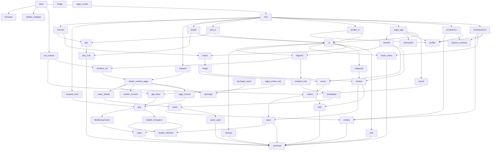

# zimr file atlas

*Generated 2026-06-30 by `zig build files-md` (tools/gen_files_md.zig) — regenerate after structural changes; counts/deps are computed, descriptions come from `//!` headers (preferred) or tools/file_descriptions.zig.*

**386 .zig files, 274,470 lines of Zig.** Module-name dependencies (`zm`, `shader_interface`, `build_options`, `sw_runtime`, …) are build-wired; file dependencies are direct `@import` paths. *Dependents* are in-tree importers (plus `build.zig (wired)` when the build references the path).

## Topography
The `src/*.zig` module import graph: **56 modules, 257 edges, 0 cycles** (89 edges after transitive reduction — see the graph below). The DAG levels below are longest-path layers — bottom-up: `L0` imports no in-tree module, and each level builds only on lower ones. This is the suggested reading order, and the order of the *src (core)* section.
- **L0** (11): `bridge`, `kompute`, `memwatch`, `physics_common`, `profiler`, `shader_codegen`, `shader_connect`, `shader_interface`, `spv2wgsl`, `wgpu_runner`, `zimrmath`
- **L1** (10): `easings`, `entities`, `frame_arena`, `plot_core`, `raster_pixel`, `spv2wgsl_wasm`, `types`, `utils`, `web`, `wgpu`
- **L2** (8): `BindGroupCache`, `codecs`, `plot`, `raster`, `runtime`, `shader_introspect`, `zimrphysics`, `zimrphysics2d`
- **L3** (6): `SwAdapter`, `errors`, `gpu`, `raster_shader`, `shapes2d`, `sound`
- **L4** (5): `compute_host`, `gpu_iface`, `image`, `renderer_trait`, `wgpu_texture`
- **L5** (3): `shader_runtime_wgpu`, `text2d`, `wgpu_smoke_test`
- **L6** (3): `Canvas`, `material`, `renderer_2d`
- **L7** (2): `WgpuGl`, `sw_runtime`
- **L8** (2): `draw3d`, `ui`
- **L9** (4): `plot3d`, `plot_ui`, `profiler_ui`, `wgpu_app`
- **L10** (1): `zimr`
- **L11** (1): `tests`

**Out-degree hubs:** `tests` (41), `zimr` (38), `wgpu_app` (23), `draw3d` (13), `ui` (12), `shader_runtime_wgpu` (10), `sw_runtime` (8), `WgpuGl` (7)

## Dependency graph
Transitive reduction of the src import DAG (257 direct `@import` edges reduced to 89 covering edges; an edge already implied by a longer path is dropped). Top-to-bottom: an importer points down to what it directly needs.

A pixel-rendered version of this same graph — drawn by zimr's own software rasterizer, with each box sized by line count — is regenerated by `zig build dag-png`:

Grouped entries (not per-file): `tests/fixtures/external/tint/` — 363 SPIR-V/WGSL fixtures from Tint's corpus driving the spv2wgsl regression; `tests/fixtures/phi_repro/` — 7 minimized phi-node repros; `tests/snapshots/` — UI snapshot PNG baselines; `assets/` — runtime-fetched images.

## (root)

### `.gitignore`

Ignore rules (caches, zig-out, prebuilt artifacts).

*38 lines*  
**Deps:** —  
**Dependents:** —

### `.zenv.sh`

Sourceable PATH exports for the vendored toolchains.

*2 lines*  
**Deps:** —  
**Dependents:** —

### `LICENSE`

Project license.

*496 lines*  
**Deps:** —  
**Dependents:** —

### `build.zig`

The build graph: discovers shader sources, runs the SPIR-V→WGSL pipeline per engine/example shader, defines every wgpu example's wasm module + page install, the six native host demos, the host test target (with WGSL + externs wiring for the refAllDecls policy), lint (a hard dependency of every compile), smoke harnesses, docs, dist, and the standalone-HTML bakers. The single most load-bearing file in the repo; edit with exact-text anchors and verify with a full gate run.

*4,018 lines · 23 fns*  
**Deps:** `../X.zig`, `../shader_interface.zig`, `../spv2wgsl.zig`, `default_shapes_vs.zig`, `math.zig`, `src/shader_codegen.zig`, `ui.zig`, `zimr.zig`, `build_options` (module), `io` (module), `math` (module), `shader_interface` (module), `zm` (module)  
**Dependents:** —

### `build.zig.zon`

Root package manifest (no external deps by design).

*17 lines*  
**Deps:** —  
**Dependents:** —

### `build_everything.bat`

Windows convenience: full build battery.

*71 lines*  
**Deps:** —  
**Dependents:** —

### `cheatsheet.html`

Generated API cheatsheet (from CHEATSHEET.md via scripts/build_cheatsheet.py); carried into dist.

*355 lines*  
**Deps:** —  
**Dependents:** `build.zig (wired)`

### `generate_vscode.bat`

Windows convenience: regenerate launch.json.

*16 lines*  
**Deps:** —  
**Dependents:** —

### `hy`p`

(no description yet — add a //! header or a dict entry)

*12,534 lines*  
**Deps:** —  
**Dependents:** —

### `install-bun.bat`

Fetches the vendored bun runtime (Windows).

*25 lines*  
**Deps:** —  
**Dependents:** —

### `install-bun.sh`

Fetches the vendored bun runtime (POSIX).

*25 lines*  
**Deps:** —  
**Dependents:** —

### `kill-serve.bat`

Stops the dev server (Windows).

*17 lines*  
**Deps:** —  
**Dependents:** —

### `kill-serve.sh`

Stops the dev server (POSIX).

*17 lines*  
**Deps:** —  
**Dependents:** —

### `release.bat`

Builds + packages the dist bundle (Windows).

*88 lines*  
**Deps:** —  
**Dependents:** `build.zig (wired)`

### `release.sh`

Builds + packages the dist bundle (POSIX).

*35 lines*  
**Deps:** —  
**Dependents:** —

### `serve.bat`

Serves zig-out/web via the bun dev server (Windows).

*56 lines*  
**Deps:** —  
**Dependents:** `build.zig (wired)`

### `serve.sh`

Serves zig-out/web via the bun dev server (POSIX).

*45 lines*  
**Deps:** —  
**Dependents:** —

## src (core)

### `src/bridge.zig`

The browser runtime for the wgpu path: WASI shim, DOM/input glue, the WebGPU bridge (integer-registry handle protocol, encoder ops incl. copyTextureToBuffer), audio, and zimrRun boot. Bundled per-example and inlined by the standalone baker.

*L0 · 4,776 lines · 439 fns*  
**Deps:** `wz` (module)  
**Dependents:** `build.zig (wired)`

### `src/kompute.zig`

kompute — the compute DSL. A kernel file declares `config` + `Buffers` + `Params` + one or more kernel `fn`s; this module generates the boilerplate so the same source runs as a GPU compute dispatch or a CPU loop (see `src/notes/tutorials/gpu-compute-tutorial.md`).

*L0 · 303 lines · 15 fns*  
**Deps:** `kompute` (module)  
**Dependents:** `build.zig (wired)`, `src/tests.zig`

### `src/memwatch.zig`

MemWatch — a per-frame wasm-linear-memory growth watchdog.

*L0 · 83 lines · 1 fns*  
**Deps:** `build_options` (module)  
**Dependents:** `src/wgpu_app.zig`

### `src/physics_common.zig`

Shared, dimension-independent contract for the two physics engines — `zimrphysics` (3D / Jolt port) and `zimrphysics2d` (2D / Box2D v3 port). Defining the genuinely parallel parts here, and asserting the parallel surface at comptime, is what keeps the two engines feeling like one family rather than re-diverging over time: a developer who learns one can predict the other. See the engine compatibility plan for the…

*L0 · 57 lines · 1 fns*  
**Deps:** —  
**Dependents:** `src/zimr.zig`, `src/zimrphysics.zig`, `src/zimrphysics2d.zig`

### `src/profiler.zig`

profiler.zig — zimr's integrated, in-process profiler (Tracy-inspired).

*L0 · 723 lines · 41 fns · 3 tests*  
**Deps:** `build_options` (module)  
**Dependents:** `build.zig (wired)`, `src/profiler_ui.zig`, `src/wgpu_app.zig`, `src/zimr.zig`, `src/zimrphysics.zig`, `src/zimrphysics2d.zig`

### `src/shader_codegen.zig`

src/shader_codegen.zig — public build-time API for zimr.

*L0 · 728 lines · 7 fns*  
**Deps:** `src/foo_fs.zig`, `src/src/shader_codegen.zig`, `<basename>_externs` (module), `<externs_module_name>` (module), `cube_split_vs_externs` (module), `gen` (module), `io` (module), `shader_interface` (module), `shader_io` (module), `shadermath` (module), `zimr_build` (module), `zm` (module)  
**Dependents:** `build.zig`, `build.zig (wired)`, `src/tests.zig`

### `src/shader_connect.zig`

src/shader_connect.zig — comptime-monomorphized varying connector.

*L0 · 70 lines · 2 fns · 1 tests*  
**Deps:** —  
**Dependents:** `src/shader_runtime_wgpu.zig`, `src/sw_runtime.zig`, `src/tests.zig`, `src/zimr.zig`

### `src/shader_interface.zig`

SHADER-SAFE — this file may be @imported by shader sources (compiled through the SPIR-V pipeline) and by comptime executors. Lint enforces the tier: no allocators, no runtime std, no externs, no bridge imports outside `test` blocks.

*L0 · [shader-safe] · 524 lines · 7 fns · 11 tests*  
**Deps:** `common/fog.zig`, `common/lighting.zig`  
**Dependents:** `build.zig (wired)`

### `src/spv2wgsl.zig`

The pure-Zig SPIR-V→WGSL transpiler entry: parses SPIR-V binaries, reconstructs structured control flow via the CFG walkers in src/spv2wgsl/, runs the sample-uniformity pass (Chrome/Tint uniform-control-flow), and emits WGSL. Known item: the recursive emitFunctionBody needs a big stack on one Tint fixture (iterative emitter queued in P6).

*L0 · 10,336 lines · 197 fns · 8 tests*  
**Deps:** —  
**Dependents:** `build.zig (wired)`, `src/shader_runtime_wgpu.zig`, `src/spv2wgsl_wasm.zig`, `src/tests.zig`, `src/zimr.zig`

### `src/wgpu_runner.zig`

wgpu_runner.zig — the generic standalone runner for a DESCRIPTOR-ONLY wgpu example. It is the exe root of an `addWgpuApp` build: it imports the example as the `user_app` module (which exposes `pub const app = z.AppSpec(State){...}` and nothing else — no `main`, no globals), owns the wasm entry and the single beginDrawing/clearBackground/endDrawing, and ticks the app full-screen.

*L0 · 35 lines · 2 fns*  
**Deps:** `user_app` (module), `zimr` (module)  
**Dependents:** `build.zig (wired)`

### `src/zimrmath.zig`

SHADER-SAFE — this file may be @imported by shader sources (compiled through the SPIR-V pipeline) and by comptime executors. Lint enforces the tier: no allocators, no runtime std, no externs, no bridge imports outside `test` blocks.

*L0 · [shader-safe] · 9,618 lines · 469 fns · 163 tests*  
**Deps:** `build_options` (module), `zm` (module)  
**Dependents:** `build.zig (wired)`, `src/notes/spikes/spike_sampler_oldpath.zig`, `src/notes/spikes/spike_ssbo_shader.zig`, `src/notes/spikes/spike_texture_shader.zig`

### `src/easings.zig`

Raylib's easing functions (linear through bounce/elastic, in/out/inout) used by the UI animation layer and the easings examples.

*L1 · 464 lines · 25 fns · 7 tests*  
**Deps:** `zm` (module)  
**Dependents:** `src/tests.zig`, `src/ui.zig`, `src/zimr.zig`

### `src/entities.zig`

The ECS: comptime-dispatched Entities(T) pools with unified spawn, forEach, handles and generation checks (the pool/world_stamp/ecs consolidation).

*L1 · 7,613 lines · 300 fns · 25 tests*  
**Deps:** `zm` (module)  
**Dependents:** `src/raster.zig`, `src/tests.zig`, `src/zimr.zig`, `src/zimrphysics.zig`, `src/zimrphysics2d.zig`

### `src/frame_arena.zig`

FrameArena — an `ArenaAllocator` that enforces its own per-frame reset.

*L1 · 161 lines · 10 fns · 1 tests*  
**Deps:** `zm` (module)  
**Dependents:** `src/ui.zig`, `src/zimrphysics2d.zig`

### `src/plot_core.zig`

plot_core.zig — machinery shared by implot.zig and implot3d.zig.

*L1 · 296 lines · 15 fns*  
**Deps:** `zm` (module)  
**Dependents:** `src/plot.zig`, `src/plot3d.zig`, `src/zimr.zig`

### `src/raster_pixel.zig`

Pixel-level primitives for the software rasterizer: blending, format packing/unpacking, span fills.

*L1 · 1,463 lines · 22 fns · 34 tests*  
**Deps:** `zm` (module)  
**Dependents:** `src/raster.zig`, `src/raster_shader.zig`, `src/tests.zig`

### `src/spv2wgsl_wasm.zig`

Wasm entry root exposing the transpiler to the browser dev page. Excluded from refAllDecls (wasm root).

*L1 · 96 lines · 1 fns*  
**Deps:** `src/spv2wgsl.zig`  
**Dependents:** `build.zig (wired)`

### `src/types.zig`

The shared vocabulary: Color, Rectangle (extern — embedded in extern ABI structs), Image, Texture, Mesh, Model, Material, ModelAnimation, Camera2D/3D, Ray/RayCollision/BoundingBox, PixelFormat, key/mouse/gesture enums. Almost everything imports this; it imports almost nothing.

*L1 · 1,616 lines · 21 fns · 34 tests*  
**Deps:** `src/types.zig`, `shader_interface` (module), `zm` (module)  
**Dependents:** `src/Canvas.zig`, `src/codecs.zig`, `src/draw3d.zig`, `src/image.zig`, `src/runtime.zig`, `src/shapes2d.zig`, `src/sound.zig`, `src/tests.zig`, `src/tests/errors_test.zig`, `src/tests/leak_test.zig`, `src/tests/shader_enum_test.zig`, `src/text2d.zig`, `src/types.zig`, `src/ui.zig`, `src/wgpu_app.zig`, `src/zimr.zig`

### `src/utils.zig`

Comptime feature flags (`features`), the todo() marker, allow_assert wiring from build_options, and small shared utilities. zimr re-exports features/todo as the public surface.

*L1 · 620 lines · 33 fns · 4 tests*  
**Deps:** `src/utils.zig`, `zm` (module)  
**Dependents:** `build.zig (wired)`, `src/tests.zig`, `src/ui.zig`, `src/utils.zig`, `src/zimr.zig`

### `src/web.zig`

The dom namespace: log/now_ms/canvas-size externs with host fallbacks, plus fetch/file-loading glue. The function-pointer sinks runtime.effects route through live here.

*L1 · 1,591 lines · 90 fns*  
**Deps:** `src/web.zig`, `zm` (module)  
**Dependents:** `src/codecs.zig`, `src/draw3d.zig`, `src/errors.zig`, `src/runtime.zig`, `src/sound.zig`, `src/tests.zig`, `src/ui.zig`, `src/web.zig`, `src/zimr.zig`

### `src/wgpu.zig`

The WebGPU handle layer: typed handles (BufferHandle, TextureHandle, BindGroupHandle, PipelineHandle...) over the JS bridge's integer registry, the extern js_* bridge declarations (comptime-gated for wasm), device/queue/encoder operations, buffer mapping, copyTextureToBuffer, and createShaderModuleWgsl. Host builds get inert fallbacks so the same code analyzes everywhere.

*L1 · 1,671 lines · 69 fns · 1 tests*  
**Deps:** `src/wgpu.zig`, `zm` (module)  
**Dependents:** `build.zig (wired)`, `src/BindGroupCache.zig`, `src/WgpuGl.zig`, `src/compute_host.zig`, `src/draw3d.zig`, `src/gpu.zig`, `src/gpu_iface.zig`, `src/material.zig`, `src/renderer_2d.zig`, `src/shader_introspect.zig`, `src/shader_runtime_wgpu.zig`, `src/sw_runtime.zig`, `src/tests.zig`, `src/wgpu.zig`, `src/wgpu_app.zig`, `src/wgpu_smoke_test.zig`, `src/wgpu_texture.zig`, `src/zimr.zig`

### `src/BindGroupCache.zig`

Cache of bind groups keyed by (layout, resources) so per-frame draws don't re-create identical groups across the bridge.

*L2 · 171 lines · 7 fns · 2 tests*  
**Deps:** `src/BindGroupCache.zig`, `src/wgpu.zig`  
**Dependents:** `src/BindGroupCache.zig`, `src/gpu.zig`, `src/tests.zig`, `src/wgpu_app.zig`, `src/wgpu_smoke_test.zig`, `src/zimr.zig`

### `src/codecs.zig`

Asset codecs: PNG encode/decode, JPEG decode, glTF/GLB parse (meshes, skins, animations, JOINTS/WEIGHTS → Mesh bone arrays), OBJ export support, TTF font parsing + atlas baking.

*L2 · 9,199 lines · 160 fns*  
**Deps:** `src/codecs.zig`, `src/types.zig`, `src/web.zig`, `zm` (module)  
**Dependents:** `build.zig (wired)`, `src/Canvas.zig`, `src/codecs.zig`, `src/draw3d.zig`, `src/errors.zig`, `src/image.zig`, `src/sound.zig`, `src/sw_runtime.zig`, `src/tests.zig`, `src/tests/errors_test.zig`, `src/text2d.zig`, `src/ui.zig`, `src/wgpu_app.zig`, `src/zimr.zig`

### `src/plot.zig`

plot.zig — a native-Zig plotting library for zimr, in the spirit of Dear ImGui's ImPlot but redesigned to be idiomatic Zig.

*L2 · 2,793 lines · 93 fns · 17 tests*  
**Deps:** `src/plot_core.zig`, `zm` (module)  
**Dependents:** `src/Canvas.zig`, `src/plot_ui.zig`, `src/tests.zig`, `src/zimr.zig`

### `src/raster.zig`

src/raster.zig - software rasterizer.

*L2 · 7,270 lines · 95 fns · 157 tests*  
**Deps:** `src/entities.zig`, `src/raster_pixel.zig`, `zm` (module)  
**Dependents:** `src/SwAdapter.zig`, `src/WgpuGl.zig`, `src/raster_shader.zig`, `src/renderer_trait.zig`, `src/shader_runtime_wgpu.zig`, `src/sw_runtime.zig`, `src/tests.zig`, `src/ui.zig`, `src/wgpu_app.zig`, `src/zimr.zig`

### `src/runtime.zig`

Engine runtime services, all backend-agnostic since P5: core (WindowState, screen/render dims, traceLog), input (keyboard/mouse/touch state machine + event queue), gestures, camera (updateCamera modes, camera math, screen↔world projection with explicit ClipPlanes), effects (clock, rng, logger with Prefixed/Scoped, loader), allocator helpers (freeMany etc.), and the wasm libc shims.

*L2 · 6,744 lines · 269 fns · 1 tests*  
**Deps:** `src/types.zig`, `src/web.zig`, `zm` (module)  
**Dependents:** `build.zig (wired)`, `src/draw3d.zig`, `src/image.zig`, `src/shapes2d.zig`, `src/tests.zig`, `src/tests/leak_test.zig`, `src/tests/multiapp_test.zig`, `src/text2d.zig`, `src/ui.zig`, `src/wgpu_app.zig`, `src/zimr.zig`

### `src/shader_introspect.zig`

Comptime schema introspection: solveLayout (schema → ResolvedLayout of binding fields + groups), autoMaterial bind group layout emission, and assertVaryingsMatch (VS↔FS varying validation with comptime-marked conditions).

*L2 · 1,028 lines · 19 fns · 17 tests*  
**Deps:** `src/wgpu.zig`, `shader_interface` (module)  
**Dependents:** `src/compute_host.zig`, `src/draw3d.zig`, `src/gpu.zig`, `src/material.zig`, `src/shader_runtime_wgpu.zig`, `src/tests.zig`, `src/wgpu_app.zig`, `src/zimr.zig`

### `src/zimrphysics.zig`

physics.zig — a single-file, single-threaded rigid-body engine.

*L2 · 18,039 lines · 445 fns*  
**Deps:** `src/entities.zig`, `src/physics_common.zig`, `src/profiler.zig`, `zm` (module)  
**Dependents:** `src/tests.zig`, `src/tests/zimrphysics_stack_test.zig`, `src/zimr.zig`

### `src/zimrphysics2d.zig`

zimrphysics2d.zig — a single-file, single-threaded 2D rigid-body engine.

*L2 · 14,513 lines · 426 fns · 10 tests*  
**Deps:** `src/entities.zig`, `src/frame_arena.zig`, `src/physics_common.zig`, `src/profiler.zig`, `zm` (module)  
**Dependents:** `src/zimr.zig`

### `src/SwAdapter.zig`

src/SwAdapter.zig — the raster (software rasterizer) renderer-trait adapter.

*L3 · 151 lines · 19 fns*  
**Deps:** `src/SwAdapter.zig`, `src/raster.zig`, `zm` (module)  
**Dependents:** `src/SwAdapter.zig`, `src/renderer_trait.zig`, `src/tests.zig`, `src/zimr.zig`

### `src/errors.zig`

The shared error sets: LoadError, ImageGenError, GpuError and friends, plus error-formatting helpers.

*L3 · 76 lines · 0 fns*  
**Deps:** `src/codecs.zig`, `src/web.zig`  
**Dependents:** `src/draw3d.zig`, `src/image.zig`, `src/tests.zig`, `src/tests/errors_test.zig`, `src/text2d.zig`

### `src/gpu.zig`

zimr's WebGPU resource layer over raw `wgpu` (merge of pipeline_cache + descriptor_encoder + gpu_frame): PipelineCache/StateCombo, the descriptor encoders (RenderPipelineDescriptor/BindGroupEntry/...), and per-frame GpuFrame.

*L3 · 695 lines · 23 fns · 9 tests*  
**Deps:** `src/BindGroupCache.zig`, `src/shader_introspect.zig`, `src/wgpu.zig`  
**Dependents:** `src/compute_host.zig`, `src/draw3d.zig`, `src/gpu_iface.zig`, `src/material.zig`, `src/renderer_2d.zig`, `src/shader_runtime_wgpu.zig`, `src/tests.zig`, `src/wgpu_app.zig`, `src/wgpu_smoke_test.zig`, `src/wgpu_texture.zig`, `src/zimr.zig`

### `src/raster_shader.zig`

src/raster_shader.zig — run zimr fragment shaders on the CPU.

*L3 · 1,763 lines · 39 fns · 15 tests*  
**Deps:** `src/raster.zig`, `src/raster_pixel.zig`, `zm` (module)  
**Dependents:** `src/shader_runtime_wgpu.zig`, `src/sw_runtime.zig`, `src/tests.zig`, `src/zimr.zig`

### `src/shapes2d.zig`

src/shapes2d.zig — the backend-generic 2D shape primitives, MOVED VERBATIM out of drawing.zig (GL retirement P1, t1173): rectangles, ellipses, polys, rings, splines, lines — all over `gl: anytype`, drawn by both backends (ui's widget rendering, wgpu_app's ShapesTextureState). GL-free since GL-retirement P5d.

*L3 · 2,915 lines · 97 fns · 41 tests*  
**Deps:** `src/runtime.zig`, `src/types.zig`, `zm` (module)  
**Dependents:** `src/tests.zig`, `src/tests/snapshot_regression_test.zig`, `src/tests/ui_dock_screenshot_test.zig`, `src/tests/ui_screenshot_test.zig`, `src/ui.zig`, `src/wgpu_app.zig`

### `src/sound.zig`

Audio: sounds (one-shot), streams (ring-buffered PCM with FIFO recycle), and music, over web-audio bridge externs with host no-op fallbacks.

*L3 · 3,382 lines · 90 fns*  
**Deps:** `src/codecs.zig`, `src/types.zig`, `src/web.zig`, `zm` (module)  
**Dependents:** `src/tests.zig`, `src/wgpu_app.zig`, `src/zimr.zig`

### `src/compute_host.zig`

compute_host.zig — `z.Compute(M)`: run a kompute kernel module `M` on the CPU (a plain `for id` loop calling the kernel) OR the GPU (a WGSL compute dispatch), chosen at runtime via `.backend`. Same kernel source, same results.

*L4 · 948 lines · 24 fns · 4 tests*  
**Deps:** `src/double_it.zig`, `src/gpu.zig`, `src/shader_introspect.zig`, `src/wgpu.zig`, `zm` (module)  
**Dependents:** `src/tests.zig`, `src/zimr.zig`

### `src/gpu_iface.zig`

WgpuBackend — the backend handle the app/frame layer threads through draw3d, renderer_2d and friends; device/queue access plus PassState.

*L4 · 826 lines · 25 fns · 3 tests*  
**Deps:** `src/gpu.zig`, `src/wgpu.zig`, `zm` (module)  
**Dependents:** `src/WgpuGl.zig`, `src/draw3d.zig`, `src/material.zig`, `src/renderer_2d.zig`, `src/shader_runtime_wgpu.zig`, `src/sw_runtime.zig`, `src/tests.zig`, `src/wgpu_app.zig`, `src/wgpu_smoke_test.zig`, `src/zimr.zig`

### `src/image.zig`

image — Image (CPU pixel buffer) type helpers + the full CPU image-processing library (merged from drawing.textures in GL-retirement P5): generators (color/checked/gradients/noise/ cellular), transforms (crop/resize×3/rotate/flip/blur/dither), draws-into-image (pixels/lines/shapes/text), color ops, format conversion, and PNG export glue.

*L4 · 5,472 lines · 100 fns · 117 tests*  
**Deps:** `src/codecs.zig`, `src/errors.zig`, `src/runtime.zig`, `src/types.zig`, `zm` (module)  
**Dependents:** `src/Canvas.zig`, `src/tests.zig`, `src/tests/leak_test.zig`, `src/text2d.zig`, `src/wgpu_app.zig`, `src/zimr.zig`

### `src/renderer_trait.zig`

The renderer trait: assertIsGlContext, the comptime contract (begin/end/vertex2f/color4ub/setTexture/...) that WgpuGl, raster adapters and the test stub all satisfy, letting 2D draw code take `gl: anytype`. The GL-era GlAdapter died in P5.

*L4 · 168 lines · 1 fns · 3 tests*  
**Deps:** `src/SwAdapter.zig`, `src/raster.zig`  
**Dependents:** `src/WgpuGl.zig`, `src/tests.zig`

### `src/wgpu_texture.zig`

WgpuTexture: creation from Image/raw RGBA8, view + sampler management, the texture registry that backs WgpuGl's id-based setTexture path, and mip/format plumbing.

*L4 · 343 lines · 9 fns · 3 tests*  
**Deps:** `src/gpu.zig`, `src/wgpu.zig`, `zm` (module)  
**Dependents:** `src/WgpuGl.zig`, `src/draw3d.zig`, `src/renderer_2d.zig`, `src/shader_runtime_wgpu.zig`, `src/tests.zig`, `src/wgpu_app.zig`, `src/zimr.zig`

### `src/shader_runtime_wgpu.zig`

The typed shader runtime for the wgpu path: Resources(Schema) bind-group containers, typed IO structs, samplers, UBO plumbing, and the wave_fs demo IO. Pairs with shader_introspect's comptime schema solving.

*L5 · 1,825 lines · 37 fns · 23 tests*  
**Deps:** `src/gpu.zig`, `src/gpu_iface.zig`, `src/raster.zig`, `src/raster_shader.zig`, `src/shader_connect.zig`, `src/shader_introspect.zig`, `src/spv2wgsl.zig`, `src/wave_fs_io.zig`, `src/wave_vs_io.zig`, `src/wgpu.zig`, `src/wgpu_texture.zig`, `shader_interface` (module)  
**Dependents:** `src/draw3d.zig`, `src/material.zig`, `src/renderer_2d.zig`, `src/sw_runtime.zig`, `src/tests.zig`, `src/wgpu_app.zig`, `src/zimr.zig`

### `src/text2d.zig`

src/text2d.zig — the backend-generic 2D text stack, MOVED VERBATIM out of drawing.zig (GL retirement P1, t1173): FontCache, TTF atlas bake (`bakeFontAtlas`), `drawWithFont`/`measureWithFont` over `gl: anytype`. Both backends draw text through this file (wgpu_app builds its Font on `bakeFontAtlas`; ui renders through `drawWithFont`). GL-free since GL-retirement P5d.

*L5 · 2,981 lines · 65 fns · 55 tests*  
**Deps:** `src/codecs.zig`, `src/errors.zig`, `src/image.zig`, `src/runtime.zig`, `src/text2d.zig`, `src/types.zig`, `zm` (module)  
**Dependents:** `src/Canvas.zig`, `src/tests.zig`, `src/tests/snapshot_regression_test.zig`, `src/tests/ui_dock_screenshot_test.zig`, `src/tests/ui_screenshot_test.zig`, `src/text2d.zig`, `src/ui.zig`, `src/wgpu_app.zig`

### `src/wgpu_smoke_test.zig`

Wasm-root smoke harness compiled per example by the smoke build: boots the app headlessly under webtests/runner.mjs (driving the dogfooded webtests/wgpu_smoke.zig logic), counts bridge calls per frame, and reports PASS lines the tier-a gate greps. Excluded from refAllDecls (wasm entry root).

*L5 · 210 lines · 4 fns · 2 tests*  
**Deps:** `src/BindGroupCache.zig`, `src/gpu.zig`, `src/gpu_iface.zig`, `src/wgpu.zig`  
**Dependents:** —

### `src/Canvas.zig`

`Canvas` — a pure-Zig, native, anti-aliased 2D drawing surface that exports PNG with zero third-party code. It renders into a supersampled RGBA8 buffer using zimr's own `imageDraw*` rasterizers + truetype text, then box-downsamples (premultiplied) for clean anti-aliasing, and encodes via zimr's own PNG codec.

*L6 · 408 lines · 19 fns · 2 tests*  
**Deps:** `src/Canvas.zig`, `src/codecs.zig`, `src/image.zig`, `src/plot.zig`, `src/text2d.zig`, `src/types.zig`, `zm` (module)  
**Dependents:** `src/Canvas.zig`, `src/tests.zig`, `src/zimr.zig`

### `src/material.zig`

material.zig — the public custom-pipeline API ("complete WebGPU control").

*L6 · 350 lines · 12 fns*  
**Deps:** `src/gpu.zig`, `src/gpu_iface.zig`, `src/shader_introspect.zig`, `src/shader_runtime_wgpu.zig`, `src/wgpu.zig`  
**Dependents:** `src/zimr.zig`

### `src/renderer_2d.zig`

The 2D batch renderer: shapes batch (vertex staging, per-texture bind groups via the registry — the turn-909 aliasing fix), orthoTopLeft (the GPU-UBO [16]f32 projection), per-frame UBO updates, and pipeline setup. Embeds default_shapes_vs/fs.wgsl.

*L6 · 587 lines · 15 fns · 6 tests*  
**Deps:** `src/gpu.zig`, `src/gpu_iface.zig`, `src/shader_runtime_wgpu.zig`, `src/shaders/default_shapes_fs_io.zig`, `src/shaders/default_shapes_vs_io.zig`, `src/wgpu.zig`, `src/wgpu_texture.zig`, `shader_interface` (module), `zm` (module)  
**Dependents:** `src/WgpuGl.zig`, `src/sw_runtime.zig`, `src/tests.zig`, `src/wgpu_app.zig`, `src/zimr.zig`

### `src/WgpuGl.zig`

src/WgpuGl.zig — the WebGPU `gl: anytype` adapter (the "third renderer").

*L7 · 612 lines · 29 fns · 8 tests*  
**Deps:** `src/WgpuGl.zig`, `src/gpu_iface.zig`, `src/raster.zig`, `src/renderer_2d.zig`, `src/renderer_trait.zig`, `src/wgpu.zig`, `src/wgpu_texture.zig`, `zm` (module)  
**Dependents:** `src/WgpuGl.zig`, `src/draw3d.zig`, `src/tests.zig`, `src/ui.zig`, `src/wgpu_app.zig`, `src/zimr.zig`

### `src/sw_runtime.zig`

src/sw_runtime.zig — single-module entry point for native consumers of the software-renderer + codec pieces.  Bundles `raster`, `raster_shader`, `codecs`, and `shader_connect` so they share one module (avoiding Zig 0.16's one-file-per-module rule — they all transitively import `types.zig`).

*L7 · 32 lines · 0 fns*  
**Deps:** `src/codecs.zig`, `src/gpu_iface.zig`, `src/raster.zig`, `src/raster_shader.zig`, `src/renderer_2d.zig`, `src/shader_connect.zig`, `src/shader_runtime_wgpu.zig`, `src/shaders/default_shapes_fs.zig`, `src/shaders/default_shapes_vs.zig`, `src/wgpu.zig`  
**Dependents:** `build.zig (wired)`, `src/tests.zig`

### `src/draw3d.zig`

draw3d — the 3D library: immediate-mode primitives + the retained-mesh API for the WebGPU backend, AND (since GL-retirement P5) the CPU model/mesh library merged in from drawing.models: mesh generators (plane/cone/cylinder/torus/knot/poly/tangents), collision + bounds + raycast math, glTF model/animation loading, CPU pose evaluation (updateModelAnimation/Blend), and CPU material descriptors.

*L8 · 5,633 lines · 141 fns*  
**Deps:** `src/WgpuGl.zig`, `src/codecs.zig`, `src/errors.zig`, `src/gpu.zig`, `src/gpu_iface.zig`, `src/runtime.zig`, `src/shader_introspect.zig`, `src/shader_runtime_wgpu.zig`, `src/shaders/pbr_common_io.zig`, `src/shaders/pbr_fs_io.zig`, `src/types.zig`, `src/web.zig`, `src/wgpu.zig`, `src/wgpu_texture.zig`, `zm` (module)  
**Dependents:** `src/tests.zig`, `src/tests/leak_test.zig`, `src/wgpu_app.zig`, `src/zimr.zig`

### `src/ui.zig`

The immediate-mode UI — the Dear ImGui port, and the largest file in the tree. UiContext + Ui frame handles, the full widget set (windows, docking, tables, plots, drag-drop, text editing, multiselect, style editor), the DrawList replay over a generic `gl: anytype` renderer trait, layout, persistence (typed state storage + disk), and the raster-based screenshot/snapshot pipeline (renderToBytes/renderToPng/snapshotPng). The Gl selector picks WgpuGl in wasm builds and the inert TestGlStub (alias of shapes2d.TestGl) in host-test builds.

*L8 · 42,493 lines · 666 fns · 660 tests*  
**Deps:** `src/WgpuGl.zig`, `src/codecs.zig`, `src/easings.zig`, `src/frame_arena.zig`, `src/raster.zig`, `src/runtime.zig`, `src/shapes2d.zig`, `src/text2d.zig`, `src/types.zig`, `src/utils.zig`, `src/web.zig`, `build_options` (module), `zimr` (module), `zm` (module)  
**Dependents:** `src/plot3d.zig`, `src/plot_ui.zig`, `src/profiler_ui.zig`, `src/tests.zig`, `src/tests/snapshot_regression_test.zig`, `src/tests/ui_dock_builder_test.zig`, `src/tests/ui_dock_screenshot_test.zig`, `src/tests/ui_screenshot_test.zig`, `src/wgpu_app.zig`, `src/zimr.zig`

### `src/plot3d.zig`

implot3d.zig — a single-file, pure-Zig port of ImPlot3D v0.5 WIP (https://github.com/brenocq/implot3d, MIT, (c) 2024-2025 Breno Cunha Queiroz; Zig port 2026).

*L9 · 4,834 lines · 375 fns · 4 tests*  
**Deps:** `src/plot_core.zig`, `src/ui.zig`, `zm` (module)  
**Dependents:** `src/zimr.zig`

### `src/plot_ui.zig`

plot_ui.zig — the `ui.zig` adapter for `plot.zig`.

*L9 · 1,447 lines · 38 fns*  
**Deps:** `src/plot.zig`, `src/ui.zig`, `zm` (module)  
**Dependents:** `src/zimr.zig`

### `src/profiler_ui.zig`

profiler_ui.zig — app-callable views for the integrated profiler.

*L9 · 376 lines · 7 fns*  
**Deps:** `src/profiler.zig`, `src/ui.zig`, `zm` (module)  
**Dependents:** `src/zimr.zig`

### `src/wgpu_app.zig`

src/wgpu_app.zig — the WebGPU `App` + `Frame` run-loop.

*L9 · 3,441 lines · 146 fns · 1 tests*  
**Deps:** `src/BindGroupCache.zig`, `src/WgpuGl.zig`, `src/codecs.zig`, `src/draw3d.zig`, `src/gpu.zig`, `src/gpu_iface.zig`, `src/image.zig`, `src/memwatch.zig`, `src/profiler.zig`, `src/raster.zig`, `src/renderer_2d.zig`, `src/runtime.zig`, `src/shader_introspect.zig`, `src/shader_runtime_wgpu.zig`, `src/shapes2d.zig`, `src/sound.zig`, `src/text2d.zig`, `src/types.zig`, `src/ui.zig`, `src/wgpu.zig`, `src/wgpu_texture.zig`, `shader_interface` (module), `zm` (module)  
**Dependents:** `src/tests.zig`, `src/zimr.zig`

### `src/zimr.zig`

============================================================================ zimr WebGPU architecture — THE reference doc for the wgpu stack ============================================================================

*L10 · 670 lines · 4 fns · 1 tests*  
**Deps:** `src/BindGroupCache.zig`, `src/Canvas.zig`, `src/SwAdapter.zig`, `src/WgpuGl.zig`, `src/codecs.zig`, `src/compute_host.zig`, `src/draw3d.zig`, `src/easings.zig`, `src/entities.zig`, `src/gpu.zig`, `src/gpu_iface.zig`, `src/image.zig`, `src/material.zig`, `src/physics_common.zig`, `src/plot.zig`, `src/plot3d.zig`, `src/plot_core.zig`, `src/plot_ui.zig`, `src/profiler.zig`, `src/profiler_ui.zig`, `src/raster.zig`, `src/raster_shader.zig`, `src/renderer_2d.zig`, `src/runtime.zig`, `src/shader_connect.zig`, `src/shader_introspect.zig`, `src/shader_runtime_wgpu.zig`, `src/shaders/default_shapes_fs.zig`, `src/shaders/default_shapes_vs.zig`, `src/shaders/pbr_fs.zig`, `src/shaders/pbr_vs.zig`, `src/sound.zig`, `src/spv2wgsl.zig`, `src/types.zig`, `src/ui.zig`, `src/utils.zig`, `src/web.zig`, `src/wgpu.zig`, `src/wgpu_app.zig`, `src/wgpu_texture.zig`, `src/zimrphysics.zig`, `src/zimrphysics2d.zig`, `zimr` (module)  
**Dependents:** `build.zig (wired)`, `src/tests.zig`, `src/tests/ext_storage_test.zig`, `src/tests/features_test.zig`

### `src/tests.zig`

Host test aggregator and the refAllDecls policy artifact: every live source file is force-analyzed here so no declaration can rot unanalyzed. Also imports the cross-cutting test suites under src/tests/ and the spv2wgsl internals. zm and shader_interface are referenced as MODULES (file-importing them would double-own their graphs).

*L11 · 110 lines · 0 fns · 1 tests*  
**Deps:** `X.zig`, `src/BindGroupCache.zig`, `src/Canvas.zig`, `src/SwAdapter.zig`, `src/WgpuGl.zig`, `src/codecs.zig`, `src/compute_host.zig`, `src/draw3d.zig`, `src/easings.zig`, `src/entities.zig`, `src/errors.zig`, `src/gpu.zig`, `src/gpu_iface.zig`, `src/image.zig`, `src/kompute.zig`, `src/plot.zig`, `src/raster.zig`, `src/raster_pixel.zig`, `src/raster_shader.zig`, `src/renderer_2d.zig`, `src/renderer_trait.zig`, `src/runtime.zig`, `src/shader_codegen.zig`, `src/shader_connect.zig`, `src/shader_introspect.zig`, `src/shader_runtime_wgpu.zig`, `src/shapes2d.zig`, `src/sound.zig`, `src/spv2wgsl.zig`, `src/sw_runtime.zig`, `src/tests/errors_test.zig`, `src/tests/ext_storage_test.zig`, `src/tests/features_test.zig`, `src/tests/leak_test.zig`, `src/tests/multiapp_test.zig`, `src/tests/zimrphysics_stack_test.zig`, `src/text2d.zig`, `src/types.zig`, `src/ui.zig`, `src/utils.zig`, `src/web.zig`, `src/wgpu.zig`, `src/wgpu_app.zig`, `src/wgpu_texture.zig`, `src/zimr.zig`, `src/zimrphysics.zig`, `shader_interface` (module), `zm` (module)  
**Dependents:** `build.zig (wired)`

### `src/assets/sample.ogg`

Small OGG used by the sound tests.

*19,742 lines*  
**Deps:** —  
**Dependents:** —

### `src/assets/test_sine.wav`

Sine-wave WAV fixture for sound tests.

*201 lines*  
**Deps:** —  
**Dependents:** —

### `src/notes/CHEATSHEET.md`

Note: zimr cheatsheet

*18,824 lines*  
**Deps:** —  
**Dependents:** —

### `src/notes/README.md`

Note: zimr

*4 lines*  
**Deps:** —  
**Dependents:** —

### `src/notes/apps_in_ui.md`

Note: App launcher — switching between full examples (reframed)

*256 lines*  
**Deps:** —  
**Dependents:** —

### `src/notes/architecture-imgui-vs-zimr.md`

Note: Architecture deep-dive: imgui vs zimr

*451 lines*  
**Deps:** —  
**Dependents:** —

### `src/notes/architecture.md`

Note: Architecture

*160 lines*  
**Deps:** —  
**Dependents:** —

### `src/notes/blog_zimr_architecture.md`

Note: zimr: a raylib-shaped graphics library in Zig, compiled to WebAssembly

*291 lines*  
**Deps:** —  
**Dependents:** —

### `src/notes/box2d_samples_plan.md`

Note: Porting the box2d sample corpus → wgpu_zimrphysics2d_demo

*193 lines*  
**Deps:** —  
**Dependents:** —

### `src/notes/changelogs/spv2wgsl-rewrite-changelog.md`

Note: spv2wgsl-rewrite-changelog.md

*1,320 lines*  
**Deps:** —  
**Dependents:** —

### `src/notes/claude.md`

Note: claude.md — fresh-session entry point

*5,081 lines*  
**Deps:** —  
**Dependents:** `build.zig (wired)`

### `src/notes/deprefix_plan.md`

Note: Plan: drop the `wgpu_` prefix from example folders/files/steps

*109 lines*  
**Deps:** —  
**Dependents:** —

### `src/notes/engine_compatibility_plan.md`

Note: Making `zimrphysics` (3D / Jolt) and `zimrphysics2d` (2D / Box2D) feel like one family

*164 lines*  
**Deps:** —  
**Dependents:** —

### `src/notes/files.md`

Note: zimr file atlas

*4,627 lines*  
**Deps:** —  
**Dependents:** `build.zig (wired)`

### `src/notes/gallery.md`

Note: Gallery — bring back the streamed-wasm examples site

*86 lines*  
**Deps:** —  
**Dependents:** —

### `src/notes/getting-started.md`

Note: Getting started with zimr

*182 lines*  
**Deps:** —  
**Dependents:** —

### `src/notes/implot-port.md`

Note: zimr plotting — `implot.zig`, `implot3d.zig` & friends

*592 lines*  
**Deps:** —  
**Dependents:** —

### `src/notes/journal.txt`

(no description yet — add a //! header or a dict entry)

*47 lines*  
**Deps:** —  
**Dependents:** —

### `src/notes/keyword_candidates.md`

Note: PROPOSED KEYWORD ADDITIONS — for approval (nothing applied yet)

*26 lines*  
**Deps:** —  
**Dependents:** —

### `src/notes/lint_autofix.md`

Note: lint_zimr autofix — design & plan

*250 lines*  
**Deps:** —  
**Dependents:** —

### `src/notes/math.md`

Note: `zm` — zimr's unified math library

*340 lines*  
**Deps:** —  
**Dependents:** —

### `src/notes/physics_demo.md`

Note: physics_demo.md — represent every Jolt sample in the zimrphysics demo

*482 lines*  
**Deps:** —  
**Dependents:** —

### `src/notes/plot.md`

Note: zimr plotting — plan & status (`plot.zig` + `plot_ui.zig`)

*355 lines*  
**Deps:** —  
**Dependents:** —

### `src/notes/plot3d.md`

Note: zimr 3D plotting — integration plan (`implot3d`)

*499 lines*  
**Deps:** —  
**Dependents:** —

### `src/notes/profiler.md`

Note: zimr profiler — design & status (ACTIVE PLAN)

*98 lines*  
**Deps:** —  
**Dependents:** —

### `src/notes/raylib_port.md`

Note: raylib sample port — completion plan

*95 lines*  
**Deps:** —  
**Dependents:** —

### `src/notes/settings.local.json`

Local editor settings snapshot.

*19 lines*  
**Deps:** —  
**Dependents:** —

### `src/notes/setup_ideas.md`

Note: Setup / workflow improvement ideas

*29 lines*  
**Deps:** —  
**Dependents:** —

### `src/notes/shader-style.md`

Note: Shader style guide

*286 lines*  
**Deps:** —  
**Dependents:** —

### `src/notes/simon_notes.md`

Note: We should always add at top of file const Allocator = std.mem.Allocator and use that instead.

*7 lines*  
**Deps:** —  
**Dependents:** —

### `src/notes/software_rasterizer_oracle.md`

Note: A Software Rasterizer as a GPU Oracle — the plan

*974 lines*  
**Deps:** —  
**Dependents:** —

### `src/notes/spikes/README.md`

Note: @SpirvType image-op spikes — P0 SOLVED

*62 lines*  
**Deps:** —  
**Dependents:** —

### `src/notes/spikes/spike_sample.zig`

(no description yet — add a //! header or a dict entry)

*50 lines · 1 fns*  
**Deps:** —  
**Dependents:** —

### `src/notes/spikes/spike_sampler_oldpath.wgsl`

(no description yet — add a //! header or a dict entry)

*32 lines*  
**Deps:** —  
**Dependents:** —

### `src/notes/spikes/spike_sampler_oldpath.zig`

(no description yet — add a //! header or a dict entry)

*9 lines · 0 fns*  
**Deps:** `src/zimrmath.zig`  
**Dependents:** —

### `src/notes/spikes/spike_ssbo_shader.zig`

(no description yet — add a //! header or a dict entry)

*12 lines · 0 fns*  
**Deps:** `src/zimrmath.zig`  
**Dependents:** —

### `src/notes/spikes/spike_store.zig`

(no description yet — add a //! header or a dict entry)

*36 lines · 1 fns*  
**Deps:** —  
**Dependents:** —

### `src/notes/spikes/spike_texture_shader.zig`

(no description yet — add a //! header or a dict entry)

*22 lines · 0 fns*  
**Deps:** `src/zimrmath.zig`  
**Dependents:** —

### `src/notes/spikes/spike_vertex_index.zig`

(no description yet — add a //! header or a dict entry)

*11 lines · 0 fns*  
**Deps:** —  
**Dependents:** —

### `src/notes/spv2wgsl_tutorial.md`

Note: How `spv2wgsl` Works — A Tutorial

*603 lines*  
**Deps:** —  
**Dependents:** —

### `src/notes/the-zimr-app-bridge.md`

Note: The zimr_app bridge: why your canvas was black

*464 lines*  
**Deps:** —  
**Dependents:** —

### `src/notes/tint-vs-spv2wgsl.md`

Note: Tint vs spv2wgsl: architectural comparison

*165 lines*  
**Deps:** —  
**Dependents:** —

### `src/notes/tutorials/app-bridge-tutorial.md`

Note: zimr's AppBridge architecture — and the `pub` bug

*365 lines*  
**Deps:** —  
**Dependents:** —

### `src/notes/tutorials/architecture-tutorial.md`

Note: architecture-tutorial.md — zimr's UI engine, end-to-end

*464 lines*  
**Deps:** —  
**Dependents:** —

### `src/notes/tutorials/debug-reload-tutorial.md`

Note: Debug + reload system

*252 lines*  
**Deps:** —  
**Dependents:** —

### `src/notes/tutorials/gpu-compute-tutorial.html`

(no description yet — add a //! header or a dict entry)

*726 lines*  
**Deps:** —  
**Dependents:** —

### `src/notes/tutorials/gpu-compute-tutorial.md`

Note: gpu-compute-tutorial.md — compute in zimr, CPU and GPU from one source

*502 lines*  
**Deps:** —  
**Dependents:** —

### `src/notes/tutorials/gpu_compute_tutorial.html`

(no description yet — add a //! header or a dict entry)

*726 lines*  
**Deps:** —  
**Dependents:** —

### `src/notes/tutorials/lint-zimr-tutorial.md`

Note: lint-zimr-tutorial.md — how the linter works

*525 lines*  
**Deps:** —  
**Dependents:** —

### `src/notes/tutorials/mandelbrot-tutorial.md`

Note: Tutorial — Mandelbrot, end-to-end

*697 lines*  
**Deps:** —  
**Dependents:** —

### `src/notes/tutorials/raster-tutorial.md`

Note: How the software renderer works — a tour

*596 lines*  
**Deps:** —  
**Dependents:** —

### `src/notes/tutorials/resource-tutorial.md`

Note: zimr resources & game entities — a tutorial

*541 lines*  
**Deps:** —  
**Dependents:** —

### `src/notes/tutorials/rtt-tutorial.html`

Render-to-texture tutorial (generated HTML; source via tools/gen_rtt_tut.sh).

*400 lines*  
**Deps:** —  
**Dependents:** —

### `src/notes/tutorials/wgpu-ports-tutorial.html`

Tutorial on porting GL examples to the wgpu backend (generated HTML).

*1,694 lines*  
**Deps:** —  
**Dependents:** —

### `src/notes/tutorials/zig-shader-tutorial.md`

Note: zig-shader-tutorial.md — writing shaders in Zig, end-to-end

*1,020 lines*  
**Deps:** —  
**Dependents:** —

### `src/notes/vscode-debugging.md`

Note: Debugging zimr examples in VS Code

*177 lines*  
**Deps:** —  
**Dependents:** —

### `src/notes/webgpu_control.md`

Note: webgpu_control.md — complete WebGPU control + raygpu example parity

*216 lines*  
**Deps:** —  
**Dependents:** —

### `src/notes/zig-spirv-compiler-interface.md`

Note: Zig SPIR-V compiler interface — the contract zimr depends on, and how to recover when it changes

*375 lines*  
**Deps:** —  
**Dependents:** —

### `src/notes/zig-spirv-quirks.md`

Note: Zig SPIR-V output quirks — and our spv2wgsl workarounds

*260 lines*  
**Deps:** —  
**Dependents:** —

### `src/notes/zig17_migration.md`

Note: zig17_migration.md — Zig 0.16 → 0.17 (master) migration

*240 lines*  
**Deps:** —  
**Dependents:** `build.zig (wired)`

### `src/notes/zmath-LICENSE.txt`

License of the zmath library zimrmath absorbed.

*23 lines*  
**Deps:** —  
**Dependents:** —

## src/shaders

### `src/shaders/_deleted_glsl_placeholder.glsl`

The GLSL gravestone: live shader entries still carry a `<name>.glsl` placeholder name consumer loops wire unconditionally; dies with the P6 wgsl-primary collapse.

*22 lines*  
**Deps:** —  
**Dependents:** `build.zig (wired)`

### `src/shaders/billboard_fs.zig`

src/shaders/billboard_fs.zig — textured-3D / billboard fragment shader, pure Zig.

*41 lines · 0 fns*  
**Deps:** `zm` (module)  
**Dependents:** —

### `src/shaders/billboard_vs.zig`

src/shaders/billboard_vs.zig — textured-3D / billboard vertex shader, pure Zig.

*58 lines · 0 fns*  
**Deps:** `zm` (module)  
**Dependents:** —

### `src/shaders/cube3d_common_io.zig`

src/shaders/cube3d_common_io.zig — Interp varyings shared by `cube3d_vs` and `cube3d_fs`.

*[shader-safe] · 17 lines · 0 fns*  
**Deps:** —  
**Dependents:** `src/shaders/cube3d_fs_io.zig`, `src/shaders/cube3d_instanced_vs_io.zig`, `src/shaders/cube3d_vs_io.zig`

### `src/shaders/cube3d_fs.zig`

src/shaders/cube3d_fs.zig — cube3d immediate-mode fragment shader body.

*29 lines · 1 fns*  
**Deps:** `src/shaders/cube3d_fs_io.zig`, `cube3d_fs_externs` (module)  
**Dependents:** —

### `src/shaders/cube3d_fs_io.zig`

src/shaders/cube3d_fs_io.zig — typed interface for the cube3d immediate-mode fragment shader. Companion to `cube3d_fs.zig`.

*[shader-safe] · 18 lines · 0 fns*  
**Deps:** `src/shaders/cube3d_common_io.zig`  
**Dependents:** `src/shaders/cube3d_fs.zig`

### `src/shaders/cube3d_instanced_vs.zig`

src/shaders/cube3d_instanced_vs.zig — instanced 3D vertex shader body.

*60 lines · 1 fns*  
**Deps:** `src/shaders/cube3d_instanced_vs_io.zig`, `cube3d_instanced_vs_externs` (module), `zm` (module)  
**Dependents:** —

### `src/shaders/cube3d_instanced_vs_io.zig`

src/shaders/cube3d_instanced_vs_io.zig — typed interface for the INSTANCED 3D vertex shader. Companion to `cube3d_instanced_vs.zig`.

*[shader-safe] · 38 lines · 0 fns*  
**Deps:** `src/shaders/cube3d_common_io.zig`, `shader_interface` (module)  
**Dependents:** `src/shaders/cube3d_instanced_vs.zig`

### `src/shaders/cube3d_vs.zig`

src/shaders/cube3d_vs.zig — immediate-mode 3D batch vertex shader body.

*45 lines · 1 fns*  
**Deps:** `src/shaders/cube3d_vs_io.zig`, `cube3d_vs_externs` (module), `zm` (module)  
**Dependents:** —

### `src/shaders/cube3d_vs_io.zig`

src/shaders/cube3d_vs_io.zig — typed interface for the immediate-mode 3D batch vertex shader. Companion to `cube3d_vs.zig`.

*[shader-safe] · 34 lines · 0 fns*  
**Deps:** `src/shaders/cube3d_common_io.zig`, `shader_interface` (module)  
**Dependents:** `src/shaders/cube3d_vs.zig`

### `src/shaders/default_shapes_common_io.zig`

src/shaders/default_shapes_common_io.zig — interpolated

*[shader-safe] · 50 lines · 0 fns*  
**Deps:** `zm` (module)  
**Dependents:** `src/shaders/default_shapes_fs_io.zig`, `src/shaders/default_shapes_vs_io.zig`

### `src/shaders/default_shapes_fs.zig`

src/shaders/default_shapes_fs.zig — Zig source for the wgpu engine's default 2D fragment shader.  Replaces the hand-written the engine-emitted `default_shapes_fs.wgsl` — same effect (sample texture × per-vertex color), now compiled through the typed shader pipeline → SPIR-V → spv2wgsl → embedded `.wgsl`.  See `src/notes/webgpu-migration-plan.md` §3 Phase C for context.

*53 lines · 1 fns*  
**Deps:** `default_shapes_fs_externs` (module)  
**Dependents:** `src/sw_runtime.zig`, `src/zimr.zig`

### `src/shaders/default_shapes_fs_io.zig`

src/shaders/default_shapes_fs_io.zig — typed interface for the

*[shader-safe] · 45 lines · 0 fns*  
**Deps:** `src/shaders/default_shapes_common_io.zig`, `shader_interface` (module)  
**Dependents:** `src/renderer_2d.zig`

### `src/shaders/default_shapes_vs.zig`

src/shaders/default_shapes_vs.zig — Zig source for the wgpu engine's default 2D vertex shader.  Replaces the hand-written the engine-emitted `default_shapes_vs.wgsl` — same effect (transform vertex through `view_projection`, pass UV + color through), now compiled through the typed shader pipeline → SPIR-V → spv2wgsl → embedded `.wgsl`.  See `src/notes/webgpu-migration-plan.md` §3 Phase C for context.

*69 lines · 1 fns*  
**Deps:** `src/shaders/default_shapes_vs_io.zig`, `default_shapes_vs_externs` (module), `zm` (module)  
**Dependents:** `src/sw_runtime.zig`, `src/zimr.zig`

### `src/shaders/default_shapes_vs_io.zig`

src/shaders/default_shapes_vs_io.zig — typed interface for the

*[shader-safe] · 57 lines · 0 fns*  
**Deps:** `src/shaders/default_shapes_common_io.zig`, `shader_interface` (module)  
**Dependents:** `src/renderer_2d.zig`, `src/shaders/default_shapes_vs.zig`

### `src/shaders/fluid_discs_fs.zig`

src/shaders/fluid_discs_fs.zig — instanced SDF-disc fragment shader, pure Zig.

*41 lines · 0 fns*  
**Deps:** `zm` (module)  
**Dependents:** —

### `src/shaders/fluid_discs_vs.zig`

src/shaders/fluid_discs_vs.zig — instanced SDF-disc vertex shader, pure Zig.

*78 lines · 0 fns*  
**Deps:** `zm` (module)  
**Dependents:** —

### `src/shaders/lambert_common_io.zig`

src/shaders/lambert_common_io.zig — Interp varyings shared by

*[shader-safe] · 19 lines · 0 fns*  
**Deps:** —  
**Dependents:** `src/shaders/lambert_fs_io.zig`, `src/shaders/lambert_vs_io.zig`

### `src/shaders/lambert_fs.zig`

src/shaders/lambert_fs.zig — Lambert fragment shader body.

*50 lines · 1 fns*  
**Deps:** `src/shaders/lambert_fs_io.zig`, `lambert_fs_externs` (module), `zm` (module)  
**Dependents:** —

### `src/shaders/lambert_fs_io.zig`

src/shaders/lambert_fs_io.zig — typed interface for the Lambert

*[shader-safe] · 41 lines · 0 fns*  
**Deps:** `src/shaders/lambert_common_io.zig`, `shader_interface` (module)  
**Dependents:** `src/shaders/lambert_fs.zig`

### `src/shaders/lambert_vs.zig`

src/shaders/lambert_vs.zig — Lambert vertex shader body.

*50 lines · 1 fns*  
**Deps:** `src/shaders/lambert_vs_io.zig`, `lambert_vs_externs` (module), `zm` (module)  
**Dependents:** —

### `src/shaders/lambert_vs_io.zig`

src/shaders/lambert_vs_io.zig — typed interface for the Lambert

*[shader-safe] · 42 lines · 0 fns*  
**Deps:** `src/shaders/lambert_common_io.zig`, `shader_interface` (module)  
**Dependents:** `src/shaders/lambert_vs.zig`

### `src/shaders/pbr_common_io.zig`

src/shaders/pbr_common_io.zig — constants + Interp varyings

*[shader-safe] · 50 lines · 0 fns*  
**Deps:** —  
**Dependents:** `src/draw3d.zig`, `src/shaders/pbr_fs_io.zig`, `src/shaders/pbr_vs_io.zig`

### `src/shaders/pbr_fs.zig`

src/shaders/pbr_fs.zig — PBR fragment shader body.

*313 lines · 9 fns*  
**Deps:** `src/shaders/pbr_fs_io.zig`, `pbr_fs_externs` (module), `zm` (module)  
**Dependents:** `src/zimr.zig`

### `src/shaders/pbr_fs_io.zig`

src/shaders/pbr_fs_io.zig — typed interface for the PBR

*[shader-safe] · 124 lines · 0 fns*  
**Deps:** `src/shaders/pbr_common_io.zig`, `shader_interface` (module)  
**Dependents:** `src/draw3d.zig`, `src/shaders/pbr_fs.zig`

### `src/shaders/pbr_vs.zig`

src/shaders/pbr_vs.zig — PBR vertex shader body.

*70 lines · 1 fns*  
**Deps:** `src/shaders/pbr_vs_io.zig`, `pbr_vs_externs` (module), `zm` (module)  
**Dependents:** `src/zimr.zig`

### `src/shaders/pbr_vs_io.zig`

src/shaders/pbr_vs_io.zig — typed interface for the PBR vertex

*[shader-safe] · 54 lines · 0 fns*  
**Deps:** `src/shaders/pbr_common_io.zig`, `shader_interface` (module)  
**Dependents:** `src/shaders/pbr_vs.zig`

### `src/shaders/points_fs.zig`

src/shaders/points_fs.zig — instanced points fragment shader, pure Zig.

*21 lines · 0 fns*  
**Deps:** `zm` (module)  
**Dependents:** —

### `src/shaders/points_vs.zig`

src/shaders/points_vs.zig — instanced gradient points vertex shader, pure Zig.

*64 lines · 0 fns*  
**Deps:** `zm` (module)  
**Dependents:** —

### `src/shaders/probes/sampler_test_fs.zig`

src/shaders/probes/sampler_test_fs.zig — S1.4.5b end-to-end probe.

*62 lines · 0 fns*  
**Deps:** `zm` (module)  
**Dependents:** `build.zig (wired)`

### `src/shaders/skybox_fs.zig`

src/shaders/skybox_fs.zig — gradient-skybox fragment shader, pure Zig.

*47 lines · 0 fns*  
**Deps:** `zm` (module)  
**Dependents:** —

### `src/shaders/skybox_vs.zig`

src/shaders/skybox_vs.zig — gradient-skybox vertex shader, pure Zig.

*56 lines · 0 fns*  
**Deps:** `zm` (module)  
**Dependents:** —

## src/tests

### `src/tests/errors_test.zig`

Cross-cutting host test suite (see file for scope).

*115 lines · 2 fns · 7 tests*  
**Deps:** `src/codecs.zig`, `src/errors.zig`, `src/types.zig`  
**Dependents:** `src/tests.zig`

### `src/tests/ext_storage_test.zig`

Cross-cutting host test suite (see file for scope).

*60 lines · 0 fns · 2 tests*  
**Deps:** `src/zimr.zig`  
**Dependents:** `src/tests.zig`

### `src/tests/features_test.zig`

Cross-cutting host test suite (see file for scope).

*61 lines · 0 fns · 2 tests*  
**Deps:** `src/zimr.zig`  
**Dependents:** `src/tests.zig`

### `src/tests/leak_test.zig`

Cross-cutting host test suite (see file for scope).

*220 lines · 0 fns · 10 tests*  
**Deps:** `src/draw3d.zig`, `src/image.zig`, `src/runtime.zig`, `src/types.zig`, `zm` (module)  
**Dependents:** `src/tests.zig`

### `src/tests/multiapp_test.zig`

Cross-cutting host test suite (see file for scope).

*356 lines · 13 fns · 9 tests*  
**Deps:** `src/runtime.zig`  
**Dependents:** `src/tests.zig`

### `src/tests/shader_enum_test.zig`

Cross-cutting host test suite (see file for scope).

*98 lines · 1 fns · 3 tests*  
**Deps:** `src/types.zig`  
**Dependents:** —

### `src/tests/snapshot_regression_test.zig`

Cross-cutting host test suite (see file for scope).

*213 lines · 4 fns · 6 tests*  
**Deps:** `src/shapes2d.zig`, `src/text2d.zig`, `src/ui.zig`  
**Dependents:** —

### `src/tests/ui_dock_builder_test.zig`

Cross-cutting host test suite (see file for scope).

*262 lines · 3 fns · 10 tests*  
**Deps:** `src/ui.zig`  
**Dependents:** —

### `src/tests/ui_dock_screenshot_test.zig`

Cross-cutting host test suite (see file for scope).

*157 lines · 0 fns · 2 tests*  
**Deps:** `src/shapes2d.zig`, `src/text2d.zig`, `src/ui.zig`  
**Dependents:** —

### `src/tests/ui_screenshot_test.zig`

Cross-cutting host test suite (see file for scope).

*84 lines · 0 fns · 1 tests*  
**Deps:** `src/shapes2d.zig`, `src/text2d.zig`, `src/ui.zig`  
**Dependents:** —

### `src/tests/zimrphysics_stack_test.zig`

Cross-cutting host test suite (see file for scope).

*186 lines · 0 fns · 2 tests*  
**Deps:** `src/zimrphysics.zig`, `zm` (module)  
**Dependents:** `src/tests.zig`

## src/web

### `src/web/index.html`

(no description yet — add a //! header or a dict entry)

*444 lines*  
**Deps:** —  
**Dependents:** `build.zig (wired)`

### `src/web/manifest.json`

Gallery metadata (names, descriptions, stars, filters) consumed by the wgpu gallery example's picker UI.

*1,742 lines*  
**Deps:** —  
**Dependents:** `build.zig (wired)`

### `src/web/readme.html`

The dark-brutalist project landing page; README.md links here. Installed into zig-out/web and carried by dist.

*2,331 lines*  
**Deps:** —  
**Dependents:** `build.zig (wired)`

## examples (top-level)

### `examples/3d_probe/3d_probe.zig`

wgpu_3d_probe — the immediate-mode 3D pipeline, end to end. A drag-orbit camera (z.updateCamera, .orbital) around a lit scene: a ground plane + grid, two cubes tumbling via drawCubeEx / drawCubeWiresEx, a smooth sphere, and a capped cylinder — all depth-tested in the dedicated 3D pass, batched into one draw per topology. The caption is drawn in 2D before entering 3D so it stays screen-anchored. Drag to orbit;…

*98 lines · 3 fns*  
**Deps:** `example_common` (module), `zimr` (module), `zm` (module)  
**Dependents:** —

### `examples/assets/fonts/atkinson_mono_LICENSE.txt`

License for the bundled Atkinson Hyperlegible Mono font.

*94 lines*  
**Deps:** —  
**Dependents:** —

### `examples/audio_basic/audio_basic.zig`

wgpu_audio_basic — port of the GL `audio_basic`: the first sound on the wgpu backend. Synthesizes three short tones on the CPU with `composer.tone` (square/sine/triangle, with an attack/release envelope), uploads each to a GPU-side... no — to a Web Audio buffer via `sounds.loadFromWave`, and plays them when you tap a pad or press 1/2/3. The audio path is backend-agnostic (Web Audio); the wgpu runner now hands the…

*152 lines · 4 fns*  
**Deps:** `example_common` (module), `zimr` (module), `zm` (module)  
**Dependents:** —

### `examples/audio_stream_synth/audio_stream_synth.zig`

wgpu_audio_stream_synth — port of the GL `audio_stream_synth`: a theremin on the wgpu audio bridge. Mouse Y maps (logarithmically) to a pitch in 110–1760 Hz; each frame it synthesizes sine samples and feeds them to an `AudioStream` — a 3-buffer rotation scheduled gaplessly via the bridge's `play_buffer_at` (implemented this turn). Click toggles the sound. The synth phase persists across chunks so the wave doesn't…

*134 lines · 4 fns*  
**Deps:** `example_common` (module), `zimr` (module), `zm` (module)  
**Dependents:** —

### `examples/ball_physics/ball_physics.zig`

(no description yet — add a //! header or a dict entry)

*310 lines · 8 fns*  
**Deps:** `zimr` (module), `zm` (module)  
**Dependents:** —

### `examples/basic/basic.zig`

wgpu_basic — the smallest end-to-end zimr WebGPU demo, the flagship the GL `basic` is for the GL backend. On init it builds a 16×16 checker with `genImageChecked` and uploads it (`loadTextureFromImage`). Each frame it clears to a slowly-pulsing slate and pushes ONE textured triangle through the rl-immediate path (`rlSetTexture` + `rlBegin(.triangles)` + `rlColor4ub`/`rlTexCoord2f`/`rlVertex2f`): the default…

*100 lines · 4 fns*  
**Deps:** `example_common` (module), `zimr` (module), `zm` (module)  
**Dependents:** —

### `examples/billboards/billboards.zig`

wgpu_billboards — port of the GL `billboards`, on the new textured-3D path. A ring of soft glowing sprites (a procedurally-generated radial-alpha texture) drawn as camera-facing billboards via `drawBillboard`, plus a few solid cubes and a grid. As the camera orbits, the billboards always face it (flat to the view) while the cubes show their 3D faces — the billboard effect. The sprite has an alpha falloff, so this…

*165 lines · 6 fns*  
**Deps:** `example_common` (module), `zimr` (module), `zm` (module)  
**Dependents:** —

### `examples/bouncing_ball/bouncing_ball.zig`

(no description yet — add a //! header or a dict entry)

*175 lines · 3 fns*  
**Deps:** `zimr` (module), `zm` (module)  
**Dependents:** —

### `examples/bridge_classic_probe/bridge_classic_probe.zig`

bridge_classic_probe — ZIG_BRIDGE Phase 3a validator. A wasm32-wasi REACTOR speaking the CLASSIC zimr contract (`_initialize` + `update(dt)`) against the new Zig bridge: device/queue/surface singletons, buffer create + queue write, WGSL shader module, sampler, and a per-frame encoder/finish/submit round. The jsdom gate asserts each verb landed by counting mock-device calls.

*275 lines · 3 fns*  
**Deps:** —  
**Dependents:** `build.zig (wired)`

### `examples/bridge_slice/bridge_slice.zig`

bridge_slice — ZIG_BRIDGE_PLAN Phase-2 slice (doctrine D9–D11). THE APP OWNS THE PAGE: this wasm module builds the entire document — css, heading, prose, a link, an embedded YouTube iframe, and TWO dynamically created WebGPU canvases on the shared device — through the bridge's generic "dom" verbs, then animates per-canvas clears and reacts to clicks on canvas 1. No HTML or JS was written for this page.

*133 lines · 5 fns*  
**Deps:** —  
**Dependents:** `build.zig (wired)`

### `examples/camera2d/camera2d.zig`

wgpu_camera2d — the Camera2D pan / zoom / rotate transform, ported to WebGPU. A world scene (grid + landmark shapes + origin marker) is viewed through a Camera2D whose target pans on a Lissajous path, zoom breathes, and rotation slowly turns — exercising the full 2D camera (offset / target / zoom / rotation) via `beginMode2D`. The GL original was mouse-driven; this animates itself. Viewport-relative under…

*93 lines · 4 fns*  
**Deps:** `zimr` (module), `zm` (module)  
**Dependents:** —

### `examples/circle_sector_drawing/circle_sector_drawing.zig`

wgpu_circle_sector_drawing — a filled circular sector (pie slice) with its outline. The swept angle rotates and breathes, the radius pulses, and — the point of the sample — the segment count oscillates from chunky (you can see the polygonal facets) to smooth. Tap to reveal the segment vertices as dots so the tessellation is literal. A panel echoes the live parameters and the MANUAL/AUTO segment mode. Ported from…

*122 lines · 3 fns*  
**Deps:** `example_common` (module), `zimr` (module), `zm` (module)  
**Dependents:** —

### `examples/clock_of_clocks/clock_of_clocks.zig`

wgpu_clock_of_clocks — the time as HHMMSS, where every digit is a 4x6 grid of 24 tiny analog clocks. Each little clock has two hands; neighbouring hands line up to trace the strokes of the digit. When a digit changes the hands sweep to their new pose with a smoothstep. Driven by the real wall clock via z.localTime(). Tap to toggle 12/24-hour mode (raylib uses SPACE). From raylib shapes_clock_of_clocks.

*203 lines · 6 fns*  
**Deps:** `example_common` (module), `zimr` (module), `zm` (module)  
**Dependents:** —

### `examples/collision_area/collision_area.zig`

(no description yet — add a //! header or a dict entry)

*190 lines · 5 fns*  
**Deps:** `zimr` (module), `zm` (module)  
**Dependents:** —

### `examples/color_wheel/color_wheel.zig`

wgpu_color_wheel — an HSV colour wheel drawn as a fan of triangles (rim = full-saturation hue, hub = the value/grey), with a draggable picker and a value slider. Drag inside the wheel to pick a hue+saturation; drag the bar to set value. The selected colour shows as a swatch with its hex. A port of raylib's rlgl colour wheel (its rlBegin/rlColor/rlVertex fan -> drawTriangleGradient). From raylib…

*176 lines · 8 fns*  
**Deps:** `example_common` (module), `zimr` (module), `zm` (module)  
**Dependents:** —

### `examples/colors_palette/colors_palette.zig`

(no description yet — add a //! header or a dict entry)

*175 lines · 5 fns*  
**Deps:** `zimr` (module), `zm` (module)  
**Dependents:** —

### `examples/composer_drum/composer_drum.zig`

wgpu_composer_drum — port of the GL `composer_drum`: a tiny drum machine on the wgpu audio bridge. Synthesizes a kick (60Hz sine), snare (250Hz saw), and hat (4kHz triangle) with `composer.tone`, then bakes an 8-step pattern into ONE looping Wave via `composer.Sequence` (each drum added at its step's frame offset). Tap PLAY (or press SPACE) to play the loop; a step grid shows the pattern and a playhead sweeps it.…

*202 lines · 3 fns*  
**Deps:** `example_common` (module), `zimr` (module), `zm` (module)  
**Dependents:** —

### `examples/comptime_julia.zig`

examples/comptime_julia.zig — the Julia set, computed at COMPILE TIME and baked into the binary as a const.  Companion to examples/comptime_mandelbrot.zig.

*155 lines · 4 fns*  
**Deps:** —  
**Dependents:** `build.zig (wired)`

### `examples/comptime_julia/comptime_julia.zig`

wgpu_comptime_julia — the Julia set computed ENTIRELY at COMPILE TIME and baked into the binary as a `const` escape-value grid, then drawn on the GPU. The graphical sibling of the CLI `comptime_julia` (which printed ASCII): same comptime kernel, but the image is painted as colored cells.

*146 lines · 5 fns*  
**Deps:** `zimr` (module), `zm` (module)  
**Dependents:** —

### `examples/comptime_mandelbrot.zig`

examples/comptime_mandelbrot.zig — the Mandelbrot set, computed at COMPILE TIME, baked into the binary as a const, printed at runtime.

*191 lines · 4 fns*  
**Deps:** —  
**Dependents:** `build.zig (wired)`

### `examples/comptime_mandelbrot/comptime_mandelbrot.zig`

wgpu_comptime_mandelbrot — the Mandelbrot set computed ENTIRELY at COMPILE TIME and baked into the binary as a `const` escape-value grid, then drawn on the GPU. The graphical sibling of the CLI `comptime_mandelbrot` (which printed ASCII): same comptime kernel, but the image is painted as colored cells.

*135 lines · 5 fns*  
**Deps:** `zimr` (module), `zm` (module)  
**Dependents:** —

### `examples/compute_particles/compute_particles.zig`

wgpu_compute_particles — 65536 particles driven by `z.Compute`, demonstrating the CPU/GPU compute toggle on the zero-copy render path. The SAME kernel auto-flips between a GPU dispatch and a CPU loop every few seconds, with the live state carried across the flip so the sim never resets. Both backends render through `z.DrawPoints`: the GPU path is zero-copy (the kernel writes the very buffer the vertex shader…

*170 lines · 4 fns*  
**Deps:** `examples/compute_particles/particle_step.zig`, `zimr` (module), `zm` (module)  
**Dependents:** —

### `examples/compute_particles/particle_step.zig`

particle_step.zig — one compute kernel: advance a particle under gravity and bounce it off the unit-box walls. Pure GATHER (each id writes only its own pos/vel), so it's identical on CPU and GPU and trivially parallel. Positions live in [0,1]^2; the host maps them to the screen. Written once in the kompute DSL; `z.Compute(@This())` runs it on either backend.

*65 lines · 1 fns*  
**Deps:** `kompute` (module), `zm` (module)  
**Dependents:** `examples/compute_particles/compute_particles.zig`

### `examples/compute_smoke/compute_smoke.zig`

wgpu_compute_smoke — the GPU compute round-trip, now driven by `z.Compute(M)` instead of hand-wired wgpu calls. Uploads [0,1,2,...,particle_count-1], runs the `double_it` kernel (out[i] = in[i]*2) on the GPU, reads it back, draws it as bars (a correct run = a doubled ascending staircase). Also runs a CPU-backend self-check at startup over the SAME kernel, demonstrating the runtime CPU/GPU toggle.

*127 lines · 3 fns*  
**Deps:** `examples/compute_smoke/double_it.zig`, `zimr` (module), `zm` (module)  
**Dependents:** —

### `examples/compute_smoke/double_it.zig`

double_it.zig — the simplest compute kernel: out[i] = in[i] * 2, written in the kompute DSL form. The author writes only config + Buffers + Params + the kernel fn; `kompute` generates the g-namespace (extern storage/uniform on GPU, plain var on CPU), the Ctx type, and the spirv_kernel entry.

*35 lines · 1 fns*  
**Deps:** `kompute` (module)  
**Dependents:** `examples/compute_smoke/compute_smoke.zig`

### `examples/cube3d/cube3d.zig`

wgpu_cube3d — port of the GL `cube3d`: a fixed-camera 3D scene with a spinning green cube (solid + wireframe) above a ground grid, plus a static reference sphere. The GL version spun the cube through the rlgl matrix stack (rlPushMatrix / rlRotatef); the wgpu immediate API expresses the same thing as a `.rotation` matrix on the cube descriptor — no matrix stack. The HUD is drawn in 2D after endMode3D so it stays…

*79 lines · 3 fns*  
**Deps:** `example_common` (module), `zimr` (module), `zm` (module)  
**Dependents:** —

### `examples/cube_demo/cube_demo.zig`

(no description yet — add a //! header or a dict entry)

*346 lines · 3 fns*  
**Deps:** `shader_interface` (module), `zimr` (module), `zm` (module)  
**Dependents:** —

### `examples/cube_sidebyside/cube_sidebyside.zig`

wgpu_cube_sidebyside — the raycube_fs ray-traced cube on THREE execution targets, side by side from ONE Zig shader: - LEFT  : `raycube_fs.shaderMain` dispatched per pixel on the CPU (raster). - RIGHT : the EXACT SAME shaderMain compiled to WGSL, run as a fullscreen GPU pass. - CORNER: the SAME shaderMain evaluated by the Zig COMPILER (comptime) and baked into the binary as a const image — read-only, can't move. A…

*325 lines · 7 fns*  
**Deps:** `examples/cube_sidebyside/raycube_fs.zig`, `examples/cube_sidebyside/raycube_fs_io.zig`, `examples/cube_sidebyside/wgpu_trivial_vs_io.zig`, `zimr` (module), `zm` (module)  
**Dependents:** —

### `examples/cube_split_fs.zig`

examples/cube_split_fs.zig — fragment shader for the cube_split demo.

*34 lines · 1 fns*  
**Deps:** `examples/cube_split_fs_io.zig`, `cube_split_fs_externs` (module)  
**Dependents:** —

### `examples/cube_split_fs_io.zig`

examples/cube_split_fs_io.zig — schema for the cube_split demo's fragment shader.  Declares Inputs / Samplers / Outputs.

*[shader-safe] · 30 lines · 0 fns*  
**Deps:** `shader_interface` (module)  
**Dependents:** `examples/cube_split_fs.zig`

### `examples/cube_split_vs.zig`

examples/cube_split_vs.zig — vertex shader for the cube_split demo.

*34 lines · 1 fns*  
**Deps:** `examples/cube_split_vs_io.zig`, `cube_split_vs_externs` (module), `zm` (module)  
**Dependents:** —

### `examples/cube_split_vs_io.zig`

examples/cube_split_vs_io.zig — schema for the cube_split demo's vertex shader.  Declares Attributes / Ubo / Outputs consumed by `cube_split_vs.zig` (shader body) and shared with the CPU host `cube_split.zig`.

*[shader-safe] · 37 lines · 0 fns*  
**Deps:** `shader_interface` (module)  
**Dependents:** `examples/cube_split_vs.zig`

### `examples/damaged_helmet/damaged_helmet.zig`

(no description yet — add a //! header or a dict entry)

*130 lines · 3 fns*  
**Deps:** `zimr` (module), `zm` (module)  
**Dependents:** —

### `examples/dashed_line/dashed_line.zig`

wgpu_dashed_line — a dashed line whose endpoint follows the pointer (drag to aim; when idle the endpoint orbits so the demo stays alive). The dash and gap lengths breathe on sines so the dashing is visibly parametric, and a tap cycles the line colour (it also auto-advances). A translucent panel reads back the live dash/space values. Ported from raylib examples/shapes/shapes_dashed_line.c (the desktop original…

*151 lines · 4 fns*  
**Deps:** `example_common` (module), `zimr` (module), `zm` (module)  
**Dependents:** —

### `examples/digital_clock/digital_clock.zig`

wgpu_digital_clock — a clock with two faces: a custom seven-segment digital readout and an analog dial with sweeping hands. Both are ported faithfully from the raylib original (the seven-segment glyphs are hand-built from hexagonal bar segments; the hands are rotated bars). There is no wall-clock-of-day in the raylib original's sense, but zimr exposes z.localTime() (real local time, DST-correct), so this shows…

*219 lines · 8 fns*  
**Deps:** `example_common` (module), `zimr` (module), `zm` (module)  
**Dependents:** —

### `examples/double_pendulum/double_pendulum.zig`

wgpu_double_pendulum — the classic chaotic double pendulum, ported to WebGPU. Two pendulums start 1e-3 rad apart in θ₂; identical at first, they diverge into completely different trajectories — the canonical demo of sensitive dependence on initial conditions. Each leaves a fading trail: a CPU ring buffer of recent rod-2 tip positions drawn as alpha-graded segments. (The GL original used a render texture; the wgpu…

*209 lines · 8 fns*  
**Deps:** `zimr` (module), `zm` (module)  
**Dependents:** —

### `examples/dynamic_mesh/dynamic_mesh.zig`

wgpu_dynamic_mesh — port of the GL `dynamic_mesh`: a quad whose four corners breathe in and out radially each frame via `updateMeshBuffer`, proving the dynamic-vertex path. Built as a 4-vertex indexed mesh; the per-frame corner positions are written into the mesh's position array, which the retained draw path re-reads each frame (Step 3a). Drawn as a Model in a fixed camera.

*121 lines · 3 fns*  
**Deps:** `example_common` (module), `zimr` (module), `zm` (module)  
**Dependents:** —

### `examples/easings_ball/easings_ball.zig`

(no description yet — add a //! header or a dict entry)

*219 lines · 3 fns*  
**Deps:** `zimr` (module), `zm` (module)  
**Dependents:** —

### `examples/easings_box/easings_box.zig`

(no description yet — add a //! header or a dict entry)

*204 lines · 3 fns*  
**Deps:** `zimr` (module), `zm` (module)  
**Dependents:** —

### `examples/easings_rectangles/easings_rectangles.zig`

(no description yet — add a //! header or a dict entry)

*173 lines · 3 fns*  
**Deps:** `zimr` (module), `zm` (module)  
**Dependents:** —

### `examples/easings_testbed/easings_testbed.zig`

(no description yet — add a //! header or a dict entry)

*347 lines · 5 fns*  
**Deps:** `zimr` (module), `zm` (module)  
**Dependents:** —

### `examples/ecs_boids/ecs_boids.zig`

wgpu_ecs_boids — Reynolds flocking on the zimr ECS, ported to WebGPU. ~160 boids live in an archetype of Pos + Vel components. Each frame: a snapshot via `iterator` feeds a steering `forEach` (separation/alignment/cohesion), then integrate-and-wrap, then a render `iterator`. Proves the ECS subsystem (Registry, archetypes, iterator, forEach) on the wgpu backend. Self-running, viewport-relative under `.responsive`.

*243 lines · 6 fns*  
**Deps:** `zimr` (module), `zm` (module)  
**Dependents:** —

### `examples/ecs_solar_system/ecs_solar_system.zig`

wgpu_ecs_solar_system — port of the GL `ecs_solar_system` onto WebGPU. Same ECS exercise, drawn with the wgpu draw API (drawCircleV).

*445 lines · 9 fns*  
**Deps:** `zimr` (module), `zm` (module)  
**Dependents:** —

### `examples/ellipse_collision/ellipse_collision.zig`

(no description yet — add a //! header or a dict entry)

*258 lines · 6 fns*  
**Deps:** `zimr` (module), `zm` (module)  
**Dependents:** —

### `examples/example_common/example_common.zig`

example_common — shared scaffold for the wgpu example set. A cohesive palette, one caption style, a subtle backdrop, and viewport-relative layout helpers, so every example reads as part of the same family instead of ad-hoc per file. Import as `@import("example_common")`.

*71 lines · 4 fns*  
**Deps:** `example_common` (module), `zimr` (module), `zm` (module)  
**Dependents:** `build.zig (wired)`

### `examples/first_person_camera/first_person_camera.zig`

wgpu_first_person_camera — port of the GL `first_person_camera`: WASD + drag-look across procedurally generated terrain.

*116 lines · 3 fns*  
**Deps:** `example_common` (module), `zimr` (module), `zm` (module)  
**Dependents:** —

### `examples/fluid_gpu/fluid_gpu.zig`

wgpu_fluid_gpu — 20,000-particle Clavet fluid, ENTIRELY on the GPU.

*841 lines · 6 fns*  
**Deps:** `examples/fluid_gpu/fluid_kernels.zig`, `zimr` (module), `zm` (module)  
**Dependents:** —

### `examples/fluid_gpu/fluid_kernels.zig`

fluid_kernels.zig — the GPU fluid: Clavet/Beaudoin/Poulin (2005) double-density relaxation as a SEVEN-kernel kompute module. The same algorithm as examples/wgpu_sph_fluid_2d (the CPU port), now running where it was born: 20k particles in compute shaders. Every kernel is the pure kompute DSL — the SAME Zig compiles to a CPU loop and to SPIR-V→WGSL.

*820 lines · 14 fns · 3 tests*  
**Deps:** `kompute` (module), `zm` (module)  
**Dependents:** `examples/fluid_gpu/fluid_gpu.zig`

### `examples/fluid_sort/fluid_sort.zig`

wgpu_fluid_sort — 20,000-particle Clavet fluid on the GPU, neighbour grid

*590 lines · 4 fns*  
**Deps:** `examples/fluid_sort/sort_kernels.zig`, `zimr` (module), `zm` (module)  
**Dependents:** —

### `examples/fluid_sort/sort_kernels.zig`

sort_kernels.zig — the GPU fluid with a SPATIAL COUNTING SORT (t1178). Same Clavet double-density-relaxation SPH as wgpu_fluid_gpu, but the neighbour grid is a counting sort instead of per-cell slot arrays: clearGrid → countGrid → prefixSum → scatter → copyback reorders pos/vel/prev into CELL ORDER each frame, so the density / force / viscosity neighbour loops read CONTIGUOUS memory (b_pos[cell_start[c]..[c+1]])…

*632 lines · 12 fns · 1 tests*  
**Deps:** `kompute` (module), `zm` (module)  
**Dependents:** `examples/fluid_sort/fluid_sort.zig`

### `examples/following_eyes/following_eyes.zig`

wgpu_following_eyes — two googly eyes whose irises track the pointer, each clamped to stay inside its sclera (atan2 + a radius clamp, straight from the raylib original). On a phone there is no hover, so when nothing is touching the screen the eyes wander on their own along a slow Lissajous path; touch and they snap to your finger. From raylib shapes_following_eyes.

*108 lines · 5 fns*  
**Deps:** `example_common` (module), `zimr` (module), `zm` (module)  
**Dependents:** —

### `examples/forward_kinematics/forward_kinematics.zig`

(no description yet — add a //! header or a dict entry)

*296 lines · 6 fns*  
**Deps:** `example_common` (module), `zimr` (module), `zm` (module)  
**Dependents:** —

### `examples/fractal_tree/fractal_tree.zig`

wgpu_fractal_tree — a recursive L-system tree swaying in the wind. Each branch splits into two thinner, shorter children; recursion to a fixed depth grows the canopy, with blossoms at the tips. A per-depth, per-position sinusoidal sway makes a ripple travel up the tree so the whole thing bends and shimmers. Pure recursion + drawLineEx.

*88 lines · 4 fns*  
**Deps:** `zimr` (module), `zm` (module)  
**Dependents:** —

### `examples/gallery/gallery.zig`

wgpu_gallery — multi-app demo on WebGPU, now via the pushViewport primitive (P1 of the multi-app refactor). One App hosts four independent sub-apps in a 2x2 grid: pulse (gradient), spinner (rotating triangle), sparkles (per-app-RNG particles), counter (big frame count). The host opens ONE draw frame, then for each cell calls z.pushViewport(f, cell) -> sub-app -> z.popViewport(f). Inside a viewport the sub-app…

*263 lines · 9 fns*  
**Deps:** `zimr` (module), `zm` (module)  
**Dependents:** —

### `examples/gallery_all/gallery_all.zig`

wgpu_gallery_all — the multi-app LAUNCHER (P3). A descriptor-only app whose State holds a z.Launcher hosting four independent child apps in a 2x2 grid, each with its OWN leak-checking allocator. Tap a cell to reset that child (deinit -> leak-check -> re-init). Three cells use reflow placement (the child sees the cell size); the fourth (orbit) uses scale_to_fit (a 300x300 design letterboxed into its cell) to…

*256 lines · 16 fns*  
**Deps:** `zimr` (module), `zm` (module)  
**Dependents:** —

### `examples/gestures_demo/gestures_demo.zig`

wgpu_gestures_demo — port of the GL `gestures_demo`: shows the most recent gesture name + its data (drag vector, pinch vector/angle, hold duration), a scrolling history, and a touch-point debug strip. Touch-driven — a graceful no-op on desktop. The recognizers are backend-agnostic input math (`updateGestures` ticks them on the wgpu input snapshot each frame); no GL. Mirrors raylib's core_input_gestures.

*160 lines · 5 fns*  
**Deps:** `example_common` (module), `zimr` (module), `zm` (module)  
**Dependents:** —

### `examples/gestures_testbed/gestures_testbed.zig`

wgpu_gestures_testbed — port of the GL `gestures_testbed`: a comprehensive gesture-state visualizer. Three columns — per-finger touch state, gesture- detector state, and a state-transition log — plus numbered touch circles tracking each finger. Touch-driven (no-op on desktop). Same backend-agnostic recognizers as gestures_demo, ticked on the wgpu input snapshot.

*194 lines · 5 fns*  
**Deps:** `example_common` (module), `zimr` (module), `zm` (module)  
**Dependents:** —

### `examples/gltf_simple/cube_glb.zig`

(no description yet — add a //! header or a dict entry)

*85 lines · 0 fns*  
**Deps:** —  
**Dependents:** `examples/gltf_simple/gltf_simple.zig`

### `examples/gltf_simple/gltf_simple.zig`

(no description yet — add a //! header or a dict entry)

*82 lines · 3 fns*  
**Deps:** `examples/gltf_simple/cube_glb.zig`, `zimr` (module), `zm` (module)  
**Dependents:** —

### `examples/gltf_textured/gltf_textured.zig`

(no description yet — add a //! header or a dict entry)

*88 lines · 3 fns*  
**Deps:** `examples/gltf_textured/quad_glb_data.zig`, `zimr` (module), `zm` (module)  
**Dependents:** —

### `examples/hello_world/hello_world.zig`

(no description yet — add a //! header or a dict entry)

*99 lines · 3 fns*  
**Deps:** `zimr` (module), `zm` (module)  
**Dependents:** —

### `examples/hello_world/main.zig`

(no description yet — add a //! header or a dict entry)

*1 lines · 0 fns*  
**Deps:** —  
**Dependents:** —

### `examples/helmet_sw/helmet_sw.zig`

wgpu_helmet_sw — ONE Zig PBR shader, THREE targets, side by side.

*666 lines · 12 fns*  
**Deps:** `helmet_proxy` (module), `zimr` (module), `zm` (module)  
**Dependents:** —

### `examples/hilbert_curve/hilbert_curve.zig`

(no description yet — add a //! header or a dict entry)

*236 lines · 6 fns*  
**Deps:** `zimr` (module), `zm` (module)  
**Dependents:** —

### `examples/image_editor/image_editor.zig`

wgpu_image_editor — port of the GL `image_editor`: a tour of the CPU image API now living in src/image.zig. A 32×32 PNG is decoded once (`loadImageFromMemory`), then `imageCopy`'d four ways and edited — `imageBlurGaussian`, `imageColorInvert`, `imageRotateCW` — each uploaded to its own GPU texture (`loadTextureFromImage`). A fifth "live" panel keeps a CPU buffer around, rewrites its pixels every frame (a…

*180 lines · 9 fns*  
**Deps:** `example_common` (module), `zimr` (module)  
**Dependents:** —

### `examples/imgui_phone_demo/imgui_phone_demo.zig`

(no description yet — add a //! header or a dict entry)

*304 lines · 8 fns*  
**Deps:** `zimr` (module)  
**Dependents:** —

### `examples/input_keys/input_keys.zig`

(no description yet — add a //! header or a dict entry)

*119 lines · 3 fns*  
**Deps:** `zimr` (module), `zm` (module)  
**Dependents:** —

### `examples/input_mouse/input_mouse.zig`

(no description yet — add a //! header or a dict entry)

*159 lines · 3 fns*  
**Deps:** `zimr` (module), `zm` (module)  
**Dependents:** —

### `examples/input_mouse_wheel/input_mouse_wheel.zig`

(no description yet — add a //! header or a dict entry)

*110 lines · 3 fns*  
**Deps:** `zimr` (module), `zm` (module)  
**Dependents:** —

### `examples/input_multitouch/input_multitouch.zig`

(no description yet — add a //! header or a dict entry)

*120 lines · 3 fns*  
**Deps:** `zimr` (module), `zm` (module)  
**Dependents:** —

### `examples/input_virtual_controls/input_virtual_controls.zig`

(no description yet — add a //! header or a dict entry)

*222 lines · 6 fns*  
**Deps:** `zimr` (module), `zm` (module)  
**Dependents:** —

### `examples/instancing/instancing.zig`

wgpu_instancing — port of the GL `instancing`: 1000 cubes (a 10×10×10 grid) drawn in ONE instanced GPU draw. The GL version split a per-instance mat4 into four vec4 vertex attributes through a custom GLSL shader; on wgpu the engine owns that — `drawMeshInstanced` keeps the cube mesh GPU-resident and streams a per-instance buffer (model matrix + colour, instance step-mode), and the instanced cube3d shader…

*136 lines · 3 fns*  
**Deps:** `example_common` (module), `zimr` (module), `zm` (module)  
**Dependents:** —

### `examples/instancing_vs.zig`

examples/instancing_vs.zig — instancing vertex shader body.

*36 lines · 1 fns*  
**Deps:** `examples/instancing_vs_io.zig`, `instancing_vs_externs` (module), `zm` (module)  
**Dependents:** —

### `examples/instancing_vs_io.zig`

examples/instancing_vs_io.zig — typed interface for the instancing vertex shader. Companion to `instancing_vs.zig`.

*[shader-safe] · 39 lines · 0 fns*  
**Deps:** `shader_interface` (module)  
**Dependents:** `examples/instancing_vs.zig`

### `examples/julia/julia.zig`

(no description yet — add a //! header or a dict entry)

*97 lines · 3 fns*  
**Deps:** `examples/julia/julia_fs_io.zig`, `examples/julia/wgpu_trivial_vs_io.zig`, `zimr` (module), `zm` (module)  
**Dependents:** —

### `examples/julia_fs.zig`

examples/julia_inline_fs.zig — Julia-set fragment shader with iface co-located in the same file (Inputs / Outputs / Ubo at the top, body below).  See `mandel_inline_fs.zig` for the mechanism; this is its companion.

*105 lines · 2 fns*  
**Deps:** `examples/julia_fs_io.zig`, `julia_fs_externs` (module), `zm` (module)  
**Dependents:** `examples/julia_fs_bundle.zig`

### `examples/julia_fs_bundle.zig`

examples/julia_fs_bundle.zig — single-module entry point for native consumers of `julia_fs.zig`.  Bundles the shader source and its io schema so they share one module (one-file-per-module rule).  Same pattern as `mandelbrot_fs_bundle`.

*8 lines · 0 fns*  
**Deps:** `examples/julia_fs.zig`, `examples/julia_fs_io.zig`  
**Dependents:** —

### `examples/julia_fs_io.zig`

examples/julia_fs_io.zig — schema for the julia_fs shader. Declares Inputs / Outputs / Ubo consumed by `julia_fs.zig` (shader body) and shared with the CPU host.

*[shader-safe] · 36 lines · 0 fns*  
**Deps:** `zm` (module)  
**Dependents:** `examples/julia_fs.zig`, `examples/julia_fs_bundle.zig`

### `examples/julia_gallery.zig`

examples/julia_gallery.zig — four Julia sets in a 2×2 grid, each with a different `c` constant, composited into a single 1280×720 PNG.

*213 lines · 4 fns*  
**Deps:** `sw_runtime` (module)  
**Dependents:** `build.zig (wired)`

### `examples/julia_gallery/julia_gallery.zig`

wgpu_julia_gallery — four classic Julia sets in a 2×2 grid, each computed ENTIRELY at COMPILE TIME and baked into the binary, then drawn on the GPU. The graphical sibling of the CLI `julia_gallery` (which wrote a PNG).

*157 lines · 6 fns*  
**Deps:** `zimr` (module), `zm` (module)  
**Dependents:** —

### `examples/kaleidoscope/kaleidoscope.zig`

wgpu_kaleidoscope — symmetric trail art ported to WebGPU. A brush follows an auto-driven Lissajous path; every frame the new segment is mirrored across N rotational axes (plus an X-axis reflection) about the screen centre, so the stroke wraps a full 360° into a kaleidoscope. A short ring buffer of recent brush points gives a flowing, fading rainbow trail. The GL original was mouse-painted; this runs itself so…

*113 lines · 3 fns*  
**Deps:** `zimr` (module), `zm` (module)  
**Dependents:** —

### `examples/keys/keys.zig`

wgpu_keys - input demo (ported). WASD/arrows move a square, shift = faster, space toggles bg, mouse crosshair + click splats. Exercises the input state machine + core 2D draws on the wgpu backend.

*202 lines · 3 fns*  
**Deps:** `zimr` (module), `zm` (module)  
**Dependents:** —

### `examples/lambert_demo/lambert_demo.zig`

(no description yet — add a //! header or a dict entry)

*430 lines · 3 fns*  
**Deps:** `zimr` (module), `zm` (module)  
**Dependents:** —

### `examples/launcher/launcher.zig`

wgpu_launcher — the flagship multi-app switcher. Hosts many full example apps (each self-contained: its own shaders/fonts/State, isolated leak-checking allocator) and shows ONE at a time full-screen via z.Launcher. A switch pill (◂ prev, a dot per app, ▸ next) cycles between apps on tap.

*156 lines · 4 fns*  
**Deps:** `ex_ecs_boids` (module), `ex_fluid_sort` (module), `ex_helmet_sw` (module), `ex_kaleidoscope` (module), `ex_mandel_julia` (module), `ex_mandel_sidebyside` (module), `ex_plot3d_demo` (module), `ex_plot_demo` (module), `ex_rt_sidebyside` (module), `ex_skinned_mesh` (module), `ex_sph_fluid_2d` (module), `ex_ui_full_showcase` (module), `ex_zimrphysics2d_demo` (module), `ex_zimrphysics_demo` (module), `zimr` (module), `zm` (module)  
**Dependents:** —

### `examples/life/life.zig`

(no description yet — add a //! header or a dict entry)

*247 lines · 7 fns*  
**Deps:** `zimr` (module), `zm` (module)  
**Dependents:** —

### `examples/lines_bezier/lines_bezier.zig`

wgpu_lines_bezier — a cubic Bézier curve ported to WebGPU. Four control points drift along slow Lissajous paths; each frame the cubic is sampled into a polyline and drawn via `drawSplineLinear`, with the control polygon as a dashed line and the control points as dots. The GL original let you drag the endpoints; this animates itself. Viewport-relative under `.responsive`.

*114 lines · 5 fns*  
**Deps:** `zimr` (module), `zm` (module)  
**Dependents:** —

### `examples/lines_drawing/lines_drawing.zig`

wgpu_lines_drawing — a persistent paint canvas. Drag to paint with a hue that cycles by stroke speed; strokes accumulate into an offscreen render texture that is composited to the screen each frame. Exercises the RTT accumulate path (beginTextureMode with no clear = load) and pointer input. Desktop extras: right-drag erases, middle-click clears, wheel sets thickness. From raylib shapes_lines_drawing; touch-paints…

*99 lines · 3 fns*  
**Deps:** `example_common` (module), `zimr` (module), `zm` (module)  
**Dependents:** —

### `examples/logo_raylib/logo_raylib.zig`

wgpu_logo_raylib — the classic "framed square" logo, drawn entirely from primitives: a filled square, a smaller filled square punched out of its middle to leave a thick border, and a word centred inside. Rebadged for this engine ("zimr"), and on the dark theme it's a light frame on the page colour. A gentle breathe keeps it alive. The point of the original survives: it is NOT a texture, every pixel is a shape.…

*80 lines · 3 fns*  
**Deps:** `example_common` (module), `zimr` (module), `zm` (module)  
**Dependents:** —

### `examples/logo_raylib_anim/logo_raylib_anim.zig`

wgpu_logo_raylib_anim — the framed-square logo, assembled live by a little state machine: a box blinks, the top+left bars grow, then the bottom+right bars close the frame, the letters type in one by one, and the whole thing fades out before looping. Rebadged "zimr" and inverted for the dark theme. Auto-loops; tap to replay immediately (raylib uses the R key). From raylib shapes_logo_raylib_anim.

*185 lines · 7 fns*  
**Deps:** `example_common` (module), `zimr` (module), `zm` (module)  
**Dependents:** —

### `examples/mandel_julia/mandel_julia.zig`

(no description yet — add a //! header or a dict entry)

*92 lines · 3 fns*  
**Deps:** `examples/mandel_julia/mandel_julia_fs_io.zig`, `examples/mandel_julia/wgpu_trivial_vs_io.zig`, `zimr` (module), `zm` (module)  
**Dependents:** —

### `examples/mandel_julia_fs.zig`

examples/mandel_julia_inline_fs.zig — mandelbrot ↔ julia morph shader with iface co-located at the top of this file. See `mandel_inline_fs.zig` for the inline-iface mechanism.

*107 lines · 2 fns*  
**Deps:** `examples/mandel_julia_fs_io.zig`, `mandel_julia_fs_externs` (module), `zm` (module)  
**Dependents:** `examples/mandel_julia_fs_bundle.zig`

### `examples/mandel_julia_fs_bundle.zig`

examples/mandel_julia_fs_bundle.zig — single-module entry point for native consumers of `mandel_julia_fs.zig`.  Bundles the shader source and its io schema so they share one module.

*7 lines · 0 fns*  
**Deps:** `examples/mandel_julia_fs.zig`, `examples/mandel_julia_fs_io.zig`  
**Dependents:** —

### `examples/mandel_julia_fs_io.zig`

examples/mandel_julia_fs_io.zig — schema for the mandel_julia_fs shader. Declares Inputs / Outputs / Ubo consumed by `mandel_julia_fs.zig` (shader body) and shared with the CPU host.

*[shader-safe] · 31 lines · 0 fns*  
**Deps:** `zm` (module)  
**Dependents:** `examples/mandel_julia_fs.zig`, `examples/mandel_julia_fs_bundle.zig`

### `examples/mandel_sidebyside/mandel_sidebyside.zig`

(no description yet — add a //! header or a dict entry)

*416 lines · 7 fns*  
**Deps:** `examples/mandel_sidebyside/mandelbrot_fs.zig`, `examples/mandel_sidebyside/mandelbrot_fs_io.zig`, `examples/mandel_sidebyside/wgpu_trivial_vs_io.zig`, `zimr` (module), `zm` (module)  
**Dependents:** —

### `examples/mandelbrot_fs.zig`

examples/mandelbrot_fs.zig — Mandelbrot fragment shader in Zig.

*163 lines · 2 fns*  
**Deps:** `examples/mandelbrot_fs_io.zig`, `mandelbrot_fs_externs` (module), `zm` (module)  
**Dependents:** `build.zig (wired)`, `examples/mandelbrot_fs_bundle.zig`

### `examples/mandelbrot_fs_bundle.zig`

examples/mandelbrot_fs_bundle.zig — single-module entry point for native consumers of `mandelbrot_fs.zig`.  Bundles the shader source and its io schema together so they share one module (avoiding Zig 0.16's one-file-per-module rule when both are reached by an example).

*12 lines · 0 fns*  
**Deps:** `examples/mandelbrot_fs.zig`, `examples/mandelbrot_fs_io.zig`  
**Dependents:** —

### `examples/mandelbrot_fs_io.zig`

examples/mandelbrot_fs_io.zig — schema for the Mandelbrot fragment shader.  Declares the data interface (Inputs, Outputs, Ubo) consumed by `mandelbrot_fs.zig` and shared with the CPU host `mandelbrot.zig` / `mandelbrot_split.zig`.

*[shader-safe] · 52 lines · 0 fns*  
**Deps:** `zm` (module)  
**Dependents:** `build.zig (wired)`, `examples/mandelbrot_fs.zig`, `examples/mandelbrot_fs_bundle.zig`

### `examples/mandelbrot_split/mandelbrot_split.zig`

(no description yet — add a //! header or a dict entry)

*222 lines · 4 fns*  
**Deps:** `examples/mandelbrot_split/mandelbrot_fs.zig`, `examples/mandelbrot_split/mandelbrot_fs_io.zig`, `examples/mandelbrot_split/wgpu_trivial_vs_io.zig`, `zimr` (module), `zm` (module)  
**Dependents:** —

### `examples/math_angle_rotation/math_angle_rotation.zig`

wgpu_math_angle_rotation — four fixed reference lines (0/30/60/90 degrees) from the centre with radial labels, plus one line that sweeps a full turn every six seconds with its colour cycling by angle. Demonstrates the parametric (cos, sin) circle-point pattern. Ported from raylib shapes_math_angle_rotation, themed with the shared scaffold.

*83 lines · 3 fns*  
**Deps:** `example_common` (module), `zimr` (module), `zm` (module)  
**Dependents:** —

### `examples/math_sine_cosine/math_sine_cosine.zig`

wgpu_math_sine_cosine — unit-circle visualisation of sine & cosine, ported to WebGPU. A point sweeps the unit circle (auto-advancing angle); the right triangle's legs ARE cos (horizontal, blue) and sin (vertical, red). A sector arc marks the swept angle, dashed lines mark the axes, and two wave traces below plot sin/cos over 0–360° with a moving marker. Exercises the new drawSplineLinear / drawLineDashed /…

*115 lines · 3 fns*  
**Deps:** `zimr` (module), `zm` (module)  
**Dependents:** —

### `examples/models3d/models3d.zig`

wgpu_models3d — port of the GL `models3d`: every immediate-3D primitive in one slowly-orbiting scene — sphere, cube, tapered cylinder, capsule, cone — above a ground grid, each wrapped in its wireframe AABB so the `getXxxBoundingBox` helpers are visually verified. The GL version drew these through the rlgl matrix stack; the wgpu immediate API batches them (one draw per topology) and the camera orbits via a…

*98 lines · 3 fns*  
**Deps:** `example_common` (module), `zimr` (module), `zm` (module)  
**Dependents:** —

### `examples/music_streaming/music_streaming.zig`

wgpu_music_streaming — port of the GL `music_streaming`: stream an embedded OGG (~2.3 MB, 96 s stereo Vorbis) on the wgpu audio bridge. `music.loadFromMemory` kicks off the browser's async `decodeAudioData` (the `js_audio_decode_ogg_bytes` path implemented this turn); `isReady` flips true a few frames later. Tap PLAY to play/stop the looping track; tap the bar to seek. A progress bar tracks the playhead. No…

*144 lines · 3 fns*  
**Deps:** `example_common` (module), `zimr` (module), `zm` (module)  
**Dependents:** —

### `examples/native_plot_png/font_LICENSE.txt`

(no description yet — add a //! header or a dict entry)

*94 lines*  
**Deps:** —  
**Dependents:** —

### `examples/native_plot_png/main.zig`

native_plot_png — a small, native, pure-Zig program that renders a publication-quality plot straight to a PNG file. No GPU, no browser, no third-party code: zimr rasterizes into a supersampled buffer (4x AA) with its own `imageDraw*` + truetype text, then encodes with its own PNG codec.

*81 lines · 1 fns*  
**Deps:** `zimr` (module)  
**Dependents:** `build.zig (wired)`

### `examples/obj_bunny/bunny.obj`

(no description yet — add a //! header or a dict entry)

*105,415 lines*  
**Deps:** —  
**Dependents:** —

### `examples/obj_bunny/obj_bunny.zig`

(no description yet — add a //! header or a dict entry)

*92 lines · 3 fns*  
**Deps:** `zimr` (module), `zm` (module)  
**Dependents:** —

### `examples/obj_simple/obj_simple.zig`

(no description yet — add a //! header or a dict entry)

*112 lines · 3 fns*  
**Deps:** `zimr` (module), `zm` (module)  
**Dependents:** —

### `examples/particles/particles.zig`

(no description yet — add a //! header or a dict entry)

*171 lines · 4 fns*  
**Deps:** `zimr` (module), `zm` (module)  
**Dependents:** —

### `examples/pbr_demo/pbr_demo.zig`

(no description yet — add a //! header or a dict entry)

*88 lines · 3 fns*  
**Deps:** `zimr` (module), `zm` (module)  
**Dependents:** —

### `examples/penrose_tile/penrose_tile.zig`

wgpu_penrose_tile — a Penrose tiling grown from an L-system (Lindenmayer system) and drawn with a turtle: the production string is expanded generation by generation from W/X/Y/Z rules, then interpreted as turtle commands (F draws, +/- turn by 36 degrees, [ ] push/pop state). The tiling reveals itself progressively, then tap to step to the next generation (raylib uses UP/DOWN). From raylib shapes_penrose_tile.

*205 lines · 7 fns*  
**Deps:** `example_common` (module), `zimr` (module), `zm` (module)  
**Dependents:** —

### `examples/physics_sidebyside/physics_sidebyside.zig`

wgpu_physics_sidebyside — two physics worlds, side by side, drawn the way each kind of game would actually draw it.

*289 lines · 8 fns*  
**Deps:** `zimr` (module), `zm` (module)  
**Dependents:** —

### `examples/pie_chart/pie_chart.zig`

wgpu_pie_chart — a live pie chart of N slices whose values breathe, so the wedges continuously re-proportion. Each slice is an HSV-spread colour; the slice under the pointer pops outward and is read out by name; a percentage label rides each wedge at its mid-angle. Tap toggles a donut hole. Ported from raylib examples/shapes/shapes_pie_chart.c (raygui spinner/checkboxes/ value editors, here animated and…

*158 lines · 3 fns*  
**Deps:** `example_common` (module), `zimr` (module), `zm` (module)  
**Dependents:** —

### `examples/pipeline_array/pipeline_array.zig`

wgpu_pipeline_array — Phase 3 (`src/notes/webgpu_control.md`): 2D texture arrays. One texture holds four layers, each painted a distinct pattern by a COMPUTE shader (a `texture_storage_2d_array`, one dispatch with z = layers). A single render pipeline then samples a `texture_2d_array`: the layer index is a per-vertex attribute, so ONE draw renders a 2x2 grid where each quad reads a different layer.

*256 lines · 5 fns*  
**Deps:** `example_common` (module), `zimr` (module)  
**Dependents:** —

### `examples/pipeline_basic/pipeline_basic.zig`

wgpu_pipeline_basic — the first example on zimr's public custom-pipeline API. Ported from raygpu's `pipeline_basic.c`: a custom render pipeline + a vertex buffer + a single draw, drawing one gradient triangle.

*121 lines · 3 fns*  
**Deps:** `examples/pipeline_basic/pipeline_basic_fs_io.zig`, `examples/pipeline_basic/pipeline_basic_vs_io.zig`, `example_common` (module), `zimr` (module)  
**Dependents:** —

### `examples/pipeline_basic_fs.zig`

examples/pipeline_basic_fs.zig — pipeline_basic fragment shader body, in Zig.

*24 lines · 1 fns*  
**Deps:** `examples/pipeline_basic_fs_io.zig`, `pipeline_basic_fs_externs` (module)  
**Dependents:** —

### `examples/pipeline_basic_fs_io.zig`

examples/pipeline_basic_fs_io.zig — typed interface for the pipeline_basic fragment shader. Companion to `pipeline_basic_fs.zig`. No Ubo, no Samplers. `Inputs` must match `pipeline_basic_vs_io.Outputs` field-for-field.

*[shader-safe] · 14 lines · 0 fns*  
**Deps:** —  
**Dependents:** `examples/pipeline_basic_fs.zig`

### `examples/pipeline_basic_vs.zig`

examples/pipeline_basic_vs.zig — pipeline_basic vertex shader body, in Zig.

*30 lines · 1 fns*  
**Deps:** `examples/pipeline_basic_vs_io.zig`, `pipeline_basic_vs_externs` (module), `zm` (module)  
**Dependents:** —

### `examples/pipeline_basic_vs_io.zig`

examples/pipeline_basic_vs_io.zig — typed interface for the pipeline_basic vertex shader. Companion to `pipeline_basic_vs.zig`.

*[shader-safe] · 20 lines · 0 fns*  
**Deps:** `shader_interface` (module)  
**Dependents:** `examples/pipeline_basic_vs.zig`

### `examples/pipeline_bloom/pipeline_bloom.zig`

wgpu_pipeline_bloom — the Phase 2 headline (`src/notes/webgpu_control.md`): a full multi-pass BLOOM effect, the "complicated effect made easy" goal. Five effect passes across three render textures:

*362 lines · 7 fns*  
**Deps:** `example_common` (module), `zimr` (module), `zm` (module)  
**Dependents:** —

### `examples/pipeline_constants/pipeline_constants.zig`

wgpu_pipeline_constants — increment 5 of the custom-pipeline API (`src/notes/webgpu_control.md`). Ported from raygpu's `pipeline_constants.cpp`: WGSL pipeline-overridable constants (`override`). ONE shader source becomes THREE specialised pipelines, each baked with different constant values at creation — different tint, position and scale — with no separate shaders and no per-draw uniforms.

*168 lines · 4 fns*  
**Deps:** `example_common` (module), `zimr` (module)  
**Dependents:** —

### `examples/pipeline_instancing/pipeline_instancing.zig`

wgpu_pipeline_instancing — increment 4 of the custom-pipeline API (`src/notes/webgpu_control.md`). Ported from raygpu's `pipeline_instancing.cpp`: ONE draw call paints a whole grid of triangles, each fed its own offset and colour from INSTANCE-rate vertex buffers.

*199 lines · 6 fns*  
**Deps:** `examples/pipeline_instancing/instancing_vs_io.zig`, `examples/pipeline_instancing/pipeline_uniforms_fs_io.zig`, `example_common` (module), `zimr` (module)  
**Dependents:** —

### `examples/pipeline_mipmap/pipeline_mipmap.zig`

wgpu_pipeline_mipmap — Phase 3 (`src/notes/webgpu_control.md`): mipmaps and LOD selection. A texture is built with a full mip chain, and a COMPUTE shader paints each level a DISTINCT hue (level 0 red, climbing the spectrum to the 1x1 top). The texture is then drawn on a perspective ground plane: the GPU picks a mip level per pixel from the UV derivatives, so distance selects the level and the road shows the chain…

*274 lines · 10 fns*  
**Deps:** `example_common` (module), `zimr` (module)  
**Dependents:** —

### `examples/pipeline_msaa/pipeline_msaa.zig`

wgpu_pipeline_msaa — MSAA (multisample anti-aliasing). The same rotating high-contrast triangle is rendered twice into small targets, magnified side by side so the edge quality is obvious: - LEFT  : 1 sample  -> jagged, stair-stepped diagonal edges - RIGHT : 4 samples -> resolved to a 1-sample texture -> smooth edges

*178 lines · 4 fns*  
**Deps:** `examples/pipeline_msaa/pipeline_msaa_fs_io.zig`, `examples/pipeline_msaa/pipeline_msaa_vs_io.zig`, `example_common` (module), `zimr` (module), `zm` (module)  
**Dependents:** —

### `examples/pipeline_msaa_fs.zig`

examples/pipeline_msaa_fs.zig — pipeline_msaa fragment shader body. Emits one flat high-contrast colour so the MSAA edge quality is obvious.

*21 lines · 1 fns*  
**Deps:** `examples/pipeline_msaa_fs_io.zig`, `pipeline_msaa_fs_externs` (module)  
**Dependents:** —

### `examples/pipeline_msaa_fs_io.zig`

examples/pipeline_msaa_fs_io.zig — typed interface for the pipeline_msaa fragment shader. No inputs (constant colour); the empty `Inputs` matches the empty VS `Outputs`.

*[shader-safe] · 10 lines · 0 fns*  
**Deps:** —  
**Dependents:** `examples/pipeline_msaa_fs.zig`

### `examples/pipeline_msaa_vs.zig`

examples/pipeline_msaa_vs.zig — pipeline_msaa vertex shader body. Transforms the 2D triangle by the UBO matrix; no varyings out.

*24 lines · 1 fns*  
**Deps:** `examples/pipeline_msaa_vs_io.zig`, `pipeline_msaa_vs_externs` (module), `zm` (module)  
**Dependents:** —

### `examples/pipeline_msaa_vs_io.zig`

examples/pipeline_msaa_vs_io.zig — typed interface for the pipeline_msaa vertex shader. A position-only triangle transformed by a vertex-stage UBO; there are NO varyings (the fragment stage emits a constant colour), so `Outputs` is empty and matches the empty FS `Inputs`.

*[shader-safe] · 19 lines · 0 fns*  
**Deps:** `shader_interface` (module)  
**Dependents:** `examples/pipeline_msaa_vs.zig`

### `examples/pipeline_postprocess/pipeline_postprocess.zig`

wgpu_pipeline_postprocess — a pass whose INPUT is a previous pass's output. Render a spinning gradient triangle into a RenderTexture, then a FULLSCREEN shader SAMPLES that texture and applies a screen-space effect (chromatic aberration + vignette). The post-processing / bloom foundation.

*168 lines · 4 fns*  
**Deps:** `examples/pipeline_postprocess/pipeline_uniforms_fs_io.zig`, `examples/pipeline_postprocess/pipeline_uniforms_vs_io.zig`, `examples/pipeline_postprocess/postprocess_post_fs_io.zig`, `examples/pipeline_postprocess/wgpu_trivial_vs_io.zig`, `example_common` (module), `zimr` (module), `zm` (module)  
**Dependents:** —

### `examples/pipeline_rendertarget/pipeline_rendertarget.zig`

wgpu_pipeline_rendertarget — render a CUSTOM PIPELINE into an offscreen RenderTexture, then composite that texture to the screen many times — "render once, reuse many". The foundation for post-processing and MSAA.

*149 lines · 3 fns*  
**Deps:** `examples/pipeline_rendertarget/pipeline_uniforms_fs_io.zig`, `examples/pipeline_rendertarget/pipeline_uniforms_vs_io.zig`, `example_common` (module), `zimr` (module), `zm` (module)  
**Dependents:** —

### `examples/pipeline_sampler/pipeline_sampler.zig`

wgpu_pipeline_sampler — Phase 3 opener (`src/notes/webgpu_control.md`): texture sampling control. One pattern (a checker tinted by a gradient, painted by a COMPUTE shader into a storage texture) is drawn four ways with UVs running 0..2.5 so both the filter and the address mode are obvious:

*241 lines · 5 fns*  
**Deps:** `example_common` (module), `zimr` (module)  
**Dependents:** —

### `examples/pipeline_settings/pipeline_settings.zig`

wgpu_pipeline_settings — pipeline STATE: the same translucent geometry drawn twice, left with `.blend = .alpha`, right with `.blend = .additive`, so the difference is unmistakable (alpha occludes back-to-front; additive sums to white where the three triangles overlap).

*148 lines · 6 fns*  
**Deps:** `examples/pipeline_settings/pipeline_settings_vs_io.zig`, `examples/pipeline_settings/pipeline_uniforms_fs_io.zig`, `example_common` (module), `zimr` (module)  
**Dependents:** —

### `examples/pipeline_settings_vs.zig`

examples/pipeline_settings_vs.zig — pipeline_settings vertex shader body.

*28 lines · 1 fns*  
**Deps:** `examples/pipeline_settings_vs_io.zig`, `pipeline_settings_vs_externs` (module)  
**Dependents:** —

### `examples/pipeline_settings_vs_io.zig`

examples/pipeline_settings_vs_io.zig — typed interface for the pipeline_settings vertex shader. Companion to `pipeline_settings_vs.zig`.

*[shader-safe] · 28 lines · 0 fns*  
**Deps:** `shader_interface` (module)  
**Dependents:** `examples/pipeline_settings_vs.zig`

### `examples/pipeline_storage/pipeline_storage.zig`

wgpu_pipeline_storage — Phase 2 (`src/notes/webgpu_control.md`): a COMPUTE shader writes an image into a STORAGE TEXTURE, which a render pass then samples. This is the compute<->render bridge: GPU-generated texture content, no CPU upload.

*176 lines · 4 fns*  
**Deps:** `example_common` (module), `zimr` (module)  
**Dependents:** —

### `examples/pipeline_uniforms/pipeline_uniforms.zig`

wgpu_pipeline_uniforms — a custom render pipeline driven by a VERTEX-STAGE uniform buffer. The UBO holds a 4x4 transform the app rewrites every frame, so the triangle spins and stays aspect-correct (the matrix replaces the hand vertex-rewrite the basic example used).

*129 lines · 4 fns*  
**Deps:** `examples/pipeline_uniforms/pipeline_uniforms_fs_io.zig`, `examples/pipeline_uniforms/pipeline_uniforms_vs_io.zig`, `example_common` (module), `zimr` (module), `zm` (module)  
**Dependents:** —

### `examples/pipeline_uniforms_fs.zig`

examples/pipeline_uniforms_fs.zig — pipeline_uniforms fragment shader body. Emits the interpolated colour straight through.

*20 lines · 1 fns*  
**Deps:** `examples/pipeline_uniforms_fs_io.zig`, `pipeline_uniforms_fs_externs` (module)  
**Dependents:** —

### `examples/pipeline_uniforms_fs_io.zig`

examples/pipeline_uniforms_fs_io.zig — typed interface for the pipeline_uniforms fragment shader. Companion to `pipeline_uniforms_fs.zig`.

*[shader-safe] · 17 lines · 0 fns*  
**Deps:** —  
**Dependents:** `examples/pipeline_uniforms_fs.zig`

### `examples/pipeline_uniforms_vs.zig`

examples/pipeline_uniforms_vs.zig — pipeline_uniforms vertex shader body.

*33 lines · 1 fns*  
**Deps:** `examples/pipeline_uniforms_vs_io.zig`, `pipeline_uniforms_vs_externs` (module), `zm` (module)  
**Dependents:** —

### `examples/pipeline_uniforms_vs_io.zig`

examples/pipeline_uniforms_vs_io.zig — typed interface for the pipeline_uniforms vertex shader. Companion to `pipeline_uniforms_vs.zig`.

*[shader-safe] · 32 lines · 0 fns*  
**Deps:** `shader_interface` (module)  
**Dependents:** `examples/pipeline_uniforms_vs.zig`

### `examples/plot3d_demo/plot3d_demo.zig`

(no description yet — add a //! header or a dict entry)

*233 lines · 4 fns*  
**Deps:** `zimr` (module), `zm` (module)  
**Dependents:** —

### `examples/plot3d_gallery/plot3d_gallery.zig`

(no description yet — add a //! header or a dict entry)

*415 lines · 10 fns*  
**Deps:** `zimr` (module), `zm` (module)  
**Dependents:** —

### `examples/plot_demo/plot_demo.zig`

(no description yet — add a //! header or a dict entry)

*1,419 lines · 40 fns*  
**Deps:** `zimr` (module), `zm` (module)  
**Dependents:** —

### `examples/png_demo/png_demo.zig`

wgpu_png_demo — port of the GL `png_demo`: decode an embedded PNG at runtime, upload it to a GPU texture, and draw it four times (2×2 grid, 4× zoom) with different tints. The GL version routed through the retained `gpu.GpuTexture` system; on wgpu the path is the engine's `loadImageFromMemory` → `loadTextureFromImage` → `drawTexture` (tinted quad). The decoded CPU pixels are freed right after upload (the texture…

*91 lines · 3 fns*  
**Deps:** `example_common` (module), `zimr` (module), `zm` (module)  
**Dependents:** —

### `examples/postprocess_post_fs.zig`

examples/postprocess_post_fs.zig — fullscreen post-processing fragment shader for the postprocess demo. Samples the `scene` texture three times at UV offsets along the radial direction (a chromatic-aberration RGB split), then darkens toward the edges (vignette).

*52 lines · 1 fns*  
**Deps:** `examples/postprocess_post_fs_io.zig`, `postprocess_post_fs_externs` (module), `zm` (module)  
**Dependents:** —

### `examples/postprocess_post_fs_io.zig`

examples/postprocess_post_fs_io.zig — schema for the postprocess demo's FULLSCREEN post-processing fragment shader. Declares Inputs / Samplers / Outputs; no Ubo (the effect is parameter-free).

*[shader-safe] · 27 lines · 0 fns*  
**Deps:** `shader_interface` (module)  
**Dependents:** `examples/postprocess_post_fs.zig`

### `examples/procgen_noise/procgen_noise.zig`

wgpu_procgen_noise — port of the GL `procgen_noise`: three procedurally- generated noise textures (white / Perlin / cellular), each made on the CPU with the engine's `genImage*` (now in src/image.zig, GL-free), uploaded to GPU textures, and drawn as panels via the rl-immediate textured-quad path (`rlSetTexture` + `rlBegin(.triangles)` + `rlVertex2f`/`rlTexCoord2f`). A fourth panel scrolls an animated Perlin…

*157 lines · 6 fns*  
**Deps:** `example_common` (module), `zimr` (module), `zm` (module)  
**Dependents:** —

### `examples/quad_glb_data.zig`

Embedded-GLB byte array (a textured quad asset) imported by wgpu_gltf_textured as anonymous module data. Data file — the lint skip list's single exception.

*97 lines · 0 fns*  
**Deps:** —  
**Dependents:** `build.zig (wired)`

### `examples/raycube_fs.zig`

examples/raycube_fs.zig — a ray-traced-cube FRAGMENT SHADER.

*137 lines · 1 fns*  
**Deps:** `examples/raycube_fs_io.zig`, `raycube_fs_externs` (module), `zm` (module)  
**Dependents:** —

### `examples/raycube_fs_io.zig`

examples/raycube_fs_io.zig — schema for the ray-traced-cube fragment shader.

*[shader-safe] · 31 lines · 0 fns*  
**Deps:** `zm` (module)  
**Dependents:** `examples/raycube_fs.zig`

### `examples/raytracer/raytracer.zig`

(no description yet — add a //! header or a dict entry)

*887 lines · 27 fns*  
**Deps:** `zimr` (module), `zm` (module)  
**Dependents:** —

### `examples/rectangle_advanced/rectangle_advanced.zig`

wgpu_rectangle_advanced — rounded rectangles with independent left/right corner roundness and a horizontal colour gradient (solid corners, body interpolated). A faithful port of the raylib DrawRectangleRoundedGradientH helper. A stack of bars breathes: each bar oscillates its two corner radii on offset sine waves while the gradient hues drift around the wheel. Phone-first: drag left/right scales the overall…

*188 lines · 6 fns*  
**Deps:** `example_common` (module), `zimr` (module), `zm` (module)  
**Dependents:** —

### `examples/rectangle_scaling/rectangle_scaling.zig`

wgpu_rectangle_scaling — drag the bottom-right handle to live-resize a rectangle. Three states: idle, ready (pointer over the handle → outline + corner marker appear), and dragging (the corner tracks the pointer until release). Ported from raylib shapes_rectangle_scaling; touch-draggable on mobile. Themed with the shared scaffold.

*89 lines · 3 fns*  
**Deps:** `example_common` (module), `zimr` (module), `zm` (module)  
**Dependents:** —

### `examples/recursive_hud/recursive_hud.zig`

wgpu_recursive_hud — render once, composite as a nested tunnel. An animated scene (a framed HUD: border, rotating sweep, orbiting dots) is rendered ONCE into a render texture, then that single texture is drawn back to the screen as a stack of concentric, progressively smaller + dimmer copies — a screen-inside-screen recursion. Pure render-once-reuse: the scene is rasterized one time and composited N times.

*112 lines · 4 fns*  
**Deps:** `zimr` (module), `zm` (module)  
**Dependents:** —

### `examples/render_texture/render_texture.zig`

wgpu_render_texture — render-to-texture demo for the new offscreen API. An animated scene (spinning rectangles + a pulsing circle) is drawn INTO an offscreen render texture via `beginTextureMode`/`endTextureMode`, then that ONE texture is composited to the screen as a tinted grid with `drawTextureRec` — "render once, reuse many." Exercises loadRenderTexture / texture-mode / asTexture. Viewport-relative.

*108 lines · 4 fns*  
**Deps:** `zimr` (module), `zm` (module)  
**Dependents:** —

### `examples/ring_drawing/ring_drawing.zig`

wgpu_ring_drawing — a parametric ring (annulus). The swept angle sweeps open and closed like a loading dial, the inner/outer radii breathe, and the demo cycles three render modes: filled ring, ring outline, and circle-sector outline. Tap to advance the mode (it also auto-advances). A panel reads back the live angle span and radii. Ported from raylib examples/shapes/shapes_ring_drawing.c, whose raygui sliders…

*121 lines · 3 fns*  
**Deps:** `example_common` (module), `zimr` (module), `zm` (module)  
**Dependents:** —

### `examples/rounded_rectangle/rounded_rectangle.zig`

wgpu_rounded_rectangle — a rounded rectangle whose roundness, size, outline thickness and corner-segment count all animate, cycling three render modes: filled rounded rect, rounded outline, and a plain rectangle for contrast. Tap advances the mode (auto-advances too); a panel reads back roundness / segments / MANUAL-AUTO. Ported from raylib examples/shapes/shapes_rounded_rectangle_drawing.c, whose raygui sliders…

*118 lines · 3 fns*  
**Deps:** `example_common` (module), `zimr` (module), `zm` (module)  
**Dependents:** —

### `examples/rt_fs.zig`

examples/rt_fs.zig — a ray-tracing FRAGMENT SHADER.

*250 lines · 7 fns*  
**Deps:** `examples/rt_fs_io.zig`, `rt_fs_externs` (module), `zm` (module)  
**Dependents:** —

### `examples/rt_fs_io.zig`

examples/rt_fs_io.zig — schema for the ray-tracing fragment shader.

*[shader-safe] · 49 lines · 0 fns*  
**Deps:** `zm` (module)  
**Dependents:** `examples/rt_fs.zig`

### `examples/rt_shader/rt_shader.zig`

(no description yet — add a //! header or a dict entry)

*145 lines · 4 fns*  
**Deps:** `examples/rt_shader/rt_fs_io.zig`, `examples/rt_shader/wgpu_trivial_vs_io.zig`, `zimr` (module), `zm` (module)  
**Dependents:** —

### `examples/rt_sidebyside/rt_sidebyside.zig`

wgpu_rt_sidebyside — the rt_fs path tracer on THREE execution targets, side by side from ONE Zig shader: - LEFT  : `rt_fs.shaderMain` dispatched per pixel on the CPU (raster), 1/5 res. - RIGHT : the EXACT SAME shaderMain compiled to WGSL, run as a fullscreen GPU pass. - CORNER: the SAME shaderMain evaluated by the Zig COMPILER (comptime), accumulated over a few samples and baked into the binary as a const. It…

*418 lines · 7 fns*  
**Deps:** `examples/rt_sidebyside/rt_fs.zig`, `examples/rt_sidebyside/rt_fs_io.zig`, `examples/rt_sidebyside/wgpu_trivial_vs_io.zig`, `zimr` (module), `zm` (module)  
**Dependents:** —

### `examples/shader_chroma_fs.zig`

examples/shader_chroma_fs.zig — chroma-shift fragment shader.

*59 lines · 1 fns*  
**Deps:** `examples/shader_chroma_fs_io.zig`, `shader_chroma_fs_externs` (module), `zm` (module)  
**Dependents:** —

### `examples/shader_chroma_fs_io.zig`

examples/shader_chroma_fs_io.zig — schema for the chroma-shift fragment shader.  Declares Inputs / Samplers / Uniforms / Outputs.

*[shader-safe] · 44 lines · 0 fns*  
**Deps:** `shader_interface` (module)  
**Dependents:** `examples/shader_chroma_fs.zig`

### `examples/shader_inspection/shader_inspection.zig`

(no description yet — add a //! header or a dict entry)

*109 lines · 4 fns*  
**Deps:** `example_common` (module), `zimr` (module), `zm` (module)  
**Dependents:** —

### `examples/shader_uniforms_fs.zig`

examples/shader_uniforms_fs.zig — mouse-driven spiral fragment shader with iface co-located in this file (Inputs / Outputs / Ubo at the top, body below).

*89 lines · 2 fns*  
**Deps:** `examples/shader_uniforms_fs_io.zig`, `shader_uniforms_fs_externs` (module), `zm` (module)  
**Dependents:** —

### `examples/shader_uniforms_fs_io.zig`

examples/shader_uniforms_fs_io.zig — schema for the shader_uniforms_fs shader. Declares Inputs / Outputs / Ubo consumed by `shader_uniforms_fs.zig` (shader body) and shared with the CPU host.

*[shader-safe] · 33 lines · 0 fns*  
**Deps:** `zm` (module)  
**Dependents:** `examples/shader_uniforms_fs.zig`

### `examples/shapes_demo/shapes_demo.zig`

(no description yet — add a //! header or a dict entry)

*137 lines · 4 fns*  
**Deps:** `zimr` (module), `zm` (module)  
**Dependents:** —

### `examples/shapes_showcase/shapes_showcase.zig`

wgpu_shapes_showcase — a grid of animated 2D shape primitives. Exercises the new gradient / polygon / fan / outline primitives (drawCircleGradient, drawCircleLines, drawPoly, drawPolyLines, drawRectangleGradientV/Ex, drawTriangleFan, drawTriangleLines) alongside existing ones (sectors, ellipses, splines, dashed lines), on the shared scaffold. Adapted from raylib's shapes showcase; self-running.

*180 lines · 5 fns*  
**Deps:** `example_common` (module), `zimr` (module), `zm` (module)  
**Dependents:** —

### `examples/sidebyside/sidebyside.zig`

(no description yet — add a //! header or a dict entry)

*293 lines · 7 fns*  
**Deps:** `zimr` (module), `zm` (module)  
**Dependents:** —

### `examples/simple_particles/simple_particles.zig`

wgpu_simple_particles — a three-type particle emitter ported to WebGPU. A ring buffer of particles is emitted from a centre emitter; the active type cycles every few seconds: water (blue, falls under gravity), smoke (grey, rises, grows, fades), and fire (yellow→red, rises with a flicker wobble, shrinks). The GL original let you drag the emitter with the mouse; this runs itself. Viewport-relative under `.responsive`.

*186 lines · 5 fns*  
**Deps:** `zimr` (module), `zm` (module)  
**Dependents:** —

### `examples/skinned_mesh/skinned_mesh.zig`

wgpu_skinned_mesh — port of the GL `skinned_mesh`: a skinned glTF rig, animated and deformed every frame.

*322 lines · 5 fns*  
**Deps:** `examples/skinned_mesh/skinned_mesh_data.zig`, `example_common` (module), `zimr` (module), `zm` (module)  
**Dependents:** —

### `examples/skinned_mesh/skinned_mesh_data.zig`

(no description yet — add a //! header or a dict entry)

*180 lines · 0 fns*  
**Deps:** —  
**Dependents:** `examples/skinned_mesh/skinned_mesh.zig`

### `examples/skybox/skybox.zig`

wgpu_skybox — a gradient skybox via the new `drawSkybox`, with a few solid 3D objects in front. The skybox is a fullscreen far-plane pass: it unprojects each pixel to a world ray and lerps a vertical gradient (warm horizon → deep blue zenith), parked just inside the far plane so the 3D objects + grid draw over it. The camera orbits, so the gradient stays anchored to the world (you see the horizon line stay level…

*78 lines · 3 fns*  
**Deps:** `example_common` (module), `zimr` (module), `zm` (module)  
**Dependents:** —

### `examples/sph_fluid_2d/sph_fluid_2d.zig`

examples/sph_fluid_2d.zig — Particle-based viscoelastic fluid (2D port).

*910 lines · 7 fns*  
**Deps:** `zimr` (module), `zm` (module)  
**Dependents:** —

### `examples/splines_drawing/splines_drawing.zig`

wgpu_splines_drawing — four spline families over a shared set of draggable points: Linear, B-Spline (Basis), Catmull-Rom, and Cubic Bezier. Drag any point to reshape the curve; tap empty space to cycle the spline type. In Bezier mode the two control points per segment are derived automatically and shown with handle dots + tangent lines. The stroke breathes its thickness and drifts hue so the canvas stays alive…

*178 lines · 5 fns*  
**Deps:** `example_common` (module), `zimr` (module), `zm` (module)  
**Dependents:** —

### `examples/split_screen/split_screen.zig`

wgpu_split_screen — port of the GL `split_screen`: two players, one world, two perspectives.

*211 lines · 8 fns*  
**Deps:** `example_common` (module), `zimr` (module), `zm` (module)  
**Dependents:** —

### `examples/starfield/starfield.zig`

wgpu_starfield — a fly-through-space starfield ported to WebGPU. Stars stream outward from the screen centre as motion streaks (the "warp speed" look): each is a point seeded in a 3D box, projected with a 1/z perspective divide, and drawn as a short line from where it was a moment ago to where it is now. Closer stars are brighter and thicker. Self-running (no input), viewport-relative under `.responsive` so it…

*122 lines · 5 fns*  
**Deps:** `zimr` (module), `zm` (module)  
**Dependents:** —

### `examples/starfield_effect/starfield_effect.zig`

wgpu_starfield_effect — the "warp speed" starfield with a live control panel. DESCRIPTOR-ONLY (P2): the file exposes `pub const app = z.AppSpec(State){...}` and nothing else — no `main`, no `zimr_app`, no `std_options` (those live in the runner, which owns the wasm entry + the frame). `update` draws into the Frame's viewport in LOCAL coords (reads f.window for its size, paints its own background) and never…

*180 lines · 6 fns*  
**Deps:** `zimr` (module), `zm` (module)  
**Dependents:** —

### `examples/sw_engine_shader.zig`

examples/sw_engine_shader.zig — render through zimr's ENGINE shader pair (default_shapes_vs + default_shapes_fs) on the CPU, producing a colored PNG.

*460 lines · 7 fns*  
**Deps:** `sw_runtime` (module), `zm` (module)  
**Dependents:** `build.zig (wired)`

### `examples/sw_julia.zig`

examples/sw_julia.zig — native CPU Julia set, writes a colored PNG.

*160 lines · 3 fns*  
**Deps:** `sw_runtime` (module), `zm` (module)  
**Dependents:** `build.zig (wired)`

### `examples/sw_mandelbrot.zig`

examples/sw_mandelbrot.zig — Software-rendered Mandelbrot through zimr's turn-3 typed-pipeline architecture.

*327 lines · 6 fns*  
**Deps:** `sw_runtime` (module), `zm` (module)  
**Dependents:** `build.zig (wired)`

### `examples/text_field/text_field.zig`

wgpu_text_field - single-line text input demo.

*78 lines · 3 fns*  
**Deps:** `zimr` (module)  
**Dependents:** —

### `examples/text_layout/text_layout.zig`

wgpu_text_layout — text rendering + measurement showcase on the wgpu backend. A baked TTF atlas (Roboto Mono) drives: a per-letter rainbow heading (each glyph advanced by its measured width), a word-wrapped paragraph (wrap point chosen with `measureText` per trial line), the same sample drawn at several sizes from the one atlas, and a `measureText` demo that boxes a string with its reported extent. Laid out…

*169 lines · 5 fns*  
**Deps:** `example_common` (module), `zimr` (module), `zm` (module)  
**Dependents:** —

### `examples/text_on_texture/text_on_texture.zig`

wgpu_text_on_texture — port of the GL `text_on_texture`, on the new textured-3D path. Each frame it renders a 2D "sign" (a coloured panel + text) into an offscreen render texture via beginTextureMode/endTextureMode, then maps that render texture onto a rotating 3D cube with drawCubeTexture — so the cube's faces display live-rendered text. A grid + a couple of solid markers give the scene depth. Combines two…

*88 lines · 3 fns*  
**Deps:** `example_common` (module), `zimr` (module), `zm` (module)  
**Dependents:** —

### `examples/texture_readback/texture_readback.zig`

wgpu_texture_readback — port of the GL `texture_readback`: prove the GPU→CPU pixel path end-to-end.

*155 lines · 4 fns*  
**Deps:** `example_common` (module), `zimr` (module), `zm` (module)  
**Dependents:** —

### `examples/textured_cube/textured_cube.zig`

wgpu_textured_cube — validates the new textured-3D pipeline (`drawCubeTexture`): an axis-aligned cube with a generated checker texture mapped 0..1 on each of its six faces, depth-tested in the immediate 3D pass alongside a ground grid (so the cube occludes the grid lines behind it). The camera auto-orbits to show every face. This is the first immediate-mode TEXTURED 3D draw — the 3D batch was solid-colour-only…

*76 lines · 3 fns*  
**Deps:** `example_common` (module), `zimr` (module), `zm` (module)  
**Dependents:** —

### `examples/tile_smoke/tile_gather.zig`

tile_gather.zig — workgroup shared-memory NEIGHBOUR-TILING de-risk (Stage 2a).

*279 lines · 4 fns · 1 tests*  
**Deps:** `kompute` (module), `zm` (module)  
**Dependents:** `examples/tile_smoke/tile_smoke.zig`

### `examples/tile_smoke/tile_smoke.zig`

wgpu_tile_smoke — shared-memory NEIGHBOUR-TILING de-risk on device (Stage 2a). Places particles, builds the uniform grid, then runs the per-cell tiled gather and checks every particle's neighbour count against a brute-force O(n_part^2) ground truth. Exact integer pass/fail. The CPU backend runs the same at startup as an independent oracle. Once green, the fluid's density/force passes can adopt the identical…

*227 lines · 8 fns*  
**Deps:** `examples/tile_smoke/tile_gather.zig`, `zimr` (module), `zm` (module)  
**Dependents:** —

### `examples/touch_paint/touch_paint.zig`

(no description yet — add a //! header or a dict entry)

*179 lines · 6 fns*  
**Deps:** `zimr` (module), `zm` (module)  
**Dependents:** —

### `examples/trails/trails.zig`

wgpu_trails — render-texture ACCUMULATION. Several emitters trace Lissajous paths; their glowing dots are drawn into a persistent render texture that is NOT cleared each frame (beginTextureMode with clear = null → load). A faint black rectangle is drawn over the texture each frame to fade old trails, so the result is flowing ribbons of light. Exercises the accumulate/load path of the render-texture API.…

*96 lines · 4 fns*  
**Deps:** `zimr` (module), `zm` (module)  
**Dependents:** —

### `examples/triangle_gradient/triangle_gradient.zig`

wgpu_triangle_gradient — three gradient-filled triangles whose corners pulse on out-of-phase sine waves. Each vertex carries its own colour and the GPU interpolates across the face, so the blend direction breathes. Exercises the new drawTriangleGradient primitive. Ported from raylib's gradient-triangle demo, themed with the shared scaffold.

*89 lines · 4 fns*  
**Deps:** `example_common` (module), `zimr` (module), `zm` (module)  
**Dependents:** —

### `examples/triangle_strip/triangle_strip.zig`

wgpu_triangle_strip — a gear/star built from a triangle strip: alternating inside- and outside-radius points around a circle form a ring of triangles, each filled with an HSV hue that cycles around the wheel. The strip slowly rotates and the hue drifts so it is alive without input. Phone-first: drag left/right to set the segment count (3..60), tap to toggle the black outline. From raylib shapes_triangle_strip…

*133 lines · 3 fns*  
**Deps:** `example_common` (module), `zimr` (module), `zm` (module)  
**Dependents:** —

### `examples/ui_animation_gallery/ui_animation_gallery.zig`

(no description yet — add a //! header or a dict entry)

*212 lines · 5 fns*  
**Deps:** `zimr` (module), `zm` (module)  
**Dependents:** —

### `examples/ui_canvas_demo/ui_canvas_demo.zig`

(no description yet — add a //! header or a dict entry)

*223 lines · 5 fns*  
**Deps:** `zimr` (module), `zm` (module)  
**Dependents:** —

### `examples/ui_clipper/ui_clipper.zig`

(no description yet — add a //! header or a dict entry)

*196 lines · 4 fns*  
**Deps:** `zimr` (module)  
**Dependents:** —

### `examples/ui_code_editor/ui_code_editor.zig`

(no description yet — add a //! header or a dict entry)

*193 lines · 5 fns*  
**Deps:** `zimr` (module), `zm` (module)  
**Dependents:** —

### `examples/ui_color_picker/ui_color_picker.zig`

wgpu_ui_color_picker — port of the GL `ui_color_picker` onto the WebGPU UI host. Side-by-side bar + wheel `colorPicker` layouts, alpha toggles, a size slider, and an inline `colorEdit` comparison. The port swaps the GL `UiContext` (+ shapes_texture + font_cache) for `z.UiHost`; the widget body is unchanged — it's the same real `ui.zig` (Dear ImGui) Ui method set.

*100 lines · 3 fns*  
**Deps:** `zimr` (module)  
**Dependents:** —

### `examples/ui_combo_custom/ui_combo_custom.zig`

(no description yet — add a //! header or a dict entry)

*154 lines · 3 fns*  
**Deps:** `zimr` (module), `zm` (module)  
**Dependents:** —

### `examples/ui_custom_rendering/ui_custom_rendering.zig`

(no description yet — add a //! header or a dict entry)

*379 lines · 7 fns*  
**Deps:** `zimr` (module), `zm` (module)  
**Dependents:** —

### `examples/ui_custom_widget/ui_custom_widget.zig`

(no description yet — add a //! header or a dict entry)

*190 lines · 4 fns*  
**Deps:** `zimr` (module), `zm` (module)  
**Dependents:** —

### `examples/ui_data_grid_phone/ui_data_grid_phone.zig`

(no description yet — add a //! header or a dict entry)

*186 lines · 5 fns*  
**Deps:** `zimr` (module), `zm` (module)  
**Dependents:** —

### `examples/ui_demo/ui_demo.zig`

(no description yet — add a //! header or a dict entry)

*82 lines · 3 fns*  
**Deps:** `zimr` (module)  
**Dependents:** —

### `examples/ui_dev_tools/ui_dev_tools.zig`

(no description yet — add a //! header or a dict entry)

*203 lines · 3 fns*  
**Deps:** `zimr` (module)  
**Dependents:** —

### `examples/ui_dock_basic/ui_dock_basic.zig`

(no description yet — add a //! header or a dict entry)

*199 lines · 3 fns*  
**Deps:** `zimr` (module), `zm` (module)  
**Dependents:** —

### `examples/ui_dock_persistence/ui_dock_persistence.zig`

(no description yet — add a //! header or a dict entry)

*197 lines · 3 fns*  
**Deps:** `zimr` (module), `zm` (module)  
**Dependents:** —

### `examples/ui_dock_simple/ui_dock_simple.zig`

wgpu_ui_dock_simple — the simplest docking demo.

*115 lines · 3 fns*  
**Deps:** `zimr` (module), `zm` (module)  
**Dependents:** —

### `examples/ui_drag_drop_demo/ui_drag_drop_demo.zig`

(no description yet — add a //! header or a dict entry)

*223 lines · 8 fns*  
**Deps:** `zimr` (module)  
**Dependents:** —

### `examples/ui_drag_drop_flags_tour/ui_drag_drop_flags_tour.zig`

(no description yet — add a //! header or a dict entry)

*229 lines · 4 fns*  
**Deps:** `zimr` (module), `zm` (module)  
**Dependents:** —

### `examples/ui_drag_drop_source/ui_drag_drop_source.zig`

(no description yet — add a //! header or a dict entry)

*115 lines · 3 fns*  
**Deps:** `zimr` (module)  
**Dependents:** —

### `examples/ui_drawlists/ui_drawlists.zig`

wgpu_ui_drawlists — port of the GL `ui_drawlists` onto the WebGPU UI host. Background + foreground draw lists (imgui's GetBackground/GetForegroundDrawList): the background grid renders UNDER every window, the corner watermark renders ABOVE them. Drag the control window — the grid stays under it, the watermark over it.

*126 lines · 3 fns*  
**Deps:** `zimr` (module), `zm` (module)  
**Dependents:** —

### `examples/ui_full_showcase/ui_full_showcase.zig`

(no description yet — add a //! header or a dict entry)

*931 lines · 18 fns*  
**Deps:** `zimr` (module), `zm` (module)  
**Dependents:** —

### `examples/ui_imgui_extras/ui_imgui_extras.zig`

(no description yet — add a //! header or a dict entry)

*135 lines · 3 fns*  
**Deps:** `zimr` (module), `zm` (module)  
**Dependents:** —

### `examples/ui_input_callbacks/ui_input_callbacks.zig`

(no description yet — add a //! header or a dict entry)

*248 lines · 7 fns*  
**Deps:** `zimr` (module)  
**Dependents:** —

### `examples/ui_input_flags_zoo_phone/ui_input_flags_zoo_phone.zig`

(no description yet — add a //! header or a dict entry)

*371 lines · 5 fns*  
**Deps:** `zimr` (module), `zm` (module)  
**Dependents:** —

### `examples/ui_input_query_demo/ui_input_query_demo.zig`

(no description yet — add a //! header or a dict entry)

*136 lines · 4 fns*  
**Deps:** `zimr` (module)  
**Dependents:** —

### `examples/ui_kanban_board/ui_kanban_board.zig`

(no description yet — add a //! header or a dict entry)

*224 lines · 6 fns*  
**Deps:** `zimr` (module), `zm` (module)  
**Dependents:** —

### `examples/ui_log_skeleton/ui_log_skeleton.zig`

(no description yet — add a //! header or a dict entry)

*163 lines · 3 fns*  
**Deps:** `zimr` (module), `zm` (module)  
**Dependents:** —

### `examples/ui_log_viewer/ui_log_viewer.zig`

(no description yet — add a //! header or a dict entry)

*452 lines · 8 fns*  
**Deps:** `zimr` (module), `zm` (module)  
**Dependents:** —

### `examples/ui_mini_plot_smoke/ui_mini_plot_smoke.zig`

(no description yet — add a //! header or a dict entry)

*104 lines · 3 fns*  
**Deps:** `zimr` (module)  
**Dependents:** —

### `examples/ui_minimal_button/ui_minimal_button.zig`

wgpu_ui_minimal_button — port of the GL `ui_minimal_button` diagnostic. The GL version used three separate UiContexts to probe font binding (no font / TTF size 10 / TTF size 16); on wgpu the font path is settled (z.Font + UiHost), so this becomes the same shape with a single UiHost driving three windows, each a self-contained button + tap counter. If all three render text and the buttons increment, multi-window…

*104 lines · 3 fns*  
**Deps:** `zimr` (module)  
**Dependents:** —

### `examples/ui_minimal_one_context/ui_minimal_one_context.zig`

wgpu_ui_minimal_one_context — port of the GL `ui_minimal_one_context` onto the WebGPU UI host. Three windows submitted through ONE UiHost (text + button + tap counter each). Harness swap only; the widget body is unchanged.

*90 lines · 3 fns*  
**Deps:** `zimr` (module), `zm` (module)  
**Dependents:** —

### `examples/ui_mouse_drag/ui_mouse_drag.zig`

(no description yet — add a //! header or a dict entry)

*222 lines · 4 fns*  
**Deps:** `zimr` (module), `zm` (module)  
**Dependents:** —

### `examples/ui_multiselect_finder/ui_multiselect_finder.zig`

(no description yet — add a //! header or a dict entry)

*322 lines · 5 fns*  
**Deps:** `zimr` (module)  
**Dependents:** —

### `examples/ui_notes_phone/ui_notes_phone.zig`

(no description yet — add a //! header or a dict entry)

*186 lines · 4 fns*  
**Deps:** `zimr` (module), `zm` (module)  
**Dependents:** —

### `examples/ui_panes/ui_panes.zig`

wgpu_ui_panes — port of the GL `ui_panes`: a three-pane workspace built from the imgui-parity primitives. A horizontal splitter divides a file-tree pane (collapsible `treeNode` folders + leaf files) from a right column, which a vertical splitter divides into an editor pane and an output pane. Drag either splitter bar to resize. Exercises `splitter`, `beginChild`, `treeNode`/`treePop`,…

*188 lines · 3 fns*  
**Deps:** `zimr` (module), `zm` (module)  
**Dependents:** —

### `examples/ui_persistence/ui_persistence.zig`

(no description yet — add a //! header or a dict entry)

*115 lines · 3 fns*  
**Deps:** `zimr` (module)  
**Dependents:** —

### `examples/ui_phone_gestures/ui_phone_gestures.zig`

wgpu_ui_phone_gestures — port of the GL `ui_phone_gestures`: a touch playground exercising the three core phone gestures against the wgpu input state. TAP (four targets, rising-edge press tested against the landing point so a finger that drifts after touchstart still counts), DRAG (a handle that pins to the finger while held), and SWIPE (a scissor-clipped list that scrolls with the drag delta). Pure manual…

*205 lines · 4 fns*  
**Deps:** `zimr` (module), `zm` (module)  
**Dependents:** —

### `examples/ui_plot/ui_plot.zig`

(no description yet — add a //! header or a dict entry)

*128 lines · 4 fns*  
**Deps:** `zimr` (module)  
**Dependents:** —

### `examples/ui_plotting_basic/ui_plotting_basic.zig`

(no description yet — add a //! header or a dict entry)

*173 lines · 3 fns*  
**Deps:** `zimr` (module), `zm` (module)  
**Dependents:** —

### `examples/ui_polish/ui_polish.zig`

(no description yet — add a //! header or a dict entry)

*147 lines · 3 fns*  
**Deps:** `zimr` (module), `zm` (module)  
**Dependents:** —

### `examples/ui_pomodoro_phone/ui_pomodoro_phone.zig`

wgpu_ui_pomodoro_phone — a 25-minute pomodoro timer with an animated progress ring, ported to WebGPU. Phone-shaped (420x760), big touch targets. Shows off the shared `ui.zig` on the wgpu UiHost: a `beginCanvas` ring drawn with the draw-list (addCircle track + addArc sweep + centred addText), `u.animated` tweening the ring colour from calm green to warning red over the final minute, and full-window no-chrome layout.

*224 lines · 5 fns*  
**Deps:** `zimr` (module), `zm` (module)  
**Dependents:** —

### `examples/ui_primitives_zoo_phone/ui_primitives_zoo_phone.zig`

(no description yet — add a //! header or a dict entry)

*499 lines · 19 fns*  
**Deps:** `zimr` (module), `zm` (module)  
**Dependents:** —

### `examples/ui_shortcuts/ui_shortcuts.zig`

(no description yet — add a //! header or a dict entry)

*201 lines · 4 fns*  
**Deps:** `zimr` (module), `zm` (module)  
**Dependents:** —

### `examples/ui_smoke_button/ui_smoke_button.zig`

wgpu_ui_smoke_button — port of the GL `ui_smoke_button` onto the WebGPU UI host. One window, one text line, one button: the minimal UI text+button path. Harness swap only (UiContext+shapes_texture+font_cache → z.UiHost); the widget body is the same real ui.zig.

*61 lines · 3 fns*  
**Deps:** `zimr` (module)  
**Dependents:** —

### `examples/ui_tabbar_tour/ui_tabbar_tour.zig`

wgpu_ui_tabbar_tour — port of the GL `ui_tabbar_tour` onto the WebGPU UI host. A tour of the TabBar widget across three stacked bars: (1) closeable tabs with close-X + middle-click + per-tab id-isolated buttons, (2) leading/trailing pins + unsaved-document asterisk + bar-level middle-click suppression, (3) force- select + selected-overline. Harness swap only (UiContext+shapes_texture+ font_cache -> z.UiHost); the…

*160 lines · 3 fns*  
**Deps:** `zimr` (module), `zm` (module)  
**Dependents:** —

### `examples/ui_tables_basic/ui_tables_basic.zig`

wgpu_ui_tables_basic — port of the GL `ui_tables_basic` onto the WebGPU UI host. A 4-column sortable scoreboard (click a header to sort, shift-click to add a tie-breaker). Harness swap only; the table widget body is unchanged (same real ui.zig table API: beginTable/tableSetupColumn/tableGetSortSpecs/…).

*132 lines · 4 fns*  
**Deps:** `zimr` (module)  
**Dependents:** —

### `examples/ui_tables_demo/ui_tables_demo.zig`

(no description yet — add a //! header or a dict entry)

*348 lines · 7 fns*  
**Deps:** `zimr` (module)  
**Dependents:** —

### `examples/ui_tables_scroll/ui_tables_scroll.zig`

(no description yet — add a //! header or a dict entry)

*163 lines · 5 fns*  
**Deps:** `zimr` (module)  
**Dependents:** —

### `examples/ui_widgets_data_types/ui_widgets_data_types.zig`

(no description yet — add a //! header or a dict entry)

*159 lines · 3 fns*  
**Deps:** `zimr` (module), `zm` (module)  
**Dependents:** —

### `examples/ui_window_menubar/ui_window_menubar.zig`

wgpu_ui_window_menubar — per-window menu bars ported to WebGPU. Three windows, each with its own `beginMenuBar` pinned to its top (not a canvas-wide bar): a Document window (File/Edit/View, with a dirty bit and undo depth), a Properties window (its own Tools menu), and a Settings window (Help -> About). Drag any window and its bar drags with it. A foreground draw list paints an About overlay and a bottom status…

*237 lines · 4 fns*  
**Deps:** `zimr` (module), `zm` (module)  
**Dependents:** —

### `examples/vao_multibuffer/vao_multibuffer.zig`

wgpu_vao_multibuffer — a vertex layout split across SEPARATE buffers (one per attribute) instead of one interleaved buffer. Positions live in slot 0, colours in slot 1, and the colour buffer is rebound between two palettes every ~1.2s — proving the slots are independent (swap one without touching the other). This is the groundwork for instancing.

*168 lines · 5 fns*  
**Deps:** `examples/vao_multibuffer/pipeline_uniforms_fs_io.zig`, `examples/vao_multibuffer/pipeline_uniforms_vs_io.zig`, `example_common` (module), `zimr` (module), `zm` (module)  
**Dependents:** —

### `examples/vector_angle/vector_angle.zig`

wgpu_vector_angle — the angle between 2D vectors; v2 follows the pointer (mouse/touch), the mode cycles every five seconds. MODE 0: the signed angle at v0 between a fixed reference v0->v1 and v0->v2. MODE 1: the angle of v0->v2 vs the horizontal axis. All the vector math is zimrmath — native `-` for difference, zm.angle2 for the signed between- angle, zm.lineAngle2 for a ray's angle — no hand-rolled helpers. From…

*88 lines · 3 fns*  
**Deps:** `example_common` (module), `zimr` (module), `zm` (module)  
**Dependents:** —

### `examples/wireframe/wireframe.zig`

wgpu_wireframe — port of the GL `wireframe`: a generated sphere + two cubes, drawn solid or as wireframe (TAB toggles), proving the retained Mesh/Model tier — `genMeshSphere`/`genMeshCube` → `loadModelFromMesh` → `drawModel` / `drawModelWires`. The wgpu retained path CPU-transforms each mesh into the immediate 3D batch (Step 3a); true GPU instancing lands in Step 4. The camera auto-orbits; the caption is 2D,…

*107 lines · 3 fns*  
**Deps:** `example_common` (module), `zimr` (module), `zm` (module)  
**Dependents:** —

### `examples/writing_anim/writing_anim.zig`

wgpu_writing_anim — a typewriter effect: a line of text is revealed one character at a time with a blinking cursor, then it pauses and restarts. The reveal is just slicing the message to its first N chars (N grows with time), no allocation; measureText places the cursor exactly at the end of the revealed text. Ported from raylib text_writing_anim.

*74 lines · 3 fns*  
**Deps:** `example_common` (module), `zimr` (module)  
**Dependents:** —

### `examples/zimrphysics2d_demo/render.zig`

render.zig — visualize a `zimrphysics2d` World by adapting the engine's box2d-faithful DebugDraw callbacks into zimr's batched `ui.DrawList`.

*323 lines · 19 fns*  
**Deps:** `zimr` (module), `zm` (module)  
**Dependents:** `examples/zimrphysics2d_demo/scenes.zig`, `examples/zimrphysics2d_demo/zimrphysics2d_demo.zig`

### `examples/zimrphysics2d_demo/scenes.zig`

scenes.zig — box2d sample ports for the zimrphysics2d testbed.

*5,388 lines · 206 fns*  
**Deps:** `examples/zimrphysics2d_demo/render.zig`, `zimr` (module), `zm` (module)  
**Dependents:** `examples/zimrphysics2d_demo/zimrphysics2d_demo.zig`

### `examples/zimrphysics2d_demo/zimrphysics2d_demo.zig`

wgpu_zimrphysics2d_demo — a box2d-style testbed for the `zimrphysics2d` engine.

*618 lines · 16 fns*  
**Deps:** `examples/zimrphysics2d_demo/render.zig`, `examples/zimrphysics2d_demo/scenes.zig`, `zimr` (module), `zm` (module)  
**Dependents:** —

### `examples/zimrphysics_demo/render.zig`

render.zig — draw a `zimrphysics` World with zimr's 3D immediate-mode API.

*224 lines · 6 fns*  
**Deps:** `zimr` (module), `zm` (module)  
**Dependents:** `examples/zimrphysics_demo/zimrphysics_demo.zig`

### `examples/zimrphysics_demo/zimrphysics_demo.zig`

wgpu_zimrphysics_demo — switchable physics scenes driven by the `zimrphysics` (Jolt port) World and drawn with `render.drawWorld`, the pure-ECS render pass over `world.bodies` (see render.zig). Six scenes inspired by Jolt's samples: showcase (mixed shape rain), pyramid, stack (alternating yaw), restitution (0..1), friction ramp (0..1), and a funnel/bowl. TAB cycles scenes (rebuilding the World via…

*2,983 lines · 60 fns*  
**Deps:** `examples/zimrphysics_demo/render.zig`, `zimr` (module), `zm` (module)  
**Dependents:** —

## examples (wgpu + shared)

### `examples/shared_smoke/shared_rotate.zig`

shared_rotate.zig — workgroup shared-memory + barrier DIAGNOSTIC.

*95 lines · 1 fns · 1 tests*  
**Deps:** `kompute` (module)  
**Dependents:** `examples/shared_smoke/shared_smoke.zig`

### `examples/shared_smoke/shared_smoke.zig`

wgpu_shared_smoke — workgroup shared-memory + barrier DIAGNOSTIC, on device. Runs the `diag` kernel once and checks three independent results so a single run pinpoints which primitive works on this GPU: 1. local id     (out_localid)  — is local_invocation_id delivered? 2. shared self  (out_self)     — does a workgroup var round-trip a value? 3. shared rotate(out_rotate)   — does cross-thread sharing + the barrier…

*167 lines · 8 fns*  
**Deps:** `examples/shared_smoke/shared_rotate.zig`, `zimr` (module), `zm` (module)  
**Dependents:** —

### `examples/wgpu_bringup/wgpu_bringup.zig`

Example: bringup on the wgpu backend.

*315 lines · 1 fns · 1 tests*  
**Deps:** `examples/wgpu_bringup/julia_fs_io.zig`, `examples/wgpu_bringup/mandel_julia_fs_io.zig`, `examples/wgpu_bringup/mandelbrot_fs_io.zig`, `zimr` (module), `zm` (module)  
**Dependents:** `build.zig (wired)`

### `examples/wgpu_trivial_fs.zig`

examples/wgpu_trivial_fs.zig — minimal fragment shader for the wgpu_bringup's Phase D1 validation.  Reads the interpolated UV from the VS; emits a UV-gradient color (R = U, G = V, B = 0.5).  No Ubo, no Samplers.

*34 lines · 1 fns*  
**Deps:** `examples/wgpu_trivial_fs_io.zig`, `wgpu_trivial_fs_externs` (module), `zm` (module)  
**Dependents:** `build.zig (wired)`

### `examples/wgpu_trivial_fs_io.zig`

examples/wgpu_trivial_fs_io.zig — schema for the trivial FS used by the wgpu_bringup to validate Phase D1.

*[shader-safe] · 33 lines · 0 fns*  
**Deps:** —  
**Dependents:** `build.zig (wired)`, `examples/wgpu_trivial_fs.zig`

### `examples/wgpu_trivial_vs.zig`

examples/wgpu_trivial_vs.zig — minimal vertex shader for the wgpu_bringup's Phase D1 validation.  Pass-through: caller pushes clip-space positions; VS forwards them with w=1.  UV varies to the FS unchanged.

*35 lines · 1 fns*  
**Deps:** `examples/wgpu_trivial_vs_io.zig`, `wgpu_trivial_vs_externs` (module), `zm` (module)  
**Dependents:** `build.zig (wired)`

### `examples/wgpu_trivial_vs_io.zig`

examples/wgpu_trivial_vs_io.zig — schema for the trivial VS used by the wgpu_bringup to validate Phase D1 (loadShader) end-to-end.

*[shader-safe] · 22 lines · 0 fns*  
**Deps:** `shader_interface` (module)  
**Dependents:** `build.zig (wired)`, `examples/wgpu_trivial_vs.zig`

## tools

### `tools/buildaux.zig`

Build helper subcommands invoked by build.zig: dist-copy, check-wgsl-clean (ERROR-marker gate on transpiled WGSL), and the standalone HTML baker that inlines wasm + JS into a single phone-verifiable file.

*124 lines · 5 fns*  
**Deps:** —  
**Dependents:** `build.zig (wired)`

### `tools/c2js.zig`

c_to_js.zig — a single-file C -> JavaScript transpiler, written in Zig.

*9,124 lines · 128 fns*  
**Deps:** —  
**Dependents:** `build.zig (wired)`

### `tools/c2js_cases/global_struct_array_member.zig`

Regression: a fixed array of extern structs INSIDE a struct INSIDE a GLOBAL struct — the shape a single consolidated `var g` produces. The C backend nests the element address as `&(&(&((Globals*)&g))->boot)->ring)->array[i]`; before the last-resort lvalue-walker hook this leaked into a JS property access on a heap offset (`(addr).ring` -> undefined). Found on-device in zimr's bridge event ring (t1178). run_test()…

*50 lines · 1 fns*  
**Deps:** —  
**Dependents:** —

### `tools/cheatsheet.zig`

cheatsheet — pure-Zig generator for zimr's public API cheatsheet.

*463 lines · 17 fns*  
**Deps:** `tools/x.zig`  
**Dependents:** `build.zig (wired)`

### `tools/dag_check.zig`

Import-graph DAG gate (Zig port of the old check_dag.py): tokenizer-based @import scan, Tarjan SCC, no whitelist; also prints the auto-computed DAG layering / reading order.

*113 lines · 2 fns*  
**Deps:** `tools/import_graph.zig`  
**Dependents:** `build.zig (wired)`

### `tools/dag_png.zig`

Renders the src dependency graph to src/notes/dag.png, drawn by zimr's own software rasterizer (Canvas): boxes area ~ lines-of-code, color = DAG level, edges = transitive reduction, laid out by level with barycenter + relaxation. `zig build dag-png`.

*785 lines · 12 fns*  
**Deps:** `tools/file_descriptions.zig`, `tools/import_graph.zig`, `zimr` (module), `zm` (module)  
**Dependents:** `build.zig (wired)`

### `tools/decl_deps.zig`

decl_deps - emit the file-scope dependency graph of a Zig file.

*124 lines · 2 fns*  
**Deps:** —  
**Dependents:** —

### `tools/decl_reorder.py`

(no description yet — add a //! header or a dict entry)

*144 lines*  
**Deps:** —  
**Dependents:** —

### `tools/file_descriptions.zig`

file_descriptions.zig — curated path -> description data for gen_files_md.zig (the file atlas).  GENERATED from the old scripts/gen_files_md.py dicts; edit descriptions here now. The right long-term home for a description is the file's own //! header — move entries out as files get touched.

*622 lines · 0 fns*  
**Deps:** —  
**Dependents:** `build.zig (wired)`, `tools/dag_png.zig`, `tools/gen_files_md.zig`

### `tools/gen_files_md.zig`

This generator (Zig port of the old gen_files_md.py): walks the tree, computes per-file line/fn/test counts + deps/dependents, and assembles src/notes/files.md from //! headers + the curated table in file_descriptions.zig. Run via `zig build files-md`.

*856 lines · 26 fns*  
**Deps:** `tools/file_descriptions.zig`, `tools/import_graph.zig`, `X` (module)  
**Dependents:** `build.zig (wired)`

### `tools/gen_rtt_tut.sh`

Regenerates the RTT tutorial HTML from its sources.

*169 lines*  
**Deps:** —  
**Dependents:** —

### `tools/gen_shader_externs.zig`

tools/gen_shader_externs.zig — codegen library for the per-shader The binding model this codegen implements (VS uniforms=group 0, samplers=group 1, FS uniforms=group 2) is documented centrally in src/zimr.zig (§3) — the single source of truth for the wgpu stack.

*1,319 lines · 4 fns · 3 tests*  
**Deps:** `tools/mandelbrot_fs_io.zig`, `foo_fs.
    // zig` (module), `gen` (module), `iface` (module), `io` (module), `shader_interface` (module), `zm` (module)  
**Dependents:** —

### `tools/gen_vscode.zig`

Editor-config generator (Zig port of build_launch_json.py): reads the wgpu_examples array from build.zig and writes .vscode/.zed launch+task configs. Run via `zig build gen-vscode`.

*426 lines · 14 fns*  
**Deps:** —  
**Dependents:** `build.zig (wired)`

### `tools/gl2wgpu_ui.py`

The port-automation script (port_ui lineage): converts GL-era UI example mains to the UiHost pattern — drove the bulk UI example migration.

*163 lines*  
**Deps:** —  
**Dependents:** —

### `tools/import_graph.zig`

Shared src module import-graph analysis used by dag_check, gen_files_md and dag_png: tokenizer @import scan, Graph build, Tarjan SCC, longest-path levels, and transitive reduction.

*353 lines · 13 fns*  
**Deps:** `tools/X.zig`, `tools/import_graph.zig`, `tools/x.zig`, `zm` (module)  
**Dependents:** `tools/dag_check.zig`, `tools/dag_png.zig`, `tools/gen_files_md.zig`, `tools/import_graph.zig`

### `tools/lint_zimr.zig`

The AST-based style linter (a hard dep of every compile): rule 1 fn-args-multiline, rule 2 typed locals/globals, rule 3 branch braces, SCREAMING-case bans, unused-global detection, line length, plus text-based shader-DSL checks for _fs/_vs files. isSkipped is down to one data-file exception since P5.

*4,091 lines · 90 fns*  
**Deps:** `tools/foo.zig`, `tools/gpu.zig`, `foo` (module), `zm` (module)  
**Dependents:** `build.zig (wired)`

### `tools/mesh_bake.zig`

mesh_bake — bake a DECIMATED glTF proxy into a generated `.zig` const.

*330 lines · 3 fns*  
**Deps:** `codecs` (module)  
**Dependents:** `build.zig (wired)`

### `tools/physics_audit.zig`

physics_audit — headless, deterministic probe of the zimrphysics engine.

*2,133 lines · 41 fns*  
**Deps:** `zm` (module), `zp` (module)  
**Dependents:** —

### `tools/plot_svg_demo.zig`

Host-only standalone: renders `plot.renderDemoSvg` to stdout (redirect to a .svg file).  Exercises the `plot.zig` rendering core through the `SvgSink`; the in-engine path uses a `ui.DrawList` sink instead. Build (ad-hoc; plot.zig is zm-only): zig build-exe -target x86_64-linux-gnu \ --dep plot -Mroot=tools/plot_svg_demo.zig \ --dep zm   -Mplot=src/plot.zig \ --dep build_options -Mzm=src/zimrmath.zig \…

*27 lines · 1 fns*  
**Deps:** `plot` (module)  
**Dependents:** —

### `tools/rename_local.zig`

rename_local — scoped rename of a function-local variable.

*197 lines · 2 fns*  
**Deps:** —  
**Dependents:** —

### `tools/rename_pub_fn.zig`

rename_pub_fn — rename a top-level function within its defining file.

*116 lines · 1 fns*  
**Deps:** —  
**Dependents:** —

### `tools/serve.zig`

serve — zimr's pure-Zig static dev server (ZIG_BRIDGE_PLAN D7 / Phase 5 step 1). Replaces the bun-run webtests/server.ts for the SERVING path: static files with correct MIME types (`.wasm` -> application/wasm in particular) and an HMR client `<script>` injected into every `.html` response so the on-disk files stay clean for static deploys.

*238 lines · 8 fns*  
**Deps:** —  
**Dependents:** `build.zig (wired)`

### `tools/spv2wgsl.zig`

tools/spv2wgsl.zig — CLI wrapper around `src/spv2wgsl.zig`'s SPIR-V → WGSL translator.  Built once by `tools/build.zig`, invoked from `src/shader_codegen.zig`'s `addShaderWgsl` step as part of the WGSL shader pipeline (parallel to `spirv-cross` in the GLSL pipeline).

*254 lines · 5 fns*  
**Deps:** `spv2wgsl` (module)  
**Dependents:** `build.zig (wired)`

### `tools/spv2wgsl_check.zig`

tools/spv2wgsl_check.zig — pure-Zig differential validator for `spv2wgsl`.  Phase 0.4 of `src/notes/spv2wgsl-rewrite-plan.md`.

*684 lines · 14 fns*  
**Deps:** `spv2wgsl` (module)  
**Dependents:** —

### `tools/use-prebuilt-spirv.sh`

Switches the shader pipeline to prebuilt SPIR-V artifacts (skips the compile stage) for fast iteration.

*41 lines*  
**Deps:** —  
**Dependents:** —

### `tools/validate_wgsl.sh`

(no description yet — add a //! header or a dict entry)

*44 lines*  
**Deps:** —  
**Dependents:** —

### `tools/zm_namedimports.zig`

zm_namedimports — migrate `zm.X` bodies to named imports (reserved-math P4).

*270 lines · 6 fns*  
**Deps:** `zm` (module)  
**Dependents:** —

### `tools/zspv.zig`

tools/zspv.zig — pure-Zig SPIR-V binary reader/writer.

*577 lines · 10 fns · 5 tests*  
**Deps:** `tools/zspv_rewrite.zig`  
**Dependents:** `build.zig (wired)`, `tools/zspv_rewrite.zig`

### `tools/zspv_rewrite.zig`

tools/zspv_rewrite.zig — Phase 2 of the SPIR-V binary tooling.

*1,485 lines · 9 fns · 2 tests*  
**Deps:** `tools/zspv.zig`  
**Dependents:** `build.zig (wired)`, `tools/zspv.zig`

## scripts

### `scripts/bootstrap-sandbox.sh`

Sets up a fresh sandbox: PATH exports for the vendored zig + bun toolchains and first-build warmup.

*91 lines*  
**Deps:** —  
**Dependents:** —

### `scripts/jpeg_section.zig`

Standalone host tool for dissecting JPEG sections — codec debugging aid from the codecs.jpeg work.

*1,129 lines · 15 fns*  
**Deps:** —  
**Dependents:** —

### `scripts/probe_damaged_helmet.zig`

Host-only one-shot probe: load DamagedHelmet.glb through our glTF parser and report success / specific failure mode.  Run with:

*65 lines · 1 fns*  
**Deps:** `scripts/src/codecs.zig`  
**Dependents:** —

### `scripts/timed-build.sh`

Wraps a build step with wall-clock timing, exit-code capture and an append to build_timings.tsv — the tier-a gate entry point.

*85 lines*  
**Deps:** —  
**Dependents:** —

### `scripts/timing-trend.sh`

Plots build_timings.tsv trends — the build-cycle-time telemetry from the 63s→5s feedback-loop work.

*83 lines*  
**Deps:** —  
**Dependents:** —

### `scripts/ui_screenshot_repro.zig`

Standalone host repro harness that drives ui.zig's renderToPng for a specific layout bug outside the test suite.

*74 lines · 1 fns*  
**Deps:** `zimr` (module)  
**Dependents:** —

## webtests

### `webtests/runner.mjs`

(no description yet — add a //! header or a dict entry)

*307 lines*  
**Deps:** —  
**Dependents:** `build.zig (wired)`

### `webtests/transpiler_corpus.zig`

Phase 5c dogfood: the spv2wgsl corpus/fixture test LOGIC in Zig, transpiled to JS by our own c2js and run under runner.mjs. Walks .opt.spv inputs, transpiles each through the spv2wgsl wasm, MD5s the WGSL in-Zig (std.crypto), scans for unresolved placeholders, and checks/refreshes tests/fixtures/wgsl_corpus.json. Byte-identical to the deleted .ts.

*685 lines · 45 fns*  
**Deps:** —  
**Dependents:** `build.zig (wired)`

### `webtests/wgpu_smoke.zig`

Phase 5b dogfood: the headless smoke-test LOGIC in Zig, compiled to wasm32 and transpiled to JS by our own c2js, run under webtests/runner.mjs. Loads an example wasm, runs N frames, counts bridge calls per type, prints the PASS line tier-a greps. Byte-identical to the deleted .ts.

*529 lines · 37 fns*  
**Deps:** —  
**Dependents:** `build.zig (wired)`

## .claude

### `.claude/settings.local.json`

(no description yet — add a //! header or a dict entry)

*9 lines*  
**Deps:** —  
**Dependents:** —

## assets

### `assets/sample.ogg`

Runtime-fetched OGG sample for audio examples.

*19,742 lines*  
**Deps:** —  
**Dependents:** `build.zig (wired)`

